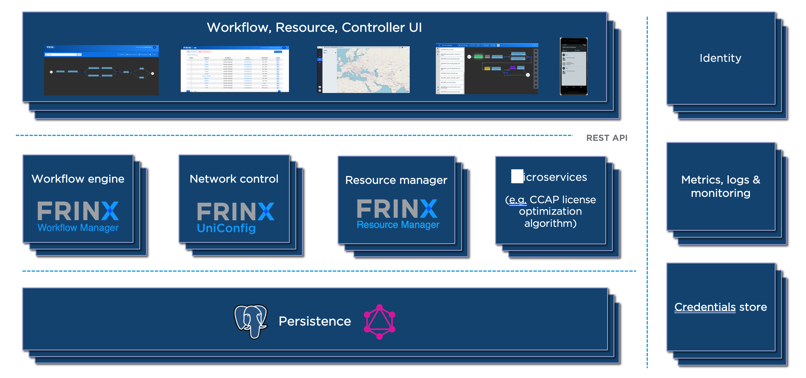

# FRINX Machine introduction

FRINX Machine is a dockerized deployment of multiple elements. The FRINX
Machine enables large scale automation of network devices, services and
retrieval of operational state data from a network. User specific
workflows are designed through the use of OpenConfig NETCONF & YANG
models, vendor native models, and the CLI. The FRINX Machine uses
dockerized containers that are designed and tested to work together to
create a user specific solution.

!!!
For installation, please refer to: [FRINX Machine
repository](https://github.com/FRINXio/FRINX-machine)
!!!

!!!
FRINX-machine can be installed in Kubernetes using the [Helm chart](https://artifacthub.io/packages/helm/frinx-helm-charts/frinx-machine)
!!!

## FRINX Machine components

### FRINX UniConfig

-   Connects to the devices in network
-   Retrieves and stores configuration from devices
-   Pushes configuration data to devices
-   Builds diffs between actual and intended config to execute atomic
    configuration changes
-   Retrieves operational data from devices
-   Manages transactions across one or multiple devices
-   Translates between CLI, vendor native, and industry standard data
    models (i.e. OpenConfig)
-   Reads and stores vendor native data models from mounted network
    devices (i.e YANG models)
-   Ensures high availability, reducing network outages and down time
-   Executes commands on multiple devices simultaneously

### Netflix Conductor (workflow engine)

-   Atomic tasks are chained together into more complex workflows
-   Defines, executes and monitors workflows (via REST or UI)

We chose Netflix’s conductor workflow engine since it has been proven to
be highly scalable open-source technology that integrates very well with
FRINX UniConfig. Further information about conductor can be found at:

-   **Sources:** https://github.com/Netflix/conductor
-   **Docs:** https://netflix.github.io/conductor/

### Elasticsearch (inventory and logs)

-   Stores inventory data in near real-time
-   Stores workflow execution and meta data
-   Stores UniConfig logs

### UniConfig UI (user interface)

-   This is the primary user interface for the FRINX Machine
-   Allows users to create, edit or run workflows and monitor any open
    tasks
-   Allows users to mount devices and view their status. The UI allows
    users to execute UniConfig operations such as read, edit, and
    commit. Configurations can be pushed to or synced from the network
-   Inventory, workflow execution, metadata and UniConfig log files are
    all accessible through the UI
-   View inventory, workflow execution, metadata and UniConfig log files

## High Level Architecture

Following diagram outlines main functional components in the FRINX
Machine solution:

FRINX Machine repository is available at https://github.com/FRINXio/FRINX-machine

Frinx-conductor repository is available at https://github.com/FRINXio/conductor

## Defining a workflow

The workflows are defined using a JSON based domain specific language
(DSL) by wiring a set of tasks together. The tasks are either control
tasks (fork, conditional, etc.) or application tasks (i.e. encoding a
file) that are executed on a remote device.

The FRINX Machine distribution comes pre-loaded with a number of
standardized workflows

A detailed description of how to run workflows and tasks, along with
examples, can be found in the official [Netflix Conductor
documentation](https://netflix.github.io/conductor/configuration/workflowdef)

## Operating FRINX Machine

To find out more about how to run the pre-packaged workflows, continue to [!ref icon="briefcase" text="Use cases"](../use-cases/index.md)