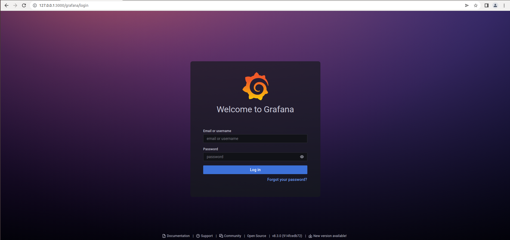
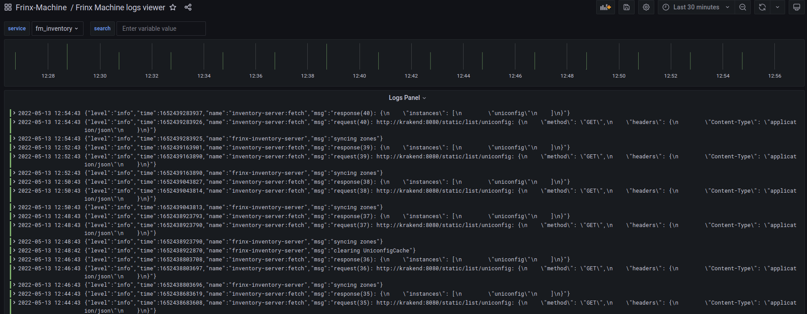
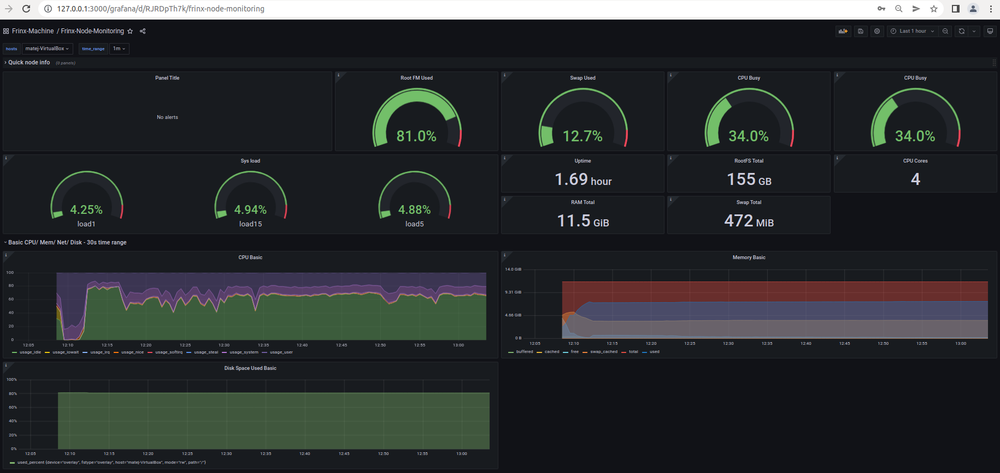
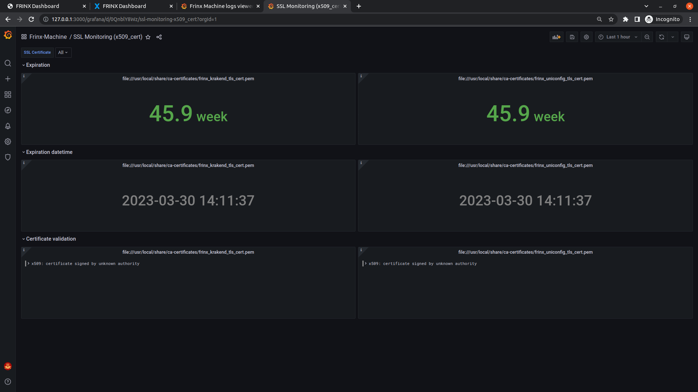
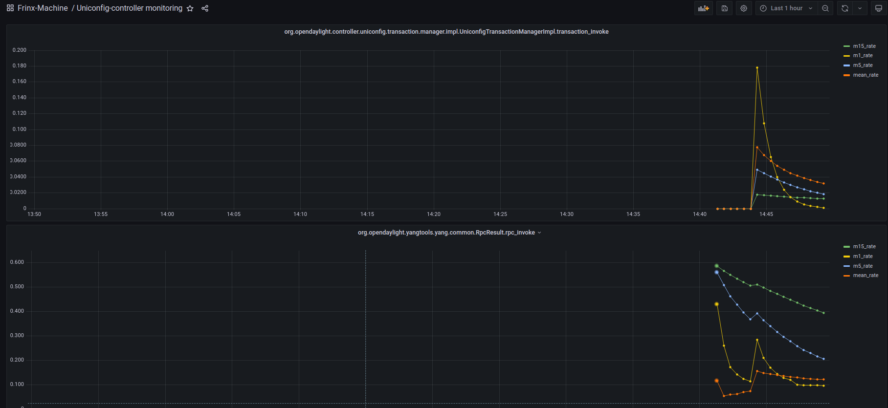

# Grafana 

Grafana is an open source visualization and analytics software. It allows to query, visualize, alert on, and explore metrics, logs, and traces no matter where they are stored.

By default, Grafana can be accessed at **localhost:3000** or **127.0.0.1:3000**

**Default credentials are:**

Username: **frinx**  
Password: **frinx123!**

## Monitoring

Grafana in FRINX Machine monitors multitude of metrics. At this time, these are:

- Device monitoring
- FRINX Machine logs
- Node monitoring
- Swarm monitoring
- SSL monitoring
- Uniconfig-controller monitoring
- Workflows monitoring

### Device Monitoring

This dashboard displays data on a specific installed device/node.

### FRINX Machine Logs

This dashboard monitors all services running in FRINX Machine. 
You can filter by individual services, and also look for a specific value.

### FRINX Machine Node Monitoring

This dashboard monitors the state of VM/System where FRINX Machine is running.
It reports info like **CPU utilisation**, **Memory utilisation**, **Disk usage**, **Up-time** etc.

### FRINX Machine Swarm Monitoring

This dashboard monitors metrics specifically tied to FM within the VM/System.  
Metrics like **Up-time**, **Available/Utilised memory**, **Number of running/stopped containers**, **CPU usage per container**, **Memory usage per container**, I**ncoming/Outcoming network traffic**, etc.

### SSL Monitoring

This dashboard displays data about your SSL certificates. It displays dates until your certificates are valid.

### UniConfig Controller Monitoring

This dashboard keeps track of various UniConfig transactions. It displays number of transactions at a given time.

### Workflows Monitoring

Collecting data on workflows is being worked on.
