# FRINX Machine Demo Manual

Open your browser (avoid Mozila) and go to the following URL:

https://services.frinx.io/frinxui/

Press the “login” button in the upper right of the screen and authenticate yourself. For credential please contact "info@frinx.io" to access the FRINX Machine instance.

You will see the following **FRINX Machine dashboard**:

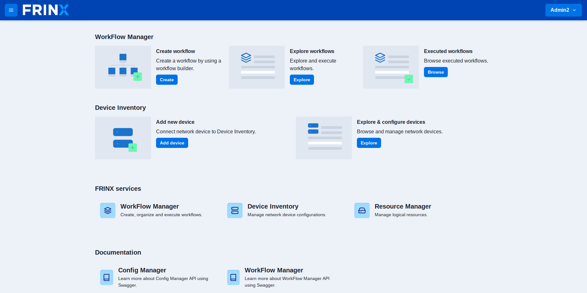

## Demo Config Manager UI

1) When at the FRINX Machine main page click on “Explore & configure devices”.
2) Make sure that the device you’re about to configure is installed (if not, install it by clicking on “install”).
3) In this demo we will use the IOS01 device. Click on the configuration button (if “transaction expired” window appears, click on “refresh”).

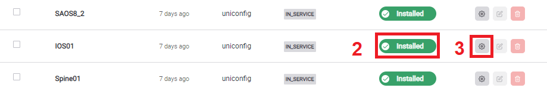

4) Change “enabled” status of Loopback0 interface to “false”
5) Save the changes
6) By clicking on “Calculate diff” you can review all the changes made
7) By clicking on “Dry run” you can see the set of commands used for the change
8) Click on “Commit to network” to apply changes to the device (Now you can see the changes in the Operational data store as well)

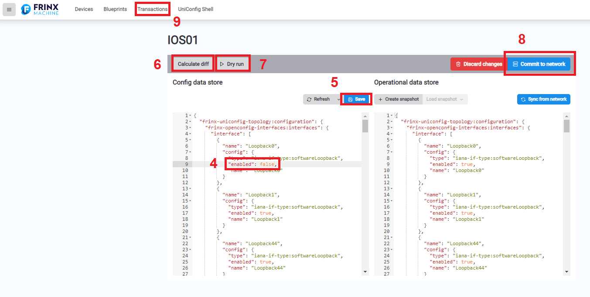

To revert the changes:

9) Click on “Transactions”
10) Click on “Revert” and then on “Revert changes” to revert changes made to the device configuration

## Demo workflow UI basics

Workflow Builder is the graphical interface of UniFlow used to create, modify and manage workflows. Workflows are groups of tasks and/or subworkflows that can be used for multiple purposes such as installing/deleting devices, creating loopback interfaces on devices, sending messages and much more. You can create your own workflows or edit existing workflows by adding or removing tasks or subworkflows. Every task and subworkflow placed in workflow has its unique reference alias and you cannot have 2 workflows with same name and version.

### Creating a new workflow

Now we will take a look at how to create a new workflow. The new workflow will be created from template workflow called **http_example_01 / 1** which can be found under explore workflows. If you dont wish to create workflow you can just execute this workflow in explore workflows.

1) The easiest way to create a new workflow is to click on **Create** button in the main page of FRINX Machine.

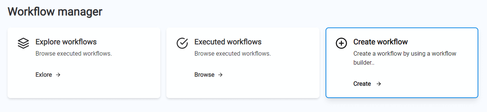

2) In the **Name** type the name of your workflow (please keep in mind that name of the workflow cannot be later changed). **Description** stands for additional info of the workflow - you can leave it blank. Once the workflow is created **Label** can help you find your workflow in **Explore workflows** faster but you can leave it blank as well. After inserting all data click on **Save changes**.

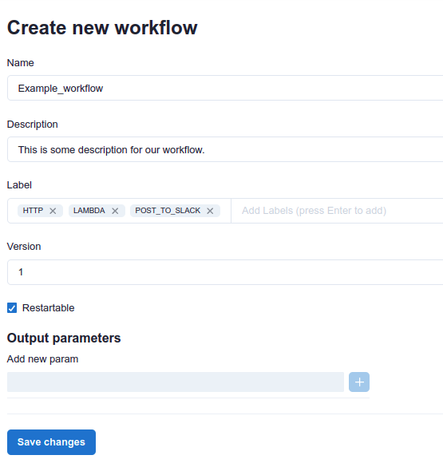

After saving changes you will be redirected to canvas. Here we will add tasks and subworkflow in our workflow.

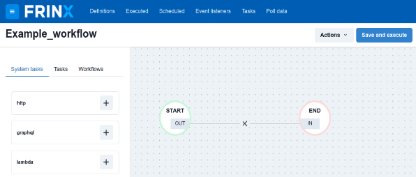

3) Click + on the **http** and **labmda** under **System tasks** and **Post_to_Slack** under **Workflows**. All tasks and subworkflows are added on same place in the canvas so you need to move them to actually see them. For connecting all parts of the workflow hower over OUT/IN where + sign will appear. Connect all parts in this way: START - http - lamda - Post_to_Slack - END. As you can see each task and workflow has its own set of characters after its name - these are reference aliases and work as unique identifier.

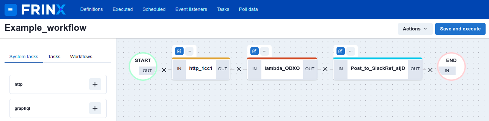

Above every task/workflow you can see 2 squares:

**Update:**


**Remove/Expand:**


4) **http - adjustment**. This task provides multiple methods for working with data from web pages. Click on update above http task. On the right side you can see General Settings and Input Parameters. Leave **General Setting** the way they are and click on **Input Parameters**. Insert:
```https://jsonplaceholder.typicode.com/todos/${workflow.input.selector}```
in the **URI** and leave other columns unchanged. This set of data will get data from JSON database based on selectors input. Now click on **Save Changes** under **Headers**.

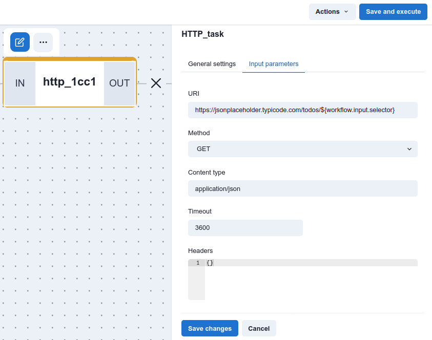

5) **lambda - adjustment**. Click on **Input parameters** and in the **Lambda value** insert:
```${NAME_OF_HTTP_TASK.output.body}```
In our example the name is **http_1cc1**. In the **Script expression** copy-paste: return JSON.parse($.lambdaValue). Lambda takes data from previous http task and returns parsed data (message text) from JSON. Click on **Save Changes**.


6) **Post_to_Slack - adjustment**. Click on **Input parameters** and in the **slack_webhook_id** insert T03UXD8N58B/B03VCP8U99P/jermqzN9AkhNgXYIZkP0qLI0. In the **message_text** insert:
```${NAME_OF_LAMBDA_TASK.output.result.title}```
**Post_to_Slack** is a workflow that can be used standalone or as a part of other workflows. This workflow works as as sender of messages to specific destination in Slack. Click on **Save Changes**.

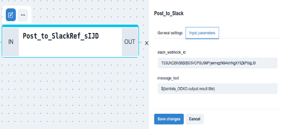

> **Info**: If you don´t see selector column just click on **Close** under the selector column, click on **Definitions** on the top left, insert the name of your workflow in the **Search by keyword**. and press run workflow under **Actions**.

7) Now the workflow is ready to be executed. Insert a number between 1 - 200  in the **selector** and press **Execute**. Click on **Continue to detail**.

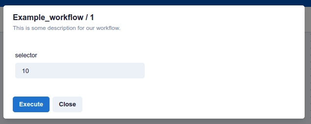

8) Now you can see that workflow was executed and every task was completed successfully.

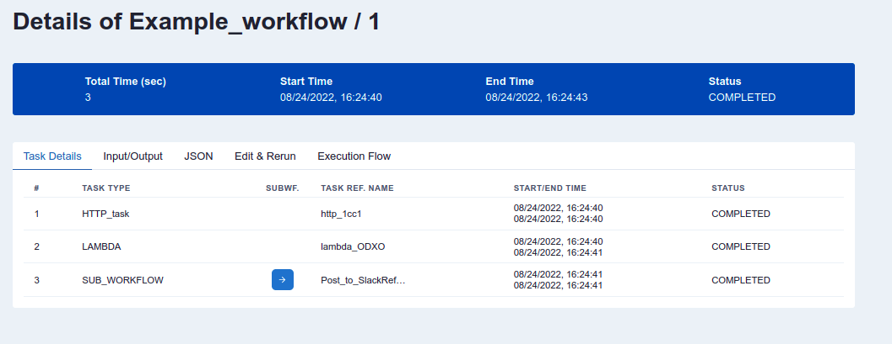

The output (demo Latin JSON) of the workflow in the Slack:

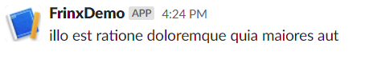

You can visit Slack directly via https://join.slack.com/t/frinx-community/shared_invite/zt-1esnmbq4l-ui9xLCS4zKGHUXZxz~PdrQ to see your own message. We recommend to use the browser version.

## Demo “Create loopback address on devices stored in the inventory”

This workflow creates a loopback interface on all devices that are installed in the inventory or on all devices filtered by labels. Labels are marks that serves as a differentiator.

1) Check if all devices are installed. You can install them manually or by executing **Install_all_from_inventory / 1** workflow.

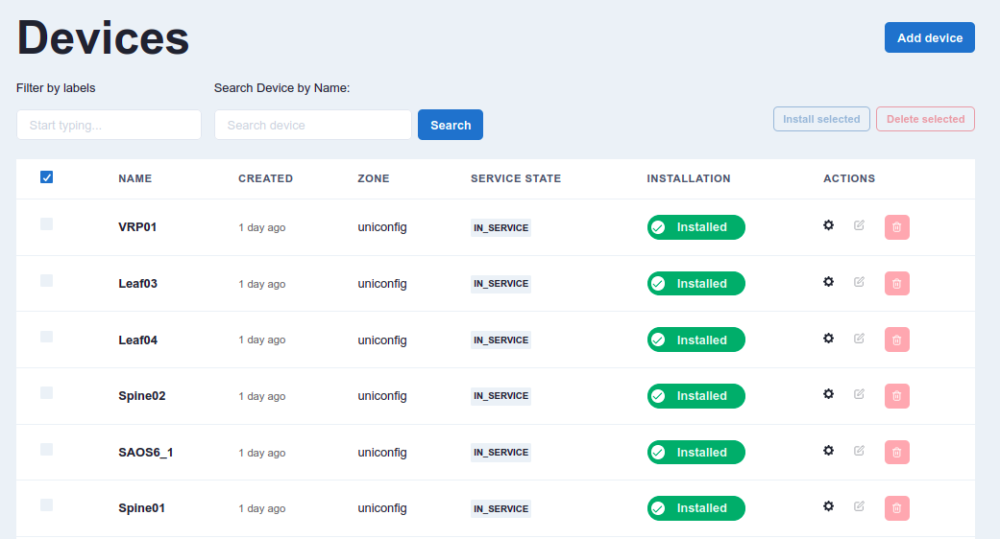

2) In the main page click on **Explore workflows** and in the column **Search by keyword**. type „loopback“. Workflow with name **Create_loopback_all_in_uniconfig / 1** will appear. Next click on run button under ACTIONS.

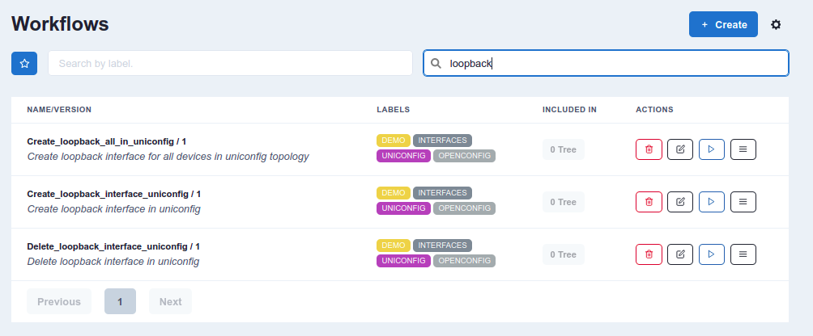

4) Insert the number 77 in **loopback_id** and press **Execute**. After executing click on the link which will appear.

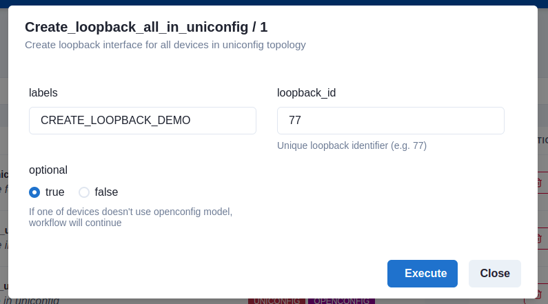

5) All tasks were executed correctly and now are completed.

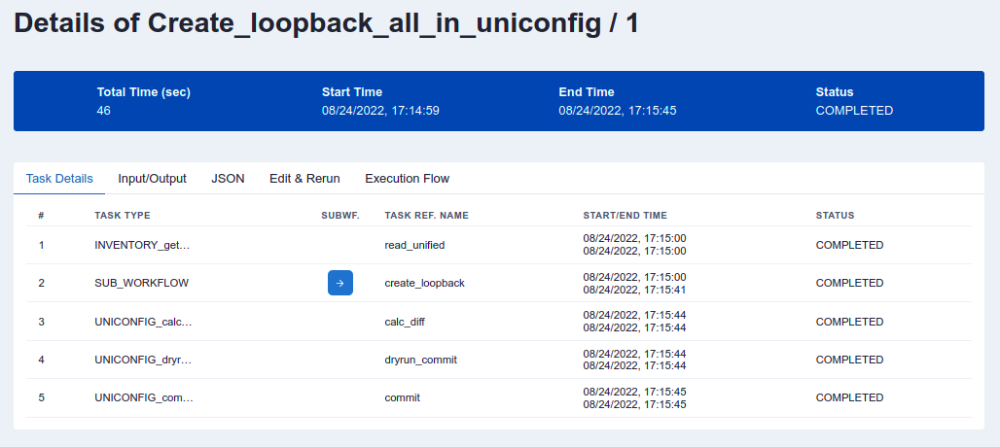

On the results page you will see 5 individual tasks:

### INVENTORY_get_all_devices_as_dynamic_fork_tasks
This workflow displays the list of all devices in the inventory or devices filtered by label. It parses the output in the correct format for the dynamic fork, which creates a dynamic amount of tasks, depending on the number of devices in the inventory. 

### SUB_WORKFLOW
This is the dynamic fork sub-workflow. In this case, it creates UNICONFIG_write_structured_device_data for every individual device in the inventory. Thanks to this, you get detailed information on the progress and succession of every device.

### UNICONFIG_calculate_diff
This remote procedure call creates a difference between the actual UniConfig topology devices and the intended UniConfig topology nodes. 

### UNICONFIG_dryrun_commit
The remote procedure call will resolve the difference between the actual and intended configuration of devices. After all, changes are applied, the cli-dryrun journal is read and an remote procedure call output is created and returned. 

### UNICONFIG_commit
This is the final task that actually commits the intended configuration to the devices.

## Demo “L3VPN”

Before running L3VPN, run **Allocate_Root_Pool / 1** workflow and check if lab-vmx1 (device) is already installed.

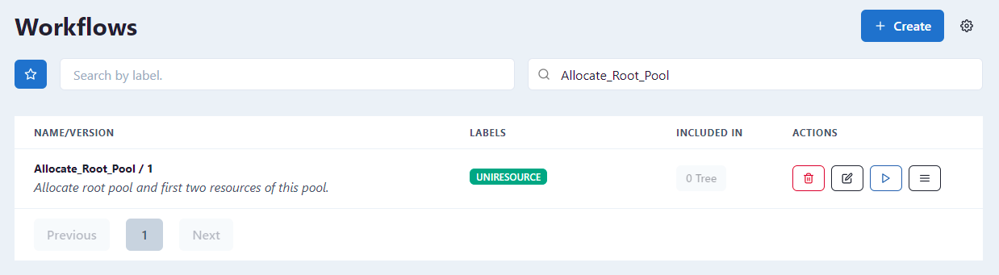

    • When in the FRINX Dashboard, click on the drop-down menu in the left top corner and click on L3VPN Automation
    • Click on “Services”
    • Click on “+ Add service”
    • Fill the information as below. VPN ID is generated automatically by clicking on “chain button”.

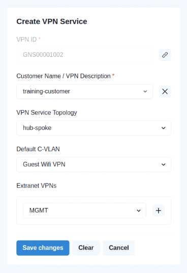

- Click “Save changes”
- You will be redirected to previous page.

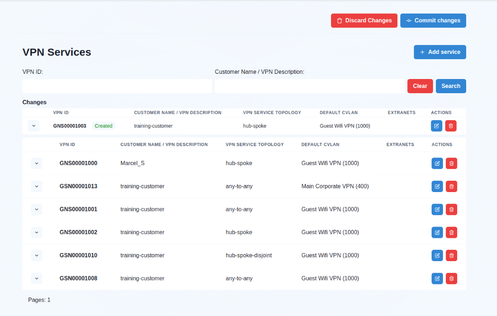

- Click on “Commit changes” and in the pop-up window as well. After committing you will see all executed tasks and sub-workflows. You can click on “Go to detail” and review all the individual processes.

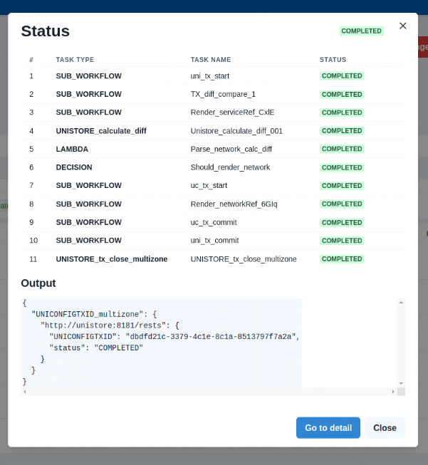

### Step 1.

- Return to L3VPN Automation site
- Click on “Sites”
- Look for test_site_3b9UQL4i

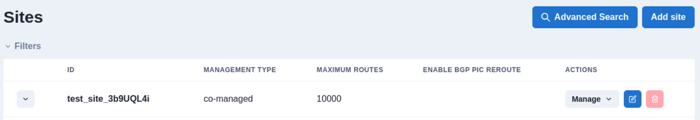

- In the test_site_3b9UQL4i click on “Manage” and then on “Site network access”


- Click on “Add network access”

### Step 2.

Add these settings:

**General and Service**

**VPN Attachment:** GNS00001002
**BTM Circuit Reference:** CES00000000-05
**Devices:** Pick one of the CPE devices
**SVC Input Bandwith (Mbsp):** 1000
**SVC Output Bandwith (Mbps):** 1000

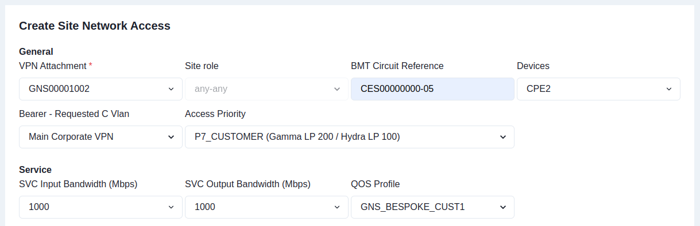

**Routing Protocol:**

- click on + Create Static Protocol

**Static Routing LAN:** 10.0.0.0/8
**Static Routing Next Hop:** 10.0.0.1
**Static Routing Lan Tag:** 999
**Bgp Profiles:** 300ms
**Maximum Routes:** 2000

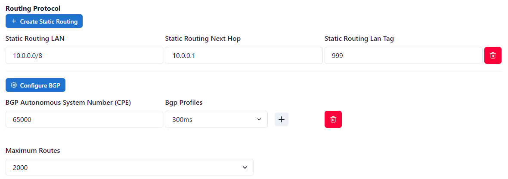

**IP Connection**

For auto-generating provider and customer address click on:


**BGP Profile:** 500ms

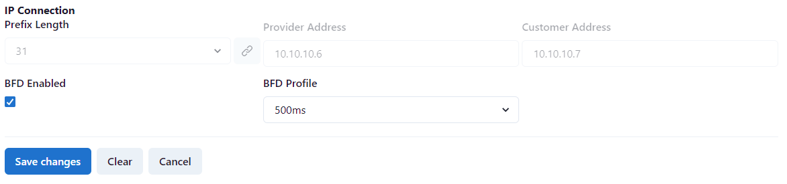

Click on **Save Changes**.

### Step 3.

Click on **Commit Changes**.

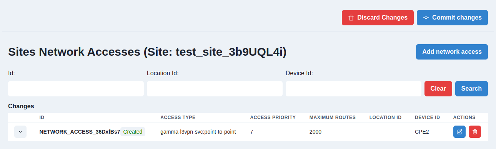

Wait until all tasks are completed.

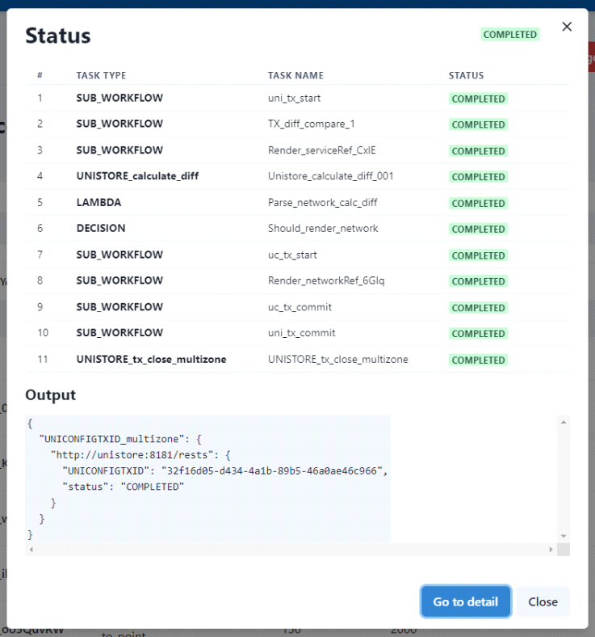
