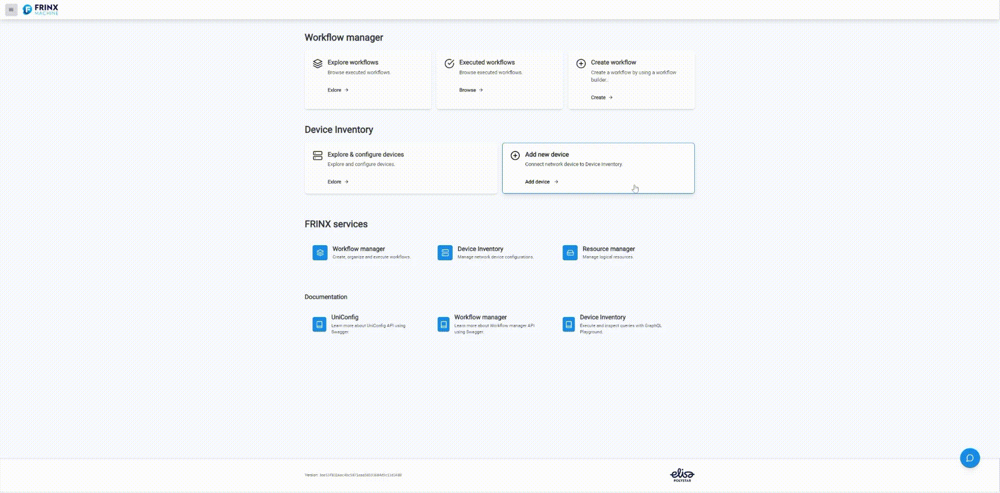
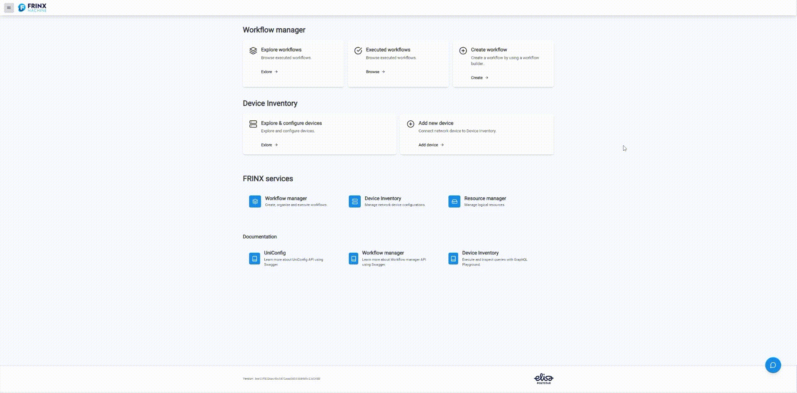

# Add a device to inventory and install it

## Adding device to inventory

To add new device to invetory, click on the **Add device** button in the
**Device inventory** tab.



## JSON examples

New devices are added to inventory by JSON code snippets. They are similar to [Blueprints](/frinx-workflow-manager/blueprints)
with one addition: **device_id** must be specified in the snippet.

To add a new device from Blueprint, toggle the "Blueprints" switch in the form and
choose the blueprint that you want to use.

### Cisco classic IOS (cli)

```json
{
    "cli": {
        "cli-topology:host": "sample-topology",
        "cli-topology:port": "10009",
        "cli-topology:transport-type": "ssh",
        "cli-topology:device-type": "ios",
        "cli-topology:device-version": "15.4",
        "cli-topology:password": "cisco",
        "cli-topology:username": "cisco",
        "cli-topology:journal-size": 500,
        "cli-topology:dry-run-journal-size": 180,
        "cli-topology:parsing-engine": "tree-parser"
    }
}
```

### Cisco IOS XR (netconf)

```json
{
    "netconf":{
        "netconf-node-topology:host":"sample-topology",
        "netconf-node-topology:port":17200,
        "netconf-node-topology:tcp-only":false,
        "netconf-node-topology:username":"USERNAME",
        "netconf-node-topology:password":"PASSWORD",
        "netconf-node-topology:session-timers": {
            "netconf-node-topology:keepalive-delay":5
        },
        "netconf-node-topology:other-parameters": {
            "netconf-node-topology:dry-run-journal-size":180
        },
        "uniconfig-config:uniconfig-native-enabled":true,
        "uniconfig-config:blacklist":{
            "uniconfig-config:path":[
                "openconfig-interfaces:interfaces",
                "ietf-interfaces:interfaces",
                "openconfig-vlan:vlans",
                "openconfig-routing-policy:routing-policy",
                "openconfig-lldp:lldp",
                "Cisco-IOS-XR-l2vpn-cfg:l2vpn",
                "Cisco-IOS-XR-group-cfg:groups",
                "openconfig-acl:acl",
                "openconfig-network-instance:network-instances"
            ]
        }
    }
}
```

### Huawei (cli)

```json
{
    "cli":{
        "cli-topology:host":"sample-topology",
        "cli-topology:port":"10008",
        "cli-topology:password":"huawei",
        "cli-topology:username":"huawei",
        "cli-topology:device-type":"vrp",
        "cli-topology:journal-size":500,
        "cli-topology:device-version":"*",
        "cli-topology:parsing-engine":"tree-parser",
        "cli-topology:transport-type":"ssh",
        "cli-topology:dry-run-journal-size":180
    }
}
```

### CALIX (netconf)

```json
{
    "netconf":{
        "netconf-node-topology:host":"sample-topology",
        "netconf-node-topology:port":17001,
        "uniconfig-config:blacklist":{
            "uniconfig-config:path":[],
            "uniconfig-config:extension":[]
        },
        "netconf-node-topology:password":"PASSWORD",
        "netconf-node-topology:tcp-only":false,
        "netconf-node-topology:username":"USERNAME",
        "netconf-node-topology:session-timers":{
            "netconf-node-topology:keepalive-delay":0
        },
        "uniconfig-config:uniconfig-native-enabled":true,
        "uniconfig-config:install-uniconfig-node-enabled":true
    }
}
```

### Nokia (netconf)

```json
{
    "netconf":{
        "netconf-node-topology:host":"sample-topology",
        "netconf-node-topology:port":17001,
        "netconf-node-topology:session-timers": {
            "netconf-node-topology:keepalive-delay":10
        },
        "netconf-node-topology:tcp-only":false,
        "netconf-node-topology:username":"USERNAME",
        "netconf-node-topology:password":"PASSWORD",
        "uniconfig-config:uniconfig-native-enabled":true,
        "uniconfig-config:install-uniconfig-node-enabled":true,
        "uniconfig-config:blacklist":{
            "uniconfig-config:path":[]
        },
        "netconf-node-topology:yang-module-capabilities":{
            "capability":[]
        }
    }
}
```


## Install the new device from Inventory

Now that the device is added we can install it. We used to need dedicated workflow to install device form inventory, but now
it can be done purely via UI. Click on **Explore** in **Explore & configure devices** tab, under **Device Inventory** section.



If you did everything correctly, your devices is now in inventory and installed, ready to be operated through Frinx Machine.