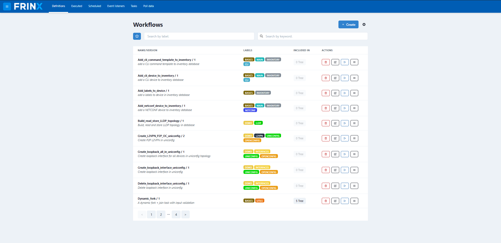
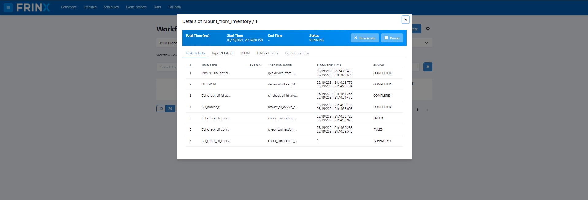
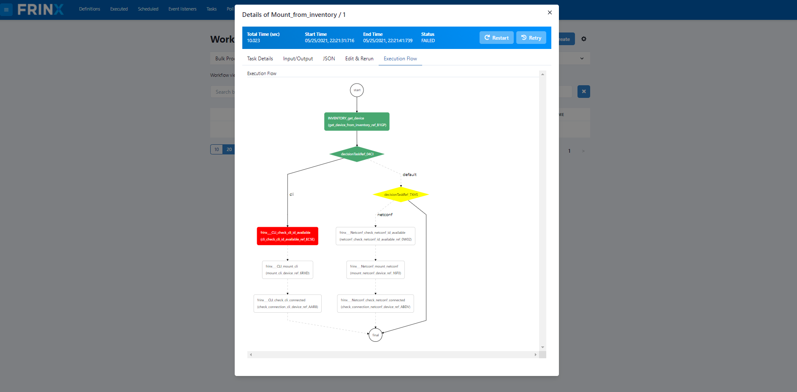
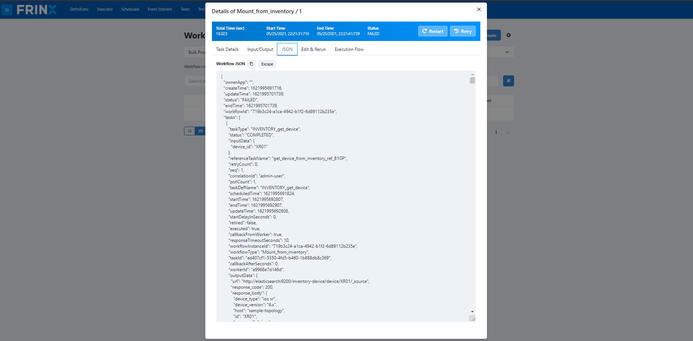

# Add a device to inventory and mount it

## Create a new device in the inventory

In this workflow we will create a device entry in our inventory via the
UniConfig UI.

Many customers will choose to import bulk data from other data sources
like Excel or CSV files. Many data import tools exist for Elasticsearch
(e.g. https://github.com/knutandre/excelastic).
The import of bulk data is out of scope for this use case. We rather
focus on data input via our GUI to demonstrate a simple set of
workflows.

Click on: Workflows

You'll be able to search for workflows by `label` and/or `keyword`


Search for **Add_cli_device_to_inventory** or
**Add_netconf_device_to_inventory**. This workflows has the labels
**BASIC**, **MAIN**.

Click on this workflow and select **Input** and fill out the form.

**Add_cli_device_to_inventory**:

``` 
device_id: any unique identifier
type: type of device (e.g. ios, ios xr)
version: version of the device
host: host ip address
protocol: protocol for connection
port: port to connect to
username: credentials to use
password: credentials to use
labels: label of device (optional)
```

**Add_netconf_device_to_inventory**:

```
device_id: any unique identifier
port: port to connect to
host: host ip address
keepalive: value of keepalive delay
tcponly: set type of communication
username: credentials to use
password: credentials to use
labels: label of device (optional)
uniconfignative: enable uniconfig-native
blacklist: List of blacklisted root paths and/or extensions
```

Click on `Execute`. A link to the left of the `Execute` button should
pop up. If you click on it, you'll be taken to the
`Home` --> `Workflows` --> `Executed` page.

There, you can click on the just executed workflow to see it's details.

After successful execution of our first workflow, we can see the new
device created in Elasticsearch. To see it, go to
`Home` --> `Inventory` --> `Discover`

!!!
If you are using Kibana for the first time, you will have to create a
new index pattern called **inventory**.

To create a new index pattern click on `Management` in the left hand
side bar, select `Index Patterns` and click on the button `Create
Index Pattern`. Enter `inventory` in the index pattern field and
click `Create`.

Now click on `Discover` in the left hand side bar and you should see
all devices that you have entered in the step before.
!!!

## Mount the new device from Inventory

Next we want to mount the device in ODL. The mount operation for NETCONF
or CLI devices in ODL results in a permanent connection that is
established, maintained and if necessary re-established with the device.
Once a device is mounted in FRINX OpenDaylight, it can be accessed via
the UniConfig framework for reading and writing configuration and
operational data. The next workflow will mount the device in FRINX ODL.

Go back to `Home` --> `Workflows` --> `Definitions` and search for a
workflow called **Mount_from_inventory**

To mount the device that you previously inserted into the inventory,
specify the ID that you used when you filled out the form. As
previously, after you click `Execute` a link should pop up to the left
of the `Execute` button. Click on it to see the executed workflows.
Click on the one that you are presented with to see more details.

## Look at the details of the workflow

The workflow that we have executed will spawn a number of sub workflows
and will only show completed if all sub workflows have completed
successfully. You can verify the state of main and sub-workflows in the
view below.





In this view, we can see that all workflows have completed successfully.
After the main workflow was executed it has spawned of multiple sub
workflows until the last workflow checks if the device was successfully
mounted.

The following screenshots show additional information about the
sub-workflows that is relevant to analysis and troubleshooting.



Once the main workflow has successfully completed the device is mounted
and can now be used to get information from the device or configure the
device.
