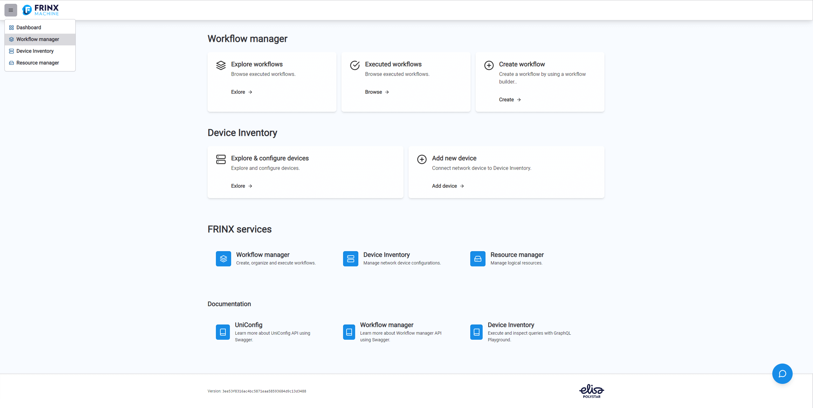
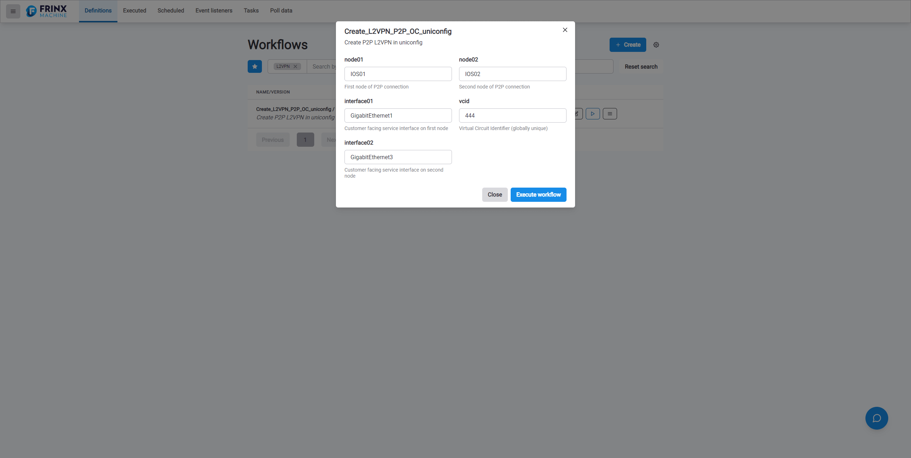
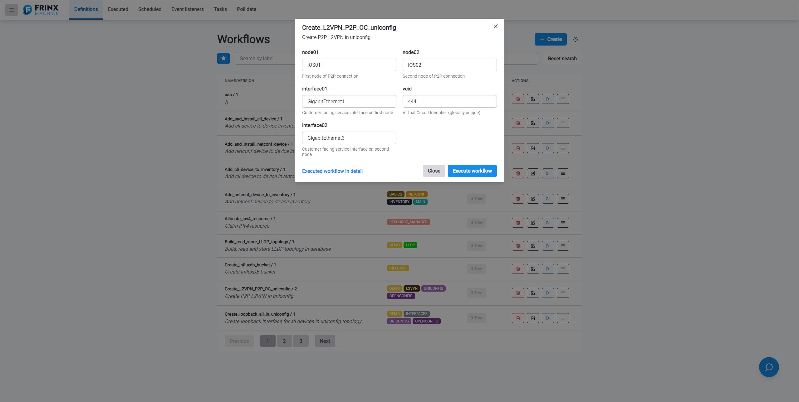
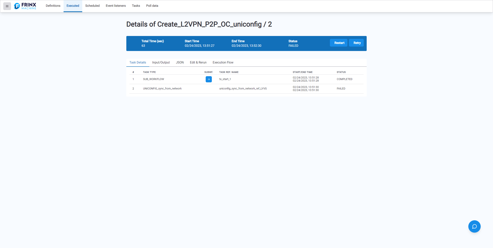
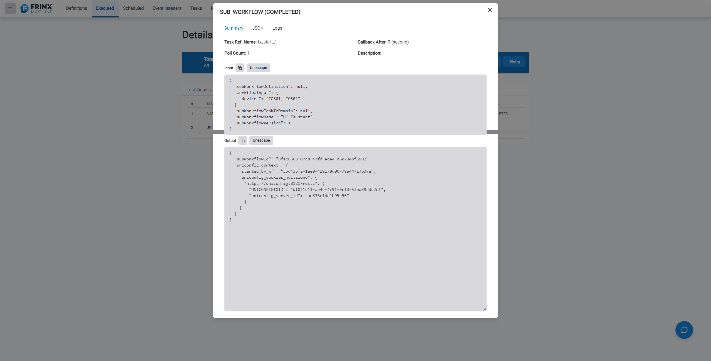

# Creating a Layer 2 VPN Point-to-Point Connection

This section details how to find and execute a prebuilt workflow that
creates a Layer 2 VPN Point-to-Point connection within UniFlow.

## Navigating through UniFlow

From the FRINX Machine dashboard you can either select
`UniFlow` --> `Explore Workflows` --> `Explore`, or select the menu tab in
the upper left-hand corner and select `UniFlow`.

You can then search for **Create_L2VPN_P2P_OC_uniconfig** or scroll
down to find it within the inventory of prebuilt workflows.




Once you have located the workflow press the **Play** button to the
right of the workflow, this will navigate you to the workflow
configuration window.

## Configuring the Workflow

Fill the inputs with the following data:

```
node01: IOS01
node02: IOS02
interface01: GigabitEthernet1
interface02: GigabitEthernet3
vcid: 444
```



Once you have completed, press the **Execute** button, a numeric link
will populate to the left of the **Execute** button. Click on this
numeric link to see the output of the executed workflow.



### Output of the Executed Workflow

On the `Workflows` page you will see your executed workflows.

Select the workflow **Create_L2VPN_P2P_OC_uniconfig** to see the
output from all of the tasks completed within this workflow.



This following sections are available within the output window:

`Task Details`: This tab gives a detailed list of the individual tasks
executed within the conductor, a log of each tasks start and end time,
and a status of 'Completed' or 'Failed'.

`Input/Output`: This is the input of the API call and the results from
the API call.

`JSON`: This tab gives a detailed output in JSON format of all
executed tasks from within the workflow. Select the `Unescape` button
to make the output more user-friendly to read.

`Edit & Rerun`: Allows you to make changes to your initial workflow,
creating a new workflow without effecting the original.

`Execution Flow`: A structured map from the conductor lays out the
path of tasks executed from start to finish, any forks in the path are
also shown here.

If you click on any of the tasks you will receive a pop-up window that
gives:

1. The option to review a summary of input and output of the API call.
2. JSON output of the completed task with that goes into greater detail
    about the task execution.
3. Log status.

### Sub-Workflows

Within the original Details of **Create_L2VPN_P2P_OC_uniconfig**
window you will see a sub-workflow.



This sub-workflow is an embedded task that makes a separate API call to
Slack to notify a pre-defined user group that the workflow has been
executed and whether it has succeeded or failed.
