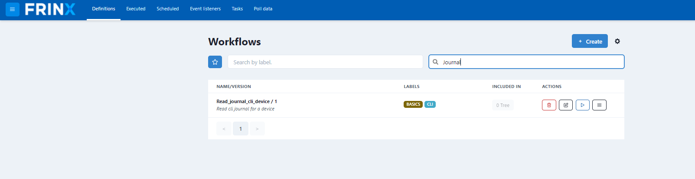

# Creating loopback Address and Retrieving Journals of Devices

This section shows how users can execute workflows to create loopback
address on devices stored in the inventory.

!!!warning
Make sure you didn't skip
mounting all devices in inventory otherwise this workflow might not work correctly.
[!ref text="Mount all devices in inventory"](../mount-all-devices-in-inventory/readme.md)
!!!

## Create loopback Address on Devices Stored in the Inventory

!!!danger	
This use case does not work with "VRP01" and "netconf-testtool" devices.
Because of that, before executing other workflows, you need to unmount
the "VRP01" and "netconf-testtool" devices that were previously
mounted by the **Mount_all_from_inventory** workflow. In order to
unmount these devices, go to `Home` --> `UniConfig` select the "VRP01"
and "netconf-testtool" device and click "Unmount Devices".
!!!

In the next step we will execute a workflow that creates loopback on
every mounted device in UniConfig (the devices were previously mounted
from inventory).

Click on `Home` --> `Workflows` --> `Definitions` and search for the
workflow **Create_loopback_all_in_uniconfig**.

After providing the loopback id to be used, you can execute the
workflow. As previously, click on the popped up numeric link next to the
execute button.

The workflow creates a loopback for all devices in the inventory. Here
you see all the devices.

After the main and sub-workflows have completed successfully the
loopback address was created on the devices. Since we are working with
emulated devices, we can check a device journal to see if it was really
created.

The execution of all workflows can be manual, via the UI, or can be
automated and scheduled via the REST API of conductor server.

## Running the workflow for retrieving the journal of a device

In this section we show how to run the workflow for retrieving the
journal of a device.

Click on: `Home` --> `Workflows` --> `Definitions` and search for **Read_journal_cli_device**.

After providing the device id(you need to specify the id under you
mounted the device), you can execute the workflow.

Under `Home` --> `Workflows` --> `Executed` click the ID of the previously
executed workflow to see the progress of the workflow. Input/output data
of each task and statistics associated with the workflow execution can
all be found here.

The journal information can be found in the output of the workflow.
Click `Execution Flow` and click on the green box with the
**CLI_get_cli_journal** text. To transform to a readable format,
click the unescape button.

