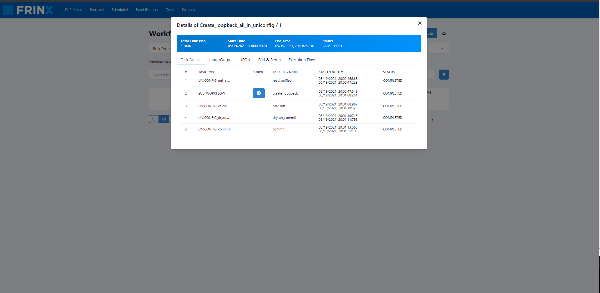
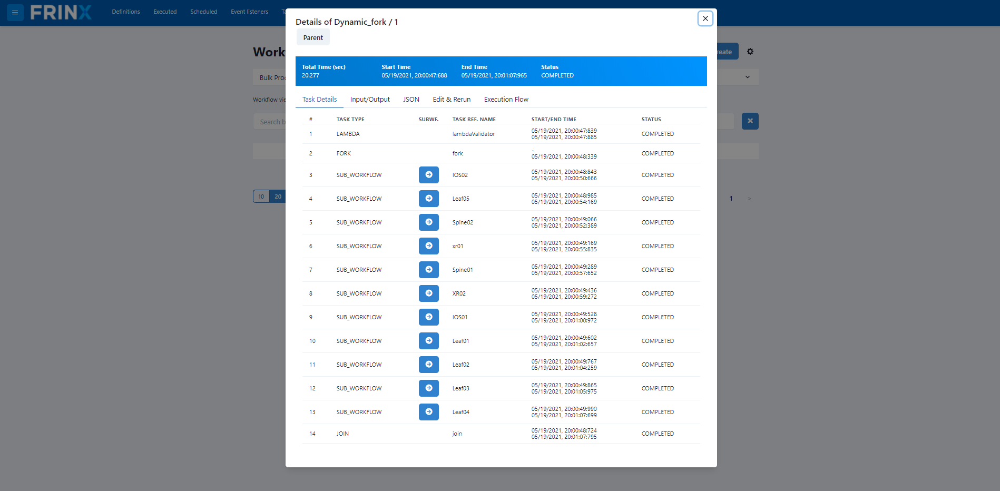

# Creating loopback Address

This section shows how users can execute workflows to create loopback
address on devices stored from the inventory.

!!!warning
Make sure you didn't skip
installing all devices from inventory otherwise this workflow might not work correctly.
[!ref text="Mount all devices in inventory"](../mount-all-devices-in-inventory/readme.md)
!!!

## Create loopback Address on Devices Stored in the Inventory

!!!danger	
This use case does not work with "VRP01" and "netconf-testtool" devices.
Because of that, before executing other workflows, you need to unmount
the "VRP01" and "netconf-testtool" devices that were previously
mounted by the **Mount_all_from_inventory** workflow. In order to
unmount these devices, go to `Home` --> `UniConfig` select the "VRP01"
and "netconf-testtool" device and click "Unmount Devices".
!!!

In the next step we will execute a workflow that creates loopback on
every mounted device in UniConfig (the devices were previously mounted
from inventory).

Click on `Home` --> `Workflows` --> `Definitions` and search for the
workflow **Create_loopback_all_in_uniconfig**.

After providing the loopback id to be used, you can execute the
workflow. As previously, click on the popped up numeric link next to the
execute button.

The workflow creates a loopback for all devices in the inventory. Here
you see all the devices.

After the main and sub-workflows have completed successfully the
loopback address was created on the devices. Since we are working with
emulated devices, we can check a device journal to see if it was really
created.

The execution of all workflows can be manual, via the UI, or can be
automated and scheduled via the REST API of conductor server.
