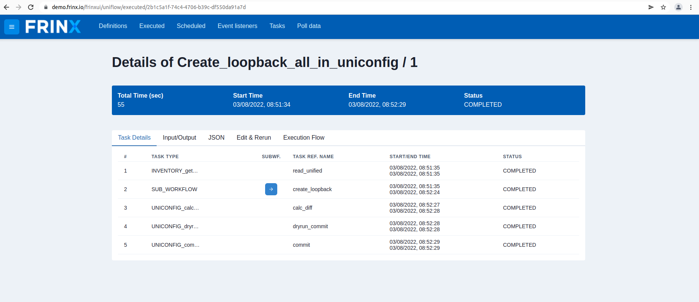
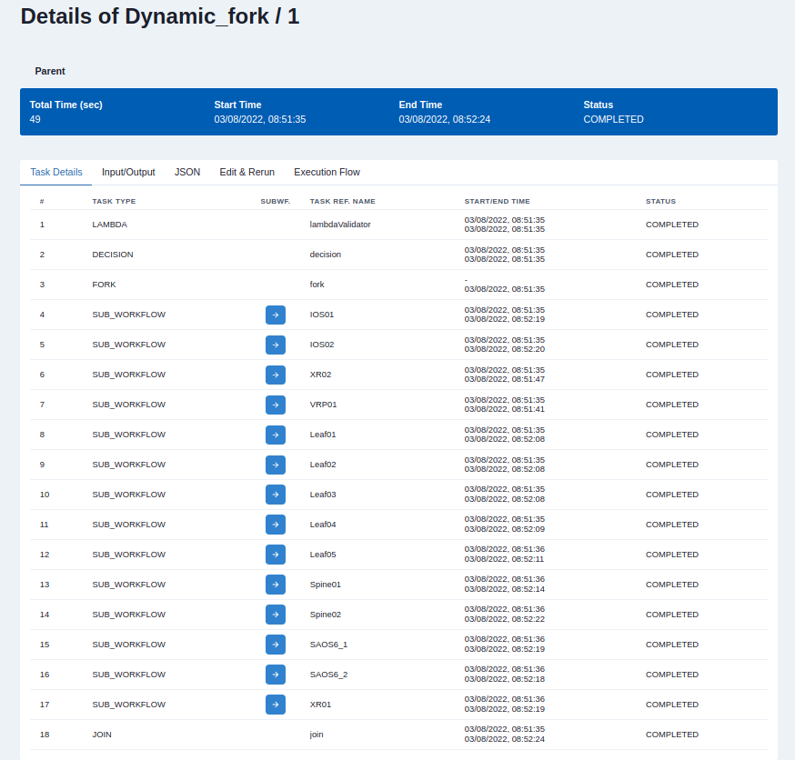

# Create loopback interfaces

This use-case discusses workflow **Create_loopback_all_in_uniconfig**. This workflow creates a loopback interface on all devices that are installed in the inventory.

!!!warning
Make sure you didn't skip
installing all devices from inventory otherwise this workflow might not work correctly.
[!ref text="Install all devices from inventory"](../install-all-devices-from-inventory/)
!!!

## Create loopback address on devices stored in the inventory

!!!danger	
By default, this workflow doesn't work on Junos, **IOSXR653**, **IOSXR663** and **SAOS8** devices. This is because we are sending the data to the "frinx-openconfig-interfaces" model, which either isn't present on those devices or its structure differs from other devices we write to. If you want to write data to those devices, you will have to edit the **Create_loopback_all_in_uniconfig** workflow. In this case, we successfully write to **IOS**, **XR**, **VRP**, **SAOS6**, **Leaf**, **Spine**.
!!!

In the next step, we execute a workflow that creates loopback on
every installed device in UniConfig.

In the `UniFlow` section, click on the `Explore` button. A list of all workflows will appear. Search for a workflow called **Create_loopback_all_in_uniconfig**.

As for the input, the only thing you need to input is "loopback_id", the name of the loopback interface e.g., **77**.
After executing, click on the numeric link that appears to see workflow progression and results.

On the results page you will see 5 individual tasks:

### INVENTORY_get_all_devices_as_dynamic_fork_tasks

This workflow displays the list of all nodes in the inventory. It parses the output in the correct format for the dynamic fork, which creates a dynamic amount of tasks, depending on the number of devices in the inventory. It allows us to use one task, disregarding the state of the inventory.

### SUB_WORKFLOW

This is the dynamic fork sub-workflow. In this case, it creates **UNICONFIG_write_structured_device_data** for every individual device in the inventory. Thanks to this, you get detailed information on the progress and succession of every device.

### UNICONFIG_calculate_diff

This RPC creates a diff between the actual UniConfig topology nodes and the intended UniConfig topology nodes. Find full details about calculate diff [here](/frinx-uniconfig/user-guide/uniconfig-operations/uniconfig-node-manager/rpc_calculate-diff/#rpc-calculate-diff)

### UNICONFIG_dryrun_commit

The RPC will resolve the diff between the actual and intended configuration of nodes by using UniConfig Node Manager. Changes for CLI nodes are applied by using cli-dryrun mountpoint which only stores translated CLI commands to the cli-dry-run journal. After all, changes are applied, the cli-dryrun journal is read and an RPC output is created and returned. Find full details about dryrun commit [here](/frinx-uniconfig/user-guide/uniconfig-operations/dryrun-manager/#rpc-dryrun-commit)

### UNICONFIG_commit

This is the final task that actually commits the intended configuration to the devices. Find full details about commit [here](/frinx-uniconfig/user-guide/uniconfig-operations/uniconfig-node-manager/rpc_commit/#rpc-commit)

If the workflow has been completed successfully, a loopback interface is now present on all devices in the inventory.

The execution of all workflows can be manual, via the UI, or can be
automated and scheduled via the REST API of conductor server.