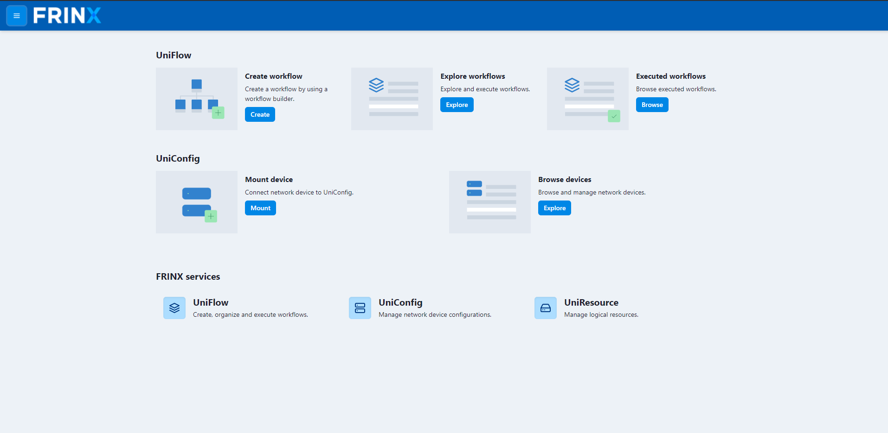

# Demo Use Cases

There are several ways of installing device/devices in FRINX Machine. You
can either run a workflow to install a network device directly or you can
add devices to your Kibana inventory and install devices from there. From
your Kibana inventory, you can install a single device, but you can also
install every device in the inventory simultaneously.

To start installing devices open up FRINX UniConfig UI.

## Open FRINX UniConfig UI

Open your browser and go to `[host_ip]` if installed locally go to
`https://localhost`. This is the GUI (UniConfig UI) for managing all of
your devices. You should see a screen like this:

[](fm1.6_dashboard.png)

!!!
For Demo Use Cases, please download repository [fm-workflows](https://github.com/FRINXio/fm-workflows)

Make sure FRINX-machine is running, navigate to

```
 cd fm-workflows
```

and execute

```
 ./startup.sh
```

Imported workflows and tasks will appear in FRINX-Machine UI,
immediately after the import finishes.
!!!

In the following articles, you'll learn how to install a device from
UniConfig and how to install all devices from the inventory. This
inventory is automatically set up for you when you start FRINX Machine.
After that we'll learn how to create a loopback address on the devices
that we previously stored in the inventory and how to read the journals
of these devices.

Then we'll take a look at how to obtain platform inventory data from the
devices that you have in the network and how to store them in inventory.
Next, you'll learn how to save commands to your inventory and execute
them on the devices that are in your network.

Lastly, we'll take a look at how you can add devices to your inventory
manually. This might be useful if you wanted to play around with the
FRINX Machine a bit a try installing your own networking devices.