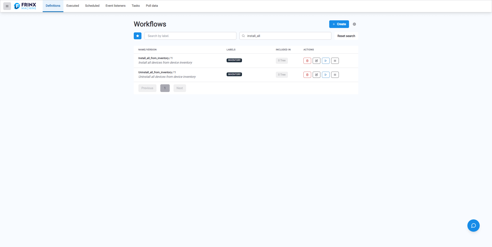
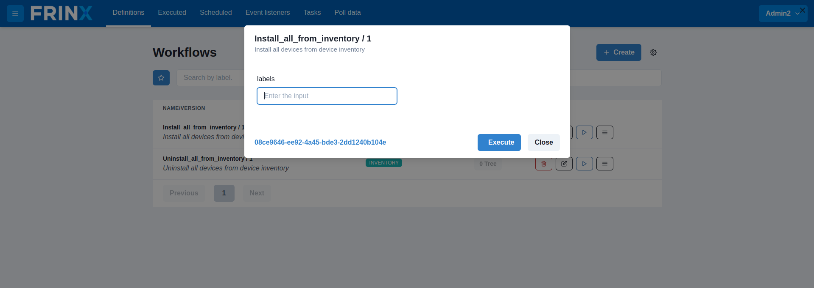
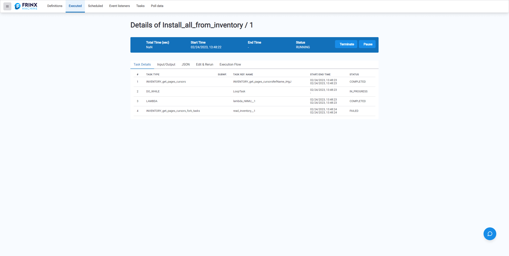

# Install all devices from inventory

When adding multiple devices to your inventory, it can be tedious to install them individually.
To make things easier, we have built a workflow to install all devices present in the inventory.

Follow these instructions to use the workflow:

On the landing page,  select `Workflow Manager`. Then select `Explore` and search for the workflow called **Install_all_from_inventory**.

After searching, select the `Execute` button (blue play icon). A window appears where you can enter the input parameter. This workflow does not require any input if you want to install all uninstalled devices. If you specified a device label when adding devices, you can use this label to determine which devices should be bulk installed. Select "Execute" again.

After you execute, a numeric link appears to the left of the `Execute` button. The link takes you to a page that shows individual tasks for this workflow, its inputs and outputs, and whether it was successful or unsuccessful. In the "Input/Output" tab, you can see both devices that were installed as a result of this workflow and those that were already installed.

