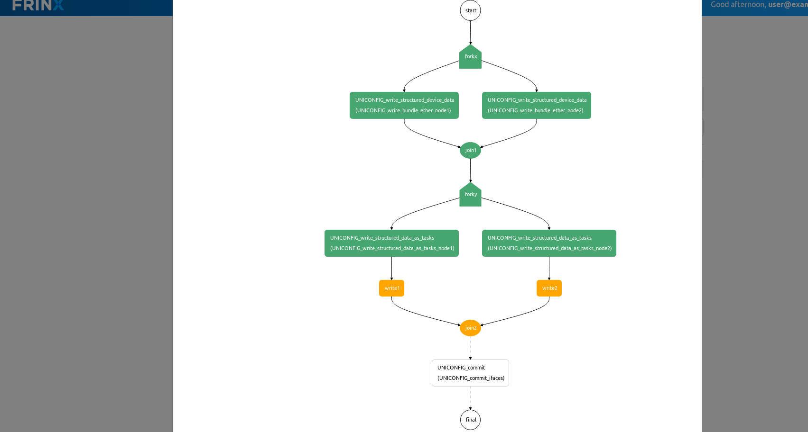
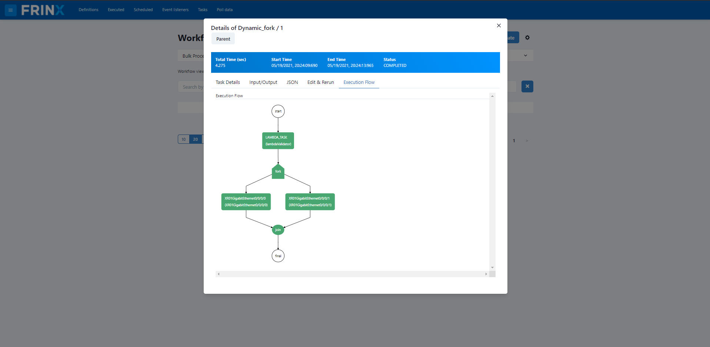

LACP workflows
==============

This workflow is using UniConfig to create LAG interface on two nodes and assigns the bundle id to the given interfaces on both nodes.

**Supported device**: ios-xr mounted as a cli device

.. important::

    Make sure you didn't skip :ref:`mounting all devices in inventory <frinx-machine-mount-all-devices-in-inventory>`, otherwise this workflow might not work correctly.

Creating a link aggregation between two nodes
----------------------------------------------

In the next step we will create a link between node 1 and node 2.

Click on: :menuselection:`Home --> Workflows --> Definitions`. Then search for the workflow: **Link_aggregation**. Click on **Input**.

After providing input parameters, you can execute the workflow.

**Example of input parameters**:

.. code-block:: text

    node1: XR01
    bundle_ether_id: 3
    bundle_ether_enabled: true
    node2: XR02
    node1_ifaces: GigabitEthernet0/0/0/0, GigabitEthernet0/0/0/1
    node2_ifaces: GigabitEthernet0/0/0/1, GigabitEthernet0/0/0/2, GigabitEthernet0/0/0/3

.. image:: LACP-WorkflowConf.png
   :target: /_images/LACP-WorkflowConf.png
   :alt: LACP Config

Workflow execution
-------------------

After workflow execution, click the ID of the workflow and click **Execution Flow,** you will be able to follow the progress of the execution of the workflow.

The workflow diagram in progress will color the steps according to your progress.

The diagram displayed above shows that the workflow has been successfully completed.
