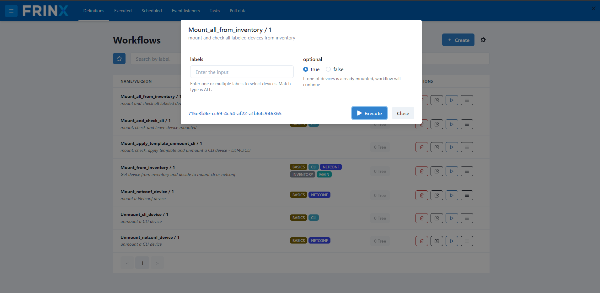

# Mount all devices in inventory

In order to set up the environment for the workflows that follow, it's
necessary for all devices from the inventory to be mounted. To do this,
follow these simple instructions:

Go to `Home` --> `Workflows` --> `Definitions` and search for the workflow
called **Mount_all_from_inventory**.

Once selected click on `Execute` in the workflow tab and then `Execute`
in input window. A numeric link on the left hand side of the `Execute`
button will pop up.

Click on the numeric link and wait for the status of all subworkflows to
change to "COMPLETED". This workflow will gather all devices in your
inventory and mount each of them.

Now you can verify that these devices are in fact mounted. To do this,
go to `Home` --> `UniConfig`. You should see something like the following:

