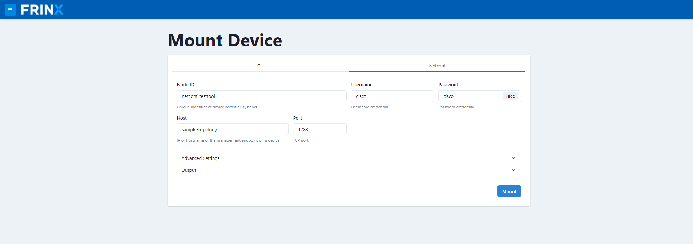
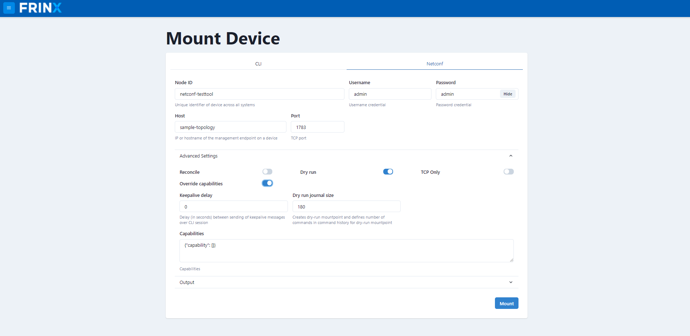

# Mount Devices from UniConfig

## Mount CLI Device

Navigate to `Mount Device` --> `CLI`

Cli device have Basic tab and Advanced tab.

Basic CLI tab contains basic data such as: node id, IP address of host
device, device port, transport type, device type, device version,
username and password. This data is required.

Fill the inputs with data:

```
node_id: XR01
host: sample-topology
port: 10001
transport-type: ssh
device-type: ios xr
device-version: 6.*
username: cisco
password: cisco
```


The Advanced CLI tab contains advanced data and optional parameters as
**Lazy Connection** and **Dry-run**. To enable these parameters, please
click on their respective button.


Click on `Mount Device` button. Mounting of the CLI device will take a couple of seconds. When your device is installed the button will change to **Connected** you can then close the overlaying modal dialog.

You can check device configuration by click at the `Config` button.

## Mount NetConf Device

`Mount Device` --> `Netconf`

The NetConf device also has a `Basic` tab and `Advanced` tab.

The `Basic` NETCONF tab contains basic data such as: node id, IP address
of host device, device port, username and password.

The `Advanced` NETCONF tab contains advanced data and optional parameters
as “Override capabilities”, “Dry-run” and "UniConfig Native". To enable
these parameters, please click on their respective button.

Fill the inputs with data:

```
node_id: netconf-testtool
host: sample-topology
port: 1783
username: cisco
password: cisco
```



Then click on the `Advanced` button. We enable the native parameter by
clicking the `UniConfig Native` tab. Then do not forget to enable
blacklist model by click into radiobutton.



Click on the `Mount Device` button. Mounting of NETCONF device will take
couple of seconds. When your device is installed the button will change to
**Connected** and you can close overlaying modal dialog.

You can check device configuration by clicking at the `Config` button.

## Unmount Device

Please select all devices. Then click on: Unmount Device button. This
will unmount all of the devices.


