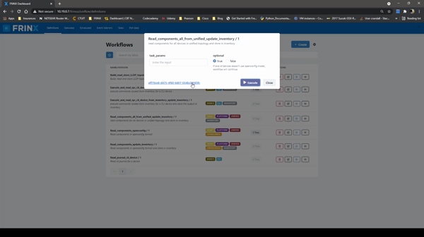
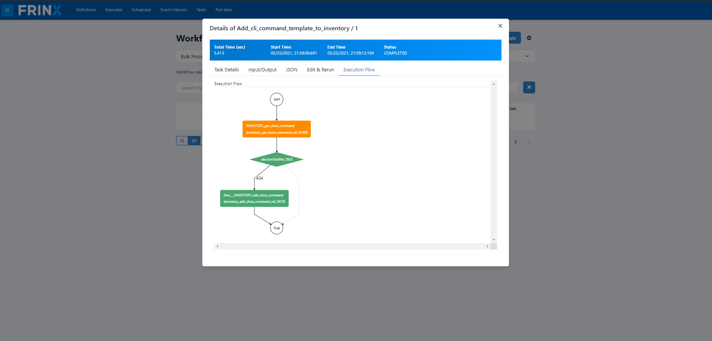

Obtain platform inventory data
==============================

In this section we show how users can execute workflows to obtain platform inventory data from devices in the network and to store them in the inventory (Elasticsearch).

The goal of this use case is to collect inventory information about physical devices via their vendor specific NETCONF or CLI interfaces, convert this information into OpenConfig data structures and store the resulting information as a child entry to its associated parent in Elasticsearch. 

The outcome is that users can manage their physical network inventory (line cards, route processors, modules, transceivers, etc …) across different hardware vendors in real-time via a single uniform interface.

.. important::

    Make sure you didn't skip :ref:`mounting all devices in inventory <frinx-machine-mount-all-devices-in-inventory>`, otherwise this workflow might not work correctly.

.. error::

    This use case does not work with VRP01 and netconf-testtool devices. Because of that, before executing other workflows, you need to unmount the "VRP01" and "netconf-testtool" devices that were previously mounted by the **Mount_all_from_inventory** workflow. In order to unmount these devices, go to :menuselection:`Home --> UniConfig` select the "VRP01" and "netconf-testtool" device and click "Unmount Devices".

Collect platform information from the device and store in the inventory
-----------------------------------------------------------------------

In the next step we will execute a workflow that collects platform information from every mounted device, converts the vendor specific information into OpenConfig format and writes the resulting data to the inventory.

Click on: :menuselection:`Home --> Workflows --> Definitions`

Then search for the workflow **Read_components_all_from_unified_update_inventory**

Once selected, you can execute the workflow without providing additional information. Click on the workflow ID that popped up to see the progress and additional details about this workflow. You should see something similar to this:

After the main and sub-workflows have completed successfully the platform information is now stored in the inventory as a child entry to the device ID that the information comes from.

The execution of all workflows can be done manually, via the UI, or can be automated and scheduled via the REST API of conductor server.
