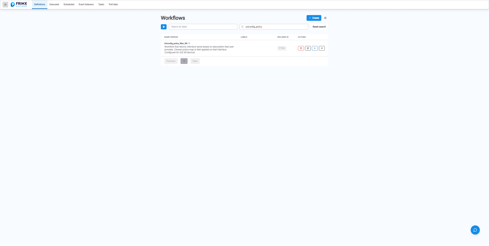
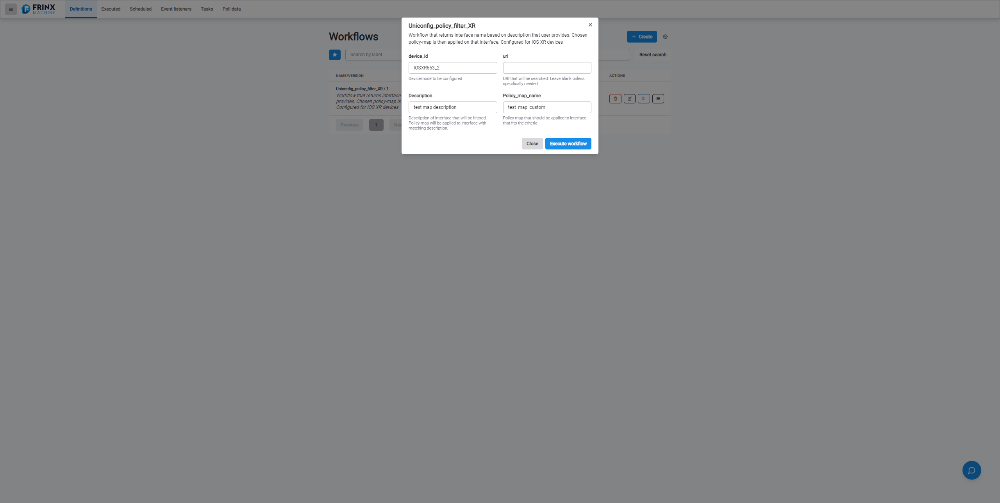
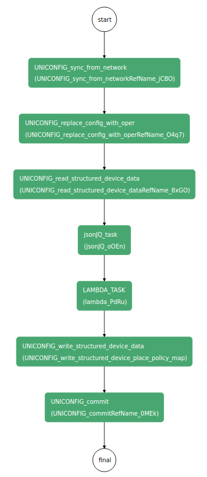
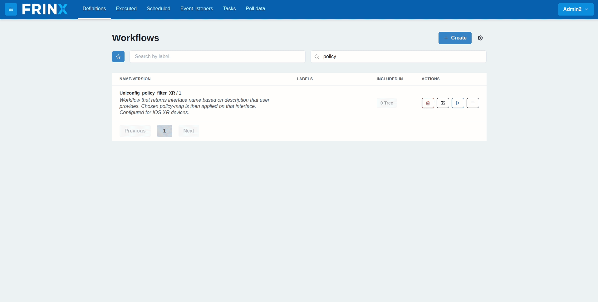

# Policy filter XR

This workflow uses UniConfig to showcase the filtering capabilities
of some of our system tasks. It filters through the interfaces of the
device, returns the name of the interface based on its description
provided by the user and applies chosen policy on that interface.

**Supported device**: ios-xr -> IOSXR653_1, IOSXR653_2 & IOSXR663_1 not IOS01 & IOS02

!!!danger
Policy creation is not part of this workflow. The chosen policy must
exist on the device before running this workflow.
!!!

## Searching the workflow



## Sync & Replace

We consider it best practice for all workflows that interact with
devices to start with the tasks "Sync from network" and "Replace config with
oper". This ensures that the internal databases of the FRINX Machine are
in sync with the latest configuration of the device. The input of these
tasks is simply the name of the node(device).

## Read device data

The next part is reading the device config. In the
**UNICONFIG_read_structured_device_data** task, you can specify which part
of the config you want to read with URI. In this case, we leave the
"URI" input field empty.

## jsonJQ filter

jsonJQ is one of our system tasks that is very useful for filtering
data. We use the following query expression:

```
.["frinx-uniconfig-topology:configuration"]["Cisco-IOS-XR-ifmgr-cfg:interface-configurations"] . "interface-configuration" | select(. != null) | .[] | select(.description == "${workflow.input.Description}") | {interface: ."interface-name"}
```

We search through the whole config, and under the
**Cisco-IOS-XR-ifmgr-cfg:interface-configurations** model we find the
interface with a description given by the user. The task returns the
name of that interface.

## Lambda

Lambda is a generic task that can process any JS code. In this case, we
use it to parse the output of the jsonJQ task. jsonJQ returns the name
of the interface in a standard decoded format, e.g: "TenGigE0/0/0/0".
However, we will be using that interface in URI, which means it must be
encoded. We can achieve that using a simple JS script:

```
{return(encodeURIComponent($.lambdaValue));}
```

As an example, we take the interface name **TenGigE0/0/0/0** and encode it to
**TenGigE0%2F0%2F0%2F0**.

## Write & commit

Lastly, we use the output of the lambda task for the configuration. We
apply a policy to the interface filtered based on its description.

## Example input



## Execution flow



## Run of the workflow



IOSXR653_1
test_map_custom
