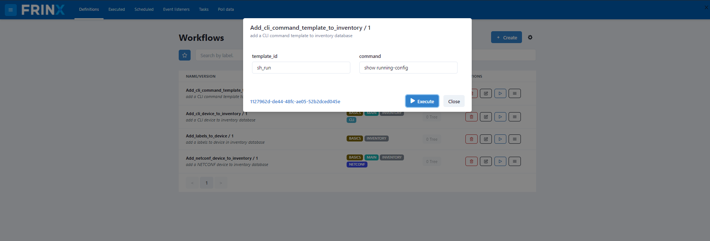
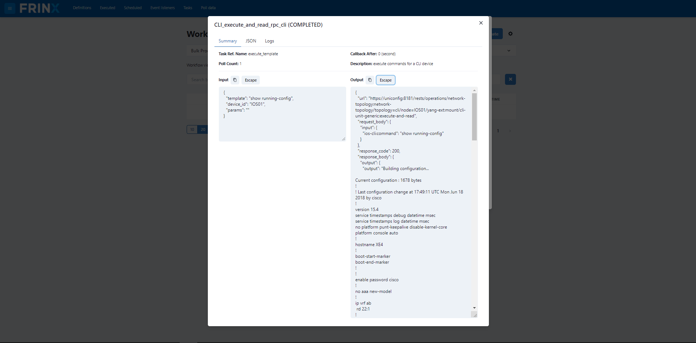
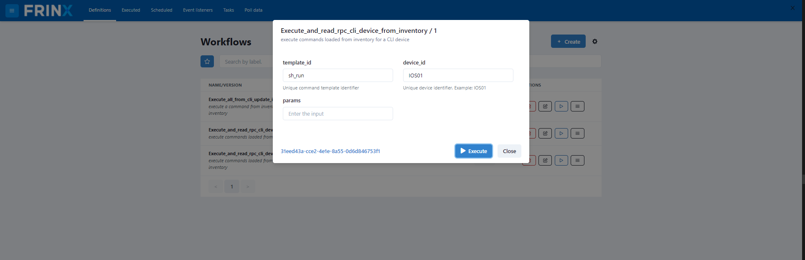
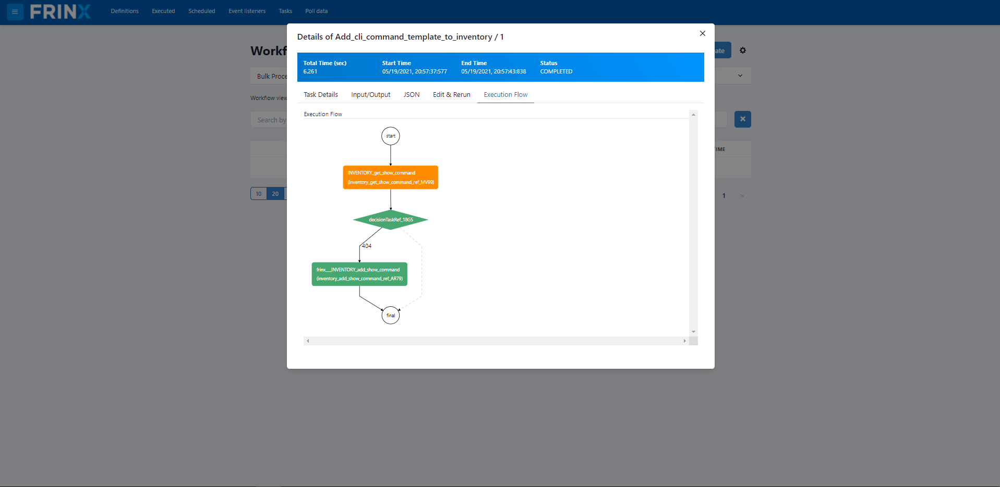
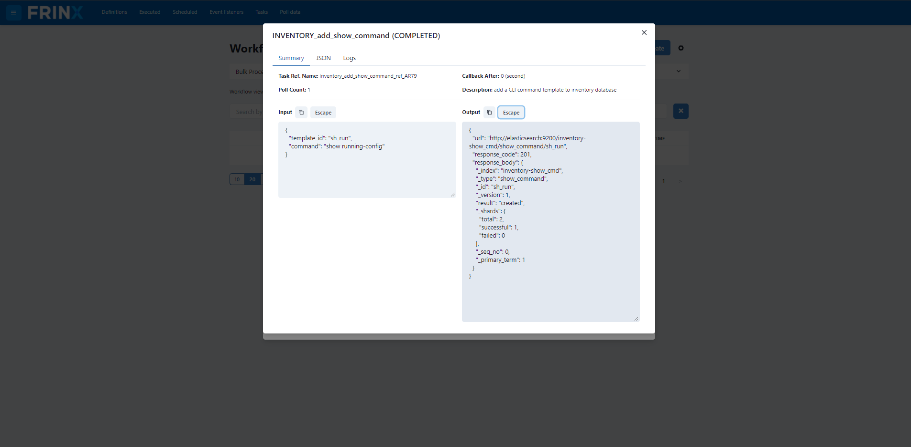

Save and execute commands on devices
====================================

In this section you will see how users can save a command to inventory and run it on devices. The command in this case is platform specific.

The goal of this use case is to execute a saved command on devices and save to output in the inventory.

.. important::

    Make sure you didn't skip :ref:`mounting all devices in inventory <frinx-machine-mount-all-devices-in-inventory>`, otherwise this workflow might not work correctly.

Save a command to inventory
---------------------------

In the next step we will execute a workflow that saves a command to inventory under a specific id.

Click on: :menuselection:`Home --> Workflows --> Definitions`

Then search for the workflow: **Add_cli_command_template_to_inventory**

.. code-block:: text

    template_id: sh_run
    command: show running-config

Once you fill in the id and the command you want to save, continue to execute the workflow.

Click on the workflow ID that popped up and click again to see it's details. You can see the progress of the workflow, input/output data of each task and statistics associated with the workflow execution.

.. image:: aSave-ExecutionFlow.png
   :target: /_images/Save-ExecutionFlow.png
   :alt: Workflow Execution

After the successful completion of the workflow the command is saved in the inventory. To see the inventory, go to :menuselection:`Home --> Inventory`

Execute saved command on mounted devices
----------------------------------------

In the next step we will execute the saved command on a device and obtain the running configuration which we then save to the inventory.

To run the command on one device in the inventory use **Execute_and_read_rpc_cli_device_from_inventory**.

To run the command on all mounted devices in the inventory while simultaneously updating the inventory itself use **Execute_all_from_cli_update_inventory**

To execute a command on one device and also update the inventory, you would use **Execute_and_read_rpc_cli_device_from_inventory_update_inventory**.

In our example we will use **Execute_and_read_rpc_cli_device_from_inventory** which will execute a command from inventory on one device without saving the output of this command to inventory.

Click on :menuselection:`Home --> Workflows --> Definitions` and find **Execute_and_read_rpc_cli_device_from_inventory**.

.. code-block:: text

    command_id: sh_run
    device_id: IOS01
    params: (leave blank)

After specifying the device id, the command id, and the input parameters (in our case empty: {}) you can run the workflow.

Look at the progress of the workflow by clicking on the workflow ID that popped up and click again to see it's details. Click "Execution Flow". Now you can see the progress of the workflow, input/output data of each task and statistics associated with the workflow execution.

Click the green box with "execute_template" written inside it and click "Unescape" to unescape the Output. You should see the output of the command which shows you the running configuration such as:

The execution of all workflows can be done manually, via the UI, or can be automated and scheduled via the REST API of conductor server.
