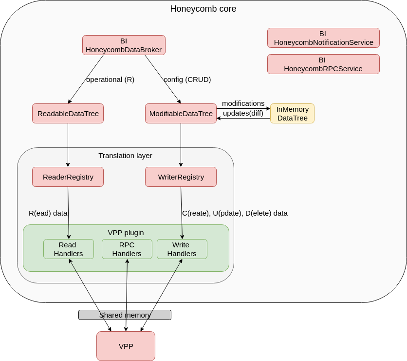
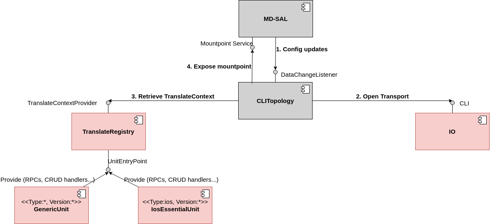

Architecture
============

Pre-requisite reading
---------------------

-   Honeycomb design documentation:

<https://wiki.fd.io/view/Honeycomb>
<https://docs.fd.io/honeycomb/1.18.04/release-notes-aggregator/release_notes.html>

-   CLI plugin available presentations:

<https://www.dropbox.com/sh/ry2ru5vizv7st8u/AAAntbCRHb1yS_NmEpbXG1WBa?dl=0>

Building on honeycomb
---------------------

The essential idea behind the southbound plugins comes from Honeycomb.
Honeycomb defines, implements and uses the same pipeline and the same
framework to handle data. The APIs, some implementations and also SPIs
used in the southbound plugin's translation layer come from Honeycomb.
However, the southbound plugin creates multiple instances of Honeycomb
components and encapsulates them behind a mount point.

The following series of diagrams shows the evolution from Opendaylight
to Honeycomb and back into Opendaylight as a mountpoint:

High level Opendaylight overview with its concept of a Mountpoint:

High level Honeycomb overview:

Honeycomb core (custom MD-SAL implementation) overview:

How Honeycomb is encapsulated as a mount point in Opendaylight:

### Major components

The following diagram shows the major components of the southbound
plugin and their relationships:

### Modules

The following diagram shows project modules and their dependencies:

