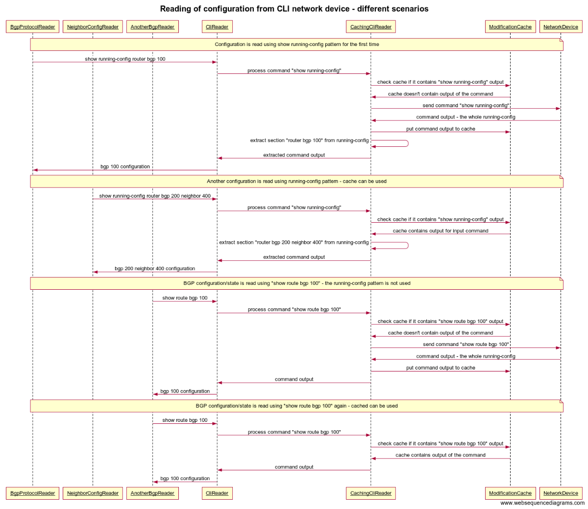

Implementing CLI Translation Unit
=================================

CLI Translation units are located in
<https://github.com/FRINXio/cli-units> repository. Java is used in CLI
translation units.

Init Unit
---------

Init translation unit does not contain readers and writers but it only
contains implementation of *TranslateUnit*. There should be only one
init translation unit per device type. Purpose of the init TU is to
setup CLI prompt and define rollback strategy.

The implementation of *TranslateUnit* needs to override methods:

**SessionInitializationStrategy getInitializer(@Nonnull final
RemoteDeviceId id, @Nonnull final CliNode cliNodeConfiguration)**

Implement and return device specific *SessionInitializationStrategy*
where:

> -   Setup device CLI terminal with attributes like width and length
>     allowing to display infinite output.
> -   Enter desired CLI mode which will be used as default - every
>     reader and writer gets CLI prompt in this state (e.g. EXEC mode
>     for IOS, config mode for IOS-XR, cli mode for Junos)

These methods may be overridden if necessary:

**getPreCommitHook()** - method that is invoked before actual commit is
written into device. For example this method can enter configuration
mode.

**getCommitHook()** - method that invokes actual commit and should catch
any error on commit. Also it should handle any post-commit actions when
the commit was successful.

**getPostFailedHook()** - method that is invoked when commit fails.
Should implement aborts or revert strategies.

**getErrorPatterns()** - method returning Java Patterns with regular
expressions that match device specific error patterns.

**getCommitErrorPattern()** - method returning Java Patterns with
regular expressions that match device specific error patterns that can
be returned by the device after issuing commit.

Translate Unit
--------------

Translate unit class must implement interface
*io.frinx.cli.unit.utils.AbstractUnit*. Naming convention for translate
unit class is device-type+openconfig-domain+Unit (e.g.
IosXrInterfaceUnit). Translate unit class is usually instantiated,
initialized and closed from Blueprint.

Implementation of TranslateUnit must be registered into
*TranslationUnitCollector* and must specify device type and device
version during registration. Snippet below shows registration of
[IosXRInterfaceUnit](https://github.com/FRINXio/cli-units/blob/master/ios-xr/interface/src/main/java/io/frinx/cli/unit/iosxr/ifc/IosXRInterfaceUnit.java)
for device type "ios xr" all versions.

``` {.sourceCode .java}
private final TranslationUnitCollector registry;
private TranslationUnitCollector.Registration reg;

public IosXRInterfaceUnit(@Nonnull final TranslationUnitCollector registry) {
    super(registry);
}

@Override
protected Set<Device> getSupportedVersions() {
    return IosXrDevices.IOS_XR_ALL;
}

@Override
protected String getUnitName() {
    return "IOS XR Interface (Openconfig) translate unit";
}

@Override
public void provideHandlers(@Nonnull CustomizerAwareReadRegistryBuilder readRegistry,
                            @Nonnull CustomizerAwareWriteRegistryBuilder writeRegistry,
                            @Nonnull Context context) {
    Cli cli = context.getTransport();
    provideReaders(readRegistry, cli);
    provideWriters(writeRegistry, cli);
}
```

Implementation of TranslateUnit must implement these methods:

**String getUnitName()**

Return unique string among all translation units which will be used as
ID for the translation unit (e.g. "IOS XR Interface (Openconfig)
translate unit")

**Set getYangSchemas()**

Return YANG models containing composite nodes handled by
handlers(readers/writers). Default implementation returns empty Set if
no handlers are implemented.

**Set getRpcs(@Nonnull Context context)**

Return RPC services implemented in the translation unit. Parameter
*context.getTransport()* returns *Cli* object containing methods for
communication with a device via CLI - may need to be passed to RPC
implementations. Default implementation returns empty Set.

**Set\<Device\> getSupportedVersions()**

This method should return specific device version that work with this
handler.

**void provideHandlers()**

Handlers(readers/writers) need to be registered in this method.
Parameter *context.getTransport()* returns *Cli* object containing
methods for communication with a device via CLI - should be passed to
readers/writers.

This method should also registers for general Openconfig checks:

``` {.sourceCode .java}
CheckRegistry checkRegistry = ChecksMap.getOpenconfigCheckRegistry();
readRegistry.setCheckRegistry(checkRegistry);
writeRegistry.setCheckRegistry(checkRegistry);
```

Instance-identifier in generic reader/writer must be without keys
pointing to the target composite node used in implemented reader/writer.

Instance-identifiers for YANG container and list (not for augmentations
and nodes behind augmentations) are automatically generated to *IIDs*
class (used in examples bellow) during build of openconfig project.

### Ordering of handlers

Writers are stored in a linear structure and are invoked in order of
registration. When registering a writer a relationship with another
writer or set of writers can be expressed using *addBefore, addAfter,
subtreeAddBefore, subtreeAddAfter* methods. E.g. InterfaceWriter and
VRFInterfaceWriter should have a relationship: InterfaceWriter -\>
VRFInterfaceWriter so that first an interface is created and only then
assigned to VRF.

> **note**
>
> VRF writer should be between them. If the order is not expressed
> during registration, commands might be executed on device in an
> unpredictable/invalid order.

The following sample shows a CLI translation unit with dependency
between 2 writers. The unit is dedicated for interface configuration on
a Cisco IOS device.

``` {.sourceCode .console}
R2(config)#interface loopback 1
R2(config-if)#ip address 10.0.0.1 255.255.255.255
```

As the example shows, the *ip address* command must be executed after
the *interface* command.

Registration of Ipv4ConfigWriter by using the *addAfter* method ensures
that the OpenConfig ip address data is translated after OpenConfig
interface data. That means CLI commands are executed in the desired
order.

**rRegistry.add**

Use when common *GenericConfigListReader*, *GenericConfigReader*,
*GenericOperListReader* or *GenericOperReader* need to be registered.

``` {.sourceCode .java}
rRegistry.add(IIDs.IN_INTERFACE, new InterfaceReader(cli));
```

**rRegistry.addNoop**

Use to register noop writers

``` {.sourceCode .java}
rRegistry.addNoop(IIDs.IN_IN_CONFIG);
```

**rRegistry.subtreeAdd**

Use when a reader implementation also fills composite child nodes of
target composite node. Method *subtreeAdd* requires a set of IIDs for
all handled children.

``` {.sourceCode .java}
rRegistry.subtreeAdd(IIDs.IN_IN_AUG_INTERFACE1_ET_CONFIG, new EthernetConfigReader(cli),
    Sets.newHashSet(IIDs.IN_IN_ET_CO_AUG_CONFIG1,
        io.frinx.openconfig.openconfig.lacp.IIDs.IN_IN_ET_CO_AUG_LACPETHCONFIGAUG);
```

**wRegistry.add**

Use when common *GenericListWriter* or *GenericWriter* are registered.

``` {.sourceCode .java}
wRegistry.add(IIDs.IN_IN_CONFIG, new InterfaceConfigWriter(cli));
```

**wRegistry.subtreeAdd**

Use for writers handling data of whole composite node subtrees. This
ensures that if only a child node is updated, the writer gets triggered.
Method *subtreeAdd* requires a set of IIDs for all handled children, the
IIDs must start from the reader itself, not from root.

``` {.sourceCode .java}
wRegistry.subtreeAddAfter(IIDs.IN_IN_AUG_INTERFACE1_ET_CONFIG, new EthernetConfigWriter(cli),
    Sets.newHashSet(IIDs.IN_IN_ET_CO_AUG_CONFIG1,
        io.frinx.openconfig.openconfig.lacp.IIDs.IN_IN_ET_CO_AUG_LACPETHCONFIGAUG),
    IIDs.IN_IN_CONFIG);
```

> **note**
>
> This example uses method subtreeAddAfter instead of subtreeAdd. Last
> parameter in this method shows dependency on writer registered under
> IIDs.IN\_IN\_CONFIG.

### Device registration

In TranslateUnit we had just created, *e.g. MplsUnitXR4.java*, we have
to register device as a constant located
*../iosxr/init/IosXrDevices.java* containing device type and version as
described in TranslateUnit \<cli-translation-unit-translate-unit\>
documentation.

``` {.sourceCode .java}
public void init() {
    reg = registry.registerTranslateUnit(IOS_4, this);
}
```

This unit can reuse all writers/readers from existing ones, except the
writer (or other handler) we want to alter or create (in our example
writer for tunnel configuration). We have to create a new writer with
desired behaviour and add it into *provideWriters* method.

``` {.sourceCode .java}
private void provideWriters(ModifiableWriterRegistryBuilder wRegistry, Cli cli) {
    wRegistry.add(IIDs.NE_NE_MP_LS_CO_TU_TU_CONFIG, new TunnelConfigWriterXR4(cli));
}
```

Readers
-------

Readers are handlers responsible for reading and parsing the data coming
from a device

There are 2 types of readers: Reader and ListReader. Reader can be used
to handle container or augmentation nodes and ListReader should handle
list nodes from YANG.

> -   Both types need to implement **readCurrentAttributes** to fill the
>     builder with appropriate values
> -   ListReader needs to also implement **getAllIds()** where it
>     retrieves a key for each item to be present in current list. After
>     the list is received, framework will invoke
>     **readCurrentAttributes** for each item from getAllIds

Readers should always use overloaded **blockingRead** method which takes
in the ReadContext since that method performs caching internally

**Use full version of commands** e.g. *show running-config interface*
instead of *sh run int*

### Reading of CLI and device configuration

CLI readers maintain translation between device and yang models. We're
sending read commands to the device and outputs are cached. This process
is shown below.

[](Process-of-reading-of-CLI-configuration-from-device.png)

#### Reading of configuration from CLI network device - different scenarios

The diagram below shows four specific scenarios:

1.  Configuration is read using show running-config pattern for the
    first time
2.  Another configuration is read using running-config pattern
    - cache can be used
3.  BGP configuration/state is read using "show route bgp 100"
    - the running-config pattern is not used
4.  BGP configuration/state is read using "show route bgp 100" again
    -   cached can be used

[](Reading-of-configuration-from-CLI-network-device-different-scenarios.png)

### Mandatory interfaces to implement

Each reader needs to implement one of these interfaces based on type of
target node in YANG. These interfaces also contain util methods which
may be used for better manipulation with data. For more information
about methods please read javadocs.

**CliConfigListReader** - implement this interface if target composite
node in YANG is list and represents config data.

**CliConfigReader** - implement this interface if target composite node
in YANG is container or augmentation and represents config data.

**CliOperListReader** - implement this interface if target composite
node in YANG is list and represents operational data.

**CliOperReader** - implement this interface if target composite node in
YANG is container or augmentation and represents operational data.

In cases where you want to invoke multiple readers on reading one YANG
node, extend following abstract classes:

**CompositeListReader** - extend this abstract class if multiple list
readers need to be invoked when reading specific list in YANG.

**CompositeReader** - extend this abstract class if multiple readers
need to be invoked when reading specific node in YANG.

A practical example of their usage is reading network instance based on
it's type. All child readers need to implement a check when the
particular reader should be invoked or the parent reader should move on
to the next reader.

For example child reader for bgp (located under *protocol*) needs to
check if *identifier* in *protocol* has value *BGP*. Otherwise reader
for bgp will be invoked even if *protocol identifier* is *OSPF*.

### Util classes

**ParsingUtils** - use methods of this util class if you want to parse
plaintext to java object builder

### Plaintext parsing hints

**Use** as **specific regular expressions** when parsing CLI output as
possible.

**For Cisco CLI devices** avoid using *section* and other advanced
formatting parameters. **Only** `include`, `exclude` **and** `begin`
**are allowed**.

Use CONFIG data as the source of truth when parsing information from
device. Except when parsing state containers (or containers explicitly
marked as *config false*).

-   I.e. use `show running-config | include router ospf` instead of
    `sh ospf` when retrieving ospf routers list.
-   In some cases, it is not possible to just use config data e.g. *sh
    run interface* does not show any data for interfaces that have no
    configuration. In this case it is necessary to use operational
    information from e.g. `show ip interface brief`

**Use following pattern when parsing multiline output from CLI**, where
it is difficult to extract lines and their relationships: i.e. when
parsing configured BGP neighbors per address family following command
can be used:

``` {.sourceCode .console}
show running-config | include ^router bgp | ^ address-family |^ neighbor``
```

which results in:

``` {.sourceCode .console}
router bgp 65000
    address-family ipv4 vrf vrf1
        neighbor 1.2.3.4 remote-as 65000>
        neighbor 1.2.3.4 activate
    address-family ipv4 vrf vrf2
        neighbor 2.2.0.1 remote-as 65000
        neighbor 2.2.0.1 activate
```

This output can then be parsed by:

-   Remove newlines to get a single line of string
-   Replace "router" with "" to separate bgp routers per line
-   Find the line that matches required router bgp {{ID}}
-   Take that line and replace "address-family" with "-family" to get
    address-family neighbors per line

### Base Readers

Each base reader should contain abstract methods:

-   **String getReadCommand(\<args\>)** - each child reader should fill
    in the read command used to get information needed for this reader.
    Arguments may vary and they are used to be more specific in the read
    command (eg. when creating a command to gather information about a
    specific interface, you may want to pass interface name as
    argument).
-   **Pattern get\<command\>Line(\>)** - there may be more such methods
    and they are used to get the regular expression needed to parse
    output of the command (eg. in case of interface reader, you will
    create methods getDescriptionLine, getShutdownLine etc.)

> **note**
>
> Naming of the methods should be unified in order to be easily parsed
> by auto-generated documentation.

Writers
-------

A writer needs to implement all 3 methods: Write, Update, Delete in
order to fully support default rollback mechanism of the framework

> **note**
>
> Time showed that update like 1. delete, 2. write is anti-pattern and
> should not be used. There is just one case where it is necessary: when
> re-writing list entry, you must first delete the previous entry, then
> write the new one, otherwise the previous entry would still be present
> and the new entry will be added to the list.

A writer can properly work only if there is a reader for the same
composite node.

A writer should check whether the command it executed was handled by the
device properly (by checking the output) and if not throw one of the
Write/Update/Delete FailedException

**Chunk templating framework is preferred to use in writers**. It gives
us:

-   Null safety
-   if/loop etc. inside templates
-   Default values and many more

**Use full version of commands** e.g. `configure terminal` instead of
`conf t`

### Mandatory interfaces to implement

Each writer needs to implement one of these interfaces based on type of
target node in YANG. Unlike mandatory interfaces for reading, only
interfaces for writing config data are available (because it is not
possible to write operational data). These interfaces also contain util
methods which may be used for better manipulation with data. For more
information about methods please read javadocs.

All writers override updateCurrentAttributes method and avoid
delete/write combination, unless specified in a comment.

**CliListWriter** - implement this interface if target composite node in
YANG is list. An implementation needs to be registered as
GenericListWriter.

**CliWriter** - implement this interface if target composite node in
YANG is container or augmentation. An implementation needs to be
registered as GenericWriter.

**CompositeWriter** - extend this abstract class when multiple writers
need to be invoked on one YANG node. The writers need to implement a
check whether or not should they be invoked.

### Base Writers

Each base writer should contain abstract methods:

-   **String updateTemplate(Config before, Config after)** this method
    returns Chunk template used for writing and updating data on the
    device.
-   **String deleteTemplate(Config data)** this method returns Chunk
    template used for deleting data from device.

> **note**
>
> If updating data is done differently than writing new data, method
> **String writeTemplate(Config data)** might be used as well.

#### Chunk Templates

Each original writer transformed to use a base writer should have all
it's templates written in Chunk. We extended Chunk to achieve easier
manipulation with data. There is now a new filter called *update*. It's
usage is following:

**"{\$data|update(mtu,mtu \$data.mtu, no mtu)}"**

-   *\$data* represents the data structure on which we check if it was
    updated from the previous state.
-   *mtu* first argument represents the **name** of the field that
    should be checked within the \$data
-   *\$data.mtu* second argument represents the actual string that will
    be sent to the device if the value of the field named in first
    argument was changed or didn't exist before
-   *no mtu* third argument represents the actual string that will be
    sent to the device if the value of the field named in first argument
    was deleted
-   optional *true* fourth argument, if present, lets the filter know it
    should send **both** outputs to the device, first the delete string
    (third argument) then the update string (second argument)

Update filter does not send any of the strings to the device, if the
value did not change.

When using this filter in updateTemplate method, you **must** use fT()
method (format template) with one pair of the arguments being *"before",
before* to let the template know what data represents the previous
state.

> **note**
>
> Unfortunately, Opendaylight generates boolean fields instead of
> Boolean and Chunk does not work with boolean fields in the same way as
> any other object fields. Therefore for boolean values (eg. shutdown),
> you cannot use update filter and checking for changes needs to be done
> in a traditional way.
