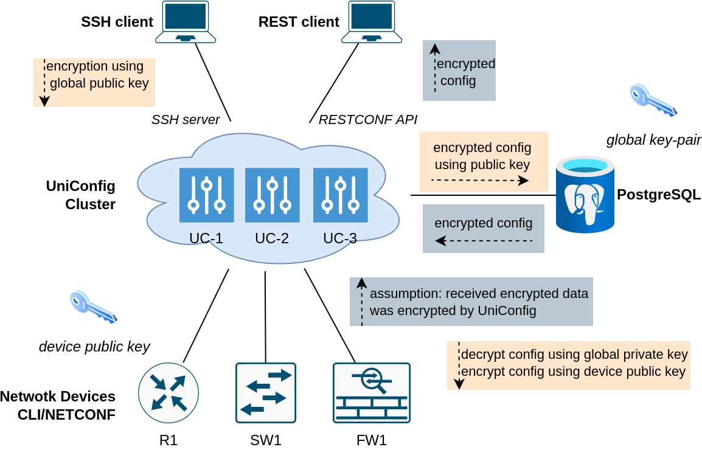
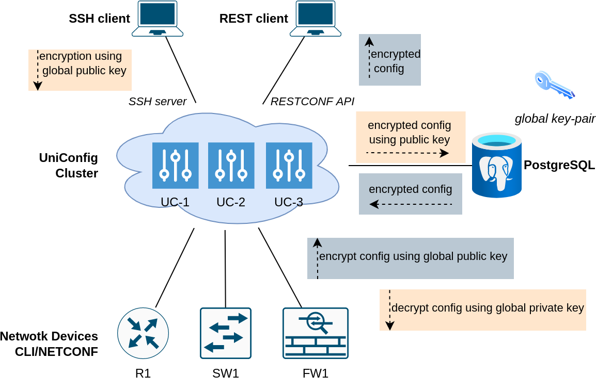
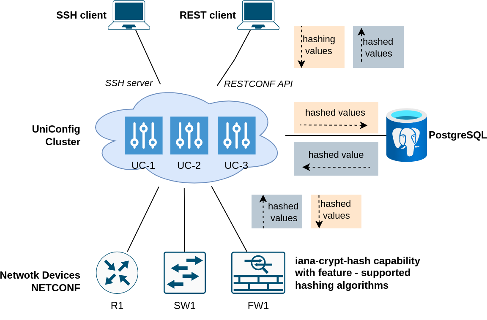
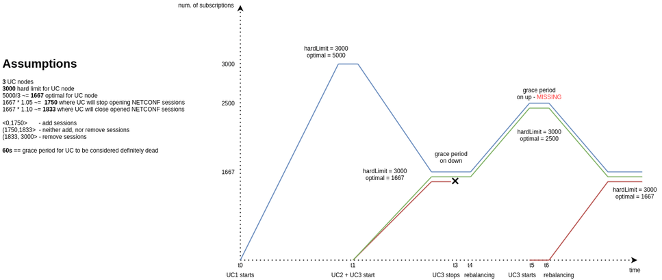
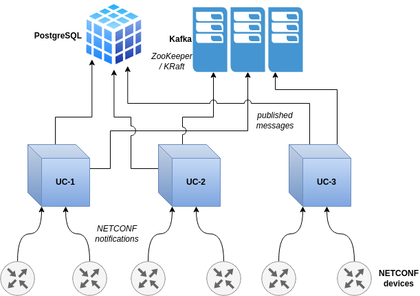

# UniConfig 4.2.10

## :white_check_mark: New Features

#### Aggregation of all edit-config NETCONF messages into one edit-config message

- Each modification in the transaction was expressed using one edit-config message on southbound layer. 

This approach was not optimal:
- it generated more network traffic than needed
- it could introduce errors, if device checks some references before committing configuration

After this patch, all NETCONF edit-config RPCs in the transaction are aggregated into single edit-config RPC with common parent element.

#### Capturing changes in ordered list/leaf-list using calculate-diff RPC

- Currently, changed order of list entries inside ordered list/leaf-list is displayed as updated whole list with all list entries - not optimal solution.

- Added new list to calculate-diff RPC output that captures changes in the ordering of list or leaf-list elements. Such changes are not displayed under created/removed/updated containers.

#### Validation of leaf-refs
- Validation of leaf-ref YANG constraints that are affected by some create/delete/update operation:
- Supported following leaf-ref paths:
    - absolute paths
    - relative paths
    - paths with 'current()' XPATH function
- Added new RESTCONF query parameter into put/patch/delete operations - checkForReferences.
- Implementation conforms [RFC 7950 - The YANG 1.1 Data Modeling Language](https://datatracker.ietf.org/doc/html/rfc7950#section-9.9)

#### Encryption of leaves selected by paths

- UniConfig uses asymmetric encryption for ensuring confidentiality of selected leaf and leaf-list values. Currently, only RSA ciphers are supported (both global UniConfig and device-level key-pairs). Encryption is supported in ‘uniconfig’, ‘unistore’, and ‘templates’ topologies.
- Global-device encryption architecture - both UniConfig and device uses PKI for encryption of data:



- In comparison to Global-device encryption architecture this model uses only global key-pair for encryption of data. Devices contain only plaintext data.



--- 

#### Implementation of ‘crypt-hash' type from 'iana-crypt-hash’ YANG module

- UniConfig supports 'iana-crypt-hash' YANG model for specification of hashed values in data-tree using type definition 'crypt-hash'. Hashing works in the 'uniconfig' and 'unistore' topologies. Only NETCONF devices are currently supported because CLI cannot be natively used for reporting of device capabilities that would contain supported hashing function.

- Hashing is done only in the RESTCONF layer after writing some data that contains leaves/leaf-lists with 'crypt-hash' type. Afterwards, UniConfig stores, uses, and writes to device only hashed representation of these values.

- All 3 hash functions are implemented - 'MD5', 'SHA-256', 'SHA-512'. In case of 'uniconfig' topology, hashing function is selected based on reported feature in the NETCONF capability, in case of 'unistore' topology, UniConfig enforces 'SHA-512' hashing function.



---

#### Using the latest schema at creation of template

- Adding configuration into UniConfig that tracks identifier of the UniConfig repository that must be used at creation of new template, if user doesn’t explicitly specify identifier of this repository using ‘schema-cache-directory’ query parameter.


#### Rebalancing of notifications cluster at runtime

- Random distribution of subscriptions to NETCONF notifications streams and turning on/off UniConfig instances may lead to scenario when one of the UniConfig instances in the cluster contain most of the subscriptions while others unequally smaller number.

- Fixed by automatic redistribution of already created subscriptions on UniConfig instances and introduction of limits, how many subscriptions can be allocated on the one UniConfig instance in the cluster.



##### Configuration

- Added new parameters under “notifications“ element in the lighty-uniconfig-config.json file:

```
@JsonProperty("maxNetconfSubscriptionsHardLimit")
private int maxNetconfSubscriptionsHardLimit = 5000;
@JsonProperty("optimalNetconfSubscriptionsReachedMargin")
private double optimalNetconfSubscriptionsReachedMargin = 0.10;
@JsonProperty("optimalNetconfSubscriptionsApproachingMargin")
private double optimalNetconfSubscriptionsApproachingMargin = 0.05;
@JsonProperty("rebalanceOnUCNodeGoingDownGracePeriod")
private int rebalanceOnUCNodeGoingDownGracePeriod = 120;
```

---

#### Implementation of RFC-8072 PATCH operation

- Invocation of PATCH that may contain multiple edits.
- All edits are invoked sequentially and atomically as single operation.
- Supported sub-operations per edit: create, delete, insert, merge, move, replace, remove.
- More detailed description: [RFC 8072 - YANG Patch Media Type](https://datatracker.ietf.org/doc/html/rfc8072) 

#### Added missing protocols to L2 for IOS XE (cli-units)

- Parsing of following protocols:
    - elmi
    - pagp
    - udld
    - ptppd

---

#### UniConfig whitelist

- specification of top-level containers/lists which configuration is synced from device (no other configuration is read from device)
- opposite of existing blacklist functionality
- either blacklist or whitelist can be specified, not both

**API**

- updated YANG model that defines whitelist/blacklist:

```
...
        choice nodes {
            case wl {
                container whitelist {
                    description "Reads which are invoked for sync-from-network and initial config read."  ;

                    uses uniconfig-config-node-lists;
                }
            }
            case bl {
                container blacklist {
                    description "Reads which are not invoked for sync-from-network and initial config read.";

                    uses uniconfig-config-node-lists;
                }
            }
        }
        
    grouping uniconfig-config-node-lists {
        leaf-list path {
            description "Only root schema nodes are supported. The path needs to be in URI format from RFC 8040.
            e.g. ietf-interfaces:interfaces where ietf-interfaces is YANG module name and interfaces is root
            container.";
            type string;
        }
        leaf-list extension {
            description "List of extensions that mark top level containers/lists.
            Example value: [\"common:hidden true\"]";
            type string;
        }
    }
...
```

- Install-node RPC example (input body):

```
{
  "input":{
      "node-id":"xr1",
      "netconf":{
          "netconf-node-topology:host":"10.0.0.1",
          "netconf-node-topology:port":830,
          "netconf-node-topology:keepalive-delay":5,
          "netconf-node-topology:tcp-only":false,
          "netconf-node-topology:username":"USERNAME",
          "netconf-node-topology:password":"PASSWORD",
          "netconf-node-topology:dry-run-journal-size":180,
          "uniconfig-config:uniconfig-native-enabled":true,
          "uniconfig-config:whitelist":{
              "uniconfig-config:path":[
                  "openconfig-interfaces:interfaces",
                  "openconfig-vlan:vlans"
              ]
          }
      }
    }
}
```

---

#### UniConfig client thread model

- make uniconfig-client thread safe (using client from multiple threads)
- making HTTP connection pools configurable (max connections, …)

**API:**

Introduced connection pool settings:

```
public final class HttpClientSettings {
    private final long responseReadTimeout;
    private final long requestWriteTimeout;
    private final long connectTimeout;
    private final boolean retryOnConnectFailure;
    private final int maxParallelConnections;
    private final int maxIdleConnections;
    private final long idleConnectionTimeout;
```

- Introduced UniConfig server settings:

```
public final class UniconfigServerSettings {
    private final String uniconfigHostname;
    private final int restServerPort;
    private final String username;
    private final String password;
```

- Example:

```
// connection settings
final var uniconfigServerSettings = new UniconfigServerSettingsBuilder()
      .setUniconfigHostname("127.0.0.1")
      .setRestServerPort(8181)
      .setUsername("admin")
      .setPassword("admin")
      .build();
final var httpClientSettings = new HttpClientSettingsBuilder()
      // setting connection pool capacity to 100
      .setMaxParallelConnections(100)
      // timeout for initialization of connection between client and server
      .setConnectTimeout(10000)
      // set maximum number of idle connections in the connection pool
      .setMaxIdleConnections(50)
      // defining how much time idle connections will stay in the connection pool (milliseconds)
      .setIdleConnectionTimeout(10000)
      .build();
LOG.info("Uniconfig server settings: {}", uniconfigServerSettings);
LOG.info("HTTP client settings: {}", httpClientSettings);

final var uniconfig = Uniconfig.create(uniconfigServerSettings, httpClientSettings);
// using uniconfig brokers ...
```

---

#### Distribution of NETCONF notifications to Kafka

- NETCONF devices are capable of generating NETCONF notifications. UniConfig is able to collect these notifications and creates its own UniConfig notifications about specific events. Kafka is used for publishing of these notifications from NETCONF devices and UniConfig. Currently there are these types of notifications: - NETCONF notifications - notifications about transactions - audit logs (RESTCONF notifications).



**API**

- Added subscription API to install-node request - 'stream' container. Example (subscription to 2 NETCONF streams - ‘NETCONF' and 'system’):

```
curl --location --request POST 'http://localhost:8181/rests/operations/connection-manager:install-node' \
--header 'Accept: application/json' \
--header 'Content-Type: application/json' \
--data-raw '{
    "input":{
        "node-id":"versa_2",
        "netconf":{
            "netconf-node-topology:host":"10.103.5.202",
            "netconf-node-topology:port":2022,
            "netconf-node-topology:keepalive-delay":5,
            "netconf-node-topology:max-connection-attempts":1,
            "netconf-node-topology:connection-timeout-millis":60000,
            "netconf-node-topology:default-request-timeout-millis":60000,
            "netconf-node-topology:tcp-only":false,
            "netconf-node-topology:username":"admin",
            "netconf-node-topology:password":"versa123",
            "netconf-node-topology:sleep-factor":1.0,
            "uniconfig-config:UniConfig-native-enabled":true,
            "netconf-node-topology:edit-config-test-option":"set",
            "stream":[
                {
                    "stream-name":"NETCONF",
                    "start-time":"2021-11-08T02:00:00+00:00",
                    "stop-time":"2021-11-08T22:00:00+00:00"
                },
                {
                    "stream-name":"system"
                }
            ]
        }
    }
}'
```

- Added root list 'netconf-subscription' which contains all active subscriptions.

```
curl --location --request GET 'http://localhost:8181/rests/data/netconf-subscriptions:netconf-subscriptions' \
--header 'Accept: application/json' \
--header 'Content-Type: application/json'
```

- Corresponding YANG model:

```
module netconf-subscriptions {
    yang-version 1;
    namespace "http://frinx.io/netconf-subscriptions";
    prefix netconf-subscriptions;

    import network-topology {
        revision-date 2013-10-21;
        prefix nt;
    }

    import yang-ext {
        revision-date "2013-07-09";
        prefix ext;
    }

    import ietf-yang-types {
        revision-date 2013-07-15;
        prefix "yang";
    }

    import connection-manager {
        revision-date 2021-04-09;
        prefix "cm";
    }

    revision 2021-10-11 {
        description
          "Initial revision";
    }

    grouping stream-subscription-fields {
        leaf node-id {
            type string;
            description
              "Identifier of the node which publishes notifications via stream.";
        }

        leaf uniconfig-instance {
            type string;
            description
              "Identifier of the UniConfig instance which currently maintains subscription to stream.";
        }

        leaf creation-time {
            type yang:date-and-time;
            mandatory true;
            description
              "Time when subscription has been created.";
        }

        uses stream-fields;
    }

    grouping stream-fields {
        leaf stream-name {
            type string;
            description
              "Identifier of the notification stream.";
        }

        leaf start-time {
            type yang:date-and-time;
            description
              "RFC5277: A parameter, <startTime>, used to trigger the replay feature and indicate that the replay
               should start at the time specified. If <startTime> is not present, this is not a replay subscription.
               It is not valid to specify start times that are later than the current time. If the <startTime> specified
               is earlier than the log can support, the replay will begin with the earliest available notification.";
        }

        leaf stop-time {
            type yang:date-and-time;
            description
              "RFC5277: An optional parameter, <stopTime>, used with the optional replay feature to indicate the newest
               notifications of interest. If <stopTime> is not present, the notifications will continue until the
               subscription is terminated. Must be used with and be later than <startTime>. Values of <stopTime>
               in the future are valid.";
        }
    }

    grouping streams-list {
        list stream {
            key stream-name;
            description
              "List of available streams to which subscription can be created.";

            uses stream-fields;
        }
    }

    list netconf-subscription {
        key "node-id stream-name";
        config false;
        description
          "List of created subscriptions to notification streams.";

        uses stream-subscription-fields;
    }

    augment "/nt:network-topology/nt:topology/nt:node" {
        when "../../nt:topology-types/topology-netconf";
        ext:augment-identifier "netconf-node";

        uses streams-list;
    }

    augment "/cm:install-node/cm:input/cm:netconf" {
        uses streams-list;
    }

    augment "/cm:install-multiple-nodes/cm:input/cm:nodes/cm:netconf" {
        uses streams-list;
    }
}

```

**Configuration**

- Provided initial configuration that can put into lighty-uniconfig-config.json:

```
{
  "notifications": {
    "enabled": true,
    "kafka": {
      "username": "kafka",
      "password": "kafka",
      "kafkaServers": [
        {
          "brokerHost": "127.0.0.1",
          "brokerListeningPort": 9092
        }
      ],
      "netconfNotificationsEnabled": true,
      "netconfNotificationsTopicName": "netconf-notifications",
      "embeddedKafka": {
        "enabled": true,
        "installDir": "/tmp/embedded-kafka",
        "archiveUrl": "https://dlcdn.apache.org/kafka/3.0.0/kafka_2.12-3.0.0.tgz",
        "dataDir": "./data/embedded-kafka",
        "cleanDataBeforeStart": true,
        "partitions": 1
      }
    },
    "notificationDbTreshold": {
      "maxCount": 10000,
      "maxAge": 100
    },
    "netconfSubscriptionsMonitoringInterval": 5,
    "maxNetconfSubscriptionsPerInterval": 10
  }
}
```

**Uniconfig-client**

Example:

```
/*
 * Copyright © 2021 Frinx and others.
 *
 * Licensed under the Apache License, Version 2.0 (the "License");
 * you may not use this file except in compliance with the License.
 * You may obtain a copy of the License at
 *
 * http://www.apache.org/licenses/LICENSE-2.0
 *
 * Unless required by applicable law or agreed to in writing, software
 * distributed under the License is distributed on an "AS IS" BASIS,
 * WITHOUT WARRANTIES OR CONDITIONS OF ANY KIND, either express or implied.
 * See the License for the specific language governing permissions and
 * limitations under the License.
 */
package io.frinx.samples;

import io.frinx.uniconfig.client.device.DeviceMountBuilder;
import io.frinx.uniconfig.client.device.NetconfDeviceMount;
import io.frinx.uniconfig.client.device.NetconfDeviceMount.Protocol;
import io.frinx.uniconfig.client.model.NetconfStream;
import io.frinx.uniconfig.client.model.Notification;
import io.frinx.uniconfig.client.model.RegisteredSubscription;
import io.frinx.uniconfig.client.model.Subscription.SubscriptionBuilder;
import io.frinx.uniconfig.client.services.NetconfDeviceService;
import io.frinx.uniconfig.client.services.NetconfSouthboundService;
import io.frinx.uniconfig.client.services.NotificationService.Listener;
import io.frinx.uniconfig.client.services.Uniconfig;
import io.frinx.uniconfig.client.services.Uniconfig.UniconfigBuilder;
import io.frinx.uniconfig.client.services.config.KafkaSettings.KafkaBrokerLocation;
import io.frinx.uniconfig.client.services.config.KafkaSettings.KafkaSettingsBuilder;
import io.frinx.uniconfig.client.services.config.UniconfigServerSettings.UniconfigServerSettingsBuilder;
import java.net.UnknownHostException;
import java.util.Collections;
import java.util.List;
import org.slf4j.Logger;
import org.slf4j.LoggerFactory;

public final class NotificationsUseCase {
    private static final Logger LOG = LoggerFactory.getLogger(NotificationsUseCase.class);

    private static final String DEVICE_ID = "vnf";
    private static final String NETCONF_STREAM = "NETCONF";
    private static final NetconfDeviceMount NETCONF_DEVICE_MOUNT = new DeviceMountBuilder()
            .setProtocol(Protocol.SSH)
            .setHost("10.103.5.202")
            .setPort(2022)
            .setUsername("admin")
            .setPassword("versa123")
            .setUseNativeModels(true)
            .setSubscriptionList(Collections.singletonList(
                    new SubscriptionBuilder()
                            .setStreamName(NETCONF_STREAM)
                            .setStartTime("2021-02-09T15:00:00Z")
                            .setStopTime("2021-02-09T16:00:00Z")
                            .build()
            ))
            .setExtensionsToIgnore(Collections.singletonList("tailf:display-when false"))
            .createDeviceMount();

    private NotificationsUseCase() {
        throw new UnsupportedOperationException("Sample class");
    }

    public static void main(String[] args) throws UnknownHostException, InterruptedException {
        // install NETCONF device
        final Uniconfig uniconfig = new UniconfigBuilder()
                .setUniconfigServerSettings(new UniconfigServerSettingsBuilder()
                        .setUniconfigHostname("127.0.0.1")
                        .setRestServerPort(8181)
                        .setUsername("admin")
                        .setPassword("admin")
                        .build())
                .setKafkaSettings(new KafkaSettingsBuilder()
                        .setNetconfNotificationsTopic("netconf-notifications")
                        .setBrokers(Collections.singletonList(new KafkaBrokerLocation("127.0.0.1", 9092)))
                        .build())
                .build();
        final NetconfSouthboundService netconfSouthboundService = uniconfig.netconf();
        final NetconfDeviceService netconf = uniconfig.netconf(DEVICE_ID);
        if (!netconf.isInstalled()) {
            LOG.info("Installing {}", DEVICE_ID);
            netconf.installDevice(NETCONF_DEVICE_MOUNT);
        }

        // get available NETCONF streams
        final List<NetconfStream> netconfStreams = netconf.getAvailableNetconfStreams();
        netconfStreams.forEach(netconfStream -> LOG.info("NETCONF stream: {}", netconfStream.getName()));

        // get stream subscriptions
        final List<RegisteredSubscription> streamSubscriptions = netconfSouthboundService.getRegisteredSubscriptions();
        streamSubscriptions.forEach(streamSubscription -> LOG.info("NETCONF stream subscriptions: {}",
                streamSubscription.toString()));

        // create and start notification service
        final var notificationService = uniconfig.notificationService();

        // register listener to notification service
        notificationService.registerListener(new NotificationListener());

        // we need to send the thread to sleep while uniconfig stores notifications on the kafka server. Then
        // the notification service, which runs in the background, has the chance to read notifications from
        // the kafka server.
        Thread.sleep(50000);

        notificationService.close();
        // uninstall device
        netconf.uninstallDevice();
    }

    /**
     * Implementation of {@link Listener}
     */
    private static class NotificationListener implements Listener {

        private static final Logger LOG = LoggerFactory.getLogger(NotificationListener.class);

        @Override
        public void onNotification(List<Notification> notificationList) {
            notificationList.forEach(this::printNotification);
        }

        private void printNotification(Notification notification) {
            LOG.info("Received new notification\n\nStream name: {},\nNode id: {},\nEvent time: {},\nIdentifier: {},\n"
                            + "Body: {}\n",
                    notification.getStreamName(),
                    notification.getNodeId(),
                    notification.getEventTime(),
                    notification.getIdentifier(),
                    notification.getJsonEventBody());
        }
    }
}
```

---

#### Dynamic configuration of Kafka brokers

Location of Kafka brokers and other Kafka settings must be configurable using RESTCONF API.

- Persistence of this configuration in the database. All UniConfig instances must use same settings.
- Option to change/read these settings using CRUD RESTCONF operations.
- Configuration that is placed in the configuration file must be used only as initial configuration.

**API**

- RESTCONF API used for reading and modification of all Kafka settings is described by following YANG model:

```
module kafka-brokers {
    yang-version 1.1;
    namespace "http://frinx.io/kafka/brokers";
    prefix kafka-brokers;

    import ietf-inet-types {
        prefix inet;
        revision-date "2013-07-15";
    }

    revision 2021-11-09 {
        description
          "Initial revision";
    }

    grouping kafka-broker-identifier {
        leaf host {
            type inet:host;
            description "Hostname / address which Kafka broker resides on.";
        }
        leaf port {
            type inet:port-number;
            description "Listening RPC port of Kafka broker.";
        }
    }

    grouping kafka-global-settings {
        leaf username {
            type string;
            description "Username used for authentication into Kafka broker (SASL). If username is not specified,
             plaintext authentication will be used.";
        }
        leaf password {
            type string;
            description "Password used for authentication into Kafka broker (SASL).
             Must be used together with username.";
        }
        leaf netconf-notification-topic {
            type string;
            mandatory true;
            default "netconf-notifications";
            description "Identifier of the Kafka topic used for distribution of NETCONF notifications.";
        }
        leaf audit-logs-topic {
            type string;
            mandatory true;
            default "audit-logs";
            description "Identifier of the Kafka topic used for distribution of audit logs.";
        }
        leaf transactions-topic {
            type string;
            mandatory true;
            default "transactions";
            description "Identifier of the Kafka topic used for distribution of notifications about transactions.";
        }
        leaf data-change-events-topic {
            type string;
            mandatory true;
            default "data-change-events";
            description "Identifier of the Kafka topic used for distribution of data-change-events.";
        }
        leaf netconf-notifications-enabled {
            type boolean;
            mandatory true;
            default "true";
            description "If netconf notifications are enabled.";
        }
        leaf transaction-notifications-enabled {
            type boolean;
            mandatory true;
            default "true";
            description "If transaction notifications are enabled.";
        }
        leaf audit-logs-enabled {
            type boolean;
            mandatory true;
            default "true";
            description "If audit logs are enabled.";
        }
        leaf data-change-events-enabled {
            type boolean;
            mandatory true;
            default "true";
            description "Enabled collection and propagation of data-change-events into Kafka.";
        }
        leaf blocking-timeout {
            type uint32;
            default 60000;
            description "The configuration controls how long the KafkaProducer's send(), partitionsFor(),
            initTransactions(), sendOffsetsToTransaction(), commitTransaction() and abortTransaction() methods
            will block. For send() this timeout bounds the total time waiting for both metadata fetch and buffer
            allocation (blocking in the user-supplied serializers or partitioner is not counted against this
            timeout). For partitionsFor() this timeout bounds the time spent waiting for metadata if it is
            unavailable. The transaction-related methods always block, but may timeout if the transaction
            coordinator could not be discovered or did not respond within the timeout.";
        }
        leaf request-timeout {
            type uint32;
            default 30000;
            description "The configuration controls the maximum amount of time the client will wait for the
            response of a request. If the response is not received before the timeout elapses the client will
            resend the request if necessary or fail the request if retries are exhausted. This should be larger
            than replica.lag.time.max.ms (a broker configuration) to reduce the possibility of message duplication
            due to unnecessary producer retries.";
        }
        leaf delivery-timeout {
            type uint32;
            default 120000;
            description "An upper bound on the time to report success or failure after a call to send() returns.
            This limits the total time that a record will be delayed prior to sending, the time to await
            acknowledgement from the broker (if expected), and the time allowed for retriable send failures.
            The producer may report failure to send a record earlier than this config if either an unrecoverable
            error is encountered, the retries have been exhausted, or the record is added to a batch which reached
            an earlier delivery expiration deadline. The value of this config should be greater than or equal to
            the sum of request.timeout.ms and linger.ms.";
        }
        leaf maxThreadPoolSize {
            type uint16;
            default 8;
            description "The maximum size of the thread pool";
        }
        leaf queueCapacity {
            type uint16;
            default 2048;
            description "The maximum size of the work queue";
        }
    }

    container kafka-settings {
        uses kafka-global-settings;
        list kafka-broker {
            key "host port";
            description "List of Kafka brokers that are used by UniConfig for distribution of notifications.
             If this list doesn't contain any item, UniConfig will try to use 127.0.0.1:9092 for creation
             of connection to Kafka broker.";
            uses kafka-broker-identifier;
        }
    }
}
```

---

#### Installation/Uninstallation of multiple devices in one RPC

- Added RPCs for installation or uninstallation of multiple devices in the single RPC call. The advantage of this approach in comparison to install-node/uninstall-node RPC is that UniConfig can schedule installation tasks in parallel.
- Up to 20 devices can be installed at once.

**API**

- Added RPCs into connection-manager YANG module:

```
    grouping install-node-input-fields {
        uses node-id;

        container cli {
            description "CLI node settings.";
        }
        container netconf {
            description "NETCONF node settings.";
        }
        container gnmi {
            description "gNMI node settings.";
        }
    }

    grouping install-multiple-nodes-input-fields {
        description "List of all nodes that are going to be installed.";
        list nodes {
            uses node-id;
            container cli {
                description "CLI node settings.";
            }
            container netconf {
                description "NETCONF node settings.";
            }
            container gnmi {
                description "gNMI node settings.";
            }
        }
    }

    grouping multiple-nodes-output-fields {
        description "List of all the nodes from the RPC input";
        list node-results {
            uses node-id;
            leaf status {
                description "Output status of invoked operation on a specific node.";
                type ft:operation-result-type;
                mandatory true;
            }
            leaf error-message {
                description "Message that described occured error during invocation of operation on a specific node.";
                type string;
            }
        }
    }

    grouping uninstall-multiple-nodes-input-fields {
        description "List of all nodes that are going to be uninstalled.";
        list nodes {
            uses node-connection;
        }
    }

    rpc install-node {
        description "Installation of node into Uniconfig database using input settings. This RPC completes when:
                     a. node is successfully installed into Uniconfig database,
                     b. installation of node fails because node cannot be mounted or configuration cannot be synced
                        from device into database,
                     c. node has already been installed (failure).";
        input {
            uses install-node-input-fields;
            must 'cli or netconf or gnmi' {
                error-message "CLI or NETCONF or gNMI settings must be specified.";
            }
        }
        output {
            uses output-fields;
        }
    }

    rpc install-multiple-nodes {
        description "Installation of multiple nodes into Uniconfig database using input settings.
                     This RPC completes when:
                     a. node is successfully installed into Uniconfig database,
                     b. installation of node fails because node cannot be mounted or configuration cannot be synced
                        from device into database,
                     c. node has already been installed (failure).";
        input {
            uses install-multiple-nodes-input-fields;
            must 'cli or netconf or gnmi' {
                error-message "CLI or NETCONF or gNMI settings must be specified.";
            }
        }
        output {
            uses multiple-nodes-output-fields;
        }
    }
```

---

#### Added list of node-ids into snapshot-metadata

- Added list of node-ids, that are inside particular snapshot, into snapshot-metadata.

**API**
 
- Added ‘nodes' leaf-list (’snapshot-manager.yang'):

```
container snapshots-metadata {
list snapshot {
  key name;
  leaf name {
    type string;
    description "Name of snapshot.";
  }
  leaf creation-time {
    type types:date-and-time;
    description "Time when the snapshot was created";
  }
  leaf-list nodes {
    type nt:node-id;
    min-elements 1;
    description "List of nodes that are part of the snapshot.";
  }
}
}
```


---


## :computer: API

- Added following element into **calculate-diff RPC** output:

```
list node-result {
  ...
  list reordered-lists {
    description "Reordered intended list against actual.";
    key path;
    leaf path {
      type ft:rfc-8040-path;
      description "Instance-identifier of reordered list.";
    }
    leaf actual-list-keys {
      type string;
    }
    leaf intended-list-keys {
      type string;
    }
  }
}
``` 

- Added checkForReferences query parameter.
- Default value is false - if it is set to 'true', then validation is done before application of modification into data-tree.

---

#### Introduction of transaction idle-timeout

- Idle timeout is more useful/practical than existing ‘absolute’ timeout, especially for long-running workflows - it will minimise the chance that transaction will be dropped after some operation started.
- Transaction idle timer is refreshed after transaction is retrieved from registry (-> at invocation of some operation from RESTCONF).
- Timed-out transaction is cleaned using existing cleaner.
- Idle timeout is configurable only globally (config file).
- Absolute timeout is not removed - it coexist with added idle-timeout.

#### Configuration

- Updated configuration section in **lighty-uniconfig-config.json** - added 'transactionIdleTimeout’ property:

```
// Grouped settings that are related to Uniconfig transactions.
"transactions": {
    /*
    Time after transaction can be closed [seconds] by transaction cleaner.
    */
    "transactionIdleTimeOut": 300,
    /*
    Maximum transaction age before it can be evicted from transaction registry [seconds].
    Configuring '0' disables cleaning of Uniconfig transactions.
    */
    "maxTransactionAge": 1800,
    /*
    Interval at which expired transactions are closed and cleaned [seconds].
    Expired transaction: transaction which age exceeds 'maxTransactionAge' setting.
    Only dedicated Uniconfig transactions (initialized using 'create-transaction' RPC)
    are cleaned - shared transaction is never removed or invalidated.
     Configuring '0' disables cleaning of Uniconfig transactions.
    */
    "cleaningInterval": 60
}
```

---

#### Install-node RPC

- Added new parameters (uniconfig-config:crypto) into **install-node RPC**:

```
{
    "input": {
        "node-id": "dev01",
        "netconf": {
            "netconf-node-topology:host": "10.103.5.47",
            "netconf-node-topology:port": 2022,
            "netconf-node-topology:keepalive-delay": 5,
            "netconf-node-topology:max-connection-attempts": 1,
            "netconf-node-topology:connection-timeout-millis": 60000,
            "netconf-node-topology:default-request-timeout-millis": 60000,
            "netconf-node-topology:tcp-only": false,
            "netconf-node-topology:username": "admin",
            "netconf-node-topology:password": "admin",
            "netconf-node-topology:sleep-factor": 1.0,
            "uniconfig-config:uniconfig-native-enabled": true,
            "netconf-node-topology:edit-config-test-option": "set",
            "uniconfig-config:crypto": {
                "public-key-path": "/crypto/pki/config-keys=config_key/pub-key",
                "public-key-cipher-type": "RSA"
            },
            "netconf-node-topology:yang-module-capabilities": {
                "capability": [
                    "urn:ietf:params:xml:ns:yang:encrypted-paths?module=encrypted-paths&amp;revision=2021-12-15"
                ]
            }
        }
    }
}
```

- 'uniconfig-config:crypto' - It allows to specify path to public key on device - ‘public-key-path’ (leaf with RFC-8040 path) and cipher type (by default, RSA is used) - ‘public-key-cipher-type’. If path to public key is specified and it exists on device, then Global-device encryption model is used. Otherwise, Global-only encryption model is selected.

- 'netconf-node-topology:yang-module-capabilities' - If auto-loading of YANG module with encrypted paths is not used and device itself doesn’t specify encrypted leaves, then it is necessary to side-load YANG module with encrypted paths. This parameter is relevant only on NETCONF nodes. Side-loaded modules must be expressed in the format of NETCONF capabilities.

#### Configuration

- Global RSA key-pair is stored inside PEM-encoded files in the ‘rsa’ directory under UniConfig root. Name of the private key must be ‘encrypt_key’ and name of the public key must be ‘encrypt_key.pub’. If user doesn’t provide these files, UniConfig will automatically generate its own key-pair with length of 2048 bits. All UniConfig instances in the cluster must use the same key-pair.

- Encryption settings are stored in the ‘config/lighty-uniconfig-config.json’ file under ‘crypto’ root object.

```
"crypto": {
    "encryptExtensionId": "frinx-encrypt:encrypt",
    "netconfReferenceModuleName": "system",
    "netconfEncryptedPathsModuleName": "encrypted-paths"
}
```

- 'encryptExtensionId' - If this setting is not defined, then encryption is disabled despite of other settings or install-node parameters. The value must have the format [module-name]:[extension-name] and specifies extension used for marking of encrypted leaves/leaf-lists in YANG modules. Corresponding YANG module, that contain this extension, can be part of device/unistore YANG schemas or it can be side-loaded during installation of NETCONF device as imported module from ‘default’ repository.

- 'netconfReferenceModuleName' - Name of the module for which NETCONF client looks for during mounting process. If UniConfig finds module with this name in the list of received capabilities, then it uses its revision in the lookup process for correct YANG module with encrypted paths (using deviations).

- 'netconfEncryptedPathsModuleName' - Name of the module which contains deviations with paths to encrypted leaves/leaf-lists. There could be multiple revisions of this file prepared in the ‘default’ NETCONF repository. NETCONF client in the UniConfig chooses the correct revision based on ‘netconfReferenceModuleName’ setting. Together, ‘netconfReferenceModuleName’ and ‘netconfEncryptedPathsModuleName’ can be used for auto-loading of encrypted paths for different versions of devices.

---

#### Uniconfig-client API

- Added InstallDeviceWithEnabledEncryption example:

```
/**
 * Requirements for configuration file:
 * 1. crypto/encryptExtensionId must be set to [module-name]:[encrypt-extension-id] where module name is the
 *    identifier of module which contains encrypt extension and encrypt-extension-id is identifier of extension itself;
 *    this extension marks leaves that must be encrypted
 * 2. using module with paths to encrypted leaves/leaf-lists - in that case, user must specify following settings:
 *    - crypto/netconfReferenceModuleName - name of YANG module from which the correct revision of
 *      'netconfEncryptedPathsModuleName' is chosen
 *    - crypto/netconfEncryptedPathsModuleName - name of YANG module which contains deviations to leaves/leaf-lists
 *      that must be encrypted
 * See sample lighty-uniconfig-config.json with specified these fields - they conform sample YANG files that are
 * placed in the resources/yang directory.
 *
 * Requirements for UniConfig cache directory:
 * a. encrypted paths are specified directly in the YANG modules provided by device
 *    - no action needed
 * b. encrypted paths must be loaded on UniConfig side
 *    - cache/default directory must contain additional modules:
 *      1. module that contains encrypt extension (example: resources/encrypted-paths@2021-12-15.yang); identifier
 *         of module must match setting in crypto/encryptExtensionId
 *      2. one or multiple modules that contain paths to encrypted leaf/leaf-lists
 *         (example: encrypted-paths@2021-12-15.yang). Revision of YANG module must match the revision of specific
 *         module that is loaded during mounting process (crypto/netconfReferenceModuleName).
 */
public final class InstallDeviceWithEnabledEncryption {

    private static final String DEVICE_ID = "vnf";
    private static final NetconfDeviceMount NETCONF_DEVICE_MOUNT = new DeviceMountBuilder()
            .setProtocol(NetconfDeviceMount.Protocol.SSH)
            .setHost("10.103.5.47")
            .setPort(2022)
            .setUsername("admin")
            .setPassword("admin")
            .setUseNativeModels(true)
            .setExtensionsToIgnore(Collections.singletonList("tailf:display-when false"))
            // specification of the path to the public key store on device
            .setCryptoSettings(CryptoSettings.create("/crypto/pki/config-keys=config_key/pub-key"))
            .createDeviceMount();

    public static void main(String[] args) {
        final var settings = new UniconfigServerSettingsBuilder()
                .setUniconfigHostname("127.0.0.1")
                .setRestServerPort(8181)
                .setUsername("admin")
                .setPassword("admin")
                .build();
        final Uniconfig uniconfig = Uniconfig.create(settings);
        final NetconfDeviceService netconf = uniconfig.netconf(DEVICE_ID);
        netconf.installDevice(NETCONF_DEVICE_MOUNT);
    }
}
```

---

#### Supported ordered list/leaf-list operations (RESTCONF & NETCONF)

- RESTCONF RFC-8040 supports 2 additional query parameters for PUT and POST methods - ‘insert' and 'point’, see:
    - [RFC 8040 - section 4.8.5](https://datatracker.ietf.org/doc/html/rfc8040#section-4.8.5)
    - [RFC 8040 - section 4.8.6](https://datatracker.ietf.org/doc/html/rfc8040#section-4.8.6)
- Using these parameters, it is possible to place list entry to specific position in the list. The 'insert' query parameter can be used to specify how an item should be inserted within an list or leaf-list. The 'point' query parameter is used to specify the insertion point for an item that is being created or moved within an 'ordered-by user' list or leaf-list. Like the 'insert' query parameter.
- In the NETCONF client, UniConfig uses edit-config 'insert' attribute to put list entry to the specific position, see:
    - [RFC 6020 - YANG](https://datatracker.ietf.org/doc/html/rfc6020#section-7.7.7)

---

#### API

- Introduction of schema for keeping information about the latest YANG repository identifier.
- It is configurable using RESTCONF.

```
module schema-settings {
    yang-version 1.1;
    namespace "http://frinx.io/schema/settings";
    prefix ss;

    revision 2021-12-16 {
        description
          "Initial revision";
    }

    container schema-settings {
        leaf latest-schema {
            type string;
            description "Name of schema-repository used for creation of templates.
            It contains identifier latest YANG schema repository";
        }
    }
}
```

---

#### Introduction of 'rename' patch operation

- This PATCH operation can be used for changing values of one/multiple keys that identify some list entry. In the RESTCONF API it was not possible to directly update values of keys.
- New PATCH operation with identifier 'rename'.
- ‘target’: identifier of original list entry
- 'point': new identifier of list entry

```
{
  "yang-patch": {
      "patch-id": "rename-list-entry",
      "comment": "Rename a list entry key",
      "edit": [
          {
              "edit-id": "11",
              "operation": "rename",
              "target": "/tvi=tvi-0%2F98",
              "point": "/tvi=tvi-0%2F101"
          }
      ]
  }
}
```

---

#### Separate UniConfig errors to more type

- Updated 'frinx-type' YANG module (previously there were processing-error and no-connection error types).

```
typedef error-type {
    type enumeration {
        enum no-connection {
            value 0;
            description "No connection to device.";
        }
        enum device-processing-error {
            value -1;
            description "Error occurs during processing on DEVICE.";
        }
        enum uniconfig-error {
            value -2;
            description "Error occurs during processing on UNICONFIG.";
        }
        enum cli-error {
            value -3;
            description "Error occurs during processing on CLI.";
        }
        enum netconf-error {
            value -4;
            description "Error occurs during processing on NETCONF.";
        }
    }
}
```

---

#### Implementation of RFC-8072 PATCH operation

Example:

```
curl --location --request PATCH 'http://127.0.0.1:8181/rests/data/network-topology/topology=uniconfig/node=vnf16/configuration/interfaces' \
--header 'Authorization: Basic YWRtaW46YWRtaW4=' \
--header 'Content-Type: application/yang-patch+json' \
--data-raw '{
    "yang-patch": {
        "patch-id": "MOD1",
        "comment": "multiple changes",
        "edit": [
            {
                "edit-id": "edit1",
                "operation": "replace",
                "target": "/tvi=tvi-0%2F8/description",
                "value": {
                    "description": "TEST"
                }
            },
            {
                "edit-id": "edit2",
                "operation": "remove",
                "target": "/tvi=tvi-0%2F9/unit=0"
            },
            {
                "edit-id": "edit3",
                "operation": "delete",
                "target": "/vni=vni-0%2F2/unit=0/family/inet"
            },
            {
                "edit-id": "edit4",
                "operation": "create",
                "target": "/ptvi",
                "value": {
                    "ptvi": [
                        {
                            "name": "ptvi99",
                            "parent-interface": "tvi-0/3.0",
                            "remote-address": "10.1.64.1"
                        }
                    ]
                }
            },
            {
                "edit-id": "edit5",
                "operation": "move",
                "target": "/tvi=tvi-0%2F2",
                "point": "/tvi=tvi-0%2F3",
                "where": "after"
            },
            {
                "edit-id": "edit6",
                "operation": "insert",
                "target": "/tvi=tvi-0%2F99",
                "where": "first",
                "value": {
                    "tvi": [
                        {
                            "name": "tvi-0/99",
                            "enable": false,
                            "mode": "ipsec",
                            "type": "p2mp-vxlan",
                            "description": "test interface"
                        }
                    ]
                }
            },
            {
                "edit-id": "edit7",
                "operation": "merge",
                "target": "/tvi=tvi-0%2F2/unit=0/family/inet/address",
                "value": {
                    "address": [
                        {
                            "addr": "10.1.0.101/32"
                        },
                        {
                            "addr": "1.2.3.4/32"
                        }
                    ]
                }
            }
        ]
    }
}'
```

---

#### Added missing protocols to L2 for IOS XE (cli-units)

- Added enumerations into 'frinx-cisco-if-extension' YANG module (openconfig):

```
enum elmi {
  description
    "ELMI Protocol";
}
enum pagp {
  description
    "Port Aggregation Protocol";
}
enum udld {
  description
    "UDLD Protocol";
}
enum ptppd {
  description
    "PTP Peer Delay Protocol";
}
```

---

#### YANG packager

- implemented tool for validation and loading of YANG repository

**API:**

- User can find corresponding script it in the utils/ directory (part of distribution).
- Script **'./convertYangsToUniconfigSchema'** contains four arguments. Each one has its own identifier so user can use any order of arguments.

- Two arguments are required, namely the path to resources that contain YANG files and the path to the output directory where user wants to copy all valid YANG files. Other three arguments are optional. First one is the path to the "default" directory which contains some default YANG files, second one is the path to the "skip-list" and last one is a "-to-file" flag, which user can use when he wants to write a debug output to file.

- -i /path/to/sources - required argument. User has two options for where the path can be directed:
    - 1. to the directory that contains YANG files and other sub-directories with YANG files
    - 2. to the text-file that contains defined names of directories. These defined directories have to be stored on the same path as text-file. 


- -o /path/to/output-directory - required argument. User can define path where he wants to save valid YANG files. Output directory must not exist.

- -d /path/to/default - optional argument. Sometimes some YANG files need additional dependencies that are not provided in source directories. In this case it is possible to use path to the 'default' directory which contains additional YANG files. If there is this missing YANG file, YANG packager will use it.

- -s /path/to/skip-list - optional argument. User can define YANG file names in text file that he does not want to include in conversion process. This file must only contain module names without revision and .yang suffix.

- -to-file - optional argument. When user uses this flag, then YANG packager also saves the debug output to a file. This file can be found on a same path as 'output-directory'. It will contain suffix '-info' in its name. If the output directory is called 'output-directory', then the file will be called 'output-directory-info'.

---

#### UniConfig notifications about RESTCONF requests

Publishing all RESTCONF traffic into PostgreSQL ‘notification' relation and Kafka 'restconf-notifications’ topic.

**API**

- Created YANG model for RESTCONF notifications:

```
module restconf-notifications {
    yang-version 1.1;
    namespace urn:ietf:params:xml:ns:yang:restconf:notifications;
    prefix rn;

    import ietf-inet-types {
        prefix inet;
        revision-date "2013-07-15";
    }
    import ietf-yang-types { prefix types; }

    revision 2021-11-22 {
        description "Initial revision";
    }

    grouping query-parameters {
        list query-parameters {
            key name;
            leaf name {
                type string;
            }
            leaf value {
                type string;
            }
        }
    }

    grouping request-fields {
        container uri-data {
            leaf http-method {
                type string;
                mandatory true;
            }
            leaf uri {
                type string;
                mandatory true;
            }
        }
        container host {
            leaf source-address {
                type inet:host;
                mandatory true;
            }
            leaf source-port {
                type inet:port-number;
                mandatory true;
            }
        }
        uses query-parameters;
        leaf user-id {
            type string;
        }

        leaf body {
            type string;
        }
    }

    grouping response-fields {
        leaf status-code {
            type uint16;
            mandatory true;
        }
        uses query-parameters;
        leaf body {
            type string;
        }
    }

    notification restconf-notification {
        container request {
            description "Restconf notification request";
            uses request-fields;
        }

        container response {
            description "Restconf notification response";
            uses response-fields;
        }

        leaf transaction-id {
          description "Transaction identifier.";
          type types:uuid;
        }
    }
}
```

**Configuration:**

```
...
    "notifications": {
        // Unique identifier of topic that is used for storing restconf notifications.
        "restconfNotificationsTopicName": "restconf-notifications",
        // Settings related to restconf notifications
        "restconfNotifications": {
            // If response body should be included in notification
            "includeResponseBody": false
        },
        ...
    },
...
```


---


## :x: Bug Fixes

#### Fixed UniConfig rollback for CLI devices

- Rollback operation after failed commit, that included some CLI devices, was not working at all.

- Fixed by re-implementation of the rollback process.

#### Filtering operational data from read NETCONF device configuration

- There are some devices that report both configuration and operational data via gRPC even if UniConfig reads only configuration data.

- Fixed by explicit removal of operational data elements from read configuration before writing this configuration into database. 

#### Fixed capturing of command response from Telnet session

The size of internal buffer was hard-coded - now it is flexible based on number of received bytes from Telnet session. It caused trimming of command output in the execute-and-read RPC response.

#### Fixed deadlocks caused by superfluous synchronisation in transaction manager

Synchronisation of component that is responsible for loading/creation/closing of transactions was unnecessary constrained - it resulted in dead-locks, especially when one UniConfig transaction was accessed asynchronously from different threads.

#### Fixed lost ordering of list elements after reading of some data

- If user read both ‘configuration' and ‘operational’ list elements using RESTCONF API (’content=all' query parameter), order of elements was lost during merging of these two sets.
- After fix, configuration elements are displayed first, then operational-only elements are displayed.

#### Fixed interrupted ping command executed by Device Discovery service
- If user executed device discovery RPC with more IP addresses than the capacity of internal thread pool, some scheduled ping tasks were cancelled by timeout process.
- Removed timeout from thread pool - tasks wait in the queue without time limit.

#### Fixed deadlock between transaction closing and UniConfig operation

- Procedure for closing transaction is called either explicitly using close-transaction RPC or automatically from transaction cleaner.
- If at the same time some transaction is used in the invoked UniConfig operation, then it may lead to the deadlock - using transaction that was expired and is being closed.
- Fixed by synchronisation of there events in the transaction manager.

---

#### Get-template-info operation must be part of read-only transaction (uniconfig-client)

This operation was only part of read-write transaction.


``` io.frinx.uniconfig.client.tx.api.ReadOnlyUniconfigTx
/**
 * Template-specific read-only operations.
 *
 * @param <T> type of data broker
 */
interface Template<T extends DataBroker> extends Node<T> {
    /**
     * Get identifier of the template.
     *
     * @return template identifier
     */
    @Override
    String getId();

    /**
     * Read only operation to get template info (including variable details).
     *
     * @return template info object.
     */
    TemplateInfo getInfo();
}
```

---

#### When notifications are enabled, uniconfig log is getting filled with PSQLException continuously

- Subscription table was not locked in the loop used for acquiring free subscription to NETCONF streams. Instead, pg_locks system view was locked. It led to various issues with permissions.
- Fixed by not locking instances in the pg_locks view, but only instances in the subscription table.

#### Installation of device with bad password getting wrong behavior
- Error message was not correctly propagated into RPC install-node output.

```
{
  "errors": {
    "error": [
      {
        "error-type": "application",
        "error-message": "Transaction failed: c3c3f007-ec56-4c08-b1c0-3f3ce606d75f: NETCONF mountpoint absent - failed to check support for NETCONF notifications: /(urn:TBD:params:xml:ns:yang:network-topology?revision=2013-10-21)network-topology/topology/topology[{(urn:TBD:params:xml:ns:yang:network-topology?revision=2013-10-21)topology-id=cli}]/node/node[{(urn:TBD:params:xml:ns:yang:network-topology?revision=2013-10-21)node-id=R1_b}]",
        "error-tag": "operation-failed",
        "error-info": "c3c3f007-ec56-4c08-b1c0-3f3ce606d75f: NETCONF mountpoint absent - failed to check support for NETCONF notifications: /(urn:TBD:params:xml:ns:yang:network-topology?revision=2013-10-21)network-topology/topology/topology[{(urn:TBD:params:xml:ns:yang:network-topology?revision=2013-10-21)topology-id=cli}]/node/node[{(urn:TBD:params:xml:ns:yang:network-topology?revision=2013-10-21)node-id=R1_b}]"
      }
    ]
  }
}
```

- Fixed - it will contain error message “mountpoint was not succesfully created“.

---

#### Fixed ignoring of unknown elements received from NETCONF device

- Even if ‘strict-parsing' was set ‘false’, sometimes NETCONF client didn’t ignore unknown elements that were placed under parent node of type 'list'.

#### Fixed downloading of schemas from NETCONF server running on netconf-testtool

- Downloading of schemas from simulated device (netconf-testtool) didn't work at all. User had to provide YANG schemas of simulated device manually to UniConfig ‘cache’ directory.

---

#### Fixed JSONB filtering for UniStore topology

- JSONB filtering feature didn’t work on configuration under unistore nodes

#### Fixed calculate-diff RPC with updated root leaves

- Calculate-diff RPC failed if there were some updated/created/removed root leaves.

---

#### Fixed disconnecting CLI because of invalid characters in the prompt

- If the commands that are executed are too long, an incorrect character will appear which prevents the CLI from processing the prompt and causes the application to hang.
- Fixed by ignoring of such characters during parsing of returned command prompts from device.

#### Fixed closing of UniConfig transaction after failed commit operation

- If commit RPC failed unexpectedly (500 status code), then UniConfig transaction was not closed and stayed hanging and blocking other transactions that would do modifications on the same nodes.
- Fixed by closing UniConfig transaction always at the end of commit RPC if it was not closed by operation itself.

---

#### Fixed handling of incorrect input pagination parameters

- Returning 400 error message if input is not correctly formatted.

Example:

```
/frinx-openconfig-interfaces:interfaces/interface?fetch=count=5
```

---

#### Fixed providing of multiple slf4j bindings on classpath

- Keeping only one slf4j implementation on classpath, so there aren’t any conflicts.

---

#### Stop closing of configuration mode in the UniConfig shell after each commit operation

- State before:

```
config>set unistore new system settings ssh client-alive-interval 3600
config>request commit
{
    "output": {
        "node-results": {
            "node-result": [
                {
                    "node-id": "new",
                    "configuration-status": "complete"
                }
            ]
        },
        "overall-status": "complete"
    }
}
uniconfig>configuration-mode
```

- State after:

```
config>set unistore new system settings ssh client-alive-interval 3600
config>request commit
{
    "output": {
        "node-results": {
            "node-result": [
                {
                    "node-id": "new",
                    "configuration-status": "complete"
                }
            ]
        },
        "overall-status": "complete"
    }
}
config>
```

---

#### Fixed writing of augmentation data at commit operation to southbound layer

- This is a regression introduced during implementation of “validation” and “confirmed commit” features. Fixed by wrapping of augmentation nodes to non-mixin parent containers.

---

#### Fixed validate RPC output with empty input

- After modification of multiple nodes in the transaction, validate RPC with empty input:

```
"/operations/uniconfig-manager:validate"

 {"input": {"target-nodes": {}}}
```

- Returns back only:

```
{"output":{"overall-status":"complete"}}
```

**But it must contain all modified nodes.**

---

#### Fixed ordering of entries in the transaction-log

- Committed transactions must be sorted by time when transaction was committed. Previously, the order was random.


---


## :bulb: Improvements

#### Removed old draft-02 RESTCONF implementation

- We stopped using old RESTCONF implementation.
- Only new RESTCONF RFC-8040 is supported.

##### Configuration
- Removed “jsonRestconfServiceType“ setting from “lighty-uniconfig-config.json”:

```
/*
 RESTCONF implementation:
 a. 'DRAFT_02' - old draft-based implementation,
 b. 'DRAFT_18' - RFC8040 implementation
*/
"jsonRestconfServiceType": "DRAFT_18",
```

---

#### Removed option to turn off transactions

This setting was confusing, because turned on transactions still support both immediate-commit-model and build-and-commit models.

##### Configuration

Removed “uniconfigTransactionEnabled“ from configuration file:

```
/*
Flag that determines whether build-and-commit or only immediate commit model is supported:
[TRUE]: both build-and-commit using dedicated UniConfig transactions and immediate
        commit models are supported
[FALSE]: only immediate commit model without explicit transactions is supported
*/
"uniconfigTransactionEnabled": true,
```

---

#### Improved 'Invalid nesting of data' error message

- This error occurred without and descriptive message, if user put some list without specification of correct brackets in the input JSON body.
- Improved error message - it points to the place/element at which error occurred (parent element).

#### Removed AutoSyncService

- This component was responsible for automatic reading of some configuration after pushing configuration to device.
- However such process was not very visible to user, it could cause issues - we decided to remove it, so similar functionality must be implemented on application layer.

#### Specification of default directory in the YANG packager utility

- The packager script expected to have ‘default’ as the name of the default directory. It must be able to accept any file name after -d parameter.

#### Separate UniConfig errors to more type

- Introduction of more granular error types that are returned in the response messages of UniConfig RPC operations.
- User should be able to identify in what component/layer of UniConfig, the error occurred.

#### Enable/disable notifications per topic

- Previously it was only possible to enable/disable notifications globally (all topics).
- Added option per topic to enable/disable notifications.

- Added 3 new leaves that are placed under “kafka-settings“ container

**API**

```
grouping kafka-global-settings {
    ...
    leaf netconf-notifications-enabled {
        type boolean;
        mandatory true;
        default "true";
        description "If netconf notifications are enabled.";
    }
    leaf transaction-notifications-enabled {
        type boolean;
        mandatory true;
        default "true";
        description "If transaction notifications are enabled.";
    }
    leaf audit-logs-enabled {
        type boolean;
        mandatory true;
        default "true";
        description "If audit logs are enabled.";
    }
}
```

**Confiruration**

- Initial configuration can be specified from lighty-uniconfig-config.json file:

``` 
    // Grouped settings that are related to notifications.
    "notifications": {
        // Flag that determines whether notifications are collected
        "enabled": false,
            // Flag that determines whether netconf notifications are enabled
            "netconfNotificationsEnabled": true,
            // Flag that determines whether audit logs are enabled
            "auditLogsEnabled": true,
            // Flag that determines whether transaction notifications are enabled
            "transactionNotificationsEnabled": true,
            // Unique identifier of topic that is used for storing netconf notifications.
            ...
```

---

#### Renamed elements in notification system

- Goal - improved readability.
- subscription list → netconf-subscription
- topic name restconf-notifications → audit-logs

**API**

- Updated subscription list and YANG module name:

```
module netconf-subscriptions {
    ...
    list netconf-subscription {
        key "node-id stream-name";
        config false;
        description
          "List of created subscriptions to notification streams.";

        uses stream-subscription-fields;
    }
    ...
}
```

- Renamed restconf-notifications module:

```
module audit-logs {
    yang-version 1.1;
    namespace urn:ietf:params:xml:ns:yang:audit:logs;
    prefix al;
    ...   
}
```

- Updated topic name for RESTCONF notifications:

```
module kafka-brokers {
    yang-version 1.1;
    namespace "http://frinx.io/kafka/brokers";
    prefix kafka-brokers;
    ...
    grouping kafka-global-settings {
        leaf audit-logs-topic {
            type string;
            mandatory true;
            default "audit-logs";
            description "Identifier of the Kafka topic used for distribution of audit logs.";
        }
    ...
}
```

**Configuration**

- Updated topic name and corresponding field name:

```
// Grouped settings that are related to notifications.
"notifications": {
    "kafka": {
        "auditLogsTopicName": "audit-logs",
        // Unique identifier of topic that is used for storing transaction notifications.
        ...
```

---

#### Removed AAA

- Removed AAA code from UniConfig.

- AAA was used for:
    - RESTCONF authentication (basic) - not needed, it can be provided by application gateway
    - encryption in NETCONF - moved corresponding functionality to NETCONF module
    - user identification - not needed, this functionality will be covered by tracing logs

**API**

- Removed “user-id“ from “audit-logs“ module:

```
grouping request-fields {
    container uri-data {
        leaf http-method {
            type string;
            mandatory true;
        }
        leaf uri {
            type string;
            mandatory true;
        }
    }
    container host {
        leaf source-address {
            type inet:host;
            mandatory true;
        }
        leaf source-port {
            type inet:port-number;
            mandatory true;
        }
    }
    uses query-parameters;
    - leaf user-id {
    -    type string;
    - }
    leaf body {
        type string;
    }
}
```

- Removed “username” from “transaction-log” module:

```
  container transactions-metadata {
    config false;
    description "Container for list of transactions metadata.";
    list transaction-metadata {
      key "transaction-id";
      ordered-by user;
      description "List of transactions metadata.";
      leaf transaction-id {
        description "Transaction identifier.";
        type types:uuid;
      }
      leaf commit-time {
        description "Date and time of the last commit.";
        type types:date-and-time;
        mandatory true;
      }
      - leaf username {
      -   description "Name of the user who performed the transaction.";
      -   type string;
      -   mandatory true;
      - }
      list metadata {
        key "node-id";
        description "List of changes.";
        min-elements 1;
        uses transaction-entry;
      }
    }
  }
```

---

#### UniConfig shell: Ability to configure multiple leafs with single SET operation

- If there are multiple leaves under same container/list, user should be able to configure them in the single command line.

**API:**

Sample YANG model:

```
container ssh {
  description "Configure SSH parameters";
  leaf client-alive-interval {
    type uint32;
    description "Client alive interval in seconds";
    units seconds;
    default 300;
  }
  leaf client-alive-count-max {
    type  uint32;
    description "Max number of client alive messages";
    units seconds;
    default 0;
  }
}
```

- Commands for setting client-alive-interval and client-alive-count-max:

```
set unistore new system settings ssh client-alive-count-max 3600
set unistore new system settings ssh client-alive-interval 100
```
- New approach:

```
set unistore new system settings ssh client-alive-count-max 3600 client-alive-interval 100
```

---

#### Removing unused UniConfig monitoring system

- Removing of following field from UniConfig instance DB relation - backup-instance.
- Removing periodical monitoring of UniConfig instances (component in the UniConfig layer) and taking leadership over nodes in the cluster.
- Removing unused DB business API services that were used in the [1] and [2].

**Configuration**

Before changes:

```
// UniConfig instance naming settings.
"uniconfigInstance": {
    // Identifier of the local UniConfig instance (name must be unique in the cluster). If it is set to 'null'
    // then this identifier is tried to be loaded from 'data/instance_name'. If this file doesn't exist, then
    // name of the UniConfig instance is randomly generated and this file is created with new name of instance.
    "instanceName": null,
    // identifier of the UniConfig instance that backs up local UniConfig instance (it should be set to 'null'
    // in the stateless deployment)
    "backupInstanceName": null
},
// Uniconfig instance monitoring settings. These settings have effect only in the stateful deployment.
"monitoring": {
    // interval between updating of local UniConfig instance heartbeat timestamp [milliseconds]
    "heartbeatInterval": 1000,
    // initial delay before backup monitoring system launches the first verification of the UniConfig instance
    // that is backed by local Uniconfig instance [milliseconds]
    "initialMonitoringDelay": 5000,
    // interval between executions of verifications - whether UniConfig instance that is backed by local
    // UniConfig instance is alive [milliseconds]
    "backupMonitoringInterval": 10000,
    // maximum allowable delay between the current timestamp and the timestamp of monitored UniConfig instance
    // [milliseconds]
    "maxInstanceAge": 5000
}
```

- After changes (removed multiple settings):

```
// UniConfig instance naming settings.
"uniconfigInstance": {
    // Identifier of the local UniConfig instance (name must be unique in the cluster). If it is set to 'null'
    // then this identifier is tried to be loaded from 'data/instance_name'. If this file doesn't exist, then
    // name of the UniConfig instance is randomly generated and this file is created with new name of instance.
    "instanceName": null
},
// Heart beat service settings.
"heartBeat": {
    // interval between updating of local UniConfig instance heartbeat timestamp [milliseconds]
    "heartbeatInterval": 1000
}
```

---

#### Removed old UniStore implementation

- UniStore was previously implemented separately from UniConfig. Now it is integrated into UniConfig with distinct topology identifier 'unistore'.

---

#### Using cached thread-pool in the device-discovery service

- There was a fixed thread-pool that kept all the threads open all the time.
- Using cached thread-pool with a small initial thread amount and higher max thread amount e.g. CPU_COUNT * 8.

#### Configuration

- Added “maxPoolSize“ setting to configuration file:

```
/*
Settings for the Device Discovery service
*/
"deviceDiscovery":{
    // A parameter that specifies the local address from which the scanning will be ran.
    "localAddress": "",
    // A parameter that specifies the maximum pool size by the executor.
    // If left empty, the default will be CPU_COUNT * 8.
    //"maxPoolSize": 20,
    // A parameter that specifies the maximum limit of IP addresses that the service can process in one request.
    "addressCheckLimit": 254
},
```

---

#### Display only sub-structure with "show" command in UniConfig shell

- Before patch:

```
config>show unistore new system settings
{
    "settings": {
        "ssh": {
            "client-alive-interval": 3600,
            "client-alive-count-max": 3600
        }
    }
}
config>show unistore new system
{
    "systemdirector:system": {
        "settings": {
            "ssh": {
                "client-alive-interval": 3600,
                "client-alive-count-max": 3600
            }
        }
    }
}
```

- After patch (just displaying what's there inside settings/system accordingly):

```
config>show unistore new system settings
{
    "ssh": {
        "client-alive-interval": 3600,
        "client-alive-count-max": 3600
    }
}
}
config>show unistore new system
    {
    "settings": {
        "ssh": {
            "client-alive-interval": 3600,
            "client-alive-count-max": 3600
        }
    }
}
```

---

#### Providing default UniStore node id in the UniConfig shell

- When we create a new UniStore node we manually had to give it a node-id. Say, we are configuring ssh now, it needs to be a generic command which doesn't expect the node-id to be given by the user.

- Before patch ('new' is the node identifier):

```
config>show unistore new system settings
{
    "settings": {
        "ssh": {
            "client-alive-interval": 3600,
            "client-alive-count-max": 3600
        }
    }
}
```

- After patch:

```
config>show unistore system settings
{
    "client-alive-interval": 3600,
    "client-alive-count-max": 3600
}
```

***Configuration:***

- Default UniStore node identifier can be configured in the lighty-uniconfig-config.json (default value is 'system'):

```
    "cliShell": {
        "sshServer": {
            "defaultUnistoreNodeId": "system"
        }
    }
```

---

#### Removed unused Maven plugins

- Removed unused Maven plugins that are executed during build process and thus making building longer.

#### Removed AspectJ from UniConfig

- AspectJ makes code more error-prone and complex for debugging - removed usage of this library in the RESTCONF and dependencies.


---


## :scroll: Documentation additions

### Validation of leaf-refs

- Validation of leaf-ref YANG constraints that are affected by some create/delete/update operation:

[!ref text="leafref-validation"](../user-guide/uniconfig-operations/restconf/#leafref-validation)

---

### idle-timeout

- Introduced transaction idle-timeout
- Updated configuration section in ‘“lighty-uniconfig-config.json” - added 'transactionIdleTimeout’ property:

[!ref text="idle-timeout"](../user-guide/uniconfig-operations/build-and-commit-model/#transaction-cleaner)

---

### Encryption 

- UniConfig uses asymmetric encryption for ensuring confidentiality of selected leaf and leaf-list values. 

[!ref text="Encryption"](../user-guide/operational-procedures/data-security-models/#data-encryption)

---

### Insert & Point

- RESTCONF RFC-8040 supports 2 additional query parameters for PUT and POST methods - ‘insert' and 'point’

[!ref text="Insert & Point"](../user-guide/uniconfig-operations/restconf/#inserting)

---

### Hashing

- UniConfig supports 'iana-crypt-hash' YANG model for specification of hashed values in data-tree using type definition 'crypt-hash'.

[!ref text="Hashing"](../user-guide/operational-procedures/data-security-models/#data-hashing)

---

### Templates

- Added information about usage of the templates

[!ref text="Templates"](../user-guide/uniconfig-operations/templates-manager/#latest-schema)

---

### Rename patch oper.

- This PATCH operation can be used for changing values of one/multiple keys that identify some list entry.

[!ref text="Rename"](../user-guide/uniconfig-operations/restconf/#inserting)

---

### Kafka clustering

- Random distribution of subscriptions to NETCONF notifications streams and turning on/off UniConfig instances may lead to scenario when one of the UniConfig instances in the cluster contain most of the subscriptions while others unequally smaller number.

[!ref text="Kafka clustering"](../user-guide/uniconfig-operations/kafka-notifications/#clustering-of-netconf-subscriptions-and-notifications)

---

### YANG Patch

- Invocation of PATCH that may contain multiple edits.

[!ref text="YANG Patch"](../user-guide/uniconfig-operations/yang-patch/)

---

### UniConfig whitelist

- List of root YANG entities that should be read. This parameter has effect only on NETCONF nodes.

[!ref text="Whitelist"](../user-guide/network-management-protocols/uniconfig-installing/#uniconfig-native)

---

### YANG Packager

- Implemented tool for validation and loading of YANG repository

[!ref text="YANG Packager"](../user-guide/uniconfig-operations/utilities/yang-packager/)

---

### Install multiple nodes

- Added RPCs for installation or uninstallation of multiple devices in the single RPC call. The advantage of this approach in comparison to install-node/uninstall-node RPC is that UniConfig can schedule installation tasks in parallel.

[!ref text="Install multiple nodes"](../user-guide/uniconfig-operations/uniconfig-node-manager/uniconfig_install_multiple_nodes/)

[!ref text="Uninstall multiple nodes"](../user-guide/uniconfig-operations/uniconfig-node-manager/uniconfig_uninstall_multiple_nodes/)

---

### Snapshot-metadata

- Added list of node-ids, that are inside particular snapshot, into snapshot-metadata.

[!ref text="snapshot-metadata"](../user-guide/uniconfig-operations/snapshot-manager/obtain_snapshot_metadata/)
