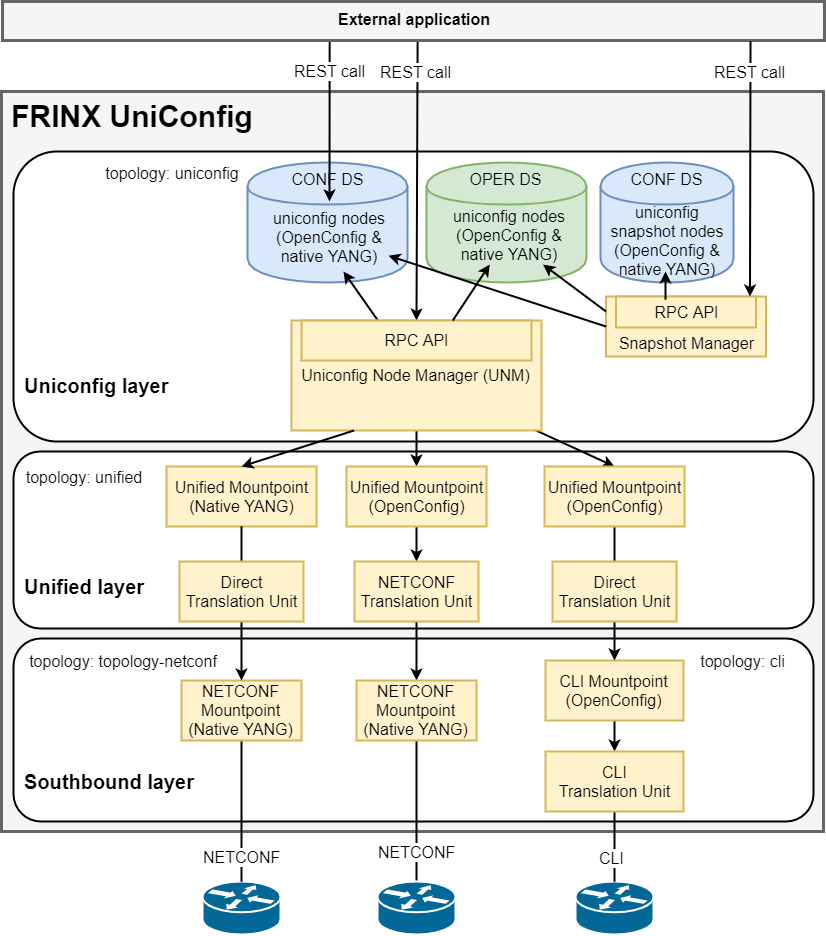

UniConfig components
====================

The figure below shows the high level architecture of the UniConfig,
its components and their dependencies.

UniConfig components use a layered design where the functionality
of the upper layers depends on the functionality of the layer underneath.
Each layer thus provides a higher level of abstraction
from the network elements.

Applications are allowed to utilize any of the layers in the system.

There are 3 main layers represented by these components (from top to bottom):

* UniConfig layer (UniConfig Node Manager with datastore)
* Unified layer (Unified mountpoint with translation units)
* Southbound layer (NETCONF mountpoint, CLI mountpoint with
  translation units)

The datastore is a component in ODL which stores structured data described by
YANG models. There are two separate datastores:

* Config datastore (CONF DS) - contains intended state (intended device
  configuration). External (outside ODL) applications have read/write access.
* Operational datastore (OPER DS) - contains actual state (actual device
  configuration). External applications have read only access.

Mountpoints in ODL represent a communication interface with an external system.
Mountpoints are usually registered under a node in a topology.

Components are described from bottom to top.

CLI Mountpoint
~~~~~~~~~~~~~~

The CLI mountpoint provides a management API for a network device over the CLI.
OpenConfig models are used for structured data describing the device
configuration and state.

The CLI mountpoint uses CLI translation units for translation between OpenConfig
data and CLI data.

The CLI mountpoint API supports device transactions and automatic
rollback functionality (in case an error occurs during device configuration
in device transaction). CLI mountpoint is registered under a node in cli
topology.

Each CLI mountpoint always includes a generic CLI translation unit
which provides an RPC for sending raw CLI commands and returning
raw CLI output.

CLI Translation Units
~~~~~~~~~~~~~~~~~~~~~

A CLI translation unit defines a mapping between YANG models and the CLI.

It is used by the FRINX UniConfig to perform translation between
device specific CLI data and standardized structured (OpenConfig YANG) data.

The translation unit can read and write configuration
or read the state of a device. It uses the CLI over SSH or telnet
for communication with the CLI device.

Junos and IOS-XR translation units are just simplified examples.
The CLI translation unit is usually created for a combination of device type
and OpenConfig main section (folder) e.g. xr-6-network-instance,
xr-6-ospf, ios-local-routing, ios-ospf, etc.

NETCONF Mountpoint
~~~~~~~~~~~~~~~~~~

The NETCONF mountpoint provides a management API for the network device
over a NETCONF session. Data is typically described by a set of vendor
specific YANG models. The NETCONF mountpoint provides device transactions
(if supported by the device). Automatic rollback may also be supported.
The NETCONF mountpoint is registered under a node in the  'topology-netconf' topology.

Unified Mountpoint
~~~~~~~~~~~~~~~~~~

The Unified mountpoint unifies the API for various Southbound protocols
like NETCONF and CLI. The API is described using OpenConfig
YANG models and uses translation units to translate between
OpenConfig data and Southbound mountpoint data.
The Unified mountpoint can also expose the same API as is provided by Southbound
mountpoint in case the of UniConfig-native.
The Unified mountpoint is registered under a node in the 'unified' topology.

Direct Translation Unit
~~~~~~~~~~~~~~~~~~~~~~~

This translation unit does not translate data from one format to another
because Northbound data and Southbound data are described by the same
YANG models. It can simply pass data to the Southbound layer.

NETCONF Translation Unit
~~~~~~~~~~~~~~~~~~~~~~~~

The NETCONF translation unit translates OpenConfig data to data described by
device specific YANG models. It uses the NETCONF mountpoint for communication
with a NETCONF device, and also implements device transaction
with automatic rollback if it is not provided by the device.

The Junos NETCONF translation unit is a simplified example.
The NETCONF translation unit is usually created for a combination
of device types and OpenConfig main section (folder).
An example is xr-6-network-instance, xr-6-ospf,
ios-local-routing, ios-ospf, etc.

UniConfig Node Manager
~~~~~~~~~~~~~~~~~~~~~~

The responsibility of this component is to maintain configuration on devices
based on intended configuration. Each device and its configuration is
represented as a node in the 'UniConfig' topology and the configuration
of this node is described by using OpenConfig YANG models.
The Northbound API of UniConfig Manager (UNM) is RPC driven and provides
functionality for commit with automatic rollback
and synchronization of configuration from the network.

Snapshot Manager
~~~~~~~~~~~~~~~~

The Snapshot Manager creates and deletes UniConfig snapshots of the 
actual UniConfig topology. Multiple snapshots can be created
within the system.

Snapshots may be used for manual rollback. Manual rollback enables simple
reconfiguration of the entire network using one of the previous states
saved within the snapshots. This means that UniConfig nodes in the config datastore
are replaced with UniConfig snapshot nodes.

Dry-run Manager
~~~~~~~~~~~~~~~

The manager provides functionality showing CLI commands or NETCONF messages which would be
sent to the network element.
This manager uses UniConfig Node Manager for diff calculation between
actual and intended state and cli-dryrun mountpoint for application of
changes.

UniConfig-native
~~~~~~~~~~~~~~~~

UniConfig Native allowsthe user to communicate with network devices using their native YANG data models (e.g.: Cisco YANG models, JunOS YANG models, Calix YANG models, CableLabs YANG models, SROS YANG models, ...) to manage configurations. With UniConfig Native is possible to mount devices through NETCONF, sync configurations in their native format and manage those devices without the need to develop translation units.
