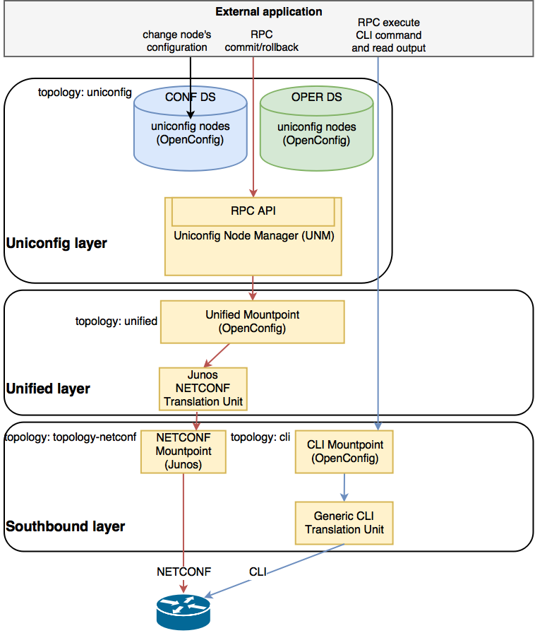
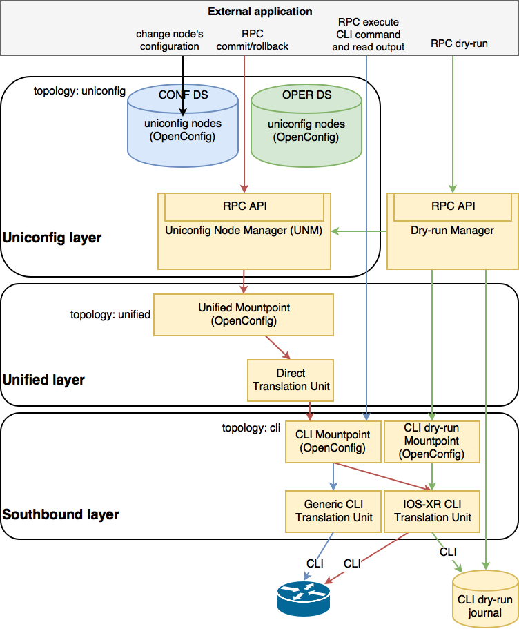

Components interactions
=======================

Go to :menuselection:`Home --> Workflows --> Definitions` and search for the workflow called **Mount_all_from_inventory**. Once selected click on "Execute" in the workflow tab and then "Execute" in the input window. A link on the left hand side of the "Execute" button will pop up. Click on it and wait for the status of all subworkflows to change to "COMPLETED". This workflow will gather all devices in your inventory and mount each of them.

NETCONF device configuration
~~~~~~~~~~~~~~~~~~~~~~~~~~~~

UniConfig uses NETCONF for device configuration. An external application
can also use the CLI RPC from the Generic CLI translation unit
for direct communication.

Go to :menuselection:`Home --> Workflows --> Definitions` and search for the workflow called **Mount_all_from_inventory**. Once selected click on "Execute" in the workflow tab and then "Execute" in the input window. A link on the left hand side of the "Execute" button will pop up. Click on it and wait for the status of all subworkflows to change to "COMPLETED". This workflow will gather all devices in your inventory and mount each of them.

CLI device configuration
~~~~~~~~~~~~~~~~~~~~~~~~

UniConfig uses CLI for device configuration.
An external application can also use the CLI RPC for
direct communication and CLI dry-run.
The device is mounted as a node in  the *cli* topology.

**CLI dry-run Mountpoint**
The CLI dry-run mountpoint mocks the management APIThe CLI dry-run mountpoint mocks the management API for a network
 for a network device over CLI. It uses the CLI dry-run journal for storing
to-be-executed CLI commands instead of configuring the network device directly.
Just as with a regular CLI mountpoint,
it uses the same set of CLI translation units and the same set of OpenConfig
YANG models.

**CLI dry-run journal**
The CLI dry-run journal is used for storing to-be-executed commands
from the CLI dry-run mountpoint.
The journal is cleared and read by Dry-run Manager.
