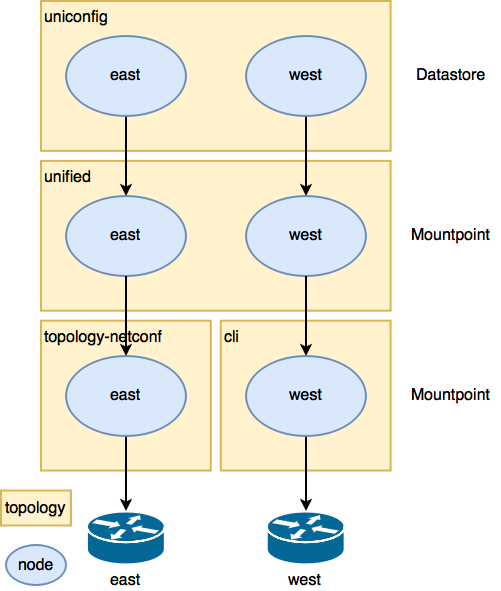

Topologies
==========

The UniConfig uses various topologies on different layers.
Each topology contains nodes in the CONF and OPER datastores.

CLI
~~~

The cli topology contains nodes which are connected with UniConfig via the CLI.

A node in CONF DS contains information on how
the FRINX UniConfig should connect to CLI devices
(i.e. IP address, port, username, password, etc.) and a node in OPER DS
contains the state of connection with available-capabilities.

CLI mountpoints are registered under these nodes. Configuration and state
on the device can be obtained from the mountpoint.

NETCONF
~~~~~~~

The topology-netconf topology contains nodes which are connected with
FRINX ODL through NETCONF. A node in CONF DS contains information on
how the FRINX UniConfig should connect to NETCONF devices
(i.e. IP address, port, username, password, etc.) and a node in OPER DS
contains the state of connection with available-capabilities.

NETCONF mountpoints are registered under these nodes. Configuration and
state on the device can be obtained from a mountpoint.

Unified
~~~~~~~

A node in unified topology only contains data about connection state and
available-capabilities in OPER DS.
Unified mountpoints are registered under these nodes.

Uniconfig
~~~~~~~~~

Nodes in the uniconfig topology contain the entire configuration of devices.
A node in CONF DS describes the intended configuration and the same node
in OPER DS shows the actual device configuration.