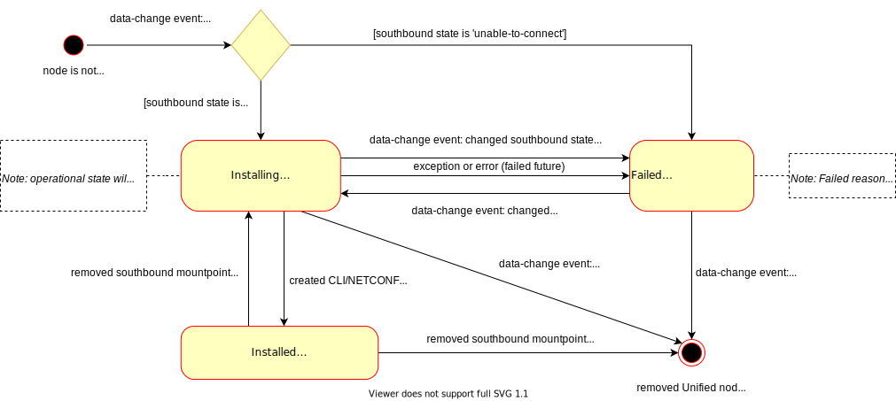

UniConfig / Unified node lifecycle
==================================

Lifecycle of Unified node
~~~~~~~~~~~~~~~~~~~~~~~~~

Description
###########

The following UML state diagram shows lifecycle of Unified node since creation of southbound node in CLI/NETCONF topology (Operational datastore) to removed Unified node from OPER DS due to removed southbound mountpoint and southbound node from Operational datastore.

There are 3 states in which Unified node can be placed:

1. **Installing**: In this state the 'connection-status' of Unified node is set to 'installing' string. This state spans the creation of southbound mountpoint ('status-message' is set to 'creation of southbound mountpoint') and afterwards the creation of Unified mountpoint ('status-message' is set to 'creation of unified mountpoint') that includes initialization of translation context. If installing fails on southbound or Unified layer, the state of node will be moved to 'Failed'. If Unified node is successfully created, the state of node will become 'Installed'. Removal of southbound node from Configurational datastore cleans up the Unified node too.
2. **Failed**: In this state the 'connection-status' of Unified node is set to 'failed' string. This state represents a failure that may occur on CLI/NETCONF layer (when the state of southbound node becomes 'unable-to-connect') or failure during creation and registration of Unified mountpoint (for example, translation context cannot be created because of failed unification of capabilities). The state of the node is reverted to 'Installing', if the 'connection-status' of southbound node is moved to 'connecting'. If the southbound node is removed from Configurational datastore, then the Unified node will be destroyed too. The 'status-message' leaf of node describes the error that occurred.
3. **Installed**: In this state the 'connection-status' of Unified node is set to 'installed' string and 'status-message' leaf has always value 'created unified mountpoint'. Installed node can move back to 'Installing' state in case of removed southbound mountpoint but with existing southbound node in Configurational datastore (user has not removed node explicitly yet). If both removal of southbound mountpoint and node from Configurational datastore happens, then the Unified node is destroyed too. Installed Unified node is prepared for usage on UniConfig layer.

Example
#######

Verification of the 'connection-status' and 'status-message' fields of the created Unified node:

.. code-block:: bash

    curl --request GET 'http://127.0.0.1:8181/rests/data/network-topology:network-topology/topology=unified/node=xr6?fields=unified-topology:connection-status;unified-topology:status-message&content=nonconfig' \
    --header 'Accept: application/json' \

Response:

.. code-block:: json

    {
        "node": [
            {
                "unified-topology:status-message": "created unified mountpoint",
                "unified-topology:connection-status": "installed"
            }
        ]
    }

Lifecycle of UniConfig node
~~~~~~~~~~~~~~~~~~~~~~~~~~~

Description
###########

The following UML state diagram shows lifecycle of UniConfig node since creation of Unified node in Operational datastore to removed UniConfig node from OPER DS due to removed Unified node from Operational datastore and removed Unified mountpoint.

.. image:: uniconfig_node_status.svg
   :alt: uniconfig_node_status

There are 3 states in which UniConfig node can be placed:

1. **Installing**: In this state the 'connection-status' of UniConfig node is set to 'installing' string. The existence of node in this state spans building of southbound mountpoint, building of Unified mountpoint ('status-message' set to 'creation of unified mountpoint' in both cases) and syncing of configuration from device - sync-from-network task ('status-message' is set to 'installing of uniconfig node'). If installing fails in lower layers or initial sync-from-network task, the state of this UniConfig node will be moved to 'Failed'. Finished sync-from-network task moves UniConfig node to 'Installed' state. Removal of Unified node from Operational datastore cleans up the UniConfig node from both datastores too.
2. **Failed**: In this state the 'connection-status' of Unified node is set to 'failed' string. This state represents a failure that may occur on southbound layer or Unified layer (when the 'connection-status' of Unified node becomes 'failed'). The state of the node is reverted to 'Installing', if the 'connection-status' of Unified node is moved to 'installing'. If the Unified node is removed from Operational datastore, then the UniConfig node will be destroyed too (both datastores). The 'status-message' leaf of node describes the error that occurred.
3. **Installed**: In this state the 'connection-status' of UniConfig node is set to 'installed' string and 'status-message' leaf has always value 'installed uniconfig node'. Installed node can move back to 'Installing' state in case of removed Unified mountpoint but with existing Unified node in Operational datastore. If both removal of Unified mountpoint and node from Operational datastore happens, then the UniConfig node is removed from both datastores.

Example
#######

Verification of the 'connection-status' and 'status-message' fields of the created UniConfig node:

.. code-block:: bash

    curl --location --request GET 'http://127.0.0.1:8181/rests/data/network-topology:network-topology/topology=uniconfig/node=xr6?fields=frinx-uniconfig-topology:connection-status;frinx-uniconfig-topology:status-message&content=nonconfig' \
    --header 'Accept: application/json' \

Response:

.. code-block:: json

    {
        "node": [
            {
                "frinx-uniconfig-topology:connection-status": "installed",
                "frinx-uniconfig-topology:status-message": "installed uniconfig node"
            }
        ]
    }

Matrix of allowed states
~~~~~~~~~~~~~~~~~~~~~~~~

The following table describes possible combinations of 'connection-status' leaf values on UniConfig, Unified and Southbound (CLI/NETCONF) layers with descriptions, when such scenario can occur.

.. csv-table::
    :header: "Uniconfig", "Unified", "Southbound", "Description"
    :widths: 5, 5, 5, 25

    "installing", "installing", "connecting", "Creation of southbound mountpoint is in progress - connecting to device, building of session."
    "failed", "failed", "unable-to-connect", "Failed to connect to target device - for example, reached max. number of connection attempts."
    "installing", "installing", "connected", "Creation of Unified mountpoint is in progress - building/identification of translation context."
    "failed", "failed", "connected", "Failed to create translation context - for example, required translation units cannot be identified."
    "installing", "installed", "connected", "Installation of UniConfig node is in progress - syncing of device configuration and metadata to datastores."
    "failed", "installed", "connected", "Failed to install UniConfig node - failed to read data from some root paths or store data to datastores."
    "installed", "installed", "connected", "Device has been successfully mounted and installed on all layers."