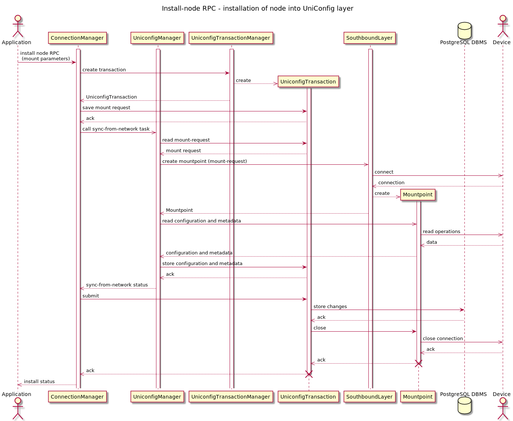
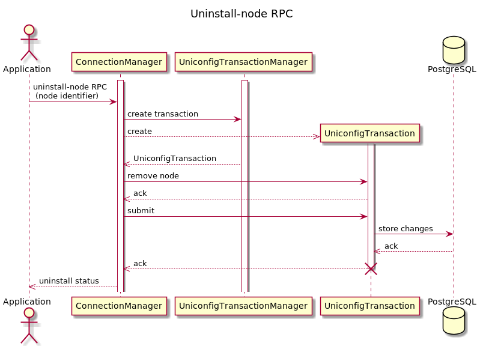

# Device installation

Installing is the process of loading device information into UniConfig
database. This information is saved in PostgreSQL database and used
whenever transaction occurs. When the transaction is finished the
connection to device is closed again, until next transaction.

These are the steps of installation process:

1.  creation of UniConfig transaction
2.  creation of mountpoint - connection to device
3.  loading configuration and metadata from mountpoint
4.  closing mountpoint and connection to device
5.  storing synced configuration and metadata to database
6.  closing UniConfig transaction

!!!
Node can be installed only once (you will receive error if node has
already been installed).
!!!

You can specify if you would like to install node on the UniConfig
layer. Default value is 'true':  

```
uniconfig-config:install-uniconfig-node-enabled
```

Only 1 node with the same node-id can be installed on UniConfig layer.

It is synchronous: it succeeds only after node is successfully installed
it fails in other cases – **max-connection-attempts** is automatically
set to value '1', if different value is not provided in RPC input, database or config file.

Following sections provide deeper explanation of parameters needed for
installation, along with example install requests.

!!!
Overview of our OpenAPI along with all parameters and expected returns [can be found here](https://app.swaggerhub.com/apis-docs/Frinx/uniconfig/latest#/connection-manager/rpc_connection-manager%3Ainstall-node).
!!!

## Default parameters
All install parameters (CLI/NETCONF) are set in database when Uniconfig is initializing. 
Values of these parameters are equal to specific yang model default values. 
These parameters are used when they are missing in RPC request.

Priority of using install parameters : 
1. Parameter set in install RPC request
2. Parameter set in database
3. Default parameter from yang model

Priority of initial writing default parameters into database:
1. Database already contains default parameters
2. User defines default parameters into config file
3. Default values from yang schema file will be saved

Default parameters can be managed (put/read/delete) by user using RESTCONF/Uniconfig-shell.

Definition of default parameters can be also done using config file **default-parameters.json**. 
It is placed in config subdirectory together with lighty-uniconfig-config.json.

```json
{
    "netconf-default-parameters" : {
        "connection-timeout-millis": 20000,
        "default-request-timeout-millis": 60000,
        "between-attempts-timeout-millis" : 2000,
        "max-connection-attempts": 1,
        "max-reconnection-attempts": 0,
        "reconnect-on-changed-schema" : false,
        "keepalive-delay": 120,
        "sleep-factor": 1.5,
        "confirm-timeout" : 600,
        "concurrent-rpc-limit" : 0,
        "actor-response-wait-time" : 5,
        "dry-run-journal-size" : 0,
        "enabled-notifications" : true,
        "customization-factory" : "default",
        "edit-config-test-option" : "test-then-set",
        "strict-parsing" : true
    },
    "cli-default-parameters" : {
        "max-connection-attempts": 1,
        "max-reconnection-attempts": 0,
        "keepalive-delay" : 60,
        "keepalive-timeout": 60,
        "keepalive-initial-delay": 120,
        "journal-size" : 0,
        "dry-run-journal-size" : 0,
        "journal-level" : "command-only",
        "parsing-engine" : "tree-parser"
    }
}
```

**RPC request - CLI default parameters:**

```bash
curl --location --request PUT 'http://localhost:8181/rests/data/cli-topology:cli-default-parameters' \
--header 'Authorization: Basic YWRtaW46YWRtaW4=' \
--header 'Content-Type: application/json' \
--data-raw '{
    "cli-topology:cli-default-parameters" : {
        "cli-topology:max-connection-attempts": 3,
        "cli-topology:max-reconnection-attempts": 3,
        "cli-topology:keepalive-delay" : 60,
        "cli-topology:keepalive-timeout": 60,
        "cli-topology:keepalive-initial-timeout": 120,
        "cli-topology:journal-size" : 0,
        "cli-topology:dry-run-journal-size" : 0,
        "cli-topology:journal-level" : "command-only",
        "cli-topology:parsing-engine" : "tree-parser"
    }
}'
```

**RPC request - NETCONF default parameters:**

```bash
curl --location --request PUT 'http://localhost:8181/rests/data/netconf-node-topology:netconf-default-parameters' \
--header 'Authorization: Basic YWRtaW46YWRtaW4=' \
--header 'Content-Type: application/json' \
--data-raw '{
    "netconf-node-topology:netconf-default-parameters" : {
        "netconf-node-topology:connection-timeout-millis": 20000,
        "netconf-node-topology:default-request-timeout-millis": 20000,
        "netconf-node-topology:between-attempts-timeout-millis" : 20000,
        "netconf-node-topology:max-connection-attempts": 20,
        "netconf-node-topology:max-reconnection-attempts": 3,
        "netconf-node-topology:reconnect-on-changed-schema" : false,
        "netconf-node-topology:keepalive-delay": 5,
        "netconf-node-topology:sleep-factor": 1.0,
        "netconf-node-topology:confirm-timeout" : 600,
        "netconf-node-topology:concurrent-rpc-limit" : 0,
        "netconf-node-topology:actor-response-wait-time" : 5,
        "netconf-node-topology:dry-run-journal-size" : 0,
        "netconf-node-topology:enabled-notifications" : true,
        "netconf-node-topology:customization-factory" : "default",
        "netconf-node-topology:edit-config-test-option" : "test-then-set",
        "netconf-node-topology:strict-parsing" : true
    }
}'
```

## Installing CLI device




List of basic connection parameters that are used for identification of
remote device. All of these parameters are mandatory.

- **node-id** - Name of node that represents device in the topology.
- **cli-topology:host** - IP address or domain-name of target device that runs SSH or Telnet server.
- **cli-topology:port** - TCP port on which the SSH or Telnet server on remote device is listening to incoming connections. Standard SSH
     port is '22', standard Telnet port is '23'.
- **cli-topology:transport-type** - Application protocol used for communication with device - supported options are 'ssh' and 'telnet'.
- **cli-topology:device-type** - Device type that is used for selection of translation units that maps device configuration to OpenConfig models. Supported devices can
     be found
- **cli-topology:device-version** - Version of device. Use a specific
    version or \* for a generic one. \* enables only basic read and
    write management without the support of OpenConfig models.
    [Here](https://docs.frinx.io/frinx-uniconfig/supported-devices.html).
- **cli-topology:username** - Username for accessing of CLI management
    line.
- **cli-topology:password** - Password assigned to username.
- **uniconfig-config:install-uniconfig-node-enabled** - Whether node
    should be installed to UniConfig and unified layers. By default,
    this flag is set to 'true'.

### Authentication parameters

List of authentication parameters used for identification of remote user
utilized for configuration of the device. Username and password
parameters are mandatory.

- **cli-topology:username** - Username for accessing of CLI management line.
- **cli-topology:password** - Password assigned to username.

List of parameters that can be used for adjusting of reconnection
strategy. None of these parameters is mandatory - if they are not set,
default values are set. There are two exclusive groups of parameters
based on selected reconnection strategy - you can define only parameters
from single group. By default, keepalive strategy is used.

### Connection parameters

Following parameters adjust maintaining of CLI session state. 
None of these parameters are mandatory (default values will be used).

-   **cli-topology:max-connection-attempts** - Maximum number of initial connection attempts (default value: 1).
-   **cli-topology:max-reconnection-attempts** - Maximum number of reconnection attempts (default value: 1).

### Keepalive strategies

**1. Keepalive reconnection strategy**

-   **cli-topology:keepalive-delay** - Delay between sending of
     keepalive messages over CLI session. Default value: 60 seconds.
-   **cli-topology:keepalive-timeout** - This parameter defines how
     much time CLI layer should wait for response to keepalive message
     before the session is closed. Default value: 60 seconds.
-   **cli-topology:keepalive-initial-delay** - This parameter defines
     how much time CLI layer waits for establishment of new CLI session
     before the first reconnection attempt is launched. Default value:
     120 seconds.

**2. Lazy reconnection strategy**

-   **command-timeout** - Maximal time (in seconds) for command
     execution. If a command cannot be executed on a device in this
     time, the execution is considered a failure. Default value: 60
     seconds.
-   **connection-establish-timeout** - Maximal time (in seconds) for
     connection establishment. If a connection attempt fails in this
     time, the attempt is considered a failure. Default value: 60
     seconds.
-   **connection-lazy-timeout** - Maximal time (in seconds) for
     connection to keep alive. If no activity was detected in the
     session and the timeout has been reached, connection will be
     stopped. Default value: 60 seconds.

### Journaling parameters

The following parameters relate with tracing of executed commands. It is
not required to set these parameters.

-   **cli-topology:journal-size** - Size of the cli mount-point journal.
    Journal keeps track of executed commands and makes them available
    for users/apps for debugging purposes. Value 0 disables journaling
    (it is default value).
-   **cli-topology:dry-run-journal-size** - Creates dry-run mount-point
    and defines number of commands in command history for dry-run
    mount-point. Value 0 disables dry-run functionality (it is default
    value).
-   **cli-topology:journal-level** - Sets how much information should be
    stored in the journal. Option 'command-only' stores only the actual
    commands executed on device. Option 'extended' records additional
    information such as: transaction life-cycle, which handlers were
    invoked etc.

### Parsing parameters

Parsing strategies are used for:

-   Recognizing of structure in cached device configuration that is
    represented in textual format.
-   Extraction of target sections from structured format of device
    configuration.

Parsing engine can be configured on creation of mountpoint by
specification of **parsing-engine** leaf value. Currently, there are three
supported CLI parsing strategies: **tree-parser** (default strategy), **batch-parser** and **one-line-parser**.

!!!
Both batch-parser and tree-parser depend on current implementation of
'CliFlavour' which defines device-specific CLI patterns. For example,
if 'CliFlavour' doesn't correctly specify format of 'show
configuration' command, then neither batch-parser or tree-parser is
applied and commands are sent directly to device.
!!!

#### Tree-parser

- It is set as default parsing engine in case you choose to not use
    'parsing-engine' parameter.
- Running-configuration is mapped into the tree structure before the
    first command lookup is executed from translation unit. Afterwards,
    this tree can be reused in the same transaction for faster lookup
    process (for example, one 'sync-from-network' task is executed in
    one transaction).
- Tree-parser is faster than batch-parser in most cases because device
    configuration must be traversed only once and searching for target
    section in parsed tree structure has only logarithmic time
    complexity. The longer the device configuration is, the better
    performance improvement is achieved using this parsing strategy.
- Both batch-parser and tree-parser should be capable to parse the
    same device configurations (in other words, tree-parser doesn't have
    any functional restrictions in comparison to batch-parser).

#### Batch-parser

- Running-configuration must be traversed from the beginning each time
    when new target section is extracted from the configuration (such
    lookup process is launched from CLI translation units).
- Internally, this parser uses regular expressions to recognize
    structure of configuration and find target section. From this
    reason, if configuration is long, this batch-parser becomes
    ineffective to extract sections that are placed near the end of
    device configuration.
- Batch-parser should be used only as fallback strategy in the case
    when tree-parser fails.

#### One-line-parser

- CLI parsing engine that stores configuration in the cache in the
    form of blocks and then uses grep function for parsing
    running-configuration

### Cisco IOX XR Example request

```bash
curl --location --request POST 'http://localhost:8181/rests/operations/connection-manager:install-node' \
--header 'Authorization: Basic YWRtaW46YWRtaW4=' \
--header 'Content-Type: application/json' \
--data-raw '{
    "input": {
        "node-id": "iosxr",
        "cli": {
            "cli-topology:host": "192.168.1.214",
            "cli-topology:port": "22",
            "cli-topology:transport-type": "ssh",
            "cli-topology:device-type": "ios xr",
            "cli-topology:device-version": "5.3.4",
            "cli-topology:username": "cisco",
            "cli-topology:password": "cisco",
            "cli-topology:journal-size": 150,
            "cli-topology:dry-run-journal-size": 150,
            "cli-topology:parsing-engine": "batch-parser",
            "node-extension:reconcile": false,
            "uniconfig-config:install-uniconfig-node-enabled": false
        }
    }
}'
```

### Junos Example request

```bash
curl --location --request POST 'http://localhost:8181/rests/operations/connection-manager:install-node' \
--header 'Authorization: Basic YWRtaW46YWRtaW4=' \
--header 'Content-Type: application/json' \
--data-raw '{
    "input": {
        "node-id": "junos",
        "cli": {
            "cli-topology:host": "192.168.1.25",
            "cli-topology:port": "22",
            "cli-topology:transport-type": "ssh",
            "cli-topology:device-type": "junos",
            "cli-topology:device-version": "17.3",
            "cli-topology:username": "root",
            "cli-topology:password": "Agiebiz2",
            "cli-topology:journal-size": 150,
            "uniconfig-config:install-uniconfig-node-enabled": false
        }
    }
}'
```

## Uninstalling CLI device



### Example request

```bash
curl --location --request POST 'http://localhost:8181/rests/operations/connection-manager:uninstall-node' \
--header 'Authorization: Basic YWRtaW46YWRtaW4=' \
--header 'Content-Type: application/json' \
--data-raw '{
    "input": {
        "node-id": "junos",
        "connection-type": "cli"
    }
}'
```

## Installing Netconf device


### Identification of remote device

List of basic connection parameters that are used for identification of
remote device. Only **tcp-only** parameter must not be specified in input
of the request.

- **node-id** - Name of node that represents device / mount-point in
    the topology.
- **netconf-node-topology:host** - IP address or domain-name of target
    device that runs NETCONF server.
- **netconf-node-topology:port** - TCP port on which NETCONF server is
    listening to incoming connections.
- **netconf-node-topology:tcp-only** - If it is set to 'true', NETCONF
    session is created directly on top of TCP connection. Otherwise,
    'SSH' is used as carriage protocol. By default, this parameter is
    set to 'false'.

### Authentication parameters

Parameters used for configuration of the basic authentication method
against NETCONF server. These parameters must be specified in the input
request.

- **network-topology:username** - Name of the user that has permission
    to access device using NETCONF management line.
- **network-topology:password** - Password to the user in
    non-encrypted format.

!!!
There are also other authentication parameters if different
authentication method is used - for example, key-based authentication
requires specification of key-id. All available authentication
parameters can be found in **netconf-node-topology.yang** under
**netconf-node-credentials** grouping.
!!!

### Session timers

The following parameters adjust timers that are related with maintaining
of NETCONF session state. None of these parameters are mandatory
(default values will be used).

- **netconf-node-topology:connection-timeout-millis** - Specifies
    timeout in milliseconds after which initial connection to the
    NETCONF server must be established (default value: 20000 ms).
- **netconf-node-topology:default-request-timeout-millis** - Timeout
    for blocking RPC operations within transactions (default value:
    60000 ms).
- **netconf-node-topology:max-connection-attempts** - Maximum number
    of initial connection attempts (default value: 1).
- **netconf-node-topology:max-reconnection-attempts** - Maximum number
    of reconnection attempts (default value: 1).
- **netconf-node-topology:between-attempts-timeout-millis** - Initial
    timeout between reconnection attempts (default value: 2000 ms).
- **netconf-node-topology:sleep-factor** - Multiplier between
    subsequent delays of reconnection attempts (default value: 1.5).
- **netconf-node-topology:keepalive-delay** - Delay between sending of
    keepalive RPC messages (default value: 120 sec).

### Capabilities

Parameters related to capabilities are often used when NETCONF device
doesn't provide list of YANGs. Both parameters are optional.

- **netconf-node-topology:yang-module-capabilities** - Set a list of
    capabilities to override capabilities provided in device's hello
    message. It can be used for devices that do not report any yang
    modules in their hello message.
- **netconf-node-topology:non-module-capabilities** - Set a list of
    non-module based capabilities to override or merge non-module
    capabilities provided in device's hello message. It can be used for
    devices that do not report or incorrectly report non-module-based
    capabilities in their hello message.

!!!
Instead of defining **netconf-node-topology:yang-module-capabilities**,
we can just define folder with yang schemas
**netconf-node-topology:schema-cache-directory**: **folder-name**. For
more information about using the
**netconf-node-topology:schema-cache-directory** parameter, see
RST Other parameters.
!!!

### UniConfig-native

Parameters related to installation of NETCONF or CLI nodes with
uniconfig-native support.

- **uniconfig-config:uniconfig-native-enabled** - Whether
    uniconfig-native should be used for installation of NETCONF or CLI
    node. By default, this flag is set to 'false'.
- **uniconfig-config:install-uniconfig-node-enabled** - Whether node
    should be installed to UniConfig and unified layers. By default,
    this flag is set to 'true'.
- **uniconfig-config:sequence-read-active** - Forces reading of data
    sequentially when mounting device. By default, this flag is set to
    'false'. This parameter has effect only on NETCONF nodes.
- **uniconfig-config:whitelist** - List of root YANG entities that should be read. This parameter has effect only on NETCONF nodes.
- **uniconfig-config:blacklist** - List of root YANG entities that
    should not be read from NETCONF device due to incompatibility with
    uniconfig-native or other malfunctions in YANG schemas. This
    parameter has effect only on NETCONF nodes.
- **uniconfig-config:validation-enabled** - Whether validation RPC
    should be used before submitting configuration of node. By default,
    this flag is set to 'true'. This parameter has effect only on
    NETCONF nodes.
- **uniconfig-config:confirmed-commit-enabled** - Whether
    confirmed-commit RPC should be used before submitting configuration
    of node. By default, this flag is set to 'true'. This parameter has
    effect only on NETCONF nodes.

### Other parameters

Other non-mandatory parameters that can be added to mount-request.

- **netconf-node-topology:schema-cache-directory** - This parameter
    can be used for two cases:
     1.  Explicitly set name of NETCONF cache directory. If it is not
         set, the name of the schema cache directory is derived from
         device capabilities during mounting process.
     2.  Direct usage of the 'custom' NETCONF cache directory stored in
         the UniConfig 'cache' directory by name. This 'custom'
         directory must exist, must not be empty and also can not use
         the 'netconf-node-topology:yang-module-capabilities'
         parameter, because capability names will be generated from
         yang schemas stored in the 'custom' directory.

- **netconf-node-topology:dry-run-journal-size** - Creates dry-run
    mount-point and defines number of NETCONF RPCs in history for
    dry-run mount-point. Value 0 disables dry-run functionality (it is
    default value).
- **netconf-node-topology:customization-factory** - Specification of
    the custom NETCONF connector factory. For example, if device doesn't
    support candidate data-store, this parameter should be set to
    'netconf-customization-alu-ignore-candidate' string.
- **netconf-node-topology:edit-config-test-option** - Specification of
    the test-option parameter in the netconf edit-config message.
    Possible values are 'set', 'test-then-set' or 'test-only'. If the
    edit-config-test-option is not explicitly specified in the mount
    request, then the default value will be used ('test-then-set'). See
    [RFC-6241](https://tools.ietf.org/html/rfc6241#section-8.6) for more
    information about this feature.
- **netconf-node-topology:confirm-timeout** - The timeout for
    confirming the configuration by "confirming-commit" that was
    configured by "confirmed-commit" (default value: 600 sec).
    Configuration will be automatically reverted by device if the
    "confirming-commit" is not issued within the timeout period. This
    parameter has effect only on NETCONF nodes.
- **netconf-node-topology:concurrent-rpc-limit** - Defines maximum number 
    of concurrent RPCs, where 0 indicates no limit (it is default value).

!!!danger
There are additional install parameters in our OpenAPI, they can all
be found
[here](https://app.swaggerhub.com/apis-docs/Frinx/uniconfig/latest#/connection-manager/rpc_connection-manager%3Ainstall-node).
!!!

### Example netconf request

```
curl --location --request POST 'http://localhost:8181/rests/operations/connection-manager:install-node' \
--header 'Authorization: Basic YWRtaW46YWRtaW4=' \
--header 'Content-Type: application/json' \
--data-raw '{
        "input":{
            "node-id":"xr1",
            "netconf":{
                "netconf-node-topology:host":"10.0.0.1",
                "netconf-node-topology:port":830,
                "netconf-node-topology:keepalive-delay":5,
                "netconf-node-topology:tcp-only":false,
                "netconf-node-topology:username":"USERNAME",
                "netconf-node-topology:password":"PASSWORD",
                "netconf-node-topology:dry-run-journal-size":180,
                "uniconfig-config:uniconfig-native-enabled":true,
                "uniconfig-config:blacklist":{
                    "uniconfig-config:path":[
                        "openconfig-interfaces:interfaces",
                        "ietf-interfaces:interfaces",
                        "openconfig-vlan:vlans",
                        "openconfig-routing-policy:routing-policy",
                        "openconfig-lldp:lldp",
                        "Cisco-IOS-XR-l2vpn-cfg:l2vpn",
                        "Cisco-IOS-XR-group-cfg:groups",
                        "openconfig-acl:acl",
                        "openconfig-network-instance:network-instances"
                    ]
                }
            }
        }
    }'
```

## Uninstalling Netconf device

### Example request

```bash
curl --location --request POST 'http://localhost:8181/rests/operations/connection-manager:uninstall-node' \
--header 'Authorization: Basic YWRtaW46YWRtaW4=' \
--header 'Content-Type: application/json' \
--data-raw '{
    "input": {
        "node-id": "xr1",
        "connection-type": "netconf"
    }
}'
```
