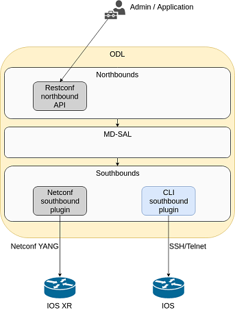
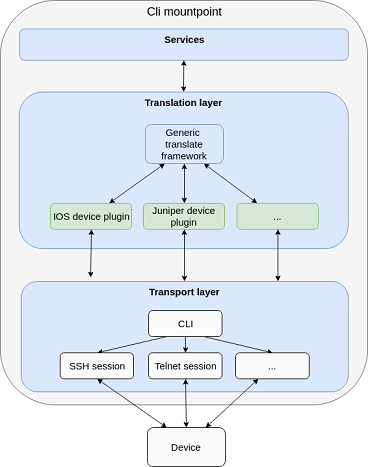
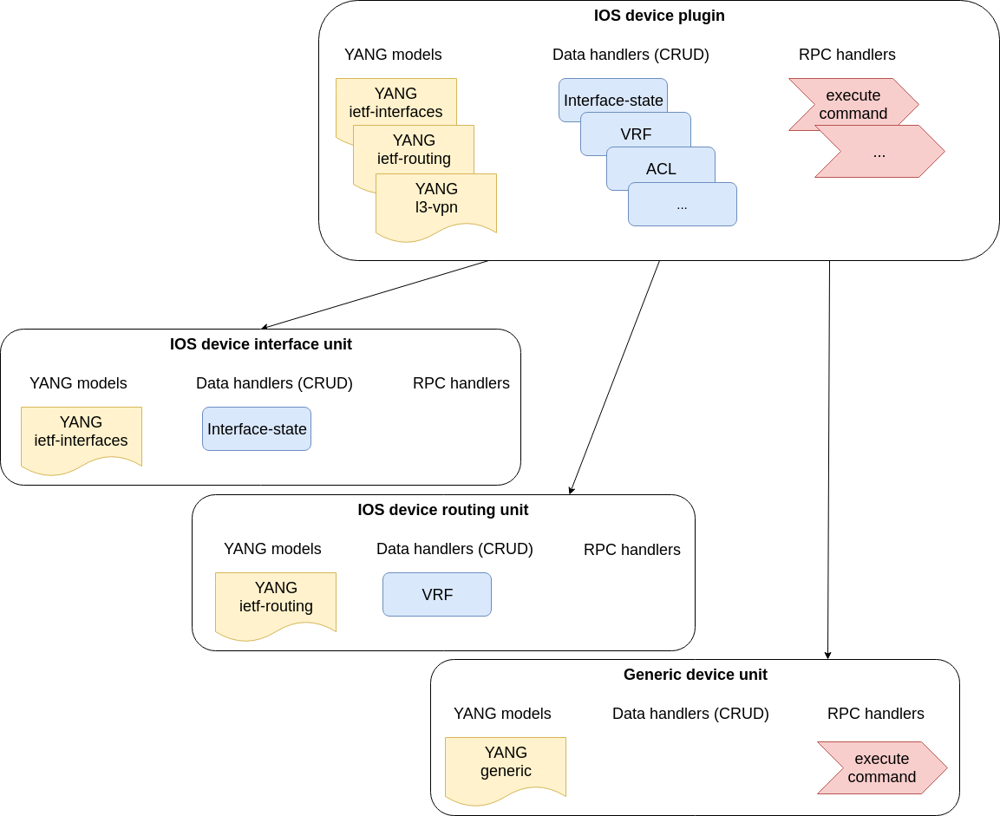
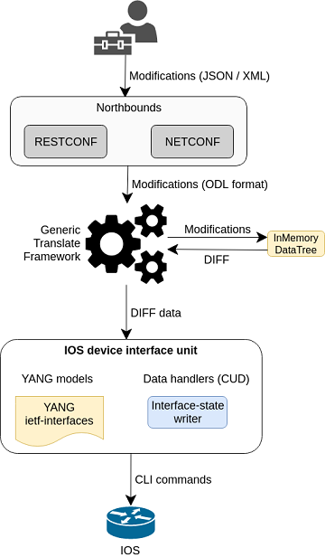

# UniConfig CLI

Introduction
------------

The CLI southbound plugin enables the Frinx UniConfig to communicate
with CLI devices that do not speak NETCONF or any other programmatic
API. The CLI service module uses YANG models and implements a
translation logic to send and receive structured data to and from CLI
devices. This allows applications to use a service model or unified
device model to communicate with a broad range of network platforms and
SW revisions from different vendors.

Much like the NETCONF southbound plugin, the CLI southbound plugin
enables fully model-driven, transactional device management for internal
and external OpenDaylight applications. In fact, the applications are
completely unaware of underlying transport and can manage devices over
the CLI plugin in the same exact way as over NETCONF.

Once we have installed the device, we can present an abstract,
model-based network device and service interface to applications and
users. For example, we can parse the output of an IOS command and return
structured data.



Architecture
------------

This section provides an architectural overview of the plugin, focusing
on the main components.

### CLI topology

The CLI topology is a dedicated topology instance where users and
applications can:

-   install a CLI device,
-   uninstall a device,
-   check the state of connection,
-   read/write data from/to a device,
-   execute RPCs on a device.

This topology can be seen as an equivalent of topology-netconf,
providing the same features for netconf devices. The topology APIs are
YANG APIs based on the ietf-topology model. Similarly to netconf
topology, CLI topology augments the model with some basic configuration
data and also some state to monitor mountpoints.

### CLI mountpoint

The plugin relies on MD-SAL and its concept of mountpoints to expose
management of a CLI device. By exposing a mountpoint into MD-SAL, it
enables the CLI topology to actually access the device's data in a
structured/YANG manner. Components of such a mountpoint can be divided
into 3 distinct layers:

-   Service layer - implementation of MD-SAL APIs delegating execution
    to transport layer.
-   Translation layer - a generic and extensible translation layer. The
    actual translation between YANG and CLI takes place in the
    extensions. The resulting CLI commands are then delegated to
    transport layer.
-   Transport layer - implementation of various transport protocols used
    for actual communication with network devices.

The following diagram shows the layers of a CLI mountpoint:



#### Translation layer

The CLI southbound plugin is as generic as possible. However, the
device-specific translation code (from YANG data -\> CLI commands and
vice versa), needs to be encapsulated in a device-specific translation
plugin. E.g. Cisco IOS specific translation code needs to be implemented
by Cisco IOS translation plugin before FRINX UniConfig can manage IOS
devices. These translation plugins in conjunction with the generic
translation layer allow for a CLI mountpoint to be created.

**Device specific translation plugin**

Device specific translation plugin is a set of:

-   YANG models
-   Data handlers
-   RPC implementations

that actually

-   defines the model/structure of the data in FRINX UniConfig
-   implements the translation between YANG data and device CLI in a set
    of handlers
-   (optionally) implements the translation between YANG RPCs and device
    CLI

The plugin itself is responsible for defining the mapping between YANG
and CLI. However, the translation layer into which it plugs in is what
handles the heavy lifting for it e.g. transactions, rollback, config
data storage, reconciliation etc. Additionally, the SPIs of the
translation layer are very simple to implement because the translation
plugin only needs to focus on the translations between YANG \<-\> CLI.

**Units**

In order to enable better extensibility of the translation plugin and
also to allow the separation of various aspects of a device's
configuration, a plugin can be split into multiple units. Where a unit
is actually just a subset of a plugin's models, handlers and RPCs.

A single unit will usually cover a particular aspect of device
management e.g. the interface management unit.

Units can be completely independent or they can build on each other, but
in the end (in the moment where a device is being installed) they form a
single translation plugin.

Each unit has to be registered under a specific device type(s) e.g. an
interface management unit could be registered for various versions of
the IOS device type. When installing an IOS device, the CLI southbound
plugin collects all the units registered for the IOS device type and
merges them into a single plugin enabling full management.

The following diagram shows an IOS device translation plugin split into
multiple units:



#### Transport layer

For now, two transport protocols are supported:

-   SSH
-   Telnet

They implement the same APIs, which enables the translation layer of the
CLI plugin to be completely independent of the underlying protocol in
use. Deciding which transport will be used to manage a particular device
is simply a matter of install-request configuration.

The transport layer can be specified using install-request
'cli-topology:transport-type' parameter.

### Data processing

There are 2 types of data depending on data-store in which data is
stored:

-   Config
-   Operational

This section details how these data types map to CLI commands.

Just as there are 2 types of data, there are 2 streams of data in the
CLI southbound plugin:

-   **Config**
    -   It represents user/application intended configuration for the
        device.
    -   Translation plugins/units need to handle this configuration in
        data handlers as C(reate), U(pdate) and D(elete) operations.
        R(ead) pulls this config data from the device and updates the
        cache on its way back.



-   **Operational**
    -   It represents actual configuration on the device, optionally
        statistics from the device.
    -   Translation plugins/units need to pull these data out of the
        device when R(ead) operation is requested.


-   **RPCs** stand on their own and can encapsulate any command(s) on
    the device.

Reconciliation
--------------

There might be situations where there are inconsistencies between actual
configuration on the device and the state cached in Frinx UniConfig.
That's why a reconciliation mechanism was developed to:

-   Allows the mountpoint to sync its state when first connecting to the
    device.
-   Allows apps/users to request synchronization when an inconsistent
    state is expected e.g. manual configuration of the device.

Reconciliation is performed when issuing any READ operation. If the data
coming from device is different compared to mountpoint cache, the cache
will be updated automatically.

Initial reconciliation (after connection has been established) takes
place automatically on the CLI layer. However it can be disabled with
attribute "node-extension:reconcile" set to false when installing a
device. Uniconfig performs its own reconciliation when devices are
connected so if both the Uniconfig and CLI layer reconcile, the install
process is unnecessarily prolonged. That's why it is advised to turn off
reconciliation on the CLI layer when using Uniconfig.

RPCs provided by CLI layer
--------------------------

There are multiple RPCs that can be used for sending of commands to CLI
session and optionally waiting for command output. To use all of these
RPCs, it is required to have installed CLI device in 'Connected' state.

### RPC: Execute-and-read

#### Description

-   Execution of the sequence of commands specified in the input. These
    commands must be separated by the new line - then, each of the
    command is executed separately.
-   After all commands are executed, it is assumed, that the original
    command prompt (prompt that was set before execution of this RPC)
    appears on the remote terminal.
-   If the input contains only single command, output of this RPC will
    contain only output of this command. If input contains multiple
    commands separated by newline, output of this RPC will be built from
    command prompts (except the prompt of the first command), input
    commands and outputs returned from remote terminal.

#### Example

Following RPC demonstrates listing of all interfaces with configured IP
addresses plus listing of available routing protocols that can be
enabled from global configuration mode. Since the last entered command
is placed in configuration mode (for example, starting with
'Router(config)\#'), it is required to return back to Privileged EXEC
mode (for example, starting with 'Router\#') using 'end' command and
'no' confirmation to not save changes. Also, 'wait-for-output-timer' is
configured to 2 seconds - CLI layer waits for command output returned
from device up to 2 seconds.

> **note**
>
> Remember that the last command prompt must equal to original prompt
> otherwise CLI session fails on timeout and CLI mountpoint must be
> recreated.

``` {.sourceCode .bash}
curl --request POST 'http://127.0.0.1:8181/rests/operations/network-topology:network-topology/topology=cli/node=xrcli/yang-ext:mount/cli-unit-generic:execute-and-read' \
--header 'Content-Type: application/json' \
--data-raw '{
    "input": {
        "command": "show ip int brief
        conf t
        router ? rip
        end
        no",
        "wait-for-output-timer": 2
    }
}'
```

RPC reply with unescaped output string (output can be easily unescaped
with 'printf' linux application):

``` {.sourceCode .json}
{
    "output": {
        "output": "show ip int brief
Fri Jan 24 12:45:00.498 UTC

Interface                      IP-Address      Status          Protocol Vrf-Name
MgmtEth0/0/CPU0/0              192.168.1.214   Up              Up       default
GigabitEthernet0/0/0/0         unassigned      Shutdown        Down     default
GigabitEthernet0/0/0/1         unassigned      Up              Up       default
GigabitEthernet0/0/0/2         unassigned      Up              Up       default
GigabitEthernet0/0/0/3         unassigned      Up              Up       default
GigabitEthernet0/0/0/4         unassigned      Up              Up       default
RP/0/0/CPU0:XR5#conf t
Fri Jan 24 12:45:02.828 UTC
RP/0/0/CPU0:XR5(config)#router ?
  amt     Automatic Multicast Tunneling (AMT)
  bgp     BGP configuration subcommands
  eigrp   EIGRP configuration subcommands
  hsrp    HSRP configuration subcommands
  igmp    IPv4 Address Family
  isis    ISO IS-IS
  lisp    LISP configuration subcommands
  mld     IPv6 address family
  msdp    MSDP configuration subcommands
  ospf    OSPF configuration subcommands
  ospfv3  IPv6 Open Shortest Path First protocol (OSPFv3)
  pim     PIM configuration subcommands
  rib     RIB configuration subcommands
  rip     RIP configuration subcommands
  rpl     IPv6 Routing Protocol for Low-Power and Lossy Networks (RPL)
  static  Static route configuration subcommands
  vrrp    VRRP configuration subcommands
RP/0/0/CPU0:XR5(config)#router  rip
RP/0/0/CPU0:XR5(config-rip)#end
Uncommitted changes found, commit them before exiting(yes/no/cancel)? [cancel]:"
    }
}
```

Description of RPC-request input body fields:

-   **command** (mandatory) - The list of commands that are sent to
    device. Commands must be separated by newline character. Every
    command-line is executed separately.
-   **wait-for-output-timer** (optional) - By default (if this parameter
    is not set or set to 0), outputs from entered commands are collected
    after caught echo of the next typed command in CLI session (or
    command prompt, if the command is the last one from input sequence).
    Then, the collected output contains output of the previous command +
    echo of the current command that hasn't been executed by sending
    newline character yet. This process is simplified by setting
    'wait-for-output-timer' value. In this case,
    'waiting-for-command-echo' procedure is not applied, rather next
    command is executed only after specified number of seconds after
    which the reply from CLI session should already be available (if it
    won't be available, then command output will be read after execution
    of the next command - outputs can be messed up).

#### Wait-for-echo behaviour

The comparison between described 'wait-for-echo' approaches can be
demonstrated in the steps of processing 2 command-lines:

1)  **'wait-for-output-timer' is not set or it set to value 0**

    > 1.  write command 1
    > 2.  wait for command 1 echo
    > 3.  hit enter
    > 4.  write command 2
    > 5.  wait for command 2 echo
    > 6.  hit enter
    > 7.  read until command prompt appears

2)  **'wait-for-output-timer' is specified in request**

    > 1.  write command 1
    > 2.  hit enter
    > 3.  read output until timeout expires
    > 4.  write command 2
    > 5.  hit enter
    > 6.  read until command prompt appears

> **note**
>
> Even if the 'wait-for-output-timer' is configured, the last output
> must equal to original command-prompt.

### RPC: Execute-and-expect

#### Description

-   It is a form of the 'execute-and-read' RPC that additionally may
    contain 'expect(..)' patterns used for waiting for specific
    outputs/prompts. It can be used for execution of interactive
    commands that require multiple subsequent inputs with different
    preceding prompts.
-   The body of 'expect(..)' pattern must be specified by Java-based
    regular expression typed between the brackets (see
    <https://docs.oracle.com/javase/7/docs/api/java/util/regex/Pattern.html>
    - documentation about regular expressions used in Java language).
-   'expect(..)' pattern can only be used for testing of previous
    command line output including next command prompt. From this reason,
    it is also a suitable tool for testing of specific command prompts.
-   'expect(..)' pattern must be specified on the distinct line. If
    multiple 'expect(..)' patterns are chained on neighboring lines,
    then all of them must match previous output (patterns are joined
    using logical AND operation).
-   Output of this RPC reflects the whole dialogue between Frinx
    UniConfig client and remote terminal except the initial
    command-prompt.
-   'wait-for-output-timer' parameter can also be specified in this RPC
    - but in this case, it applies only for non-interactive commands -
    commands that are not followed by 'expect(..)' pattern. It is
    possible to mix interactive and non-interactive commands in input
    command snippet.
-   If 'expect' pattern doesn't match previous output, CLI session will
    be dropped on timeout.

#### Example

The following RPC requests shows execution of interactive command for
copying of file from TFTP server. The CLI prompt subsequently ask for
source filename and destination filename. These prompts are asserted by
'expect(..) pattern. The last 'expect(..) pattern just waits for
confirmation about number of copied bytes.

``` {.sourceCode .bash}
curl --request POST 'http://127.0.0.1:8181/rests/operations/network-topology:network-topology/topology=cli/node=iosxr/yang-ext:mount/cli-unit-generic:execute-and-expect' \
--header 'Content-Type: application/json' \
--data-raw '{
    "input": {
        "command": "copy tftp://192.168.1.40 disk0:/
        expect(.*Source filename.+\\?.*)
        sample_file.txt
        expect(.*Destination filename.+\\?.*)
        config2.conf
        expect(.*\\d+\\s+bytes copied in\\s+\\d+\\s+sec.*)
        "
    }
}'
```

RPC reply with unescaped output string (output can be easily unescaped
with 'printf' linux application):

``` {.sourceCode .json}
{
    "output": {
        "output": "copy tftp://192.168.1.40 disk0:/
Sun Jan 26 17:36:21.371 UTC
Source filename [/tftp:]?sample_file.txt
Destination filename [/disk0://sample_file.txt]?config2.conf
Accessing tftp://192.168.1.40/sample_file.txt
C
17 bytes copied in      0 sec
RP/0/0/CPU0:PE1#"
    }
}
```

> **note**
>
> Backslash is a special character that must be escaped in JSON body.
> From this reason, in the previous example, there are two backslashes
> proceeding regular-expression constructs.

> **note**
>
> If 'execute-and-expect' command field doesn't contain any 'expect(..)'
> patterns, it will be evaluated in the same way like 'execute-and-read'
> RPC.

### RPC: Execute-and-read-until

#### Description

-   It is form of the 'execute-and-read' RPC that allows to explicitly
    specify 'last-output' that CLI expect at the end of commands
    executions (after the last command has been sent to device).
-   If explicitly specified 'last' output is not found at the end of the
    output, again, the session will be dropped and recreated similarly
    to behaviour of 'execute-and-read' RPC.

#### Example

The following request shows sending of the configuration snippet for
disabling of automatic network summary (RIP routing protocol). After
executing of these commands, command prompt is switched to
'RP/0/0/CPU0:XR5(config-rip)\#' - it is not the same like initial
command prompt 'RP/0/0/CPU0:XR5\#'. From this reason it is required to
return back to initial command prompt by sending of additional commands
or specification of 'last-output' as it is demonstrated in this example.

``` {.sourceCode .bash}
curl --request POST 'http://127.0.0.1:8181/rests/operations/network-topology:network-topology/topology=cli/node=iosxr/yang-ext:mount/cli-unit-generic:execute-and-read-until' \
--header 'Content-Type: application/json' \
--data-raw '{
    "input": {
        "command": "conf t
        router rip
        no auto-summary",
        "wait-for-output-timer": 2,
        "last-output": "RP/0/0/CPU0:XR5(config-rip)#"
    }
}'
```

RPC reply with unescaped output string (output can be easily unescaped
with 'printf' linux application):

``` {.sourceCode .json}
{
    "output": {
        "output": "conf t
Mon Jan 27 08:11:35.005 UTC
Current Configuration Session  Line       User     Date                     Lock
00000000-04c990b0-00000000     vty1       cisco    Mon Jan 27 08:07:46 2020
RP/0/0/CPU0:XR5(config)#router rip
RP/0/0/CPU0:XR5(config-rip)#"
    }
}
```

> **note**
>
> Set 'last-output' is saved within current CLI session - if you send
> next 'execute-and-read' RPC, it is assumed that the initial and last
> output is newly configured 'last-output'.

### RPC: Execute

#### Description

-   Simple execution of single or multiple commands on remote terminal.
    Multiple commands must be separated by newline in the input. The
    outputs from commands are not collected - output of this RPC
    contains only status message.
-   This RPC can be used in cases where it is not necessary to obtain
    outputs of entered commands.
-   After all commands are executed, the last output is not checked
    against expected output.

#### Example

The following example demonstrates 'execute' RPC on creation of simple
static route and committing of made change.

``` {.sourceCode .bash}
curl --request POST 'http://127.0.0.1:8181/rests/operations/network-topology:network-topology/topology=cli/node=xrcli/yang-ext:mount/cli-unit-generic:execute' \
--header 'Content-Type: application/json' \
--data-raw '{
    "input": {
        "command": "conf t
        router static address-family ipv4 unicast 50.50.50.0/24 GigabitEthernet 0/0/0/3
        end
        yes
        ",
        "wait-for-output-timer": 2
    }
}'
```

RPC reply - output contains just status message:

``` {.sourceCode .json}
{
    "output": {
        "status": "ok"
    }
}
```
