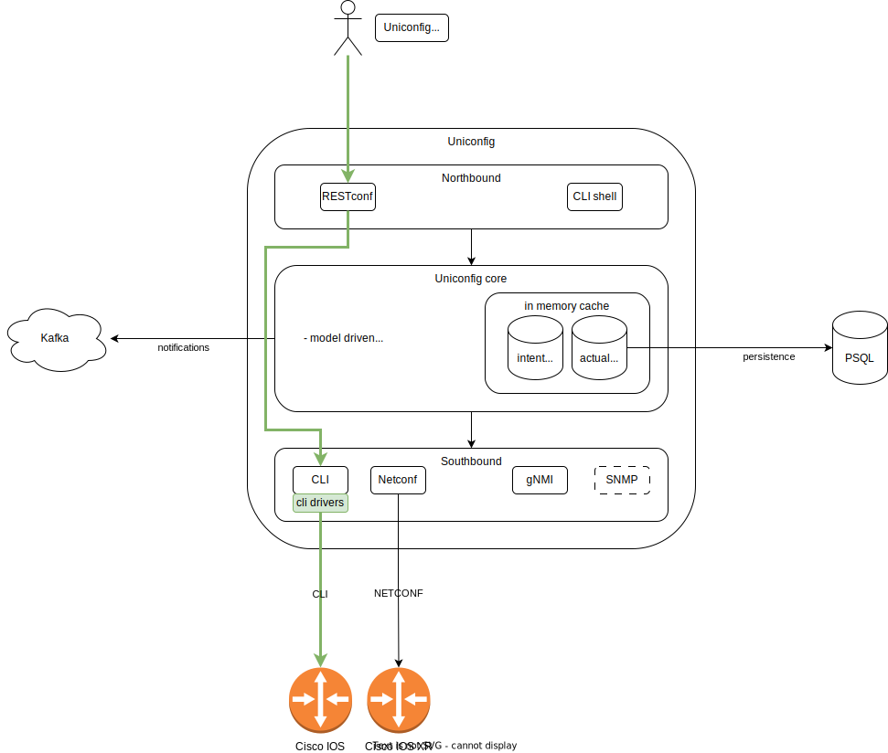
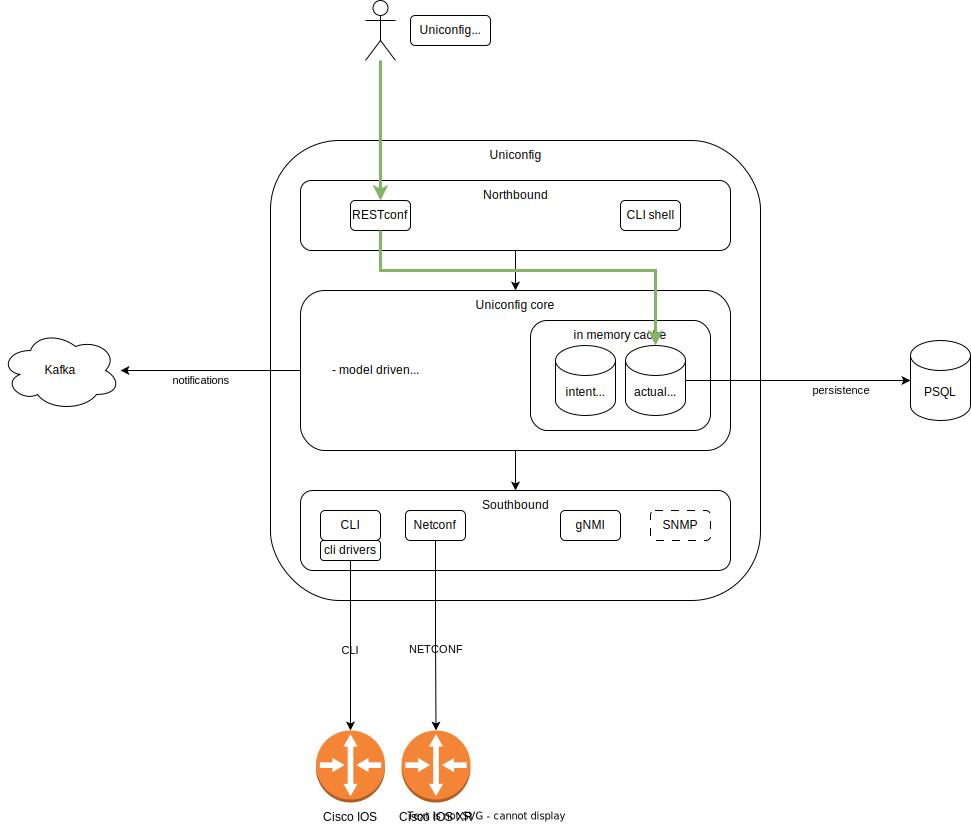
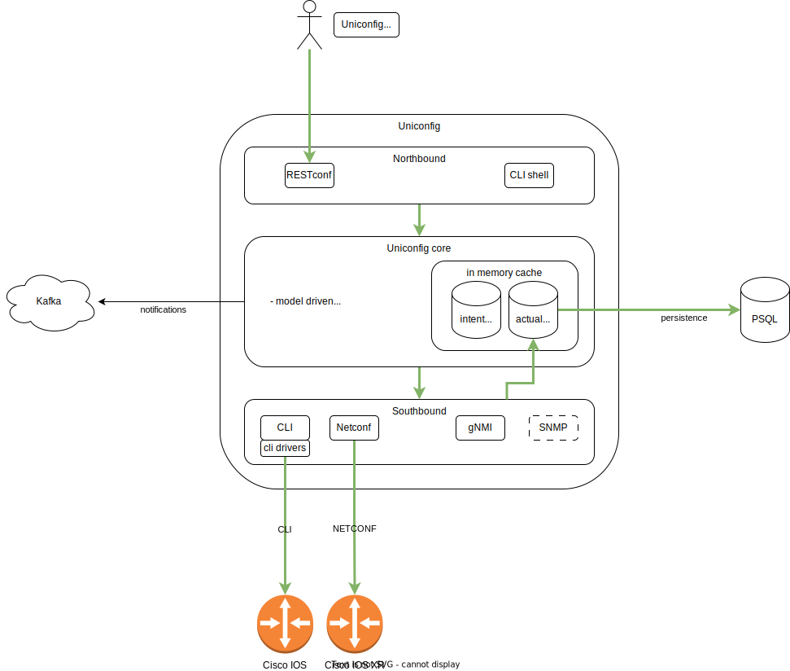

# Data flows and transformations

<!-- TOC -->
* [Data flows and transformations](#data-flows-and-transformations)
  * [Architecture](#architecture)
  * [Flows](#flows)
    * [CLI, direct to device, plaintext interface](#cli-direct-to-device-plaintext-interface)
    * [CLI, direct from device, configuration data read](#cli-direct-from-device-configuration-data-read)
    * [CLI, direct from device, operational data read](#cli-direct-from-device-operational-data-read)
    * [CLI, direct to device, configuration data write](#cli-direct-to-device-configuration-data-write)
    * [Netconf, direct from device, configuration data read](#netconf-direct-from-device-configuration-data-read)
    * [Netconf, direct from device, operational data read](#netconf-direct-from-device-operational-data-read)
    * [Netconf, direct to device, configuration data write](#netconf-direct-to-device-configuration-data-write)
    * [Uniconfig, cached intent configuration, data read](#uniconfig-cached-intent-configuration-data-read)
    * [Uniconfig, cached applied configuration, data read](#uniconfig-cached-applied-configuration-data-read)
    * [Uniconfig, applying intent to a device](#uniconfig-applying-intent-to-a-device)
    * [Uniconfig, synchronizing applied configuration from network](#uniconfig-synchronizing-applied-configuration-from-network)
<!-- TOC -->

## Architecture

The following diagram outlines the basic architecture for this purpose.
It gives a simplified overview and only includes a subset of components,
but serves as a baseline for illustrating various data flows.

The following main components are included:
* **Northbound**
  * **Restconf** - REST API for Uniconfig.
    * [Restconf RFC](https://datatracker.ietf.org/doc/html/rfc8040) provides detailed information on YANG-based REST API specifics.
    * [JSON YANG RFC](https://datatracker.ietf.org/doc/html/rfc7951) provides information on how JSON is used.
    * [Uniconfig restconf documentation](../../uniconfig-operations/restconf) provides an overview.
  * **Uniconfig Java SDK** - Java SDK for Uniconfig. Uses Restconf internally.
    * [Uniconfig java SDK documentation](../../uniconfig-operations/uniconfig-shell) provides an overview.
  * **Uniconfig CLI shell** - CLI interface for Uniconfig. Similar capabilities as RESTCONF, but intended for users who prefer CLI access.
    * [Uniconfig shell documentation](../../uniconfig-operations/uniconfig-shell) provides an overview.
* **Uniconfig core**
  * The Uniconfig core consists of many different components/features. A good place to start is the [build-and-commit model in Uniconfig](../../uniconfig-operations/build-and-commit-model).
* **Southbound**
  * **CLI** - Southbound plugin for managing devices over CLI (SSH).
  * **NETCONF** - Southbound plugin for managing devices over Netconf (SSH).
  * **gNMI** - Southbound plugin for managing devices over gNMI (SSH).
  * **SNMP** - // TBD


## Flows

### CLI, direct to device, plaintext interface

Flow for reading/writing arbitrary commands to a CLI device.

1. The User sends an HTTP POST REST (rpc) request to Uniconfig.
    * URL specifies Uniconfig defined execute-and-read or execute-and-expect RPC.
    * URL must specify the following:
        * `topology=cli` - CLI-managed device
        * `node=<nodeID>` - specific managed device
2. Restconf invokes an asynchronous RPC on the southbound layer, but blocks until it completes.
3. The CLI layer invokes a generic implementation of the plaintext access RPC and returns output from the device as is.
4. Restconf receives the data from the CLI layer and completes the request.

***Restconf example:***

To send an arbitrary command to a device and receive a response:
```
POST http://localhost:8181/rests/operations/network-topology:network-topology/topology=cli/node=IOS/yang-ext:mount/cli-unit-generic:execute-and-read

{
  "input" :
  {
     "ios-cli:command" : "show version"
  }
}
```

To send a sequence of commands (ssh expect style) and receive a response:
```
POST http://localhost:8181/rests/operations/network-topology:network-topology/topology=cli/node=IOS/yang-ext:mount/cli-unit-generic:execute-and-expect

{
  "input" :
  {
     "ios-cli:command" : "configure
expect(.*Configuring from terminal.*)
terminal
interface loopback 999
description execute-and-expect
exit
exit
"
  }
}
```

***Flow diagram:***


### CLI, direct from device, configuration data read

Flow for reading structured (YANG-model based) configuration data from a device over CLI.
The data is always retrieved from the device with no cache involved.

1. The user sends an HTTP GET REST request to Uniconfig.
   * URL must conform to openconfig data models used for all CLI devices.
   * URL must specify the following:
     * `topology=cli` - CLI-managed device
     * `node=<nodeID>` - specific managed device
     * `?content=config` - to specify only configuration data must be read from device (if not present, defaults to config)
2. Restconf component parses the URL and validates it against openconfig YANG models.
3. Restconf invokes an asynchronous read from the southbound layer, but blocks until it completes.
4. The CLI layer finds appropriate an CLI driver (cli units) and invokes all readers registered for a specific path provided in the URL.
5. CLI readers send specific commands to the device and parse the output into an internal DOM data structure.
6. Restconf receives the data from CLI layer, serializes them into JSON and completes the request.

***Restconf example:***

To get configuration data for all interfaces:

```
GET http://localhost:8181/rests/data/network-topology:network-topology/topology=cli/node=IOS/yang-ext:mount/frinx-openconfig-interfaces:interfaces?content=config
```

***Flow diagram:***


### CLI, direct from device, operational data read

Flow for reading structured (YANG-model based) operational data from a device over CLI.
The data is always retrieved from the device with no cache involved.

**This flow is identical to `CLI, direct from device, configuration data read` flow**.
**The difference is that this READ returns a combination of configuration and operational data !**
**To invoke operational data read, use `?content=nonconfig` in the URL, the rest of URL is no different**

**Warning!** Be careful when requesting operation data from devices.
The data can be massive and the act of reading such data can cause issues on device itself.
Always be as specific as possible, i.e., use the most specific (longest) URL possible.

***Restconf example:***

To get configuration and operational data for all interfaces:
```
GET http://localhost:8181/rests/data/network-topology:network-topology/topology=cli/node=IOS/yang-ext:mount/frinx-openconfig-interfaces:interfaces?content=nonconfig
```

***Flow diagram:***



### CLI, direct to device, configuration data write

Flow for writing structured (YANG-model based) configuration data to a device over CLI.
The data is transformed and sent directly to a device.

1. The user sends an HTTP PUT or POST REST request into Uniconfig.
  * URL and payload need to conform to openconfig data models used for all CLI devices.
  * URL must specify the following:
    * `topology=cli` - CLI-managed device
    * `node=<nodeID>` - specific managed device
    * `?content=config` - only configuration data is read from the device
2. The payload must contain valid JSON that correspondos to the URL points within the YANG model.
3. Restconf component parses the URL and the payload and validates them against openconfig YANG models.
3. Restconf invokes an asynchronous write on the southbound layer, but blocks until it completes.
4. The CLI layer finds the appropriate CLI driver (cli units) and invokes all writers registered for a specific path provided in the URL.
5. CLI writers send specific commands to the device and check the output for errors.
6. Restconf receives a success or failed response from the CLI layer and maps it to the appropriate status code.

**Note:** We do not recommend writing directly to a device. The preferred option is to use Uniconfig core to build an intent and commit the changes to the network.

***Restconf example:***

To configure a new Loopback999 interface:
```
PUT http://localhost:8181/rests/data/network-topology:network-topology/topology=cli/node=IOS/yang-ext:mount/frinx-openconfig-interfaces:interfaces/interface=Loopback999?content=config

{
    "interface": [
        {
            "name": "Loopback999",
            "config": {
                "type": "iana-if-type:softwareLoopback",
                "enabled": false,
                "description": "test interface",
                "name": "Loopback999"
            }
        }
    ]
}

```

***Flow diagram:***


### Netconf, direct from device, configuration data read

Flow for reading structured (YANG-model based) configuration data from a device over Netconf.
The data is always retrieved from the device with no cache involved.

1. The User sends an HTTP GET REST request to Uniconfig.
    * URL must conform to vendor-specific YANG data models used by the device.
      * Which models are used depends on the device. Many vendor-specific models can be found on [GitHub](https://github.com/YangModels/yang/tree/main/vendor).
    * URL must specify the following:
      * `topology=topology-netconf` - CLI-managed device
      * `node=<nodeID>` - specific managed device
      * `?content=config` - only configuration data is read from the device (if not given, defaults to config)
2. Restconf component parses the URL and validates it against vendor-specific YANG models.
3. Restconf invokes an asynchronous read from the southbound layer, but blocks until it completes.
5. The Netconf layer serializes the path (URL) into a get-config request with a filter, sends it to the device and parses the output into an internal DOM data structure.
6. Restconf receives the data from the Netconf layer, serializes them into JSON and completes the request

***Restconf example:***

To get Loopback999 interface configuration using IOS XR vendor models:
```
GET http://localhost:8181/rests/data/network-topology:network-topology/topology=topology-netconf/node=IOSXR/yang-ext:mount/Cisco-IOS-XR-ifmgr-cfg:interface-configurations/interface-configuration=act,Loopback999?content=config
```

***Flow diagram:***


### Netconf, direct from device, operational data read

Flow for reading structured (YANG-model based) operational data from a device over Netconf.
The data is always retrieved from the device with no cache involved.

**This flow is identical to the `Netconf, direct from device, configuration data read` flow**.
**The difference is that this READ returns a combination of configuration and operational data by using `get` netconf RPC instead of `get-config`!**
**To invoke operational data read, use `?content=nonconfig` in the URL**

**Warning!** Be careful when requesting operation data from devices.
The data can be massive and the act of reading such data can cause issues on device itself.
Always be as specific as possible, i.e., use the most specific (longest) URL possible.

***Restconf example:***

To get operational data for all interfaces using IOS XR vendor models:
```
GET http://localhost:8181/rests/data/network-topology:network-topology/topology=cli/node=IOS/yang-ext:mount/Cisco-IOS-XR-ifmgr-oper:interface-properties?content=nonconfig
```

***Flow diagram:***


### Netconf, direct to device, configuration data write

Flow for writing structured (YANG-model based) configuration data to a device over Netconf.
The data is transformed and sent directly to a device.

**Note:** We do not recommend writing directly to a device. The preferred option is to use Uniconfig core to build an intent and commit the changes to the network.


***Restconf example:***

To configure Loopback999 interface configuration using IOS XR vendor models:
```
PUT http://localhost:8181/rests/data/network-topology:network-topology/topology=topology-netconf/node=IOSXR/yang-ext:mount/Cisco-IOS-XR-ifmgr-cfg:interface-configurations/interface-configuration=act,Loopback999?content=config

{
    "interface-configuration": [
        {
            "active": "act",
            "interface-name": "Loopback999",
            "interface-virtual": [
                null
            ],
            "description": "deep dive"
        }
    ]
}
```

***Flow diagram:***


### Uniconfig, cached intent configuration, data read

Flow for reading structured (YANG-model based), cached intent configuration data (not applied to network) for a device, regardless of its management protocol.
The data is retrieved from in-memory cache (or a database, if not available in memory).

1. The user sends an HTTP GET REST request to Uniconfig.
    * URL must conform to models used for that specific device, whether standard or vendor-specific models.
    * URL must specify the following:
        * `topology=uniconfig` - device cached in uniconfig
        * `node=<nodeID>` - specific managed device
        * `?content=config` - only intent data is read for a device (if not given, defaults to config == intent)
2. Restconf component parses the URL and validates it against device-specific YANG models.
3. An ad-hoc uniconfig transaction is started.
   * Transactions can be started automatically by Uniconfig or controlled by the user.
   * For more information about transactions, see [Build and commit mode](../../uniconfig-operations/build-and-commit-model) or [Immediate commit model](../../uniconfig-operations/immediate-commit-model).
4. Restconf invokes an asynchronous read from uniconfig core, but blocks until it completes.
5. Uniconfig core reads in-memory cached intent (or loads the latest version of data from the database).
   * This is typically a very quick operation compared to reading directly from a device.
6. Restconf receives the data from Uniconfig core, serializes them into JSON and completes the request.
7. The ad-hoc transaction is closed.

***Restconf example:***

To get Loopback999 interface cached intent configuration using IOS XR vendor models:
```
GET http://localhost:8181/rests/data/network-topology:network-topology/topology=uniconfig/node=IOSXR/configuration/Cisco-IOS-XR-ifmgr-cfg:interface-configurations/interface-configuration=act,Loopback999?content=config
```

To get Loopback999 interface cached intent configuration using openconfig models for a device over CLI:
```
GET GET http://localhost:8181/rests/data/network-topology:network-topology/topology=uniconfig/node=IOS/configuration/frinx-openconfig-interfaces:interfaces/interface=Loopback999?content=config
```

***Flow diagram:***


### Uniconfig, cached applied configuration, data read

Flow for reading structured (YANG-model based), cached configuration data (already applied to the network) for a device, regardless of its management protocol.
The data is retrieved from in-memory cache (or a database, if not available in memory).

1. The user sends an HTTP GET REST request to Uniconfig.
    * URL must conform to models used for that specific device, whether standard or vendor-specific models.
    * URL must specify the following:
        * `topology=uniconfig` - device cached in uniconfig
        * `node=<nodeID>` - specific managed device
        * `?content=nonconfig` - only applied data is read for a device (if not given, defaults to config == intent)
2. Restconf component parses the URL and validates it against device-specific YANG models.
3. An ad-hoc uniconfig transaction is started.
    * Transactions can be started automatically by Uniconfig or controlled by the user.
    * For more information about transactions, see [Build and commit mode](../../uniconfig-operations/build-and-commit-model) or [Immediate commit model](../../uniconfig-operations/immediate-commit-model).
4. Restconf invokes an asynchronous read from Uniconfig core, but blocks until it completes.
5. Uniconfig core reads in-memory cached, already applied configuration (or loads the latest version of data from a database).
    * This is typically a quick operation compared to reading directly from a device.
6. Restconf receives the data from Uniconfig core, serializes them into JSON and completes the request.
7. The ad-hoc transaction is closed.

***Restconf example:***

To get Loopback999 interface cached intent configuration using IOS XR vendor models:
```
GET http://localhost:8181/rests/data/network-topology:network-topology/topology=uniconfig/node=IOSXR/configuration/Cisco-IOS-XR-ifmgr-cfg:interface-configurations/interface-configuration=act,Loopback999?content=config
```

To get Loopback999 interface cached intent configuration using openconfig models for a device over CLI:
```
GET GET http://localhost:8181/rests/data/network-topology:network-topology/topology=uniconfig/node=IOS/configuration/frinx-openconfig-interfaces:interfaces/interface=Loopback999?content=config
```

***Flow diagram:***



### Uniconfig, applying intent to a device

Flow for writing structured (YANG-model based) configuration data to Uniconfig's intent.
Intent is typically modified for multiple devices.
When modifications are completed, a commit is issued to apply the changes to the network.
Automated rollback may kick in when a failure occurs.

For more information on this flow, see [Build and commit mode](../../uniconfig-operations/build-and-commit-model) or [Immediate commit model](../../uniconfig-operations/immediate-commit-model).

**Note:**
Uniconfig core builds on top of "direct to device data flows" 
and everything south of Uniconfig core is identical to
those (direct to device) data flows. For example, Uniconfig core uses the `Netconf, direct to device, configuration data write`
flow to apply configurations to Netconf devices when performing a commit.

***Restconf example:***

To configure two devices in a single transaction:

```
# Start a transaction and preserve the cookie afterwards

POST http://localhost:8181/rests/operations/uniconfig-manager:create-transaction


PUT http://localhost:8181/rests/data/network-topology:network-topology/topology=uniconfig/node=IOSXR/configuration/Cisco-IOS-XR-ifmgr-cfg:interface-configurations/interface-configuration=act,Loopback999?content=config

{
    "interface-configuration": [
        {
            "active": "act",
            "interface-name": "Loopback999",
            "interface-virtual": [
                null
            ],
            "description": "deep dive"
        }
    ]
}


PUT http://localhost:8181/rests/data/network-topology:network-topology/topology=uniconfig/node=IOS/configuration/frinx-openconfig-interfaces:interfaces/interface=Loopback999?content=config

{
    "interface": [
        {
            "name": "Loopback999",
            "config": {
                "type": "iana-if-type:softwareLoopback",
                "enabled": false,
                "description": "test interface",
                "name": "Loopback999"
            }
        }
    ]
}

# To commit the transaction and apply changes to both devices:

POST http://localhost:8181/rests/operations/uniconfig-manager:commit

{
    "input": {
    }
}
```

***Flow diagram:***


### Uniconfig, synchronizing applied configuration from network

Flow for synchronizing/updating an applied configuration from a network device.
This is useful especially when the configuration is changed in the network directly (outside of Uniconfig).
Once the configuration is synchronized, those direct changes can be accepted or reverted in Uniconfig.

For more information on this flow, see [Sync from network](../../uniconfig-operations/uniconfig-node-manager/rpc_sync-from-network).

1. The user sends an HTTP GET REST request to Uniconfig.
    * URL specifies Uniconfig defined sync-from-network RPC.
    * Payload must specify a list of devices to be synchronized.
3. An ad-hoc uniconfig transaction is started.
    * Transactions can be started automatically by Uniconfig or controlled by the user.
    * For more information about transactions, see [Build and commit mode](../../uniconfig-operations/build-and-commit-model) or [Immediate commit model](../../uniconfig-operations/immediate-commit-model).
3. Restconf invokes an asynchronous RPC in Uniconfig core, but blocks until it completes.
5. Uniconfig core performs direct from device configuration data read flows for each device in parallel.
    * Uniconfig has a mechanism to verify whether a device is out of sync based on the last commit timestamp. A full configuration is performed only if out of sync.
6. Uniconfig core stores the new configuration in the applied configuration cache and in the database.
6. Restconf receives a success or failed response from Uniconfig core and maps it to the appropriate status code and response.
7. The ad-hoc transaction is committed.


***Restconf example:***

To synchronize two devices from the network:
```
POST http://localhost:8181/rests/operations/uniconfig-manager:sync-from-network

{
    "input": {
        "target-nodes": {
            "node": ["IOS", "IOSXR"]
        }
    }
}
```

***Flow diagram:***


