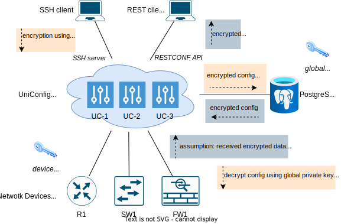
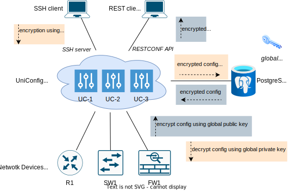
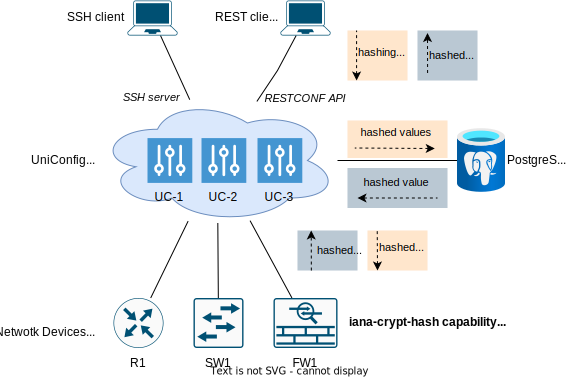

# Data Security Models

UniConfig supports encryption and hashing of leaf/leaf-list values on SSH and RESTCONF API.
Following sections describe supported security models in depth.

## Data encryption

UniConfig uses asymmetric encryption for ensuring confidentiality of selected leaf and leaf-list values. Currently,
only RSA ciphers are supported (both global UniConfig and device-level key-pairs). Encryption is supported
in 'uniconfig', 'unistore', and 'templates' topologies.

### Global-device encryption architecture

Both UniConfig and device uses PKI for encryption of data:

* UniConfig side: All selected leaves are encrypted using global public key when this data enters UniConfig via
  RESTCONF API or UniConfig SSH shell API. Afterwards, data is stored in database in the encrypted format.
  UniConfig has also access to private key which is used internally for decryption of already encrypted data.
* Device side: Device exposes public key and UniConfig uses this key for re-encryption of data before it is sent
  to device ('commit'/'checked-commit' operations). However, device doesn't expose its private key - UniConfig is not
  able to detect changes done to encrypted data (updated leaves/leaf-lists) - it is only able to detect, if data
  was removed or created, not updated. Because of this reason, UniConfig assumes that read encrypted data from device
  has been encrypted using the same public key as it was used by UniConfig.

Following picture depicts data transformations done on UniConfig interfaces:



### Global-only encryption architecture

In comparison to Global-device encryption architecture this model uses only global key-pair for encryption of data.
Devices contain only plaintext data.

* Public key is used for encryption of received data via RESTCONF, UniConfig
  shell API, and when syncing configuration from device to UniConfig transaction ('sync-from-network' operation).
* Private key is used for decryption of encrypted data before forwarding this configuration to device
  ('commit'/'checked-commit' operations).

Next picture depicts data transformations done on UniConfig interfaces:



!!!
Reading of operational data from device directly (GET under 'yang-ext:mount') shows data
in unencrypted format. Application gateways should restrict access to mountpoints in this use-case.
!!!

### YANG support

Leaves and leaf-lists, which value user would like to store encrypted, must be marked using YANG extension without any
parameters. Currently, only leaves with 'string' type (direct/indirect with custom type definitions) are supported,
since encrypted values are base64 encoded. Also, be aware that type constraints must accept encrypted values.

Example YANG module that defines one 'encrypt' extension:

```yang frinx-encrypt@2021-12-15
module frinx-encrypt {
    yang-version 1.1;
    namespace urn:ietf:params:xml:ns:yang:frinx-encrypt;
    prefix frinx-encrypt;

    revision 2021-12-15 {
        description "Initial revision";
    }

    extension encrypt {
    }
}
```

Usage of the extension in the 'config' module:

```yang config@2021-12-15
module config {
    yang-version 1.1;
    namespace urn:ietf:params:xml:ns:yang:config;
    prefix config;

    import frinx-encrypt {
        prefix fe;
        revision-date 2021-12-15;
    }

    revision 2021-12-15 {
        description "Initial revision";
    }

    typedef secret-string {
        type string;
    }

    container config {
        list properties {
            key property-id;

            leaf property-id {
                type string;
            }
            leaf enabled {
                type boolean;
            }
            leaf value {
                type string;
                fe:encrypt;
            }
        }

        container routing {
            container eigrp {
                leaf process-id {
                    type uint16;
                }
                leaf password {
                    type secret-string;
                    fe:encrypt;
                }
            }

            leaf-list neighbor-key {
                type leafref {
                    path "../../properties/value";
                }
                fe:encrypt;
            }
        }
    }
}
```

Many times, it is not possible to modify existing YANG files because they are already deployed on device, for example
device running with NETCONF server. In this case, user can still mark what leaves should be encrypted using additional
YANG module that contains deviations.

Example:

```yang encrypted-paths@2019-11-10
module encrypted-paths {
    yang-version 1.1;
    namespace urn:ietf:params:xml:ns:yang:encrypted-paths;
    prefix ep;

    import snmp {
        prefix snmp;
        revision-date 2019-11-10;
    }
    import frinx-encrypt {
        prefix fe;
        revision-date 2021-12-15;
    }

    revision 2019-11-10 {
        description "Initial revision";
    }

    deviation "/snmp:snmp/snmp:usm/snmp:remote/snmp:user/snmp:auth/snmp:protocol/snmp:md5/snmp:md5/snmp:key-type/snmp:password/snmp:password" {
        deviate add {
            fe:encrypt;
        }
    }

    deviation "/snmp:snmp/snmp:usm/snmp:remote/snmp:user/snmp:auth/snmp:protocol/snmp:md5/snmp:md5/snmp:key-type/snmp:key/snmp:key" {
        deviate add {
            fe:encrypt;
        }
    }

    deviation "/snmp:snmp/snmp:usm/snmp:remote/snmp:user/snmp:auth/snmp:protocol/snmp:sha/snmp:sha/snmp:key-type/snmp:password/snmp:password" {
        deviate add {
            fe:encrypt;
        }
    }

    deviation "/snmp:snmp/snmp:usm/snmp:remote/snmp:user/snmp:auth/snmp:protocol/snmp:sha/snmp:sha/snmp:key-type/snmp:key/snmp:key" {
        deviate add {
            fe:encrypt;
        }
    }
}
```

Afterwards, user has 2 options how this module can be coupled with modules from device (NETCONF):

a. Explicit specification of this side-loaded module in the 'install-node' request - using
   'netconf-node-topology:yang-module-capabilities' settings (see 'Device installation' section).
b. Automatic detection of side-loaded module - UniConfig looks for specific capability from NETCONF server,
   inherits its revision, and then looks for side-loaded module with specific name and inherited revision
   (see 'Configuration' section). This option is preferred, if deployment contains multiple versions of devices
   and list of encrypted paths are different on each version.

### Configuration

Global RSA key-pair is stored inside PEM-encoded files in the 'rsa' directory under UniConfig root. Name of the
private key must be 'encrypt_key' and name of the public key must be 'encrypt_key.pub'. If user doesn't provide
these files, UniConfig will automatically generate its own key-pair with length of 2048 bits.
All UniConfig instances in the cluster must use the same key-pair.

Encryption settings are stored in the 'config/lighty-uniconfig-config.json' file under 'crypto' root object.

Example:

```json settings
"crypto": {
    "encryptExtensionId": "frinx-encrypt:encrypt",
    "netconfReferenceModuleName": "system",
    "netconfEncryptedPathsModuleName": "encrypted-paths"
}
```

* encryptExtensionId - If this setting is not defined, then encryption is disabled despite of other
  settings or install-node parameters. The value must have the format [module-name]:[extension-name] and specifies
  extension used for marking of encrypted leaves/leaf-lists in YANG modules. Corresponding YANG module, that contain
  this extension, can be part of device/unistore YANG schemas or it can be side-loaded during installation of NETCONF
  device as imported module from 'default' repository.
* netconfReferenceModuleName - Name of the module for which NETCONF client looks for during mounting process. If
  UniConfig finds module with this name in the list of received capabilities, then it uses its revision in the lookup
  process for correct YANG module with encrypted paths (using deviations).
* netconfEncryptedPathsModuleName - Name of the module which contains deviations with paths to encrypted
  leaves/leaf-lists. There could be multiple revisions of this file prepared in the 'default' NETCONF repository.
  NETCONF client in the UniConfig chooses the correct revision based on 'netconfReferenceModuleName' setting.
  Together, 'netconfReferenceModuleName' and 'netconfEncryptedPathsModuleName' can be used for auto-loading
  of encrypted paths for different versions of devices.

### Device installation

There are 2 settings related to encryption in the 'install-node' RPC request:

* uniconfig-config:crypto - It allows specifying path to public key on device - 'public-key-path' (leaf with RFC-8040
  path) and cipher type (by default, RSA is used) - 'public-key-cipher-type'. If path to public key is specified, and it
  exists on device, then Global-device encryption model is used. Otherwise, Global-only encryption model is selected.
* netconf-node-topology:yang-module-capabilities - If auto-loading of YANG module with encrypted paths is not used
  and device itself doesn't specify encrypted leaves, then it is necessary to side-load YANG module with encrypted
  paths. This parameter is relevant only on NETCONF nodes. Side-loaded modules must be expressed in the format
  of NETCONF capabilities.

Following request shows install-node request with specified both path to public key and side-loaded YANG module
'encrypted-paths' with revision '2021-12-15' and namespace 'urn:ietf:params:xml:ns:yang:encrypted-paths'.

```bash RPC request: install device
curl --location --request POST 'http://127.0.0.1:8181/rests/operations/connection-manager:install-node' \
--header 'Content-Type: application/json' \
--header 'Accept: application/json' \
--data-raw '{
    "input": {
        "node-id": "dev01",
        "netconf": {
            "netconf-node-topology:host": "10.103.5.47",
            "netconf-node-topology:port": 2022,
            "netconf-node-topology:keepalive-delay": 5,
            "netconf-node-topology:max-connection-attempts": 1,
            "netconf-node-topology:connection-timeout-millis": 60000,
            "netconf-node-topology:default-request-timeout-millis": 60000,
            "netconf-node-topology:tcp-only": false,
            "netconf-node-topology:username": "admin",
            "netconf-node-topology:password": "admin",
            "netconf-node-topology:sleep-factor": 1.0,
            "uniconfig-config:uniconfig-native-enabled": true,
            "netconf-node-topology:edit-config-test-option": "set",
            "uniconfig-config:crypto": {
                "public-key-path": "/crypto/pki/config-keys=config_key/pub-key",
                "public-key-cipher-type": "RSA"
            },
            "netconf-node-topology:yang-module-capabilities": {
                "capability": [
                    "urn:ietf:params:xml:ns:yang:encrypted-paths?module=encrypted-paths&amp;revision=2021-12-15"
                ]
            }
        }
    }
}'
```

During installation, UniConfig tries to download public key from device. Public key can be verified using GET request:

```bash GET request: reading synced public key from device
curl --location --request POST 'http://127.0.0.1:8181/rests/data/network-topology:network-topology/topology=uniconfig/node=dev01/crypto:crypto?content=nonconfig' \
--header 'Accept: application/json'
```

```json GET response
{
    "crypto": {
        "encryption-public-key": "MIIBIjANBgkqhkiG9w0BAQEFBAOCAQ8AMIIBCgKCAQEAngAPZy+xJRhwzyC3NuiDQ6mXXhHD797wGt8L91v7jU+IZigggiRJIYOHwEUVkvPKErULIi8ZQhi2pykuSoJu6733GUoqct22M9uYOe9I5Y+9uL16dSVrn90Vy2vk9/CqAC+cKbIdEMpowhb/nap7e9+m8owcttH0trkWV1qMSTrQIIsIAo48jxLfxjtOLHwyCGE4JOSvBg3RSNUWVH7SAwk5b3zv0JM2lV1ctF2kiDs1RP2ASXgLnCjCUH6EdXfbgORrImd58kO+931RbdhGwPUlt8+ij6UxvE6kJBm9wnIBVyiDrRmPcuHd41hCFooMEmoCRxr1ZGDxcTEh3DndUwIDAQAB",
        "encryption-cipher-type": "RSA"
    }
}
```

### Example: global-device model

The next use-case shows encryption of values marked by 'frinx-encrypt:encrypt' extension on both UniConfig server
side and device side. NETCONF device directly exposes 'frinx-encrypt' YANG module and leaves with applied extension
(side-loading of encrypted paths is not necessary).

Used YANG model for simulation of YANG device:

```yang config2021-12-15
module config {
    yang-version 1.1;
    namespace urn:ietf:params:xml:ns:yang:config;
    prefix config;

    import frinx-encrypt {
        prefix fe;
        revision-date 2021-12-15;
    }

    revision 2021-12-15 {
        description "Initial revision";
    }

    typedef secret-string {
        type string;
    }

    container keys {
        config false;
        leaf public-key {
            type binary;
        }
    }

    container config {
        leaf test {
            type string;
        }

        list properties {
            key property-id;

            leaf property-id {
                type string;
            }
            leaf enabled {
                type boolean;
            }
            leaf value {
                type string;
                fe:encrypt;
            }
        }

        container routing {
            container rip {
                leaf version {
                    type uint8;
                }
                leaf auto-summary {
                    type boolean;
                    fe:encrypt; // only string is supported for encryption - ignored
                }
            }
            container eigrp {
                leaf process-id {
                    type uint16;
                }
                leaf password {
                    type secret-string;
                    fe:encrypt;
                }
            }

            leaf-list neighbor-key {
                type leafref {
                    path "../../properties/value";
                }
                fe:encrypt;
            }
        }
    }
}
```

```bash 1. Installation of new device with specified path to public key
curl --location --request POST 'http://127.0.0.1:8181/rests/operations/connection-manager:install-node' \
--header 'Content-Type: application/json' \
--header 'Accept: application/json' \
--data-raw '{
    "input": {
        "node-id": "testtool",
        "netconf": {
            "netconf-node-topology:host": "127.0.0.1",
            "netconf-node-topology:port": 36000,
            "netconf-node-topology:keepalive-delay": 5,
            "netconf-node-topology:max-connection-attempts": 1,
            "netconf-node-topology:connection-timeout-millis": 60000,
            "netconf-node-topology:default-request-timeout-millis": 60000,
            "netconf-node-topology:tcp-only": false,
            "netconf-node-topology:username": "admin",
            "netconf-node-topology:password": "admin",
            "netconf-node-topology:sleep-factor": 1.0,
            "uniconfig-config:install-uniconfig-node-enabled": true,
            "uniconfig-config:uniconfig-native-enabled": true,
            "uniconfig-config:crypto": {
                "public-key-path": "/keys/public-key"
            }
        }
    }
}'
```

```json RPC response
{
    "output": {
        "status": "complete"
    }
}
```

```bash 2. Creation of new transaction
curl --location --request POST 'http://127.0.0.1:8181/rests/operations/uniconfig-manager:create-transaction'
```

```text RPC response (UNICONFIGTXID=5e75d4e9-382e-4852-905e-9b5c4db57107)
5e75d4e9-382e-4852-905e-9b5c4db57107
```

```bash 3. Writing plaintext data with leaves that must be encrypted
curl --location --request PUT 'http://127.0.0.1:8181/rests/data/network-topology:network-topology/topology=uniconfig/node=testtool/configuration/config/properties' \
--header 'Content-Type: application/json' \
--header 'Cookie: UNICONFIGTXID=5e75d4e9-382e-4852-905e-9b5c4db57107; Path=/rests/' \
--data-raw '{
    "properties": [
        {
            "property-id": "id1",
            "enabled": true,
            "value": "test1"
        },
        {
            "property-id": "id2",
            "enabled": false,
            "value": "test2"
        }
    ]
}'
```

```text PUT reponse
Status: 201
```

```bash 4. Reading already encrypted data in the same transaction
curl --location --request GET 'http://127.0.0.1:8181/rests/data/network-topology:network-topology/topology=uniconfig/node=testtool/configuration/config/properties?content=config' \
--header 'Accept: application/json' \
--header 'Cookie: UNICONFIGTXID=5e75d4e9-382e-4852-905e-9b5c4db57107; Path=/rests/'
```

```json GET response
{
    "properties": [
        {
            "property-id": "id1",
            "value": "hJVw+MLPnB4K9dlH67khBXMt8LW7p2+oXCFLVq19TelOVXf4Oad6XfO36wD4gTjF0VpgGp3/95SYX25NrBT5U8vW8AQ33OdFo99TF+g+bAjYE8bBX9ND8Nwdyxu86AKmPGzJWHKlz3SIf0KzX+hC9LvdDiD4nmkPiS27ZGVOnaN9wNFHEt9Oa9Z4SvKSPq8ZpxVoCpHfZ08CS7DPuMqaMRPzi+7QWIsMSIBXoNbWDlg5YTN68tgcOCwtof1lSYaZHnpNWHAvR59HMh2vL+L4BWRvnQgVWoYYuC3aPWMbF+Z8Q5CVqdzcD67VUzhKcGKEiag9u1suy0IBTLAhJPHD+g==",
            "enabled": true
        },
        {
            "property-id": "id2",
            "value": "YMoUZ5fOIYA8Uii34hg+CJ5BsEGlu82y0MJDb8ETbz3lcnlDxevrVLHtT6TdwkU+6wUed80FRfrD9FCPWfq6E19hC7fyq9kV8nS7IO02kuafZ0fsKIFKHSQqsOJTe9dACOunWmo6ZqzRjUHn2tVBY0rrydtusk7fJ4GrmK8X73e3EXOlWYOtqxZj88Egf6FrrpN17sJZJCHMHI+tN0GMEykjYhklnW2QxaLyXjrI88PcJwPUEOQouG5tSOVDw7xAKu/yPGikTUrlIZGaT7PJTXkKOMC8TomJybVD7mA8e9ytcJO4jQVJD10JxO2PJe1L1humgi4qbOzv3xQ+Mmsfhg==",
            "enabled": false
        }
    ]
}
```

```bash 5. Commit changes to device
curl --location --request POST 'http://127.0.0.1:8181/rests/operations/uniconfig-manager:commit' \
--header 'Accept: application/json' \
--header 'Content-type: application/json' \
--header 'Cookie: UNICONFIGTXID=5e75d4e9-382e-4852-905e-9b5c4db57107; Path=/rests/' \
--data-raw '{
    "input": {
        "target-nodes": {
        }
    }
}'
```

```json RPC response
{
    "output": {
        "node-results": {
            "node-result": [
                {
                    "node-id": "testtool",
                    "configuration-status": "complete"
                }
            ]
        },
        "overall-status": "complete"
    }
}
```

```bash 6. Reading committed configuration from device (immediate-commit model)
curl --location --request GET 'http://127.0.0.1:8181/rests/data/network-topology:network-topology/topology=topology-netconf/node=testtool/yang-ext:mount/config/properties?content=config' \
--header 'Accept: application/json'
```

```json GET response
{
    "properties": [
        {
            "property-id": "id1",
            "value": "BsscbpHaTAR3JBnUjuWPcIiUXmpakK9rvmEiTh5+yInezkzIEPQJNyIlVONMjRABv2cs5a0rIfcJAIpwKfmGwB1hfPRSYEUJrMuvSY2SvOhgEAYAcVrMGsVLtmSpZymvDQw1ZUAp1ANT2r3NgH+FELWmATaGmKMtBJLyt8OexXmpCmENmGf+Hdj0450a6WwW+qPcJnLclR+KUR6yHSOzIZVPGBdp0zw5bEwCsYPWLtBgEw4U9/QxzO+ELhO8o9bEJx44EVax5zSZpmr5+9TineRB99GLaBpTnbDEUDKB6qDzmmutuQfaqUCdIpeBPOHIkY2R1Eos2Bagx2mAv/QXWw==",
            "enabled": true
        },
        {
            "property-id": "id2",
            "value": "UM3pBX/zsmwBoYUQPFLMl3XciPIbAKU2Z3rFlDaHNWotxwjci2Sc4E42Mz/hfTBbJOsrDhwDf9542dUcnNZ0VQZHSZ6QSm8YZYkLgwTC0jIz+kC/aLP8yHdax8pSUrWf1oqGgYAD18wC6CLL8Jvptu4YFH7oxxVAk1b6RX3LcU41UMrxbGTdkPq8iUAMgI5d3+YKVRzy00xOAyhMo3rrRK6VDtTZ+jwxvTK4V9xo7AEgxjCQXhEnTQPWVESGRiq0WP4wRX4QlwB6b7uiwcQYa+L6ZGU83CJeA8fDb9YSsRzKkIQJ+6cKaiNXupvDTn7nMy0lhG45oJfGUB059RAaKQ==",
            "enabled": false
        }
    ]
}
```

```bash 7. Reading committed configuration from database (immediate-commit model)
curl --location --request GET 'http://127.0.0.1:8181/rests/data/network-topology:network-topology/topology=uniconfig/node=testtool/configuration/config/properties?content=config' \
--header 'Accept: application/json'
```

```json GET reponse
{
    "properties": [
        {
            "property-id": "id1",
            "value": "hJVw+MLPnB4K9dlH67khBXMt8LW7p2+oXCFLVq19TelOVXf4Oad6XfO36wD4gTjF0VpgGp3/95SYX25NrBT5U8vW8AQ33OdFo99TF+g+bAjYE8bBX9ND8Nwdyxu86AKmPGzJWHKlz3SIf0KzX+hC9LvdDiD4nmkPiS27ZGVOnaN9wNFHEt9Oa9Z4SvKSPq8ZpxVoCpHfZ08CS7DPuMqaMRPzi+7QWIsMSIBXoNbWDlg5YTN68tgcOCwtof1lSYaZHnpNWHAvR59HMh2vL+L4BWRvnQgVWoYYuC3aPWMbF+Z8Q5CVqdzcD67VUzhKcGKEiag9u1suy0IBTLAhJPHD+g==",
            "enabled": true
        },
        {
            "property-id": "id2",
            "value": "YMoUZ5fOIYA8Uii34hg+CJ5BsEGlu82y0MJDb8ETbz3lcnlDxevrVLHtT6TdwkU+6wUed80FRfrD9FCPWfq6E19hC7fyq9kV8nS7IO02kuafZ0fsKIFKHSQqsOJTe9dACOunWmo6ZqzRjUHn2tVBY0rrydtusk7fJ4GrmK8X73e3EXOlWYOtqxZj88Egf6FrrpN17sJZJCHMHI+tN0GMEykjYhklnW2QxaLyXjrI88PcJwPUEOQouG5tSOVDw7xAKu/yPGikTUrlIZGaT7PJTXkKOMC8TomJybVD7mA8e9ytcJO4jQVJD10JxO2PJe1L1humgi4qbOzv3xQ+Mmsfhg==",
            "enabled": false
        }
    ]
}
```


```bash 8. Writing plaintext data with leaf-list that must be encrypted (immediate-commit model)
curl --location --request PUT 'http://127.0.0.1:8181/rests/data/network-topology:network-topology/topology=uniconfig/node=testtool/configuration/config/routing/neighbor-key' \
--header 'Content-type: application/json' \
--data-raw '{
    "neighbor-key": [
        "neigh1",
        "neigh2",
        "neigh2"
    ]
}'
```

```text PUT response
Status: 201
```

```bash 9. Reading committed configuration from device (immediate-commit model)
curl --location --request GET 'http://127.0.0.1:8181/rests/data/network-topology:network-topology/topology=topology-netconf/node=testtool/yang-ext:mount/config/routing/neighbor-key?content=config' \
--header 'Accept: application/json'
```

```json GET response
{
    "neighbor-key": [
        "JD+6+DCBf97NIJqxekkrpdspQzgpZ9/G9ckV39hmnLyUS2rc7KULFMX/zw6drLsyV8ZgKyLXUjA0aiQq0k2FvicujJAAwSX/GRjKkN51P/kV4AA0hTxX1eVOC3RR392lRCzRmcIaaniHj9zXOJciY/Ki5UvKW0VOwcaPN47iZKJ2fcBbyNwMcQfXAP0ScBQOCxH/MVtp7vq/0tJCS6CS4CSNOx/LarSaq+MGgKgQroWQ9LONnJ5BCWsZsO6h5RhhBOjn5AT4cNrmvEAvbGohkTJCibdSmAO28AfIdVqidoRABGA8z8fEOu0vgdFmKXJFaawE7kpZBgvnm3EN5nr/6A==",
        "X24s8vRw3tJB6pK5cLaT6SnFXoGG1HlMUOs91k8DCGSVxMlV98l5W3WWnGEuQnJdH8n6dNhC3qaXO4vEd2CUT97HnMpP25mbKvBuJot12xoMj7lMDg+J0+FuhKiy+ibim1o059wbbayAU7IsxiKIVgbHIwVovI5vub331Ya5TGpuUVOAMRXasnvymGRbbWuS2aTkwDWt/148549C9ofTqOr0kFL0TVD+Ze8BSdi33+GKTskAvrk44vNJjZI/mITggWezHKi2xfu8R+vEK+pCaelcjmMuwYXYEu6l+fI8E+wU9/CRAK/EpGHjBKljuae8Q1UmeY3TeQ8/ahwCw1UqLQ==",
        "RoG/5szzENbFh0/ZWhw+f8Wg+dQyXpQ1RR2rIEfLOBZkVkNq55LTuB0NwgLfw/PBirUZVZHtPzGNMmOnuqoyfRZ8AUu8t6mgxaKKRROAaEKQOJ069Gl5klRn4kryMzDLihcoHWfnJqcb+SbQ8SIoeeUZdd0yJkgkegJMYWyWECOGbWlPX7YaKg7sd6QWzHh+SBXyZg5tYyG5qm7i6XiXysyB1CAtuQRLk2EKkE4Ce5Wo6+JT2vflx3x+CcQAB3qH6ZAa4Mc5TzPSsajTlJ+yxicKvKGz3HuV5c6qn7961+pADXlpuiV69O1nK8+yh+3+NdFE/7THpoy5FkmQ70/hGg=="
    ]
}
```

```bash 10. Reading committed configuration from database (immediate-commit model)
curl --location --request GET 'http://127.0.0.1:8181/rests/data/network-topology:network-topology/topology=uniconfig/node=testtool/configuration/config/routing/neighbor-key?content=config' \
--header 'Accept: application/json'
```

```json GET response
{
    "neighbor-key": [
        "DLvDUR3de+dqdOw3/MwokDVFa2yuw3kySFYIMFZ4Fk61F3Fp4DU5ePFxu5J1tWPeJWs769Ms11/ugTbE7SSKd5kB+NaJv2pjvsnaEg06DDXw46hEM5OiAMsW0XbkkqC1jAP2locXZRgt095x0mNV9o8ssIhLwwvw7QC625CnWma/L3fmDbk7ZyvpyAdyovkLbY2b5IbO3Iusbtkga41cTmRKbtjZ7h9fMzVSVunWj2Q4X8nwihinUI7ytiPWFvpZ9Ehhldth8kVs8t4XiRjrzSPGDsqR7jg0NnGJQMFpXxG/QVkhZSJhegxFVBvAwhTOSfu19mfR7ghSR8pYRKEtbQ==",
        "RP9tOlIDgBo2rIHoQ+JFyYVDHs69cDAh8i+2Upml+/i1XDAku6L7oCj2nQNPmutiv/GNoDZo7K3Zoq1tff8N3eqB+xVtkIyYY2YsURJb6GGOlEKRYAUtVGdVxdTnxiie19FCasNrabI/+HgU9KLopjCb9jkuDg2m/pbn14rdzM5JT0XSiuInj6jvKT4qf+/mt4tqrpPT/Y1XePAOTNotZMMXu5ocSV6gxLUk360/Eo19Lv0qSNRLis5xIpjtFPWkF1po13kM3F9kq5QeVB41XbU9ZcTpBi/EeQLmcX0JeDZiIhrSVSmrMw0JsnHlv8V550Jo8rWr/v3Q8hXpgCPr0Q==",
        "kgG8T63FBrtvORJl80HJZ86y/QTnOsOCqebNyEV1nJGgszIffUS3DrZk/xBz1ldeChMGbEzz0M7ERD9Lg7LAQGwbdci0ZlbXufdSDdGR0PTCfSly/kq2AQ6748ZQhSiEO6wjY1I5ADh3xJJoWaZTb7C9RM6YgezCQweJt41N6Yr4NMhAIEjto4b4iuHv6MjTLLOsjJKkGFZRzPZBo5B/ojMWqrBVBLc5lQqfeJ4vF2jNRaNMlLsh0wttekMjqcdBanpQh4Nov0KvCQ5Y5u4rzAQ/IS3MdD0A+fUioTW1wZhcvsi4b8Us0pIQ1lQmQVZCR/4F/YnuvuraSxq53ln+nA=="
    ]
}
```

### Example: global-only model

The next use-case shows encryption of values marked by 'frinx-encrypt:encrypt' extension only on UniConfig server side.
NETCONF device directly exposes 'frinx-encrypt' YANG module and leaves with applied extension
(side-loading of encrypted paths is not necessary).

Used YANG model for simulation of YANG device is same as in the previous use-case.

```bash 1. Installation of new device without public key
curl --location --request POST 'http://127.0.0.1:8181/rests/operations/connection-manager:install-node' \
--header 'Content-Type: application/json' \
--header 'Accept: application/json' \
--data-raw '{
    "input": {
        "node-id": "testtool",
        "netconf": {
            "netconf-node-topology:host": "127.0.0.1",
            "netconf-node-topology:port": 36000,
            "netconf-node-topology:keepalive-delay": 5,
            "netconf-node-topology:max-connection-attempts": 1,
            "netconf-node-topology:connection-timeout-millis": 60000,
            "netconf-node-topology:default-request-timeout-millis": 60000,
            "netconf-node-topology:tcp-only": false,
            "netconf-node-topology:username": "admin",
            "netconf-node-topology:password": "admin",
            "netconf-node-topology:sleep-factor": 1.0,
            "uniconfig-config:install-uniconfig-node-enabled": true,
            "uniconfig-config:uniconfig-native-enabled": true
        }
    }
}'
```

```json RPC response
{
    "output": {
        "status": "complete"
    }
}
```

```bash 2. Creation of new transaction
curl --location --request POST 'http://127.0.0.1:8181/rests/operations/uniconfig-manager:create-transaction'
```

```text RPC response (UNICONFIGTXID=782eb86d-3c11-4c77-bfdf-e8b0bf283830)
782eb86d-3c11-4c77-bfdf-e8b0bf283830
```


```bash 3. Writing plaintext data with leaves that must be encrypted
curl --location --request PUT 'http://127.0.0.1:8181/rests/data/network-topology:network-topology/topology=uniconfig/node=testtool/configuration/config/properties' \
--header 'Content-Type: application/json' \
--header 'Cookie: UNICONFIGTXID=782eb86d-3c11-4c77-bfdf-e8b0bf283830; Path=/rests/' \
--data-raw '{
    "properties": [
        {
            "property-id": "id1",
            "enabled": true,
            "value": "test1"
        },
        {
            "property-id": "id2",
            "enabled": false,
            "value": "test2"
        }
    ]
}'
```

```text PUT reponse
Status: 201
```

```bash 4. Reading already encrypted data in the same transaction
curl --location --request GET 'http://127.0.0.1:8181/rests/data/network-topology:network-topology/topology=uniconfig/node=testtool/configuration/config/properties?content=config' \
--header 'Accept: application/json' \
--header 'Cookie: UNICONFIGTXID=782eb86d-3c11-4c77-bfdf-e8b0bf283830; Path=/rests/'
```

```json GET response
{
    "properties": [
        {
            "property-id": "id1",
            "value": "G+a03obgOIUJ0iVZRj5raw6umiDGCfmiaoufAw7QhqI/T7EH6ZSv+yV+7QgPqj278gjtC9Dy8ajTDihI8CMQstpXUrWPHnQe9KfgBfcepL7BBfYJUluJJzCdAXwlwDi7eab9VPBIyBEtz7+S/jqycbjRCBILWrJT7jxw7Pba9ar49KuaHYkclau6L6baOkbNSnF9VeQjecz51EUS5aOPvXghHzYlcHdLdkoEKoFUfEdD0UzY679cPyMojJ2bZzpdRwIIrZQRcXQxhFNIMGwuKlY0TaHF5215A68I3gbtr0/zSWu4EVZbYP8UCLKR7RdiOnbonrjB5tfekCn/1FnqSQ==",
            "enabled": true
        },
        {
            "property-id": "id2",
            "value": "dqORW1ld4lf8PPnGSXhkVIoL9/i1uH9s8mKtEINmt4N1wC3pmSElhqC06Al/TdvN/ocjOcQd8J3ULw9eDh1fnfiggMofhVsFYtQTl90pGtiZ47pMy23gWNHYf3VSBNJQTmGVPc2QV8AJVcgvZSknjlLqUW9yQ5mVPrU6NOHQSfB7ba6gp5wdY1iwnEJcrD4LYbeBzHhrrMr3QNUNSaeEyD/FHEoqzsl7p7wWIOvLZhhqiKfqkov86TGfD3U0MZE+j4FfSifxrEZQPh2O8UHMJ4ir2wFMB5TeDTqEFdBHEo1m/vlzh41dPReUVTU+/hf9Zzw2YSnaxh8ZvC4FW2bieQ==",
            "enabled": false
        }
    ]
}
```

```bash 5. Commit changes to device
curl --location --request POST 'http://127.0.0.1:8181/rests/operations/uniconfig-manager:commit' \
--header 'Accept: application/json' \
--header 'Content-type: application/json' \
--header 'Cookie: UNICONFIGTXID=782eb86d-3c11-4c77-bfdf-e8b0bf283830; Path=/rests/' \
--data-raw '{
    "input": {
        "target-nodes": {
        }
    }
}'
```

```json RPC response
{
    "output": {
        "node-results": {
            "node-result": [
                {
                    "node-id": "testtool",
                    "configuration-status": "complete"
                }
            ]
        },
        "overall-status": "complete"
    }
}
```

```bash 6. Reading committed configuration from device (immediate-commit model)
curl --location --request GET 'http://127.0.0.1:8181/rests/data/network-topology:network-topology/topology=topology-netconf/node=testtool/yang-ext:mount/config/properties?content=config' \
--header 'Accept: application/json'
```

```json GET response
{
    "properties": [
        {
            "property-id": "id1",
            "value": "test1",
            "enabled": true
        },
        {
            "property-id": "id2",
            "value": "test2",
            "enabled": false
        }
    ]
}
```

```bash 7. Reading committed configuration from database (immediate-commit model)
curl --location --request GET 'http://127.0.0.1:8181/rests/data/network-topology:network-topology/topology=uniconfig/node=testtool/configuration/config/properties?content=config' \
--header 'Accept: application/json'
```

```json GET reponse
{
    "properties": [
        {
            "property-id": "id1",
            "value": "G+a03obgOIUJ0iVZRj5raw6umiDGCfmiaoufAw7QhqI/T7EH6ZSv+yV+7QgPqj278gjtC9Dy8ajTDihI8CMQstpXUrWPHnQe9KfgBfcepL7BBfYJUluJJzCdAXwlwDi7eab9VPBIyBEtz7+S/jqycbjRCBILWrJT7jxw7Pba9ar49KuaHYkclau6L6baOkbNSnF9VeQjecz51EUS5aOPvXghHzYlcHdLdkoEKoFUfEdD0UzY679cPyMojJ2bZzpdRwIIrZQRcXQxhFNIMGwuKlY0TaHF5215A68I3gbtr0/zSWu4EVZbYP8UCLKR7RdiOnbonrjB5tfekCn/1FnqSQ==",
            "enabled": true
        },
        {
            "property-id": "id2",
            "value": "dqORW1ld4lf8PPnGSXhkVIoL9/i1uH9s8mKtEINmt4N1wC3pmSElhqC06Al/TdvN/ocjOcQd8J3ULw9eDh1fnfiggMofhVsFYtQTl90pGtiZ47pMy23gWNHYf3VSBNJQTmGVPc2QV8AJVcgvZSknjlLqUW9yQ5mVPrU6NOHQSfB7ba6gp5wdY1iwnEJcrD4LYbeBzHhrrMr3QNUNSaeEyD/FHEoqzsl7p7wWIOvLZhhqiKfqkov86TGfD3U0MZE+j4FfSifxrEZQPh2O8UHMJ4ir2wFMB5TeDTqEFdBHEo1m/vlzh41dPReUVTU+/hf9Zzw2YSnaxh8ZvC4FW2bieQ==",
            "enabled": false
        }
    ]
}
```

```bash 8. Writing plaintext data with leaf-list that must be encrypted (immediate-commit model)
curl --location --request PUT 'http://127.0.0.1:8181/rests/data/network-topology:network-topology/topology=uniconfig/node=testtool/configuration/config/routing/neighbor-key' \
--header 'Accept: application/json' \
--data-raw '{
    "neighbor-key": [
        "neigh1",
        "neigh2",
        "neigh2"
    ]
}'
```

```text PUT response
Status: 201
```

```bash 9. Reading committed configuration from device (immediate-commit model)
curl --location --request GET 'http://127.0.0.1:8181/rests/data/network-topology:network-topology/topology=topology-netconf/node=testtool/yang-ext:mount/config/routing/neighbor-key?content=config' \
--header 'Accept: application/json'
```

```json GET response
{
    "neighbor-key": [
        "neigh1",
        "neigh2"
    ]
}
```

```bash 10. Reading committed configuration from database (immediate-commit model)
curl --location --request GET 'http://127.0.0.1:8181/rests/data/network-topology:network-topology/topology=uniconfig/node=testtool/configuration/config/routing/neighbor-key?content=config' \
--header 'Accept: application/json'
```

```json GET response
{
    "neighbor-key": [
        "gq4bEcMd45BAr4aT2M4bCUvYyJHmMDIJzepeKWQoK05POgZRQyxpz1wTYbeaAju+SQnFphShibIYULjKtuCRXiL6w4mt7JaAxQJwrNN9DeZrypDKWTl5sIXB7r3VCRplfqQUByzXseWbMiwJGq/StboWAnq2YMiFm1DcZVwquymMRGwQl2cwPzZXRkoAVruaEpmOyIOI0fun3u2EkPuagpGT+wB4MRhB3WcsZ7e7ieAQPdjosUoNhoSdZZcwISwXG2ken1bSyEXWYKTvGyHTopq+PhfDKWqTZ09kOr+ufyGfN+rYSQvar2Q3+J02TMb9eMD161f7RO06BBviSXGwVQ==",
        "jdX0haiadPEl2psy1pfwU4xWNyy4g0PA+QTUzJeWPtOVz4lMj6HfiGypWvpNNTaVdpOfb0R5cx6ns+i+oPWPEesodWreTj5BYX42xyFINzcB2zTbNzAOFE8zpeKNHweA0a3kDVCvJOYF5haGSA8ggjzu/ajxi6dN4hDXN9e8ixThB2hB8/Yhss6xK6Tmbxx9syajAqh3HqF9r5/IctBcQkeDAQ0XyVqjJztK6aPx2hDFZ/qSnxS8Mt+zN+rLgUuaY2SaNdEZG3lkQZyRpzlMNyNqebB8anTwtuFd4NtpAHprEVnv7f4Mnvvcj7xR1Cxld4GfmXTSljhBzKzV4cPIrQ==",
        "hgeLRb889fVXV96z2fEVaMZ/QGeFIZk9Jv9Nexjl06NqWhBn7j8RwDE/ygL1OUifWDd6xj0aRc3F6AhJR/SJHNvHDaltmHK5UqA0iYVR4kxElWi/XI3Q/aNJela1HGURc6sIv1VdEyDrlJ8r80i+wHSbxi/EG10tCYK+HkJDUQ8nTQ7T337QBRKlGDowz2CPrwSM72VBJUgax1IiFI8JW2757pxK8uyZM7q+u+Wl1M+MuTPumNEBmzwULaIgx9jNjiQkrLwQqEMS+x8igDgBaglQPOPHxRNEWt6zaKQcacFXWfdYDWMZogtJNu4wEbSFYM5UiojjqPLGzNTSAdEFfQ=="
    ]
}
```

## Data hashing

UniConfig supports 'iana-crypt-hash' YANG model for specification of hashed values in data-tree using type definition
'crypt-hash'. Hashing works in the 'uniconfig' and 'unistore' topologies. Only NETCONF devices are currently supported
because CLI cannot be natively used for reporting of device capabilities that would contain supported hashing function.

### Architecture

Hashing is done only in the RESTCONF layer after writing some data that contains leaves/leaf-lists with 'crypt-hash'
type. Afterwards, UniConfig stores, uses, and writes to device only hashed representation of these values.



### YANG support

YANG module 'iana-crypt-hash':

http://www.iana.org/assignments/yang-parameters/iana-crypt-hash@2014-08-06.yang

All 3 hash functions are implemented - 'MD5', 'SHA-256', 'SHA-512'. In case of 'uniconfig' topology, hashing function
is selected based on reported feature in the NETCONF capability, in case of 'unistore' topology,
UniConfig enforces 'SHA-512' hashing function.

### Device installation

Hashing is enabled by default on NETCONF devices that reports corresponding 'iana-crypt-hash' model-based capability.
User doesn't have to add entry setting in the 'install-node' request.

After successful installation of device, it is possible to check loaded hashing function that will be used for storing
of hashed values. Use following GET request:

```bash Reading synced hashing function from device
curl --location --request GET 'http://127.0.0.1:8181/rests/data/network-topology:network-topology/topology=uniconfig/node=dev01/crypto:hash?content=nonconfi' \
--header 'Accept: application/json'
```

```json GET response
{
    "hash": {
        "algorithm": "SHA-512",
    }
}
```

### Example: hashing input values

This example demonstrates hashing of input values with 'crypt-hash' type on RESTCONF API.

```bash 1. Creation of new transaction
curl --location --request POST 'http://127.0.0.1:8181/rests/operations/uniconfig-manager:create-transaction'
```

```text RPC response (UNICONFIGTXID=1ed7ea30-362e-4297-a93f-b1c35b3f376d)
1ed7ea30-362e-4297-a93f-b1c35b3f376d
```

```2. Writing new user with password that has type 'crypt-hash'
curl --location --request PUT 'http://127.0.0.1:8181/rests/data/network-topology:network-topology/topology=uniconfig/node=dev01/configuration/system/users=frinx' \
--header 'Content-Type: application/json' \
--header 'Cookie: UNICONFIGTXID=1ed7ea30-362e-4297-a93f-b1c35b3f376d; Path=/rests/' \
--data-raw '{
    "system:users": [
        {
            "name": "frinx",
            "role": "admin",
            "login": "shell",
            "password": "secret"
        }
    ]
}'
```

```text PUT response
Status: 201
```

```bash 3. Reading hashed data from transaction
curl --location --request GET 'http://127.0.0.1:8181/rests/data/network-topology:network-topology/topology=uniconfig/node=dev01/configuration/system/users=frinx?content=config' \
--header 'Accept: application/json' \
--header 'Cookie: UNICONFIGTXID=1ed7ea30-362e-4297-a93f-b1c35b3f376d; Path=/rests/'
```

```json GET response
{
    "system:users": [
        {
            "name": "frinx",
            "role": "admin",
            "password": "$6$Nmd5tbv5KOkc9lud$gK6NX6Sj/5gZwdhEh6I9Ff0z0CBpIiXDYwjB9U8vIG4cQM/bWFCfcAQlKmlt86NFfZ0megJGX67UealuD95wB0",
            "login": "shell"
        }
    ]
}
```

```bash 4. Commit changes to device
curl --location --request POST 'http://127.0.0.1:8181/rests/operations/uniconfig-manager:commit' \
--header 'Accept: application/json' \
--header 'Content-type: application/json' \
--header 'Cookie: UNICONFIGTXID=1ed7ea30-362e-4297-a93f-b1c35b3f376d; Path=/rests/' \
--data-raw '{
    "input": {
        "target-nodes": {
        }
    }
}'
```

```json RPC response
{
    "output": {
        "node-results": {
            "node-result": [
                {
                    "node-id": "testtool",
                    "configuration-status": "complete"
                }
            ]
        },
        "overall-status": "complete"
    }
}
```

```bash 5. Reading committed configuration from device (immediate-commit model)
curl --location --request GET 'http://127.0.0.1:8181/rests/data/network-topology:network-topology/topology=topology-netconf/node=dev01/yang-ext:mount/system/users=frinx?content=config' \
--header 'Accept: application/json'
```

```json GET response
{
    "system:users": [
        {
            "name": "frinx",
            "role": "admin",
            "password": "$6$Nmd5tbv5KOkc9lud$gK6NX6Sj/5gZwdhEh6I9Ff0z0CBpIiXDYwjB9U8vIG4cQM/bWFCfcAQlKmlt86NFfZ0megJGX67UealuD95wB0",
            "login": "shell"
        }
    ]
}
```
