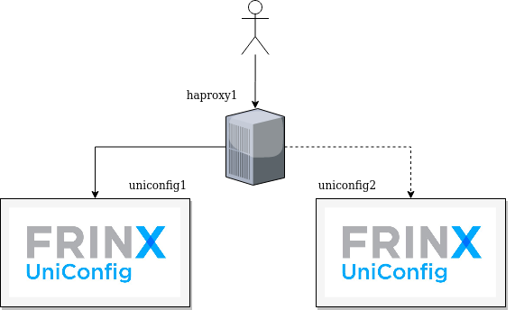
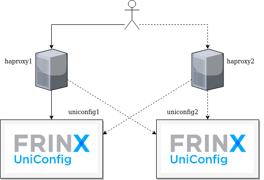
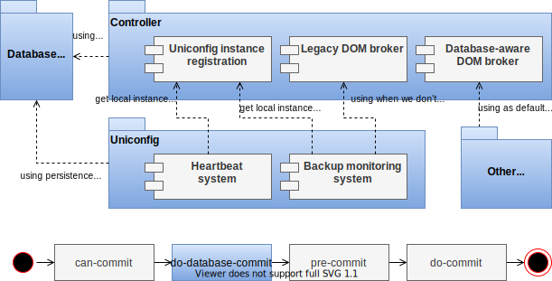
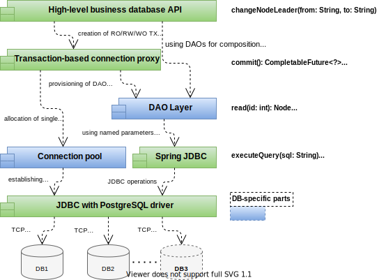
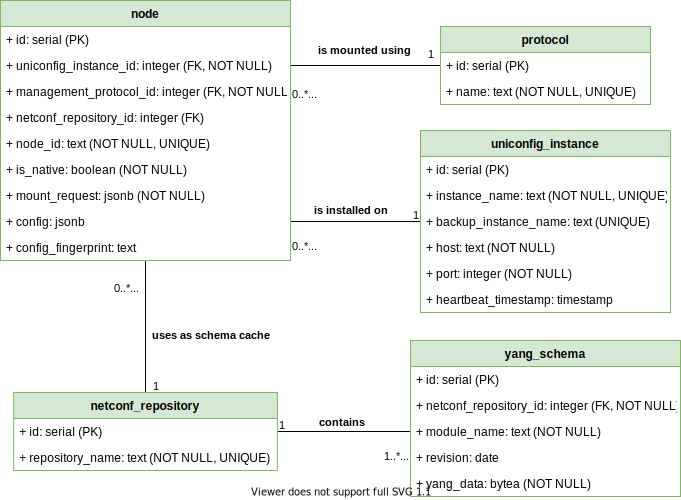
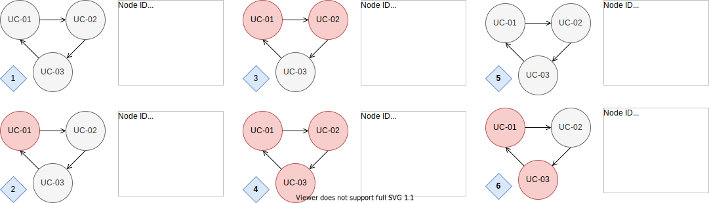

UniConfig High Availability Cluster
===================================

::: {.toctree maxdepth="0" hidden=""}
:::

Clustering with HAProxy and Keepalived
--------------------------------------

In order to make this work, the following three components will be
needed:

-   [Haproxy]{.title-ref}
-   [Keepalived]{.title-ref}
-   [UniConfig]{.title-ref}

::: {.note}
::: {.title}
Note
:::

You should be able to find the first two in the package manager of you
Linux distribution. This setup was tested on Ubuntu 18.04. If you use an
older distribution, you might find that some of the features that are
required are not available in the package managers version of
*Keepalived* and/or *Haproxy*. In that case, you might need to build
these from source. In such cases, make sure that you use the latests
version.
:::

To see how to download, install and run *UniConfig*, follow [these
inscructions](https://docs.frinx.io/frinx-odl-distribution/oxygen/getting-started.html#system-requirements).

There will be two scenarios we\'ll talk about.

-   [1 Haproxy and 2 UniConfig nodes
    scenario](#haproxy-and-2-uniconfig-nodes-scenario)
-   [2 Haproxy with floating IP and 2 UniConfig nodes
    scenario](#haproxy-with-floating-ip-and-2-uniconfig-nodes-scenario)

For both cases, the assumpotion will be that each *Haproxy* instance and
each *UniConfig* node is running in a separate VM, meaning that we\'ll
have 3 VMs in the first and 4 VMs in the second scenario.

### 1 Haproxy and 2 UniConfig nodes scenario

In this first scenario, we\'ll have one *Haproxy* instance connected to
two UniConfig nodes. The *Haproxy* instance will continuously check the
availability of the *UniConfig* nodes and in case one of them isn\'t
responding, it will start sending the reqests to the other *UniConfig*
node.

[](1-haproxy.png)

The configuration in *Haproxy* is going to be the following:

``` {.text}
defaults
 mode http
 option http-server-close
 timeout client 20s
 timeout server 20s
 timeout connect 4s

frontend frontend_app
 bind HAPROXY_IP:HAPROXY_PORT name app
 default_backend backend_app

backend backend_app
 stick-table type ip size 1
 stick on src
 server s1 UNICONFIG_1_IP:8181 check
 server s2 UNICONFIG_2_IP:8181 check backup
```

Populate the fields `HAPROXY_IP`, `HAPROXY_PORT`, `UNICONFIG_1_IP`,
`UNICONFIG_2_IP` with appropriate values in your infrastructre. Save
this to a file called `/etc/haproxy/haproxy.cfg`.

After that, when both of your *UniConfig* nodes are running, start
*Haproxy* with `service haproxy start` or
`systemctl start haproxy.service`, depending on what your service
manager is.

Now, by default all request will be forwarerd to `server s1` which is
the *UniConfig* at the `UNICONFIG_1_IP` address. If you stop it or block
the connection to this node by other means, the *Haproxy* will start
forwarding all requests to `UNICONFIG_2_IP` address and will stick to
sending request to this *UniConfig* node even if *UniConfig* on the
`UNICONFIG_1_IP` comes back to life again.

### 2 Haproxy with floating IP and 2 UniConfig nodes scenario

In this second scenario, we\'ll have an additional *Haproxy* instance.
Both of the *Haproxy* instances are going to be connected to both
*UniConfig* instances. The information about which *UniConfig* node is
in active use is going to be shared among the *Haproxy* instances via
stick tables. There will always be only one active *Haproxy* instance
and in case it fails, the other one will take over. This is going to be
managed by *Keepalived* which uses the **VRRP** protocol for failover
managment.

[](2-haproxy.png)

The steps are going to be similar as in the first scenario, however the
two *Haproxy* instances will have a slightly modified configuration,
plus we\'ll need to configure *Keepalived* on the VMs that run
*Haproxy*. Also, the *Haproxy* will be reachable through a virtual IP
address. In case of a failover, when for example the *Haproxy* instance
1 becomes unavailable, the *Haproxy* instance 2 assigns to itself the
virtual IP address and announces this information via a Gratuitous ARP
reply.

First, the *Haproxy* configuration:

``` {.text}
peers LB
 peer LB1 HAPROXY_1_IP:10001
 peer LB2 HAPROXY_2_IP:10002

defaults
 mode http
 option http-server-close
 timeout client 20s
 timeout server 20s
 timeout connect 4s

frontend frontend_app
 bind HAPROXY_{1|2}_IP:HAPROXY_PORT name app
 default_backend backend_app

backend backend_app
 stick-table type ip size 1 peers LB
 stick on src
 server s1 UNICONFIG_1_IP:8181 check
 server s2 UNICONFIG_2_IP:8181 check backup
```

The `HAPROXY_1_IP` and `HAPROXY_2_IP` addresses should be populated with
the private IP addresses of these two VMs. The `UNICONFIG_1_IP` and the
`UNICONFIG_2_IP` should be populated as in the first scenario, with the
IP addresses of the VMs that run *UniConfig*.

The `HAPROXY_{1|2}_IP` field should be populated with `HAPROXY_1_IP` on
the VM where the first instance of *Haproxy* is running and
`HAPROXY_2_IP` on the VM where the second one is running. The
`HAPROXY_PORT` can be any port of your choosing, where *Haproxy* will be
reachable.

Here, the IP address should be populated with the virtual IP address, on
which the active *Haproxy* instance is going to be reachable. This IP
address will also be present in the *Keepalived* configuration, because
this IP is the one that the BACKUP *Haproxy* instance assigns to itself
in case of a failover. The `HAPROXY_PORT` is the port can be chosen
arbitrarily, it\'s simply a port where *Haproxy* is going to be
reachable.

Let\'s move in to *Keepalived*. There will be two slightly different
configuration files, one used for the MASTER *Haproxy* instance and the
other one for BACKUP.

This is how the MASTER *Haproxy* instance configuration file looks like:

``` {.text}
global_defs {
    script_user root
    enable_script_security
}

vrrp_script check_haproxy {
    script "killall -0 haproxy"
    interval 2
    weight 2
}

vrrp_instance VI_1 {
    interface eth0
    state MASTER
    virtual_router_id 51
    priority 101

    virtual_ipaddress {
        HAPROXY_PUB_IP
    }

    track_script {
        check_haproxy
    }

    notify /run-on-status-change.sh

}
```

The BACKUP *Haproxy* instance configuration file looks like this:

``` {.text}
global_defs {
    script_user root
    enable_script_security
}

vrrp_script check_haproxy {
    script "killall -0 haproxy"
    interval 2
    weight 2
}

vrrp_instance VI_1 {
    interface eth0
    state BACKUP
    virtual_router_id 51
    priority 100

    virtual_ipaddress {
        HAPROXY_PUB_IP
    }

    track_script {
        check_haproxy
    }

    notify /run-on-status-change.sh

}
```

As you can see, the only difference are the `state` and the `priority`
fields values. The [notify]{.title-ref} field is optional, we\'ll see
how it can be used a [little later](#notify-script).

These config files should be save as `/etc/keepalived/keepalived.conf`
on both VMs which will run *Haproxy*.

Then, *Haproxy* needs to be executed with an additional parameter on
both VMs. On the VM with the *Haproxy* instance one, execute
`haproxy -L LB1` and on the other one, execute `haproxy -L LB2`

Now, to run *Keepalived*, execute `/etc/init.d/keepalived start` on both
the MASTER and the BACKUP machine.

### Recap

Now all should be working. The two VMs exchange stick table information
for keeping in sync regarding which *UniConfig* node to send request to.
The MASTER *Keepalive* checks if *Haproxy* is running and informs the
BACKUP instance about the status. So long as the connection between the
*Keepalive* instances is in tact and *Haproxy* is running fine, the
BACKUP instances does nothing. Should there be a problem with either the
connection or the *Haproxy* process itself on the MASTER instance, the
BACKUP instance kicks in, assigns to itself the virtual IP address and
notifies the rest of the network about this fact via a Gratuitous ARP
reply, which will cause all requests to be forwarerd to this BACKUP
instance. Now if the MASTER instances connection and/or *Haproxy*
process comes back to life and the BACKUP nodes starts receiving status
information from the MASTER instance again, it\'s going to unassign the
virtual IP from itself and let the MASTER take over. This works through
the election process between the two instances and is resolved via
**VRRP** through the [priority]{.title-ref} fields value in the config
file. The instance with the higher value in the [priority]{.title-ref}
field takes presedence.

### Notify script

Now for the [notify]{.title-ref} field. *Keepalived* allows you to take
action on a status change and lets you run an arbitrary script. As a
simple example, you could define the script as follows:

``` {.bash}
#!/bin/bash

TIMESTAMP=$(date)
TRANSITION=$3

echo "I'm $TRANSITION : $TIMESTAMP" > /status-change.txt
```

According to the documentation the script defined in
[notify]{.title-ref} is executed with four **additional** arguments:

``` {.text}
# arguments provided by Keepalived:
#   $(n-3) = "GROUP"|"INSTANCE"
#   $(n-2) = name of the group or instance
#   $(n-1) = target state of transition (stop only applies to instances)
#            ("MASTER"|"BACKUP"|"FAULT"|"STOP")
#   $(n)   = priority value
#   $(n-3) and $(n-1) are ALWAYS sent in uppercase, and the possible
```

By this logic, you can save the above script as
`/run-on-status-change.sh` and see how the status changes between the
MASTER and BACKUP node. Any time a status change occurs, you\'ll be able
to see that information in the `status-change.txt` file.

The script `/run-on-status-change.sh` is placed in the root directory in
this example, because *Keepalived* expects the scripts whole path to
only be writable by the root user.

::: {.note}
::: {.title}
Note
:::

If you do not want to use such a script, delete the whole line from the
config files.

To verify that the failover is working correctly without using the
example script, you can take a look at the logs produced by
*Keepalived*.
:::

Clustering with relational database
-----------------------------------

### Introduction

UniConfig clustering is based on introduction of database layer with one
or multiple database systems that represent persistent storage for
loaded devices configuration, information about UniConfig instances, and
used YANG schemas grouped in NETCONF repositories. Above the database
layer there could be one or multiple UniConfig instances with running
UniConfig distribution and available active-standby high availability
profile - selected UniConfig instance can back up another UniConfig
instance in the cluster.

Summarized features of database clustering in UniConfig:

-   **active-standby high-availability profile** - One UniConfig
    instance backs up another UniConfig instance by monitoring of its
    state. If the monitored instance fails, then another UniConfig
    instance take over nodes that have been installed on failed
    instance. However, a new UniConfig instance must proceed with the
    whole installation process at the recovery - from this reason the
    UniConfig currently doesn\'t support active-active deployment.
-   **separation of data from other logic** - Data is not bound tightly
    to UniConfig instance but extracted to distinct layer. This approach
    brings multiple advantages - easier debugging, possibility to use
    UniConfig data also by external application, or deployment of custom
    clustering models for database systems. On the other side, database
    clustering increases the delay between data accessors and data
    itself (it can vary depending on network configuration and selected
    deployment model).
-   **visibility of the persistent data** - UniConfig configuration is
    stored safely in database system in the readable JSON format that
    can be traversed by external application (in case of datastore
    persitence, data is represented by serialized Java objects).
-   **UniConfig-specific solution** - Database design and configuration
    are tuned for UniConfig services without bloated datastore and akka
    services.

### Architecture

#### Physical architecture

The following diagram shows the physical architecture as a layered
system with 4 layers - database systems, UniConfig instances with
datastores, optional proxy layer, and applications.


Description of the layers:

-   **Database systems** - Database system is used for persistence of
    UniConfig configuration, persistence of NETCONF schemas, and as a
    communication medium between UniConfig instances (information about
    UniConfig instances is stored here). Currently, database layer
    represents the only way, how UniConfig instances can communicate
    with each other. There could be multiple database systems deployed
    in the cluster - high availability principle can freely be applied
    for databases. Then, UniConfig instance on higher layer connects to
    one or multiple database systems and use multiple databases with
    failover mechanism - if the communication with the first database
    fails, UniConfig will try to use the next connection (JDBC failover
    mechanism). If the target database system provides orchestrator
    component, then the failover mechanism doesn\'t have to be applied -
    instead, UniConfig would keep just the single connection do database
    orchestrator. Currently 2 database systems are supported: PostgreSQL
    and CockroachDB.
-   **UniConfig instances with datastores** - UniConfig instance
    represents running UniConfig distribution with enabled database
    clustering feature. In the database deployment datastores are used
    just in runtime - they are not persisted to disk using
    journal/snapshots mechanism. The communication with one or more
    database systems is handled using JDBC and corresponding database
    drivers. In this layer, there could be one (single-node deployment)
    or more instances. The instances don\'t communicate with each other
    directly, only through the database.
-   **HA proxy / Load balancer** - Optional component that is
    responsible for routing of HTTP requests to correct UniConfig
    instance. It can, for example, hide logic around provisioning of
    mounted nodes to different UniConfig instances and detect what
    UniConfig instance is still alive. The detail operation of this
    component is out-of-scope of this documentation. If this proxy layer
    is not deployed, then the end application in higher layer must be
    responsible for managing of communication with multiple UniConfig
    instances.
-   **Control / automation application** - Application that uses
    UniConfig backend services - for example FRINX machine.

#### Software architecture

Multiple software components on UniConfig and controller layers have
been introduced for achieving database clustering. The following diagram
shows these components and basic relations between them.



Description of the software components:

-   **Database access layer** - It consists of connection pool, database
    access objects, database transaction manager, and business services.
    Connection pool is responsible for providing of JDBC connections to
    database access objects while limiting number of connections that
    can be active at one time. The approach one thread - one connection
    is applied. After borrowed connection is releases from thread, it is
    returned back to connection pool, so it can be reused (connection
    pool also checks aliveness of released connections after they are
    released). Database access objects implements basic CRUD operations
    for all necessary relations. Transaction manager hides
    initialization and closing logic around database connections into
    read-only, read-write, and write-only transactions. At last,
    business services implement more complex database operations by
    composition of operations provided by database access objects. The
    next diagram breaks down this layer in detail.
-   **Uniconfig instance registration** - This component is responsible
    for registration of UniConfig instance using local instance name and
    backup instance name into database system at initialization of
    UniConfig. Afterwards, it also provides cached information about
    local instance to other components.
-   **Database-aware DOM broker** - Extended DOM data broker that adds
    database hooks to datastore paths that also must be persisted in the
    database system. This way, write-only or read-write transaction
    stays atomic from the view of datastore and database - either
    changes are applied in both datastore and database or they are not
    applied at all and datastore stays consistent with database. Phase
    \'do-database-commit\' is injected between \'can-commit\' and
    \'pre-commit\' datastore phases - this way, modifications are
    written into database only after data is validated against datastore
    constraints (the bottom part of the last diagram). This is the
    default DOM data broker that replaces implementation of original DOM
    data broker.
-   **Heartbeat system** - Heartbeat system keeps local UniConfig
    instance alive in the cluster by updating \'heartbeat\_timestamp\'
    field to the actual time. Afterwards, other instances in the cluster
    can verify the aliveness of the UniConfig instance using the value
    of this field. This component is started as the last one with backup
    monitoring system.
-   **Backup monitoring system** - This component is responsible for
    monitoring of another UniConfig instance for aliveness in the
    periodic manner. Currently, only \'heartbeat\_timestamp\' is checked
    against maximum allowed age of the UniConfig instance. If UniConfig
    instance is marked as failed, the recovery process starts - mounting
    of UniConfig nodes into local instance. One instance can actively
    monitor only one another UniConfig instance (however, it is possible
    to recover chain of UniConfig instances that failed at the same
    time).
-   **Legacy DOM broker** - Unmodified datastore broker without any
    database hooks. Especially, backup monitoring system uses this
    component, so the modifications done into datastore during recovery
    process are not needlessly applied back to database.

The next diagram shows components which the database access layer is
built from. Currently, UniConfig is compatible with two database systems
- PostgreSQL and CockroachDB. Extending support for next database
systems doesn\'t require much effort because of the clearly separated
database access objects from business logic.



### Configuration

#### Default configuration

By default, database clustering is disabled in UniConfig distribution.
To enable it, \'enabled\' flag under \'dbPersitence\' configuration must
be set to \'true\' and other configuration subsections must be adjusted
for specific environment. Whole database-related configuration is placed
under \'dbPersistence\' JSON object under root JSON object of global
configuration file \'lighty-uniconfig-config.json\' (it is placed in the
directory \'config\').

The following JSON shows the default configuration in the UniConfig
distribution:

``` {.json}
{
    "dbPersistence": {
        "enabled": false,
        "monitoring": {
            "heartbeatInterval": 1000,
            "initialMonitoringDelay": 5000,
            "backupMonitoringInterval": 10000,
            "maxInstanceAge": 5000
        },
        "uniconfigInstance": {
            "instanceName": "uc-0",
            "backupInstanceName": null
        },
        "connection": {
            "dbName": "uniconfig",
            "username": "uniremote",
            "password": "unipass",
            "initialDbPoolSize": 5,
            "maxDbPoolSize": 10,
            "maxIdleConnections": 5,
            "maxWaitTime": 30000,
            "enabledTls": false,
            "tlsClientCert": "./client.pks",
            "tlsClientKey": "./client.key",
            "tlsCaCert": "./ca.pks",
            "databaseLocations": [
                {
                    "host": "127.0.0.1",
                    "port": 26257
                }
            ]
        }
    }
}
```

#### Description of the settings

-   **enabled** - If it is set to \'true\', database clustering is
    enabled. Otherwise, all other \'dbPersistence\' settings are
    ignored.

-   **monitoring** - Settings related to UniConfig monitoring module
    that is responsible for keeping local instance alive and monitoring
    other instance.

    > -   **heartbeatInterval** - Interval in milliseconds between
    >     updating \'heartbeat\_timestamp\' value of local UniConfig
    >     instance. This duration doesn\'t include updating process -
    >     the next \'heartbeatInterval\' starts to count down only after
    >     the \'heartbeat\_timestamp\' is updated.
    > -   **initialMonitoringDelay** - Initial delay before monitoring
    >     system is launched (after UniConfig was started). It is useful
    >     in scenarios in which multiple UniConfig instances are started
    >     at once - immediate spinning of monitoring system can cause
    >     starting of recovery process because other instance is marked
    >     as down since it has not been booted yet and
    >     \'heartbeat\_timestamp\' contains an old value. Value is
    >     expressed in milliseconds and it doesn\'t apply for heartbeat
    >     system (it is started immediately after other UniConfig
    >     components become active).
    > -   **backupMonitoringInterval** - Interval in milliseconds
    >     between verifications of UniConfig instance that is backed by
    >     local instance. Interval duration doesn\'t include
    >     verification process and potentially executed recovery
    >     process.
    > -   **maxInstanceAge** - Maximum age of the UniConfig instance
    >     before local instance assumes that the other instance is down
    >     and start recovery process. Value is expressed in
    >     milliseconds.

-   **uniconfigInstance** - Information about local UniConfig instance -
    how is the UniConfig instance registered in the database system.

    > -   **instanceName** - Name of the local UniConfig instance. It
    >     must be unique in the cluster.
    > -   **backupInstanceName** - Name of the backup UniConfig instance
    >     which should be responsible for recovering of nodes attached
    >     to local instance. Backup instance name must also be unique in
    >     the cluster - every UniConfig instance can be responsible only
    >     for recovering of single instance.

-   **connection** - Settings related to database connection.

    > -   **dbName** - Name of the database that contains all relations.
    >
    > -   **username** - Name of the user who is authorized to do
    >     read-write operations in the selected database. Username is
    >     used within both TLS and basic authentication schemes.
    >
    > -   **password** - User password. Password is used only within
    >     basic authentication scheme.
    >
    > -   **initialDbPoolSize** - Initial size of the database
    >     connection pool. These connections are pre-initialized at
    >     startup of the UniConfig, so they can be immediately used. The
    >     total number of active + free connections can never be less
    >     then this value.
    >
    > -   **maxDbPoolSize** - Maximum size of the database connection
    >     pool. If next connection is requested from the pool, the
    >     request is blocked until some connection is released.
    >
    > -   **maxIdleConnections** - Maximum number of idle connections
    >     that has been previously allocated but then they were released
    >     by carrying threads. If this number is reached, next idle
    >     connections are also released from the connection pool, so
    >     they must be recreated from scratch when they will be
    >     necessary again.
    >
    > -   **maxWaitTime** - Maximum wait time for the allocation of
    >     connection from the database connection pool. If the
    >     connection is failed to be allocated for requested thread in
    >     this time, the failed asynchronous completion token is
    >     returned. The failure can happen because of multiple reasons -
    >     connection pool is exhausted for long time or there is I/O
    >     issue.
    >
    > -   **enabledTls** - Flag using which it is possible to enable TLS
    >     authentication scheme. When it is set to \'true\',
    >     \'password\' field is ignored; however \'tlsClientCert\',
    >     \'tlsClientKey\', and \'tlsCaCert\' fields are required
    >     (\'username\' is still required for TLS authentication
    >     scheme).
    >
    > -   **tlsClientCert** - Path to the certificate assigned to user
    >     who is connecting to database. It must have \'PKS\' format.
    >     Database system uses this certificate for verification of the
    >     user (UniConfig represents the user).
    >
    > -   **tlsClientKey** - Client certificate key.
    >
    > -   **tlsCaCert** - Path to the certificate of certification
    >     authority that singed database system certificate (it could be
    >     self-signed certificate - in that case certification authority
    >     and the database system are the same entities). UniConfig uses
    >     this certificate for verification of database system.
    >
    > -   **databaseLocations** - List of target database systems. All
    >     database systems must have the same configuration - database
    >     name, authentication / authorization system, and database
    >     model (data model should be shared too as part of the deployed
    >     failover system). If the connection cannot be established with
    >     the first database location, the next one in the list is
    >     tried.
    >
    >     > -   **host** - Hostname or IP address of the target database
    >     >     system.
    >     > -   **port** - TCP port on which the database system listens
    >     >     to incoming connections.

#### Deployment example

Example of the 3-nodes deployment from the view of configuration files -
monitoring and database settings are kept with default values.

Instance \"uc-1\":

``` {.json}
{
    "dbPersistence": {
        "enabled": true,
        "uniconfigInstance": {
            "instanceName": "uc-1",
            "backupInstanceName": "uc-2"
        }
    }
}
```

Instance \"uc-2\":

``` {.json}
{
    "dbPersistence": {
        "enabled": true,
        "uniconfigInstance": {
            "instanceName": "uc-2",
            "backupInstanceName": "uc-3"
        }
    }
}
```

Instance \"uc-3\":

``` {.json}
{
    "dbPersistence": {
        "enabled": true,
        "uniconfigInstance": {
            "instanceName": "uc-3",
            "backupInstanceName": "uc-1"
        }
    }
}
```

### Physical data model

#### UML class diagram

The following UML class diagram shows physical database model which is
required to be deployed on target database system.



::: {.note}
::: {.title}
Note
:::

All unique fields are also indexed - unique constraint automatically
creates index for the same field in the PostgreSQL and CockroachDB
database systems.
:::

#### Description of entities and fields

-   **node**: Node in database represents mounted node in UniConfig.
    Description of fields:

    > -   **node\_id**: Unique node identifier that is used for mounting
    >     of this device.
    > -   **mount\_request**: JSON representation of original mount
    >     request used for mounting of this device. After device is
    >     mounted in the UniConfig distribution, a new node entry with
    >     filled-in mount request is created. From this reason, this
    >     field is always non-null.
    > -   **config**: Serialized UniConfig configuration in the JSON
    >     format. This configuration reflects Uniconfig configuration
    >     container in the Operational datastore. Any change to this
    >     container in the Operational datastore (for example, after
    >     commit or sync-from-network operations) is automatically saved
    >     to database.
    > -   **is\_native**: Boolean flag that identifies whether this node
    >     is mounted as translation-based node or uniconfig-native node.
    >     Information about nativeness of node is extracted from
    >     \'mount\_request\'.
    > -   **config\_fingerprint**: Configuration fingerprint (usually,
    >     the configuration timestamp or transaction identifier on a
    >     target device) that corresponds to loaded fingerprint under
    >     UniConfig node in the Operation datastore. The metadata
    >     OpenConfig translation unit is responsible for reading and
    >     parsing of this information. Updated \'config\_fingerprint\'
    >     (after sync-from-network operation) is automatically reflected
    >     in value change of this field in the database.
    > -   **management\_protocol\_id**: This field is used as the
    >     foreign key to \'protocol\' relation. Every node can be
    >     mounted using \'cli\' or \'netconf\' management protocol.
    > -   **netconf\_repository\_id**: This field is used as the foreign
    >     key to \'netconf\_repository\' relation. If node is not
    >     mounted using NETCONF protocol, the value of this field is
    >     null. Otherwise, this fields points to used NETCONF cache
    >     repository - directory with all YANG schemas for specific
    >     device type.
    > -   **uniconfig\_instance\_id**: This field is used as the foreign
    >     key to \'uniconfig\_instance\' relation. It represents
    >     UniConfig instance on which the node has been mounted. If the
    >     node is mounted on multiple UniConfig instances in the
    >     cluster, the first UniConfig instance is preserved.

-   **uniconfig\_instance**: Instance of this entity represents one
    running UniConfig distribution in the network. After UniConfig
    instance is started, it is registered to the database. Description
    of fields:

    > -   **instance\_name**: Name of the UniConfig instance that is
    >     obtained from the configuration file. It must be unique in the
    >     cluster.
    > -   **backup\_instance\_name**: Name of the UniConfig instance
    >     that backs up local UniConfig instance. In case of failure,
    >     backup UniConfig instance takes over nodes that are assigned
    >     to local UniConfig instance. Value of this field is also
    >     obtained from the configuration file. If the UniConfig
    >     instance doesn\'t have any backup, null value can be assigned
    >     to this field (for example, in the single instance
    >     deployment). Backup instance name must be unique in the
    >     relation too.
    > -   **host**: Host on which the UniConfig instance web server
    >     listens to (IP address or hostname). This setting is extracted
    >     from RESTCONF configuration.
    > -   **port**: TCP port number on which the UniConfig instance web
    >     server listens to. This setting is extracted from RESTCONF
    >     configuration.
    > -   **heartbeat\_timestamp**: This timestamp identifies the last
    >     heartbeat probe of the UniConfig instance. Local instance is
    >     responsible for updating of this field periodically. At the
    >     initialization of the UniConfig instance the value of this
    >     field is set to null, so the booting process (which can last
    >     longer then configured maximum age) doesn\'t trigger recovery
    >     process on other instance.

-   **yang\_schema**: Single YANG schema descriptor. YANG schema cannot
    exist without assigned \'netconf\_repository\' - if the
    \'netconf\_repository\' is removed, also all assigned YANG schemas
    are removed from data model. Description of fields:

    > -   **module\_name**: Name of the YANG module, possibly
    >     sub-module. It must be specified.
    > -   **revision**: Optional revision of the YANG module (date
    >     formatting).
    > -   **yang\_data**: Unmodified contents of the YANG file. It is
    >     represented by a byte array.
    > -   **netconf\_repository\_id**: This fields is used as the
    >     foreign key to \'netconf\_repository\' relation. It represents
    >     assigned NETCONF repository which this YANG schema belongs to.
    >     One YANG schema can belong only to single NETCONF repository
    >     even if there could be 2 YANG schemas with the same revision
    >     and module name (there could be some vendor-specific
    >     modifications in the YANG files that make them different by
    >     content).

-   **netconf\_repository**: NETCONF repository represents NETCONF cache
    directory with downloaded / manually provided device YANG schema
    files. NETCONF repository is created during mounting of device on
    NETCONF layer.

    > -   **repository-name**: Unique name of the NETCONF repository
    >     that also corresponds to name of the cache directory.

-   **protocol**: Network management protocol used for mounting of
    device. It contains only constants.

    > -   **name**: Identifier of the network management protocol.
    >     Currently there are only 2 options: \'cli\' or \'netconf\'.

#### SQL script

Described data model can be loaded into PostgreSQL or CockroachDB
database using following SQL script:

``` {.sql}
/* Create tables */

CREATE TABLE protocol
(
    id   serial NOT NULL PRIMARY KEY,
    name text   NOT NULL
);

CREATE TABLE uniconfig_instance
(
    id                   serial    NOT NULL PRIMARY KEY,
    instance_name        text      NOT NULL,
    backup_instance_name text      NULL,
    host                 text      NOT NULL,
    port                 integer   NOT NULL,
    heartbeat_timestamp  timestamp NULL
);

CREATE TABLE node
(
    id                     serial  NOT NULL PRIMARY KEY,
    uniconfig_instance_id  integer NOT NULL,
    management_protocol_id integer NOT NULL,
    netconf_repository_id  integer NULL,
    node_id                text    NOT NULL,
    is_native              boolean NOT NULL,
    mount_request          jsonb   NOT NULL,
    config                 jsonb   NULL,
    config_fingerprint     text    NULL
);

CREATE TABLE netconf_repository
(
    id              serial NOT NULL PRIMARY KEY,
    repository_name text   NOT NULL
);

CREATE TABLE yang_schema
(
    id                    serial  NOT NULL PRIMARY KEY,
    netconf_repository_id integer NOT NULL,
    module_name           text    NOT NULL,
    revision              date    NULL,
    yang_data             bytea   NOT NULL
);

/* Create foreign key, check, and unique constraints (indexes are automatically created with unique constraints) */

ALTER TABLE protocol
    ADD CONSTRAINT "UNIQUE_name"
        UNIQUE (name);

ALTER TABLE uniconfig_instance
    ADD CONSTRAINT "UNIQUE_instance_name"
        UNIQUE (instance_name);

ALTER TABLE uniconfig_instance
    ADD CONSTRAINT "UNIQUE_backup_instance_name"
        UNIQUE (backup_instance_name);

ALTER TABLE uniconfig_instance
    ADD CONSTRAINT "CHECK_port"
        CHECK (port > 0 AND port < 65536);

ALTER TABLE node
    ADD CONSTRAINT "UNIQUE_node_id"
        UNIQUE (node_id);

ALTER TABLE node
    ADD CONSTRAINT "FK_node_uniconfig_instance"
        FOREIGN KEY (uniconfig_instance_id)
            REFERENCES uniconfig_instance (id) ON DELETE NO ACTION ON UPDATE NO ACTION;

ALTER TABLE node
    ADD CONSTRAINT "FK_node_protocol"
        FOREIGN KEY (management_protocol_id)
            REFERENCES protocol (id) ON DELETE NO ACTION ON UPDATE NO ACTION;

ALTER TABLE node
    ADD CONSTRAINT "FK_node_netconf_repository"
        FOREIGN KEY (netconf_repository_id)
            REFERENCES netconf_repository (id) ON DELETE NO ACTION ON UPDATE NO ACTION;

ALTER TABLE yang_schema
    ADD CONSTRAINT "FK_yang_schema_netconf_repository"
        FOREIGN KEY (netconf_repository_id)
            REFERENCES netconf_repository (id) ON DELETE NO ACTION ON UPDATE NO ACTION;

ALTER TABLE netconf_repository
    ADD CONSTRAINT "UNIQUE_repository_name"
        UNIQUE (repository_name);

/* Inserting of constant values */

INSERT INTO protocol (id, name)
VALUES (1, 'cli'),
       (2, 'netconf');
SELECT SETVAL('protocol_id_seq', (SELECT MAX(id) from "protocol"));
```

In the PostgreSQL deployment it is possible to directly install this
script to database, so it will be automatically deployed only during the
first start of the database. The following example shows dockerfile that
is derived from \'postgres:alpine\' docker image and that copies initial
SQL script into \'docker-entrypoint-initdb.d\' directory (all SQL
scripts in this directory are deployed at first boot of the PostgreSQL
database system).

``` {.unknown}
FROM postgres:alpine
COPY init_schema.sql /docker-entrypoint-initdb.d/001_data.sql
```

### Deployment strategies

Deployment strategies are constrained by design of the
\'uniconfig\_instance\' entity - both \'instance\_name\' and
\'backup\_instance\_name\' fields are marked as unique. Because of this
design, it is possible construct only chain topologies in which these
chains are connected to loop or ends of the chain have only single-side
connection.

Connection patterns from the view of local UniConfig instance:

1.  UniConfig instance is not connected to any other instance - Single
    node deployment without backup.
2.  UniConfig instance is connected to single UniConfig instance - In
    this deployment, local instance is backed by another instance but
    local instance doesn\'t back any instance (it doesn\'t monitor
    another instance).
3.  UniConfig instance has two connections - Local instance is backed by
    another instance that monitors local instance and local UniConfig
    instance also monitors another instance (the most common deployment
    strategy).

The following image shows sample valid topologies. Tables contain
database information - \'instance\_name\' and \'backup\_instance\_name\'
from the \'uniconfig\_instance\' relation. Circles refer to named
UniConfig instances and arrowed association lines between circles
describe direction of the backup process (target UniConfig instance
represents a backup for source UniConfig instance).


### Recovery process

UniConfig instance can monitor up to one other UniConfig instance using
stored \'heartbeat\_timestamp\' (in the \'uniconfig\_instance\' entity).
If the \'heartbeat\_timestamp\' of monitored UniConfig instance is older
than configured maximum age, then local UniConfig instance assumes that
neighbor instance is dead and it starts recovery procedure:

1.  Looking for nodes that are assigned to failed UniConfig instance
    (through relation between \'uniconfig\_instance\' and \'node\'
    entities).
2.  Loading of necessary NETCONF repositories that haven\'t been loaded
    locally yet - copying YANG schemas to local directories and creation
    of NETCONF repositories from these cache directories (identification
    of required NETCONF repositories can be done using relation between
    \'node\' and \'netconf\_repository\' entities).
3.  Loading UniConfig configuration container from database into
    Configuration datastore for each node of failed UniConfig instance.
4.  Loading mount requests of collected nodes into corresponding network
    topologies (Configuration datastore).
5.  Changing leader of recovered nodes to local UniConfig instance by
    updating field \'uniconfig\_instance\_id\' in the \'node\' entity.
6.  Verification if the instance that is backed by failed instance is
    alive (if there is such instance) - if it also failed, continue
    process recursively by returning to step \[1\].
7.  Marking failed instance as processed, so the recovery process won\'t
    be launched again at the next monitoring interval.

::: {.note}
::: {.title}
Note
:::

UniConfig instance that was previously marked as down can wake up
(heartbeat timestamp is updated). In that case local instance that
recovered nodes attached to failed instance registers this change and is
prepared to start recovery procedure again. However, transferred nodes
are not returned back to woken instance.
:::

The next diagram with 3-nodes cluster shows scenario in which recovery
process is execute on different nodes in time.



Description of executed operations in 6 steps which correspond to
numbers in the image:

1.  All 3 UniConfig instances works with running monitoring threads.
2.  \'UC 01\' fails - \'UC 02\' automatically installs \'node1\' that
    was assigned to \'UC 01\' instance.
3.  \'UC 02\' fails (\'UC 01\' is dead too) - \'UC 03\' automatically
    installs all 3 nodes.
4.  All 3 UniConfig instances are crashed - Assigned UniConfig instance
    doesn\'t change on any node. However, data is kept in safe in
    database system.
5.  All 3 UniConfig instances are brought up - Assigned UniConfig
    instance doesn\'t change again - the last state is preserved.
6.  \'UC 01\' and \'UC 03\' fails at the same time - \'UC 02\'
    automatically installs nodes that were assigned to \'UC 01\' and
    \'UC 02\'.
