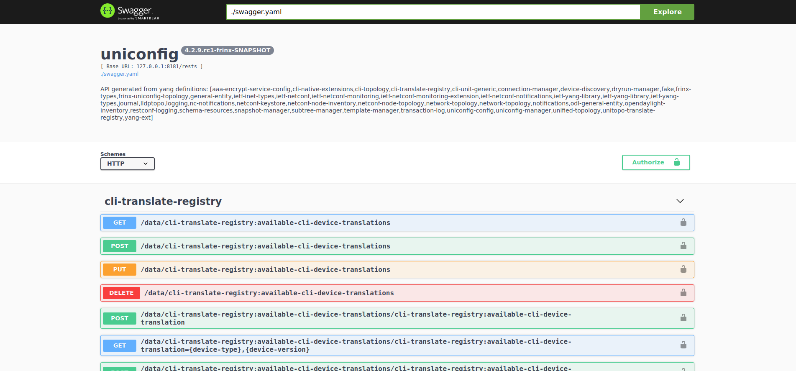

# OpenAPI

The OpenAPI file located in the **openapi** folder contains all the RPCs
and their respective examples. A shell script (named
**start\_uniconfig\_swagger.sh**) was created that automatically checks
if the file is present and runs it in a docker container where the
Swagger API runs, and opens the file containing all the RPC. After
running the shell script, open any browser and type **localhost** in the
URL bar.

!!!success
Overview of our OpenAPI along with all parameters and expected returns
[can be found here](https://app.swaggerhub.com/apis-docs/Frinx/uniconfig/latest#)
!!!

The website should look like on the screenshot below:

Alternatively, you can look at our live instance of the site that always
displays latest version of the API.

!!!success
Overview of our OpenAPI along with all parameters and expected returns
[can be found here](https://app.swaggerhub.com/apis-docs/Frinx/uniconfig/latest#)
!!!
