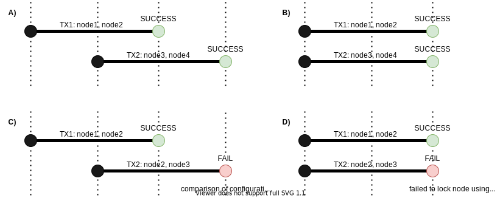
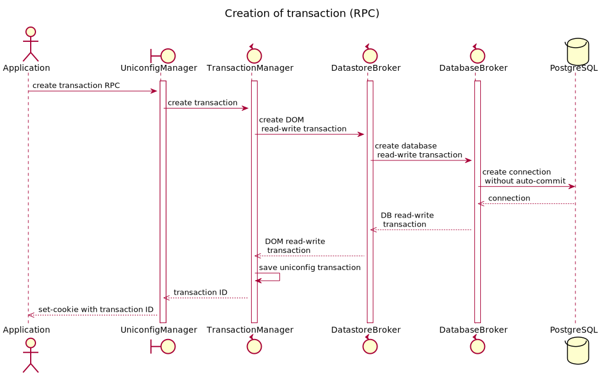
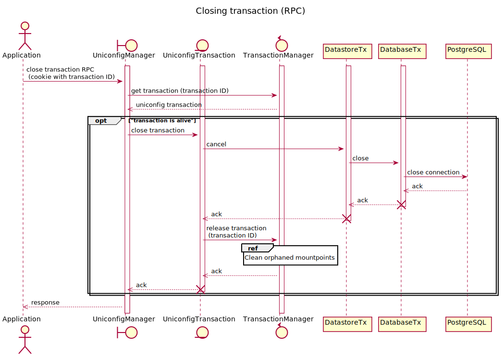

# Build-and-Commit Model

## Introduction

Build-and-commit model is based on explicit creation of the transaction,
invoking operations in the scope of this transaction and finally
committing or closing transaction. The transaction represents a session
between the client and the UniConfig instance.

Using explicitly created transactions has multiple advantages in
comparison to Immediate Commit Model:

- Multiple operations and modifications can be invoked in the single
    transaction while keeping transactions isolated.
- Most of the UniConfig operations, such as calculate-diff and commit,
    doesn't have any usage in the Immediate Commit Model - they are
    valuable only if the Build-and-Commit Model is used.
- The transaction allows a client to identify if it still communicates
    with the same UniConfig instance (this property is usable in the
    clustered deployment). If the UniConfig instance does not know about
    the transaction then the request will fail because transaction
    expired, is closed, or has never been created.

## Configuration

Configurations related to UniConfig transactions is placed in the
'config/lighty-uniconfig-config.json' file under 'transactions'
container. Note that build-and-commit model is enabled if
'uniconfigTransactionEnabled' is set to 'true' value (default value).

```
// Grouped settings that are related to Uniconfig transactions.
"transactions": {
    /*
    Flag that determines whether build-and-commit or only immediate commit model
    is supported:
    [TRUE]: both build-and-commit using dedicated UniConfig transactions and immediate
            commit models are supported
    [FALSE]: only immediate commit model without explicit transactions is supported
    */
    "uniconfigTransactionEnabled": true,
    /*
    Maximum transaction age before it can be evicted from transaction registry [seconds].
    Configuring '0' disables cleaning of Uniconfig transactions.
    */
    "maxTransactionAge": 600,
    /*
    Interval at which expired transactions are closed and cleaned [seconds].
    Expired transaction: transaction which age exceeds 'maxTransactionAge' setting.
    Configuring '0' disables cleaning of Uniconfig transactions.
    */
    "cleaningInterval": 60
}
```

## Optimistic locking mechanism

Race condition between transactions that are committed in parallel and
contain changes of same nodes (uniconfig, unistore, snapshot, or
template nodes) is solved using optimistic locking mechanism.
Configuration of same node can be modified in parallel from 2
transactions, however only the first committed transaction will succeed.
Commit of the second transaction will fail.

UniConfig uses 2 different techniques for detection of conflicts during
commit or checked-commit operation:

1. Comparison of configuration fingerprints - Fingerprint value is
updated for altered node at the end of the commit operation - at the
beginning of commit operation, UniConfig compares the value of
actual fingerprint in database with value of fingerprint read before
the first CRUD operation done in the transaction and the last synced
fingerprint (updated after execution of sync-from-network RPC). If
actual fingerprint from database equals to fingerprint read before
the first CRUD operation or the last synced fingerprint, then commit
operation can continue. Otherwise, error is returned without
touching any devices on network.

2. Per-node advisory locks - Comparison of configuration fingerprints 
are reliable if transactions are committed one after another.
However, such serialization cannot be achieved in the clustered
environment because UniConfig instances are not coordinated. If 2
transactions are committed at the same time and both assume that
configuration fingerprints haven't been updated by other
transaction, both transactions may start to push changes to network
devices at the same time. To prevent prevent occurrences of this
scenario, UniConfig locks node in the PostgresSQL database using
transaction-level advisory locks at the beginning of commit
operation. If other transaction tries to lock the same node, this
attempt will fail, and second transaction will not enter critical
section - rather it will fail. Locks are automatically released at
the end of the transaction (commit RPC closes transaction).

All possible scenarios are captured in the following diagrams.



Dynamic mountpoints
-------------------

Mountpoints are created only when UniConfig needs to read / write some
data from / to device and lifecycle of mountpoint is bounded by
lifecycles of transactions that use the mountpoint. If some mountpoint
is not used by any transaction, then UniConfig automatically closes this
mountpoint - associated operational data on southbound layer and
connection to device are removed.

The first diagram demonstrates mounting of 2 devices which are used by 1
transaction - after this transaction is closed, both mountpoints are
closed. The second diagram shows scenario in which 2 transactions share
1 of 2 mountpoints - after the first transaction is closed, 1 of the
mountpoints is not closed since the second transaction still may
communicate with corresponding device.


Creation of transaction
-----------------------

Transaction can be created using create-transaction RPC. RPC doesn't
specify input body and also returns response without body. Response
additionally contains Set-Cookie header with UNICONFIGTXID key and
corresponding value - transaction identifier that conforms RFC-4122
Universally Unique IDentifier (UUID) format.

Process of transaction creation is depicted by following sequence
diagram.



UniConfig is performing following steps after calling create-transaction
RPC:

1.  Creation of connection to database system - Connection is created
    with disabled auto-commit - enabling transactional features.
    UniConfig uses 'read committed' isolation level.
2.  Creation of database transaction - It provides access to remote
    PostgreSQL database. Using database transaction it is possible to
    read committed data, read uncommitted changes created by this
    transaction and write modifications to database. Data read at the
    first access to some resource is cached to datastore transaction -
    when some component tries to access the same resource again, it is
    read only from datastore transaction. Data is written to database
    transaction at invocation of commit/checked-commit RPC.
3.  Creation of datastore read-write transaction - It provides access to
    OPER and CONFIG datastores bound to this transaction. Datastore is
    used only as a cache between application and PostgreSQL database,
    and it resides only in the memory allocated to UniConfig process.
    Datastore transaction is never committed - cache is trashed at the
    end of the transaction life.
4.  Registration of transaction - Transaction is always bound to 1
    specific UniConfig instance.

### Successful example

The following request shows successful creation of UniConfig
transaction. Response contains Set-Cookie header with UNICONFIGTXID key
and value.

```RPC Request
Method
POST

URL
http://127.0.0.1:8181/rests/operations/uniconfig-manager:create-transaction
```
```RPC Response
Status code
201

Headers
1Set-Cookie: UNICONFIGTXID=2ab7cfc3-dedc-4444-8431-6e9cf94fad3b;Version=1;Comment="uniconfig transaction created";Path=/rests/
```

### Failed example

The most common reason for failed creation of UniConfig transaction is
reached maximum number of open transactions that is limited by
'maxDbPoolSize' database connection pool setting. In that case,
UniConfig returns response with 500 status code.

> **RPC request**
>
> **RPC request:**

> **RPC response**
>
> **RPC response:**

Invocation of CRUD operation in transaction
------------------------------------------

CRUD operations for modification or reading node configuration can be
invoked in the specific transaction by appending UNICONFIGTXID (key)
with UUID of transaction (value) to Cookie headers. In that case,
operation will be invoked only in the scope of single transaction -
changes are not visible to other transactions until this transaction is
successfully committed.

Next diagram describes execution of CRUD operation from RESTCONF API. It
shows also difference between datastore and database transaction - data
is read from database only at the first access to some data (for
example, node configuration). After that, this configuration is cached
inside temporary datastore transaction - goal is to improve performance
by limiting transferring data between UniConfig and PostgreSQL. Next
access to same configuration can be evaluated under in-memory datastore.


### Successful example

The following request demonstrates reading of some configuration from
uniconfig topology, junos node in the transaction with ID
'd7ff736e-8efa-4cc5-9d27-b7f560a76ff3'.

> **GET request**
>
> **GET request:**

> **GET response**
>
> **GET response:**

### Failed example

Trying to use non-existing UniConfig transaction results in 403 status
code (Forbidden access).

> **GET request**
>
> **GET request:**

> **GET response**
>
> **GET response:**

Invocation of RPC operation in transaction
------------------------------------------

RPC operation can be invoked in the specific transaction the same way as
CRUD operation - by specification of UNICONFIGTXID in the Cookie header.

There are few differences between CRUD and RPC operations from the view
of transactions:

-   Commit, checked-commit, and close-transaction RPCs can state of the
    transaction. Create-transaction RPC is reserved for creation of
    transaction.
-   Not all RPC operations that are exposed by UniConfig use dedicated
    transactions - in that case, these RPCs just ignore explicitly
    specified transaction and either don't work with transactions at all
    or create transaction internally (examples: install-node,
    uninstall-node RPC).
-   There are also transaction-aware operations that directly leverage
    properties of transactions. For example, if some UniConfig RPC is
    invoked with empty list of target nodes, then operation is
    automatically applied to all modified nodes in the transaction
    (calculate-diff RPC with empty target nodes computes diff for all
    modified nodes in the transaction).

Following diagram shows execution of random RPC in the specified
transaction.


### Successful example

Invocation of calculate-diff RPC in the transaction which contains
modifications done on the 'junos' node.

> **RPC invocation**
>
> **POST request:**

> **RPC response**
>
> **POST response:**

### Failed example

Invocation of calculate-diff RPC with transaction ID that has wrong
format.

> **RPC invocation**
>
> **POST request:**

> **RPC response**
>
> **POST response:**

Closing transaction
-------------------

There are 2 options how transaction can be closed:

1.  close-transaction RPC - Explicit closing of transaction that results
    in dropping of all changes done in the transaction.
2.  commit/checked-commit RPC - After execution of commit operation,
    transaction is automatically closed (despite of commit result).
    Behaviour of commit and checked commit RPC is described in better
    detail under the 'UniConfig Node Manager' section.

Close-transaction RPC doesn't contain body, only Cookie header with
UNICONFIGTXID property pointing to transaction that user would like to
close. Response contains information if transaction has been
successfully closed.

Following sequence diagrams describe close-transaction procedure. It is
split into 2 diagrams to improve readability and to reuse some parts
from other diagrams.



| .. image:: clean-orphaned-mountpoints-Clean\_orphaned\_mountpoints.svg
:alt: cleaning orphaned mountpoints :scale: 100

Briefly depicted most important actions:

1.  Loading UniConfig transaction from registry by provided transaction
    ID that is extracted from Cookie header.
2.  Closing connection to database.
3.  Cancellation of database transaction.
4.  Cancellation of datastore read-write transaction.
5.  Unregistration of transaction from local registry.
6.  Unmounting nodes that are not referenced by any UniConfig
    transaction - connection to device is closed and representing
    southbound / Unified mountpoints are removed together with state
    data.

> **note**
>
> After transaction is closed, it cannot be used by any other operation
> - user must create a new transaction in order to use build-and-commit
> model.

### Successful example

Closing existing transaction using close-transaction RPC. Response
doesn't body, only status code 200.

> **RPC request**
>
> **RPC request:**

> **RPC response**
>
> **RPC response:**

### Failed example

If transaction has already been closed, user will receive response with
JSON body containing error message.

> **RPC request**
>
> **RPC request:**

> **RPC response**
>
> **RPC response:**

Transaction cleaner
-------------------

Transaction cleaner is used for automatic closing of transactions that
are open longer then specified timeout value ('maxTransactionAge'
setting in the configuration). This mechanism effectively suppresses
application-level errors - open transactions are not closed at the end
of the workflow.

Next sequence diagram describes cleaning process. Referenced diagram
'Close transaction' is placed in the previous 'Closing transaction'
section.


Use cases
---------

### Modification of different devices in separate transactions

**1. Installation of 2 devices - ‘xr6\_1’ and ‘xr6\_2’ (without
transaction ID)**

``` {.sourceCode .bash}
curl --location --request POST 'http://localhost:8181/rests/operations/connection-manager:install-node' \
--header 'Authorization: Basic YWRtaW46YWRtaW4=' \
--header 'Content-Type: application/json' \
--data-raw '{
    "input": {
        "node-id": "xr6_1",
        "netconf": {
            "netconf-node-topology:host": "192.168.1.211",
            "netconf-node-topology:port": 830,
            "netconf-node-topology:keepalive-delay": 0,
            "netconf-node-topology:tcp-only": false,
            "netconf-node-topology:username": "cisco",
            "netconf-node-topology:password": "cisco",
            "netconf-node-topology:dry-run-journal-size": 180,
            "uniconfig-config:uniconfig-native-enabled": true,
            "uniconfig-config:blacklist": {
                "uniconfig-config:path": [
                    "openconfig-interfaces:interfaces",
                    "ietf-interfaces:interfaces",
                    "openconfig-vlan:vlans",
                    "openconfig-routing-policy:routing-policy"
                ]
            }
        }
    }
}'

curl --location --request POST 'http://localhost:8181/rests/operations/connection-manager:install-node' \
--header 'Authorization: Basic YWRtaW46YWRtaW4=' \
--header 'Content-Type: application/json' \
--data-raw '{
    "input": {
        "node-id": "xr6_2",
        "netconf": {
            "netconf-node-topology:host": "192.168.1.212",
            "netconf-node-topology:port": 830,
            "netconf-node-topology:keepalive-delay": 0,
            "netconf-node-topology:tcp-only": false,
            "netconf-node-topology:username": "cisco",
            "netconf-node-topology:password": "cisco",
            "netconf-node-topology:dry-run-journal-size": 180,
            "uniconfig-config:uniconfig-native-enabled": true,
            "uniconfig-config:blacklist": {
                "uniconfig-config:path": [
                    "openconfig-interfaces:interfaces",
                    "ietf-interfaces:interfaces",
                    "openconfig-vlan:vlans",
                    "openconfig-routing-policy:routing-policy"
                ]
            }
        }
    }
}'
```

**2. Creation of 2 uniconfig transactions: let’s name them TX1 and TX2**

``` {.sourceCode .bash}
curl --location --request POST 'http://localhost:8181/rests/operations/uniconfig-manager:create-transaction' \
--header 'Content-Type: application/json' \
--header 'Accept: application/json' \
--header 'Authorization: Basic YWRtaW46YWRtaW4=' \
--header 'Cookie: JSESSIONID=node01v71oyfxlkbty1o7f0neiioc0j0.node0'
```

The first response contains transaction-id of TX1 that can be used in
the subsequent requests that belong to TX1:

``` {.sourceCode .text}
Status: 201 Created
Set cookie: UNICONFIGTXID=73f85310-a20a-46b9-beaf-d2ac98cc74cc;Version=1;Comment="uniconfig transaction created";Path=/rests/
```

The first second contains transaction-id of TX2 that can be used in the
subsequent requests that belong to TX2:

``` {.sourceCode .text}
Status: 201 Created
Set cookie: UNICONFIGTXID=5e8ab9d0-803a-40d6-9f0a-92e47524bab8;Version=1;Comment="uniconfig transaction created";Path=/rests/
```

**3. Modification of ‘xr6\_1’ uniconfig configuration inside TX1**

Creation of new Loopback97 interface in the TX1 - cookie header contains
UNICONFIGTXID of TX1:

``` {.sourceCode .bash}
curl --location --request PUT 'http://localhost:8181/rests/data/network-topology:network-topology/topology=uniconfig/node=xr6_1/frinx-uniconfig-topology:configuration/Cisco-IOS-XR-ifmgr-cfg:interface-configurations/interface-configuration=act,Loopback97' \
--header 'Content-Type: application/json' \
--header 'Accept: application/json' \
--header 'Authorization: Basic YWRtaW46YWRtaW4=' \
--header 'Cookie: UNICONFIGTXID=73f85310-a20a-46b9-beaf-d2ac98cc74cc; JSESSIONID=node0dsw5vbjrst7m1w2htold3gf6c2.node0' \
--data-raw '{
    "interface-configuration": [
        {
            "active": "act",
            "interface-name": "Loopback97",
            "description": "stanov loopback",
            "interface-virtual": [
                null
            ]
        }
    ]
}'
```

Response:

``` {.sourceCode .text}
Status: 201 Created
```

Verification if TX1 contains created interface (Cookie header contains
UNICONFIGTXID of TX1):

``` {.sourceCode .bash}
curl --location --request GET 'http://localhost:8181/rests/data/network-topology:network-topology/topology=uniconfig/node=xr6_1/frinx-uniconfig-topology:configuration/Cisco-IOS-XR-ifmgr-cfg:interface-configurations/interface-configuration=act,Loopback97?content=config' \
--header 'Content-Type: application/json' \
--header 'Accept: application/json' \
--header 'Authorization: Basic YWRtaW46YWRtaW4=' \
--header 'Cookie: UNICONFIGTXID=73f85310-a20a-46b9-beaf-d2ac98cc74cc; JSESSIONID=node0dsw5vbjrst7m1w2htold3gf6c2.node0'
```

Response:

``` {.sourceCode .json}
{
    "interface-configuration": [
        {
            "active": "act",
            "interface-name": "Loopback97",
            "description": "stanov loopback",
            "interface-virtual": [
                null
            ]
        }
    ]
}
```

**4. Modification of ‘xr6\_2’ uniconfig configuration inside TX2**

Creation of new Loopback79 interface - cookie header contains
UNICONFIGTXID of TX2:

``` {.sourceCode .bash}
curl --location --request PUT 'http://localhost:8181/rests/data/network-topology:network-topology/topology=uniconfig/node=xr6_2/frinx-uniconfig-topology:configuration/Cisco-IOS-XR-ifmgr-cfg:interface-configurations/interface-configuration=act,Loopback79' \
--header 'Content-Type: application/json' \
--header 'Accept: application/json' \
--header 'Authorization: Basic YWRtaW46YWRtaW4=' \
--header 'Cookie: UNICONFIGTXID=5e8ab9d0-803a-40d6-9f0a-92e47524bab8; JSESSIONID=node0ipnsppvl6r81psxzqbazaoj33.node0' \
--data-raw '{
    "interface-configuration": [
        {
            "active": "act",
            "interface-name": "Loopback79",
            "description": "stanov loopback",
            "interface-virtual": [
                null
            ]
        }
    ]
}'
```

Response:

``` {.sourceCode .text}
Status: 201 Created
```

Verification if TX2 contains created interface (Cookie header contains
UNICONFIGTXID of TX2):

``` {.sourceCode .bash}
curl --location --request GET 'http://localhost:8181/rests/data/network-topology:network-topology/topology=uniconfig/node=xr6_2/frinx-uniconfig-topology:configuration/Cisco-IOS-XR-ifmgr-cfg:interface-configurations/interface-configuration=act,Loopback79?content=config' \
--header 'Content-Type: application/json' \
--header 'Accept: application/json' \
--header 'Authorization: Basic YWRtaW46YWRtaW4=' \
--header 'Cookie: UNICONFIGTXID=5e8ab9d0-803a-40d6-9f0a-92e47524bab8; JSESSIONID=node0ipnsppvl6r81psxzqbazaoj33.node0'
```

Response:

``` {.sourceCode .json}
{
    "interface-configuration": [
        {
            "active": "act",
            "interface-name": "Loopback79",
            "description": "stanov loopback",
            "interface-virtual": [
                null
            ]
        }
    ]
}
```

**5. Verification if TX1 and TX2 are isolated**

TX1 doesn't see modifications done in TX2 and vice-versa:

``` {.sourceCode .bash}
curl --location --request GET 'http://localhost:8181/rests/data/network-topology:network-topology/topology=uniconfig/node=xr6_1/frinx-uniconfig-topology:configuration/Cisco-IOS-XR-ifmgr-cfg:interface-configurations/interface-configuration=act,Loopback97' \
--header 'Content-Type: application/json' \
--header 'Accept: application/json' \
--header 'Authorization: Basic YWRtaW46YWRtaW4=' \
--header 'Cookie: UNICONFIGTXID=5e8ab9d0-803a-40d6-9f0a-92e47524bab8; JSESSIONID=node01ojoxzbr05hlopwixblbfbk7i5.node0'

curl --location --request GET 'http://localhost:8181/rests/data/network-topology:network-topology/topology=uniconfig/node=xr6_2/frinx-uniconfig-topology:configuration/Cisco-IOS-XR-ifmgr-cfg:interface-configurations/interface-configuration=act,Loopback79' \
--header 'Content-Type: application/json' \
--header 'Accept: application/json' \
--header 'Authorization: Basic YWRtaW46YWRtaW4=' \
--header 'Cookie: UNICONFIGTXID=73f85310-a20a-46b9-beaf-d2ac98cc74cc; JSESSIONID=node01ojoxzbr05hlopwixblbfbk7i5.node0'
```

Both responses should return Status 404 Not Found:

``` {.sourceCode .json}
{
    "errors": {
        "error": [
            {
                "error-message": "Request could not be completed because the relevant data model content does not exist",
                "error-tag": "data-missing",
                "error-type": "protocol"
            }
        ]
    }
}
```

**6. Committing TX1 and TX2 using uniconfig-manager:commit RPC**

It is not required to specify target nodes in the input because
UniConfig transaction tracks modified nodes:

``` {.sourceCode .bash}
curl --location --request POST 'http://localhost:8181/rests/operations/uniconfig-manager:commit' \
--header 'Content-Type: application/json' \
--header 'Authorization: Basic YWRtaW46YWRtaW4=' \
--header 'Cookie: UNICONFIGTXID=73f85310-a20a-46b9-beaf-d2ac98cc74cc; JSESSIONID=node01ojoxzbr05hlopwixblbfbk7i5.node0' \
--data-raw '{
    "input": {
        "target-nodes": {
            "node": []
        }
    }
}'
```

Since there aren't any conflicts between modifications in the committed
transactions, both RPCs should succeed. Expected responses:

``` {.sourceCode .json}
{
    "output": {
        "node-results": {
            "node-result": [
                {
                    "node-id": "xr6_1",
                    "configuration-status": "complete"
                }
            ]
        },
        "overall-status": "complete"
    }
}
```

``` {.sourceCode .json}
{
    "output": {
        "node-results": {
            "node-result": [
                {
                    "node-id": "xr6_2",
                    "configuration-status": "complete"
                }
            ]
        },
        "overall-status": "complete"
    }
}
```

**7. Verification of committed data**

Verification if configuration was correctly committed to devices (direct
read under yang-ext:mount) and if datastore was updated (GET request
without transaction ID):

``` {.sourceCode .bash}
curl --location --request GET 'http://localhost:8181/rests/data/network-topology:network-topology/topology=uniconfig/node=xr6_2/frinx-uniconfig-topology:configuration/Cisco-IOS-XR-ifmgr-cfg:interface-configurations/interface-configuration=act,Loopback79?content=config' \
--header 'Content-Type: application/json' \
--header 'Accept: application/json' \
--header 'Authorization: Basic YWRtaW46YWRtaW4=' \
--header 'Cookie: JSESSIONID=node0jlfqlo2ggxgxe9fv0y6y5ogh7.node0'

curl --location --request GET 'http://localhost:8181/rests/data/network-topology:network-topology/topology=uniconfig/node=xr6_2/frinx-uniconfig-topology:configuration/Cisco-IOS-XR-ifmgr-cfg:interface-configurations/interface-configuration=act,Loopback79?content=nonconfig' \
--header 'Content-Type: application/json' \
--header 'Accept: application/json' \
--header 'Authorization: Basic YWRtaW46YWRtaW4=' \
--header 'Cookie: JSESSIONID=node0jlfqlo2ggxgxe9fv0y6y5ogh7.node0'

curl --location --request GET 'http://localhost:8181/rests/data/network-topology:network-topology/topology=topology-netconf/node=xr6_2/yang-ext:mount/Cisco-IOS-XR-ifmgr-cfg:interface-configurations/interface-configuration=act,Loopback79' \
--header 'Content-Type: application/json' \
--header 'Accept: application/json' \
--header 'Authorization: Basic YWRtaW46YWRtaW4=' \
--header 'Cookie: JSESSIONID=node0jlfqlo2ggxgxe9fv0y6y5ogh7.node0'
```

All 3 responses - Status 200 OK with returned expected data. Similar
verification can be done on 'xr6\_2'.

**8. Verification if TX1 and TX2 are closed**

Trying to read some data in the TX1:

``` {.sourceCode .bash}
curl --location --request GET 'http://localhost:8181/rests/data/network-topology:network-topology/topology=uniconfig/node=xr6_1/frinx-uniconfig-topology:configuration/Cisco-IOS-XR-ifmgr-cfg:interface-configurations/interface-configuration=act,Loopback97' \
--header 'Content-Type: application/json' \
--header 'Accept: application/json' \
--header 'Authorization: Basic YWRtaW46YWRtaW4=' \
--header 'Cookie: UNICONFIGTXID=5e8ab9d0-803a-40d6-9f0a-92e47524bab8; JSESSIONID=node0jlfqlo2ggxgxe9fv0y6y5ogh7.node0'
```

Response - Status 403 Forbidden:

``` {.sourceCode .json}
{
    "errors": {
        "error": [
            {
                "error-message": "Uniconfig transaction 5e8ab9d0-803a-40d6-9f0a-92e47524bab8 has already been closed",
                "error-tag": "access-denied",
                "error-type": "protocol"
            }
        ]
    }
}
```

Trying to read some data in the TX2:

``` {.sourceCode .bash}
curl --location --request GET 'http://localhost:8181/rests/data/network-topology:network-topology/topology=uniconfig/node=xr6_2/frinx-uniconfig-topology:configuration/Cisco-IOS-XR-ifmgr-cfg:interface-configurations/interface-configuration=act,Loopback79' \
--header 'Content-Type: application/json' \
--header 'Accept: application/json' \
--header 'Authorization: Basic YWRtaW46YWRtaW4=' \
--header 'Cookie: UNICONFIGTXID=73f85310-a20a-46b9-beaf-d2ac98cc74cc; JSESSIONID=node0jlfqlo2ggxgxe9fv0y6y5ogh7.node0'
```

Response - Status 403 Forbidden:

``` {.sourceCode .json}
{
    "errors": {
        "error": [
            {
                "error-message": "Uniconfig transaction 73f85310-a20a-46b9-beaf-d2ac98cc74cc has already been closed",
                "error-tag": "access-denied",
                "error-type": "protocol"
            }
        ]
    }
}
```

### Modification of sub-tree on same device in separate transactions

**1. Installation of device ‘xr6\_1’**

``` {.sourceCode .bash}
curl --location --request POST 'http://localhost:8181/rests/operations/connection-manager:install-node' \
--header 'Authorization: Basic YWRtaW46YWRtaW4=' \
--header 'Content-Type: application/json' \
--data-raw '{
    "input": {
        "node-id": "xr6_1",
        "netconf": {
            "netconf-node-topology:host": "192.168.1.211",
            "netconf-node-topology:port": 830,
            "netconf-node-topology:keepalive-delay": 0,
            "netconf-node-topology:tcp-only": false,
            "netconf-node-topology:username": "cisco",
            "netconf-node-topology:password": "cisco",
            "netconf-node-topology:dry-run-journal-size": 180,
            "uniconfig-config:uniconfig-native-enabled": true,
            "uniconfig-config:blacklist": {
                "uniconfig-config:path": [
                    "openconfig-interfaces:interfaces",
                    "ietf-interfaces:interfaces",
                    "openconfig-vlan:vlans",
                    "openconfig-routing-policy:routing-policy"
                ]
            }
        }
    }
}'
```

**2. Preparation of configuration on 'xr6\_1'**

Creation of Loopback97 interface with some initial description:

``` {.sourceCode .bash}
curl --location --request POST 'http://localhost:8181/rests/operations/uniconfig-manager:create-transaction' \
--header 'Content-Type: application/json' \
--header 'Accept: application/json' \
--header 'Authorization: Basic YWRtaW46YWRtaW4=' \
--header 'Cookie: UNICONFIGTXID=4b44231a-b2e5-457d-9d88-8f970d33201e'

curl --location --request PUT 'http://localhost:8181/rests/data/network-topology:network-topology/topology=uniconfig/node=xr6_1/frinx-uniconfig-topology:configuration/Cisco-IOS-XR-ifmgr-cfg:interface-configurations/interface-configuration=act,Loopback97' \
--header 'Content-Type: application/json' \
--header 'Accept: application/json' \
--header 'Authorization: Basic YWRtaW46YWRtaW4=' \
--header 'Cookie: UNICONFIGTXID=4b44231a-b2e5-457d-9d88-8f970d33201e; JSESSIONID=node0wbvwgmd3tbx8uu6sw13rcfq210.node0' \
--data-raw '{
    "interface-configuration": [
        {
            "active": "act",
            "interface-name": "Loopback97",
            "description": "stanov loopback",
            "interface-virtual": [
                null
            ]
        }
    ]
}'

curl --location --request POST 'http://localhost:8181/rests/operations/uniconfig-manager:commit' \
--header 'Content-Type: application/json' \
--header 'Authorization: Basic YWRtaW46YWRtaW4=' \
--header 'Cookie: UNICONFIGTXID=4b44231a-b2e5-457d-9d88-8f970d33201e; JSESSIONID=node0wbvwgmd3tbx8uu6sw13rcfq210.node0' \
--data-raw '{
    "input": {
        "target-nodes": {
            "node": []
        }
    }
}'
```

**3. Creation of 2 uniconfig transactions: let’s name them TX1 and TX2**

Creation of the uniconfig transaction TX1:

``` {.sourceCode .bash}
curl --location --request POST 'http://localhost:8181/rests/operations/uniconfig-manager:create-transaction' \
--header 'Content-Type: application/json' \
--header 'Accept: application/json' \
--header 'Authorization: Basic YWRtaW46YWRtaW4=' \
--header 'Cookie: JSESSIONID=node01l0nvy00n2jeuuhtneqqlhra811.node0'
```

Creation of the uniconfig transaction TX2:

``` {.sourceCode .bash}
curl --location --request POST 'http://localhost:8181/rests/operations/uniconfig-manager:create-transaction' \
--header 'Content-Type: application/json' \
--header 'Accept: application/json' \
--header 'Authorization: Basic YWRtaW46YWRtaW4=' \
--header 'Cookie: JSESSIONID=node01l0nvy00n2jeuuhtneqqlhra811.node0'
```

**4. Modification of ‘xr6\_1’ uniconfig configuration inside TX1**

Changing description of interface Loopback97 to 'test loopback':

``` {.sourceCode .bash}
curl --location --request PUT 'http://localhost:8181/rests/data/network-topology:network-topology/topology=uniconfig/node=xr6_1/frinx-uniconfig-topology:configuration/Cisco-IOS-XR-ifmgr-cfg:interface-configurations/interface-configuration=act,Loopback97' \
--header 'Content-Type: application/json' \
--header 'Accept: application/json' \
--header 'Authorization: Basic YWRtaW46YWRtaW4=' \
--header 'Cookie: UNICONFIGTXID=14804ad7-c0f6-4b22-8336-7484efc23e31; JSESSIONID=node01l0nvy00n2jeuuhtneqqlhra811.node0' \
--data-raw '{
    "interface-configuration": [
        {
            "active": "act",
            "interface-name": "Loopback97",
            "description": "test loopback",
            "interface-virtual": [
                null
            ]
        }
    ]
}'
```

**5. Modification of ‘xr6\_1’ uniconfig configuration inside TX2**

Changing description of interface Loopback97 to 'next loopback': - there
is a conflict with TX1 which also tries to create/replace the
configuration of the same interface:

``` {.sourceCode .bash}
curl --location --request PUT 'http://localhost:8181/rests/data/network-topology:network-topology/topology=uniconfig/node=xr6_1/frinx-uniconfig-topology:configuration/Cisco-IOS-XR-ifmgr-cfg:interface-configurations/interface-configuration=act,Loopback97' \
--header 'Content-Type: application/json' \
--header 'Accept: application/json' \
--header 'Authorization: Basic YWRtaW46YWRtaW4=' \
--header 'Cookie: UNICONFIGTXID=5160a334-aeb0-4864-931a-bc652990feb0; JSESSIONID=node0hnl6qz34dx7b1v97p07vwfqk213.node0' \
--data-raw '{
    "interface-configuration": [
        {
            "active": "act",
            "interface-name": "Loopback97",
            "description": "next loopback",
            "interface-virtual": [
                null
            ]
        }
    ]
}'
```

**6. Commit TX1**

Commit TX2 without target nodes - it should pass:

``` {.sourceCode .bash}
curl --location --request POST 'http://localhost:8181/rests/operations/uniconfig-manager:commit' \
--header 'Content-Type: application/json' \
--header 'Authorization: Basic YWRtaW46YWRtaW4=' \
--header 'Cookie: UNICONFIGTXID=5160a334-aeb0-4864-931a-bc652990feb0; JSESSIONID=node0nqbpx1l07fbilbrxdj1h0vx15.node0' \
--data-raw '{
    "input": {
        "target-nodes": {
            "node": []
        }
    }
}'
```

Response:

``` {.sourceCode .json}
{
    "output": {
        "node-results": {
            "node-result": [
                {
                    "node-id": "xr6_1",
                    "configuration-status": "complete"
                }
            ]
        },
        "overall-status": "complete"
    }
}
```

**7. Commit TX2**

Commit TX1 without target nodes - it should fail because the same node
has already been modified by different transaction that has already been
committed:

``` {.sourceCode .bash}
curl --location --request POST 'http://localhost:8181/rests/operations/uniconfig-manager:commit' \
--header 'Content-Type: application/json' \
--header 'Authorization: Basic YWRtaW46YWRtaW4=' \
--header 'Cookie: UNICONFIGTXID=14804ad7-c0f6-4b22-8336-7484efc23e31; JSESSIONID=node0nqbpx1l07fbilbrxdj1h0vx15.node0' \
--data-raw '{
    "input": {
        "target-nodes": {
            "node": []
        }
    }
}'
```

Response - Status 200 OK with error message:

``` {.sourceCode .json}
{
    "output": {
        "error-message": "14804ad7-c0f6-4b22-8336-7484efc23e31: Node 'xr6_1' in topology 'uniconfig' has been modified by other transaction."
        "overall-status": "fail"
    }
}
```

**8. Verification of committed data in TX1 / non-committed data in TX2**

Verification if committed changes in TX1 were applied to datastore and
device:

``` {.sourceCode .bash}
curl --location --request GET 'http://localhost:8181/rests/data/network-topology:network-topology/topology=uniconfig/node=xr6_1/frinx-uniconfig-topology:configuration/Cisco-IOS-XR-ifmgr-cfg:interface-configurations/interface-configuration=act,Loopback97?content=config' \
--header 'Content-Type: application/json' \
--header 'Accept: application/json' \
--header 'Authorization: Basic YWRtaW46YWRtaW4=' \
--header 'Cookie: JSESSIONID=node0ovyof0o58vgp5868y4028wd216.node0'

curl --location --request GET 'http://localhost:8181/rests/data/network-topology:network-topology/topology=uniconfig/node=xr6_1/frinx-uniconfig-topology:configuration/Cisco-IOS-XR-ifmgr-cfg:interface-configurations/interface-configuration=act,Loopback97?content=nonconfig' \
--header 'Content-Type: application/json' \
--header 'Accept: application/json' \
--header 'Authorization: Basic YWRtaW46YWRtaW4=' \
--header 'Cookie: JSESSIONID=node0cxljma02pmdb1g6w7ngnyiuwd17.node0'

curl --location --request GET 'http://localhost:8181/rests/data/network-topology:network-topology/topology=topology-netconf/node=xr6_1/yang-ext:mount/Cisco-IOS-XR-ifmgr-cfg:interface-configurations/interface-configuration=act,Loopback97' \
--header 'Content-Type: application/json' \
--header 'Accept: application/json' \
--header 'Authorization: Basic YWRtaW46YWRtaW4=' \
--header 'Cookie: JSESSIONID=node0cxljma02pmdb1g6w7ngnyiuwd17.node0'

Response for all three requests (description of interface is 'test loopback' - TX2 hasn't been committed):
```

``` {.sourceCode .json}
{
    "interface-configuration": [
        {
            "active": "act",
            "interface-name": "Loopback97",
            "description": "test loopback",
            "interface-virtual": [
                null
            ]
        }
    ]
}
```

**9. Verification if TX1 and TX2 are closed**

Trying to read some data in the transaction:

``` {.sourceCode .bash}
curl --location --request GET 'http://localhost:8181/rests/data/network-topology:network-topology/topology=uniconfig/node=xr6_1/frinx-uniconfig-topology:configuration/Cisco-IOS-XR-ifmgr-cfg:interface-configurations/interface-configuration=act,Loopback97' \
--header 'Content-Type: application/json' \
--header 'Accept: application/json' \
--header 'Authorization: Basic YWRtaW46YWRtaW4=' \
--header 'Cookie: UNICONFIGTXID=5160a334-aeb0-4864-931a-bc652990feb0; JSESSIONID=node0cxljma02pmdb1g6w7ngnyiuwd17.node0'

curl --location --request GET 'http://localhost:8181/rests/data/network-topology:network-topology/topology=uniconfig/node=xr6_1/frinx-uniconfig-topology:configuration/Cisco-IOS-XR-ifmgr-cfg:interface-configurations/interface-configuration=act,Loopback79' \
--header 'Content-Type: application/json' \
--header 'Accept: application/json' \
--header 'Authorization: Basic YWRtaW46YWRtaW4=' \
--header 'Cookie: UNICONFIGTXID=14804ad7-c0f6-4b22-8336-7484efc23e31; JSESSIONID=node0cxljma02pmdb1g6w7ngnyiuwd17.node0'
```

Respective responses:

``` {.sourceCode .json}
{
    "errors": {
        "error": [
            {
                "error-message": "Uniconfig transaction 5160a334-aeb0-4864-931a-bc652990feb0 has already been closed",
                "error-tag": "access-denied",
                "error-type": "protocol"
            }
        ]
    }
}
```

``` {.sourceCode .json}
{
    "errors": {
        "error": [
            {
                "error-message": "Uniconfig transaction 14804ad7-c0f6-4b22-8336-7484efc23e31 has already been closed",
                "error-tag": "access-denied",
                "error-type": "protocol"
            }
        ]
    }
}
```
