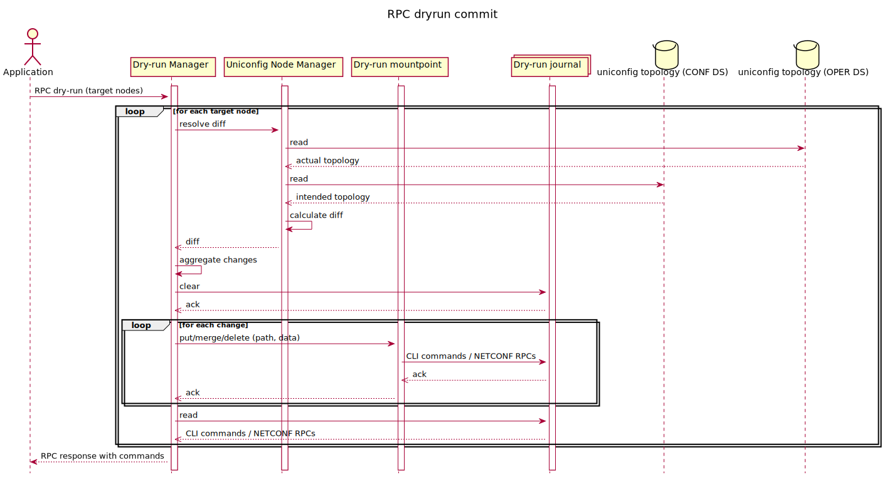

RPC dryrun-commit
=================

The RPC will resolve the diff between actual and intended configuration
of nodes by using UniConfig Node Manager. Changes for CLI nodes are
applied by using cli-dryrun mountpoint which only stores translated CLI
commands to the cli-dry-run journal. After all changes are applied, the
cli-dryrun journal is read and an RPC output is created and returned. It
works similarly with NETCONF devices, but it outputs NETCONF messages
instead of CLI commands. RPC input contains a list of UniConfig nodes
for which to execute the dry run. Output of the RPC describes the
results of the operation and matches all input nodes. It also contains a
list of commands, and NETCONF messages for the given nodes. If RPC is
called with empty list of target nodes, dryrun operation is executed on
all modified nodes in the UniConfig transaction. If one node failed for
any reason the RPC will be failed entirely.

RPC Examples
------------

### Successful example

RPC input contains the target node and the output contains a list of
commands which would be sent to the device if the RPC commit or
checked-commit was called.

> **RPC Request**
>
> **RPC request:**

> **RPC Response**
>
> **RPC response:**

* * * * *

Successful example ++++++++++++++

RPC input does not contain target nodes, dryrun is executed with all
modified nodes.

> **RPC Request**
>
> **RPC request:**

> **RPC Response**
>
> **RPC response:**

* * * * *

### Failed Example

RPC input contains the target node and the output contains a list of
commands which would be sent to the device if the RPC commit or
checked-commit was called. One node does not support dry-run.

> **RPC Request**
>
> **RPC request:**

> **RPC Response**
>
> **RPC response:**

* * * * *

### Failed Example

RPC input contains the target node and the output contains a list of
commands which would be sent to the device if the RPC commit or
checked-commit was called. One node has a bad configuration.

> **RPC Request**
>
> **RPC request:**

> **RPC Response**
>
> **RPC response:**

* * * * *

### Failed Example

RPC input contains the target node and the output contains a list of
commands which would be sent to a device if the RPC commit or
checked-commit was called. One node does not support dry-run (IOSXR) and
one is not in the unified topology (IOSXRN). There is one extra node,
which has not been mounted yet (AAA).

> **RPC Request**
>
> **RPC request:**

> **RPC Response**
>
> **RPC response:**

* * * * *

### Failed Example

RPC input contains a target node and the output contains a list of
commands which would be sent to a device if the RPC commit or
checked-commit was called. One node has not been mounted yet (AAA).

> **RPC Request**
>
> **RPC request:**

> **RPC Response**
>
> **RPC response:**

* * * * *

### Failed Example

If the RPC input does not contain the target nodes and there weren't any
touched nodes, the request will result in an error.

> **RPC Request**
>
> **RPC request:**

> **RPC Response**
>
> **RPC response:**
