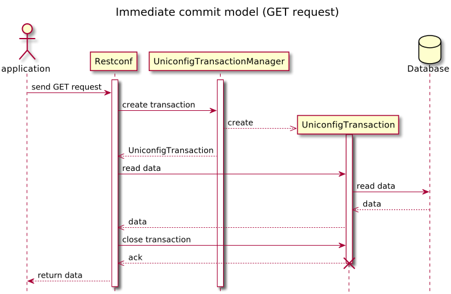
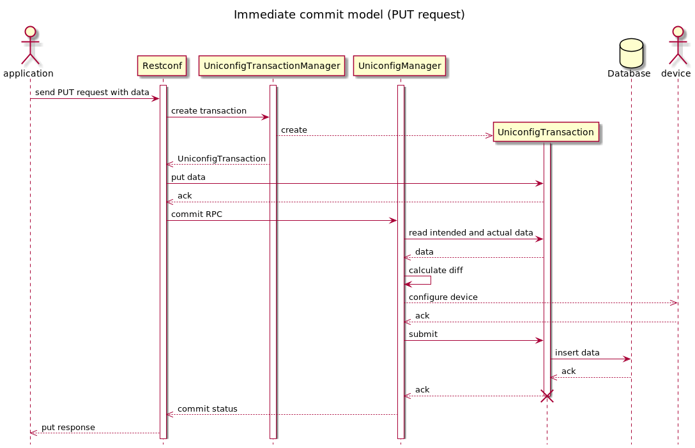

Immediate Commit Model
======================

The immediate commit creates new transactions for every call of an RPC.
The transaction is then closed so no lingering data will occur.

For reading data (GET request), a sequential diagram was created for
better understanding of how the whole process works.

Similarly, a sequential diagram for putting data (PUT request) was
created as well.

The key difference in those diagrams is that editing data (PUT, PATCH,
DELETE, POST) + RPC calls in the database need to be committed, so there
is an additional call of the commit RPC. This commit ensures that the
transaction is closed. For reading data, it is necessary to close the
transaction differently, because no data were changed, so calling a
commit would be unnecessary.

RPC Examples
------------

### Successful example

RPC input contains a new interface that will be added to the existing
ones.

> **PUT Request**
>
> **RPC request:**

> **PUT Response**
>
> **RPC response:**

* * * * *

After putting the data into the database, they will be automatically
committed and can be viewed.

> **GET Request**
>
> **RPC request:**

> **GET Response**
>
> **RPC response:**

* * * * *

### Failed Example

RPC input contains a value that is not supported.

> **PUT Request**
>
> **RPC request:**

> **PUT Response**
>
> **RPC response:**

* * * * *
