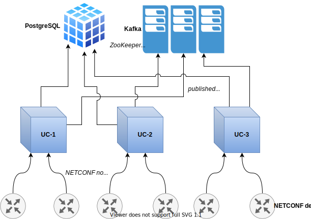
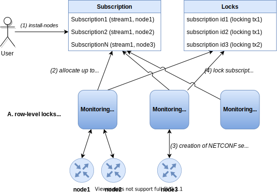

# Kafka Notifications

## Introduction

NETCONF devices are capable of generating NETCONF notifications.
UniConfig is able to collect these notifications and creates its own
UniConfig notifications about specific events. Kafka is used for
publishing of these notifications from NETCONF devices and UniConfig.
Currently, there are these types of notifications:
- NETCONF notifications
- notifications about transactions
- audit logs (RESTCONF notifications)
- data-change-events
- connection notifications

Each type of notifications is stored in its own topic in kafka. Besides
that, all notifications are stored in one table in database.



## Kafka

Apache Kafka is a publish-subscribe based durable messaging system. A
messaging system sends messages between processes, applications, and
servers. Apache Kafka is a software where topics can be defined (think
of a topic as a category), applications can add, process and reprocess
records.

In our specific case UniConfig is publisher of notifications. Each type
of notifications is stored in separate topic and therefore can be
subscribed to independently. Names of topics and connection data are
configurable in lighty-uniconfig-config.json file.

## NETCONF notifications

[RFC 5277](https://tools.ietf.org/html/rfc5277) document defines a
mechanism where the NETCONF client indicates interest in receiving event
notifications from a NETCONF server by creating a subscription to
receive event notifications. The NETCONF server replies to indicate
whether the subscription request was successful and, if it was
successful, begins sending the event notifications to the NETCONF client
as the events occur within the system. These event notifications will
continue to be sent until either the NETCONF session is terminated or
the subscription terminates for some other reason. 

NETCONF notifications have categories called streams. While subscribing
it is required to choose which streams should be received. Default
stream is called NETCONF.

## Notifications about transactions

This type of notifications is generated after each commit in UniConfig.
It contains:

-   transaction id
-   calculate diff result
-   commit result

## Audit logs (RESTCONF notifications)

This type of notifications is generated after each RESTCONF operation.

**It contains:**

- transaction id
- request data
    - uri
    - http-method
    - source-address
    - source-port
    - query-parameters
    - user-id
    - body
- response data
    - status-code
    - query-parameters
    - body

Response body does not need to be included in notification. It can be
configured using *includeResponseBody* parameter in
lighty-uniconfig-config.json file.

## Data-change events

User must perform subscription step before data-change-events are generated and published into Kafka.
Using subscription, user specifies observed subtrees against data-changes. Afterwards, data-change-events
are generated by UniConfig instances after some transaction is committed and committed changes contain
subscribed subtrees.

Sample data-change-event captured by Kafka console consumer:

```json
{
    "eventTime": "2022-02-14T07:36:39.55857-00:00",
    "nodeId": "UC-f057f8fa-8024-499a-94e9-904ce37fca78",
    "streamName": "DCE",
    "identifier": "data-change-event",
    "body": {
        "subscription-id": "f2a786a6-eea3-419c-8341-750d388181a0",
        "transaction-id": "634ac8c3-c20b-4d83-a283-a31fe0bed1a6",
        "edit": [
            {
                "subtree-path": "/process=p3",
                "data-after": "{\n  \"process\": [\n    {\n      \"uid\": \"p3\"\n    }\n  ]\n}"
            },
            {
                "subtree-path": "/process=p2",
                "data-before": "{\n  \"process\": [\n    {\n      \"uid\": \"p2\"\n    }\n  ]\n}"
            },
            {
                "subtree-path": "/process=p1/address/bus-size",
                "data-after": "{\n  \"config:bus-size\": 2048\n}",
                "data-before": "{\n  \"config:bus-size\": 1024\n}"
            },
            {
                "subtree-path": "/process=p1/address/bus-id",
                "data-after": "{\n  \"config:bus-id\": \"0xFFFF\"\n}",
                "data-before": "{\n  \"config:bus-id\": \"0x451FE\"\n}"
            }
        ]
    }
}
```

In case of data-change-events, streamName is always 'DCE' and identifier of YANG notification is 'data-change-event'.
Body contains:

- subscription-id: Identifier of the subscription that triggers generation of data-change-event.
  Subscription identifier makes association of subscriptions and received data-changes-events easier than using
  combination of multiple fields such as node identifier, topology identifier, and subtree path.
- transaction-id: Identifier of committed transaction that triggered data-change-event after commit or checked-commit
  UniConfig operations.
- edit - List of captured modifications done in the committed transaction.

Edit entry fields:

- subtree-path: Relative path to data-tree element at which data-change happened. Path is relative to subtree-path
  specified during subscription.
- data-before: JSON representation of subtree data before done changes. If this field is not present, then 'data-after'
  represents created data.
- data-after: JSON representation of subtree data including done changes. If this fields is not present, then
 'data-before' represents removed data.

## Connection notifications

Connection notification are generated whenever status of some node changes.
For connection notifications, streamName is always 'CONNECTION' and identifier of YANG notification is 'connection-notification'.

It contains:

- topology id
- node id
- connection status
- connection message

Supported topologies are cli, netconf and gnmi.

Sample connection notifications captured by Kafka console consumer:

**CLI disconnect notification:**
```json
{"eventTime":"2022-02-17T10:09:28.76615-00:00","nodeId":"UC-5b4d0cec-6493-4e3d-bd1c-348a3ce83600","streamName":"CONNECTION","identifier":"connection-notification","body":{"connection-status":"disconnected","node-id":"R1","connection-message":"","topology":"cli"}}
```

**NETCONF connect notification:**
```json
{"eventTime":"2022-02-17T10:09:51.41777-00:00","nodeId":"UC-5b4d0cec-6493-4e3d-bd1c-348a3ce83600","streamName":"CONNECTION","identifier":"connection-notification","body":{"connection-status":"connecting","node-id":"R2","connection-message":"Connecting","topology":"topology-netconf"}}
```

## Database entities

There are three tables related to notifications in database:

-   notification
-   settings
-   netconf-subscription

Notifications are stored in notification table. It has these columns:
- stream name - name of the notification stream - NETCONF stream name or UniConfig-specific stream name
- node id - node id of the NETCONF device for NETCONF notifications or identifier of UniConfig instance in case of other
  types of notifications
- identifier - name of the YANG notification
- body - full notification body in JSON format
- event time - time when notification was generated

Example request for reading notifications using RESTCONF:

```bash Request
curl --location --request GET 'http://localhost:8181/rests/data/notifications:notification' \
--header 'Accept: application/json' \
--header 'Content-Type: application/json'
``` 

Settings table has 2 columns: identifier and config. Record with
identifier kafka contains configuration for kafka that can be modified
at runtime.

Example request for reading kafka settings using RESTCONF:

```bash Request
curl --location --request GET 'http://localhost:8181/rests/data/kafka-brokers:kafka-settings' \
--header 'Accept: application/json' \
--header 'Content-Type: application/json'
``` 

NETCONF subscription table is used to track NETCONF notification
subscriptions. It has the following columns:
- node id - id of the NETCONF node from which notifications should be collected
- UniConfig instance id - instance id of UniConfig that is collecting notifications from the NETCONF device
- stream name - NETCONF stream name
- creation time - time when subscription was created
- start time - time when notifications start to be collected
- end time - time when notifications stop to be collected

Example request for reading subscriptions using RESTCONF:

```bash Request
curl --location --request GET 'http://localhost:8181/rests/data/netconf-subscriptions:netconf-subscriptions' \
--header 'Accept: application/json' \
--header 'Content-Type: application/json'
```

## NETCONF subscriptions

To receive NETCONF notifications from NETCONF device it is necessary to
create subscription. Subscription is created using install request:

```bash Request
curl --location --request POST 'http://localhost:8181/rests/operations/connection-manager:install-node' \
--header 'Accept: application/json' \
--header 'Content-Type: application/json' \
--data-raw '{
    "input":{
        "node-id":"versa_2",
        "netconf":{
            "netconf-node-topology:host":"10.103.5.202",
            "netconf-node-topology:port":2022,
            "netconf-node-topology:keepalive-delay":5,
            "netconf-node-topology:max-connection-attempts":1,
            "netconf-node-topology:connection-timeout-millis":60000,
            "netconf-node-topology:default-request-timeout-millis":60000,
            "netconf-node-topology:tcp-only":false,
            "netconf-node-topology:username":"admin",
            "netconf-node-topology:password":"versa123",
            "netconf-node-topology:sleep-factor":1.0,
            "uniconfig-config:UniConfig-native-enabled":true,
            "netconf-node-topology:edit-config-test-option":"set",
            "uniconfig-config:blacklist":{
                "extension":[
                    "tailf:display-when false"
                ]
            },
            "stream":[
                {
                    "stream-name":"NETCONF",
                    "start-time":"2021-11-08T02:00:00+00:00",
                    "stop-time":"2021-11-08T22:00:00+00:00"
                },
                {
                    "stream-name":"oam"
                }
            ]
        }
    }
}'
``` 

Subscriptions to notification streams are defined as list with name
*stream*. There is one record for each stream. The only required
parameter is *stream-name*. Besides the required *stream-name*
parameter, this record also supports optional parameters:

- *start-time* - must be specified if user wants to enable replay and
    it should start at the time specified.
- *stop time* - used with the optional replay feature to indicate the
    newest notifications of interest. If stopTime is not present, the
    notifications will continue until the subscription is terminated.
    Must be used with and be later than *start-time*. Values in the
    future are valid.

!!!
Creation of new subscription for the stream will terminate all
existing subscriptions for this stream.
!!!

## Monitoring system - processing NETCONF subscriptions

Inside UniConfig, NETCONF notification subscriptions are processed in an
infinite loop within monitoring system. An iteration of the monitoring
system loop consists of following steps:

1. Check global setting for NETCONF notifications
    -   If turned off, release all NETCONF subscriptions and end current iteration

2. Release cancelled subscriptions

3. Query free subscriptions from DB and for each:
    1.  create notification session (create mountpoint and register listeners)
    2.  lock subscription (set UniConfig instance)

!!!
There is a hard limit for how many sessions can a single UniConfig node
handle. In case this limit is reached, UniConfig node refuses to acquire
additional subscriptions.
!!!

Loop interval, hard subscription limit and maximum number of
subscriptions processed per interval can be set in
lighty-uniconfig-config.json file.

### Dedicated NETCONF session for subscription

NETCONF device may have the :interleave capability that indicates
support to interleave other NETCONF operations within a notification
subscription. This means the NETCONF server can receive, process, and
respond to NETCONF requests on a session with an active notification
subscription. However, not all devices support this capability, so the
common approach for devices \'with\' and \'without\' interleave
capability is to track notifications with a separate NETCONF session. In
order to support this functionality, UniConfig will create a separate
NETCONF session with a separate mount-point for every subscription.
These mount points and sessions are destroyed automatically when the
corresponding subscription is closed.



## Clustering of NETCONF subscriptions and notifications

When device is installed with stream property set, subscriptions for all
provided streams are created in database. These subscriptions are always
created with UniConfig instance id set to null, so they can be acquired
by any UniConfig from cluster. Each UniConfig instance in cluster uses
its own monitoring system to acquire free subscriptions. Monitoring
system uses specialized transaction to lock subscriptions which prevents
more UniConfig instances to lock same subscriptions. While locking
subscription, UniConfig instance writes its id to subscription table to
currently locked subscription and which means that this subscription is
already acquired by this UniConfig instance. Other instances of
UniConfig will not find this subscription as free anymore.

### Optimal subscription count and rebalancing

With multiple UniConfig instances working in a cluster, each instance
calculates an optimal range of subscriptions to manage.

```
OPTIMAL_RANGE_LOW = (NUMBER_OF_ALL_SUBSCRIPTIONS / NUMBER_OF_LIVE_UC_NODES_IN_CLUSTER) * OPTIMAL_NETCONF_SUBSCRIPTIONS_APPROACHING_MARGIN
OPTIMAL_RANGE_HIGH = (NUMBER_OF_ALL_SUBSCRIPTIONS / NUMBER_OF_LIVE_UC_NODES_IN_CLUSTER) * OPTIMAL_NETCONF_SUBSCRIPTIONS_REACHED_MARGIN
# Example: optimal range for 5000 subscriptions with 3 nodes in the cluster and margins set to 0.05 and 0.10 = (1750, 1834)
```

Based on optimal range and a number of currently opened subscriptions,
each UniConfig node (while performing a monitoring system iteration)
decides whether it should:

- Acquire additional subscriptions before optimal range is reached
- Stay put and not acquire additional subscriptions in case optimal range is reached
- Release some of its subscriptions to trigger rebalancing until optimal range is reached

When an instance goes down, all of its subscriptions will be immediately
released and the optimal range for the other living nodes will change
and thus the subscriptions will be reopened by the rest of the cluster.

!!!
There is a grace period before the other nodes take over the
subscriptions. So in case a node goes down and up quickly, it will
restart the subscriptions on its own.
!!!

Following example illustrates a timeline of a 3 node cluster and how
many subscriptions each node handles:


!!!
The hard limit still applies in clustered environment and it will never
be crossed, regardless of the optimal range.
!!!

## Subscription to data-change events

### Creation of new subscription

Subscription to data-change-events can be created using 'create-data-change-subscription' RPC. After subscription
is done, UniConfig starts to listen to data-change-events on selected nodes and subtrees, and distribute corresponding
messages to dedicated Kafka topic.

RPC input contains:
- node-id: Identifier of node from which data-change-events are generated.
- topology-id: Identifier of topology where specified node is placed.
- subtree-path: Path to subtree from which user would like to receive data-change-events. Default path equals to '/'
- captured data-change-events from whole node configuration. 
- data-change-scope: Data-tree scope that specified how granular data-change-events should be captured and propagated
  to Kafka. There are 3 options ('SUBTREE' is default value):
  - 'SUBTREE': Represents a change of the node or any of or any of its child nodes, direct and nested.
    This scope is superset of ONE and BASE.
  - 'ONE': Represent a change (addition, replacement, or deletion) of the node on the subtree-path or one of its direct
    children elements.
  - 'BASE': Represents only a direct change of the node on subtree-path, such as replacement of a node,
    addition or deletion.

RPC output contains only generated 'subscription-id' in format of UUID. This subscription identifier represents token
that can be used by user:
- displaying information about created subscription using RPC
- deleting existing subscription
- sorting received Kafka messages

Example: creation of subscription to node 'device1' from 'uniconfig' topology and to whole configuration
subtree '/interfaces'.

```bash RPC Request
curl --location --request POST 'http://127.0.0.1:8181/rests/operations/data-change-events:create-data-change-subscription' \
--header 'Content-Type: application/json' \
--data-raw '{
    "input": {
        "node-id": "device1",
        "topology-id": "uniconfig",
        "subtree-path": "/interfaces",
        "data-change-scope": "SUBTREE"
    }
}'
```

```json RPC response
{
  "output": {
    "subscription-id": "8e82453d-4ea8-4c26-a74e-50d855a721fa"
  }
}
```

### Removal of subscription

Existing subscription can be removed using 'delete-data-change-subscription' RPC and provided subscription-id.
After subscription is removed, UniConfig stops generation of new data-change-events related to subscribed path.

RPC input contains only 'subscription-id' - unique identifier of subscription to data-change-events. RPC output
doesn't contain body. RPC will return 404, if subscription with provided identifier doesn't exist.

Example: removal of subscription with ID '8e82453d-4ea8-4c26-a74e-50d855a721fa':

```bash RPC Request
curl --location --request POST 'http://127.0.0.1:8181/rests/operations/data-change-events:delete-data-change-subscription' \
--header 'Content-Type: application/json' \
--data-raw '{
  "output": {
    "subscription-id": "8e82453d-4ea8-4c26-a74e-50d855a721fa"
  }
}'
```

### Showing information about subscription

The RPC 'show-subscription-data' can be used for displaying information about created subscription. RPC input contains
identifier of target subscription.

RPC output for existing subscription contains 'topology-id', 'node-id', 'subtree-path', and 'data-change-scope' - the
same fields that can also be specified in the 'create-data-change-subscription' RPC input.
If subscription with specified ID doesn't exist, RPC will return 404 status code with standard RESTCONF error container.

Example: showing information about 

```bash RPC Request
curl --location --request POST 'http://127.0.0.1:8181/rests/operations/data-change-events:show-subscription-data' \
--header 'Content-Type: application/json' \
--data-raw '{
  "output": {
    "subscription-id": "8e82453d-4ea8-4c26-a74e-50d855a721fa"
  }
}'
```

```json RPC response
{
    "output": {
        "subtree-path": "/interfaces",
        "topology-id": "uniconfig",
        "data-change-scope": "SUBTREE",
        "node-id": "device1"
    }
}
```

It is also possible to fetch all created subscriptions under specific node by sending GET request
to 'data-change-subscriptions' list under 'node' list item (operational data).

Example (there are 2 subscriptions under 'device1' node):

```bash GET request
curl --location --request GET 'http://127.0.0.1:8181/rests/data/network-topology:network-topology/topology=uniconfig/node=device1/data-change-subscriptions?content=nonconfig' \
--header 'Accept: application/json'
```

```json GET response
{
    "data-change-events:data-change-subscriptions": [
        {
            "subscription-id": "8e82453d-4ea8-4c26-a74e-50d855a721fa",
            "subtree-path": "/interfaces",
            "data-change-scope": "SUBTREE"
        },
        {
            "subscription-id": "3b3ad917-f1a1-4cc4-83b9-3c8b62929b81",
            "subtree-path": "/ospf",
            "data-change-scope": "ONE"
        }
    ]
}
```

## Configuration

Configuration for notifications is in lighty-uniconfig-config.json file
under *notifications* property. Whole configuration looks like this:

```json
{
  "notifications": {
    "enabled": true,
    "kafka": {
      "username": "kafka",
      "password": "kafka",
      "kafkaServers": [
        {
          "brokerHost": "127.0.0.1",
          "brokerListeningPort": 9092
        }
      ],
      "netconfNotificationsEnabled": true,
      "auditLogsEnabled": true,
      "transactionNotificationsEnabled": true,
      "dataChangeEventsEnabled": true,
      "netconfNotificationsTopicName": "netconf-notifications",
      "auditLogsTopicName": "auditLogs",
      "transactionsTopicName": "transactions",
      "dataChangeEventsTopicName": "data-change-events",
      "blockingTimeout": 60000,
      "requestTimeout": 30000,
      "deliveryTimeout": 120000,
      "maxThreadPoolSize": 8,
      "queueCapacity": 2048,
      "embeddedKafka": {
        "enabled": true,
        "installDir": "/tmp/embedded-kafka",
        "archiveUrl": "https://dlcdn.apache.org/kafka/3.0.0/kafka_2.12-3.0.0.tgz",
        "dataDir": "./data/embedded-kafka",
        "cleanDataBeforeStart": true,
        "partitions": 1
      }
    },
    "auditLogs": {
      "includeResponseBody": true
    },
    "notificationDbTreshold": {
      "maxCount": 10000,
      "maxAge": 100
    },
    "netconfSubscriptionsMonitoringInterval": 5,
    "maxNetconfSubscriptionsPerInterval": 10,
    "maxNetconfSubscriptionsHardLimit": 5000,
    "rebalanceOnUCNodeGoingDownGracePeriod": 120,
    "optimalNetconfSubscriptionsApproachingMargin": 0.05,
    "optimalNetconfSubscriptionsReachedMargin" : 0.10
  }
}
```

All notifications and also monitoring system can be enabled and disabled
by *enabled* flag.

**There are 3 properties related to monitoring system:**

- subscriptionsMonitoringInterval - how often is monitoring system
     loop running and trying to acquire free subscriptions, value is in
     seconds and default is 5
- maxSubscriptionsPerInterval - maximum number of free subscriptions
     that can be acquired in single monitoring system loop iteration,
     when there is fewer free subscription than this value, only this
     smaller amount will be processed (even zero if there are none), if
     the number of free subscriptions is higher or equal to this value,
     only specified amount will be acquired, the rest can be acquired
     in next iterations of monitoring system loop or by other UniConfig
     instances in cluster, default value for this property is 10
- maxNetconfSubscriptionsHardLimit - hard limit for how many
     subscriptions can a single UniConfig node handle

**There are 3 properties related to monitoring system in clustered
environment:**

- rebalanceOnUCNodeGoingDownGracePeriod - grace period for a
     UniConfig node going down. Other nodes will not restart the
     subscriptions until the grace period passes from when a dead
     Uniconfig node has been seen last. Default = 120 seconds.
- optimalNetconfSubscriptionsApproachingMargin - the lower margin to
     calculate optimal range start. Default = 0.05
- optimalNetconfSubscriptionsReachedMargin - the higher margin to
     calculate optimal range end. Default = 0.10

**There are three properties related to the timeout of messages to Kafka**

- blockingTimeout - configuration of how long the **send()** method and the
  creation of connection for reading of metadata methods will block (in ms).
- requestTimeout - configuration of how long will the producer wait for
  the acknowledgement of a request (in ms). If the acknowledgement
  is not received before the timeout elapses, the producer will resend
  the request or fail the request if retries are exhausted.
- deliveryTimeout - configuration of the upper bound on the time to report
  success or failure after a call to **send()** returns (in ms). This limits
  the total time that a record will be delayed prior to sending, the
  time to await acknowledgement from the broker (if expected), and the
  time allowed for retriable send failures.

**There are two properties related to the thread pool executor which is needed to
send messages to Kafka**

- maxThreadPoolSize - the maximum thread pool size in the executor.
- queueCapacity - the maximum capacity of the work queue in the executor.

**There are two properties that are used to limit number of records in
database in notifications table:**

- maxCount - if number of records in notifications table exceeds
     specified number then oldest record in this table will be deleted,
     this way there will never be more records in database than
     specified value, default is 10 000
- maxAge - if record is older than specified value it will be
     deleted, value is in hours and default is 100

These properties are under *notificationDbTreshold*. Both of these are
implemented using database triggers. Triggers are running on inserts to
notifications table.

Audit logs settings are under auditLogs property. Currently there is
only one flag *includeResponseBody* that is used to enable or disable of
logging body of RESTCONF responses. 

All settings related to kafka are grouped under *kafka* property. For
authentication there are *username* and *password* properties. For kafka
connection there is *kafkaServers* property. This contains list of kafka
servers as combination of *brokerHost* and *brokerListeningPort*. Broker
host can be either ip address or hostname.

It is possible to enable/disable each type of notifications
independently. To do that these flags are used:

- netconfNotificationsEnabled
- auditLogsEnabled
- transactionNotificationsEnabled 
- dataChangeEventsEnabled

It is possible to setup names of all topics for every notification type.
This is done using:

- transactionsTopicName - topic name for transactions about notifications
- netconfNotificationsTopicName - topic name for NETCONF notifications
- auditLogsTopicName - topic name for audit logs
- dataChangeEventsTopicName - topic name for data-change-events

It is also possible to setup embedded kafka. These setting are grouped
under *embeddedKafka* property:

- enabled - flag that enables or disables embedded kafka
- installDir - where should be kafka files placed
- archiveUrl - where to download kafka from
- dataDir - kafka data directory
- cleanDataBeforeStart - if kafka config should be cleared before start

Kafka settings are also stored in db. This way they can be changed at
runtime. This change can be done using RESTCONF or UniConfig shell.
Kafka setting are stored in settings table.

## Kafka client - example

To read notifications from kafka, it is possible to use command line
consumer. It is done by running following command in kafka installation
directory:

```bash
bin/kafka-console-consumer.sh \
 --bootstrap-server localhost:9092 \
 --topic netconf-notifications
```

It is important to have properly setup hostname, port and topic name.
Output after creation of NETCONF notification may look like this:

```json
{
  "eventTime": "2021-12-03T08:16:45.75600-00:00",
  "nodeId": "R1",
  "streamName": "NETCONF",
  "identifier": "netconf-session-start",
  "body": {
    "session-id": 191,
    "source-host": "10.255.246.85",
    "username": "admin"
  }
}
```
