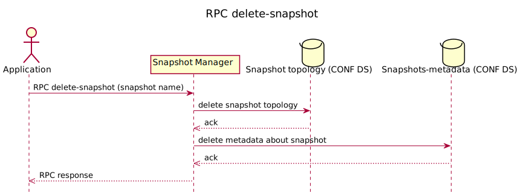

RPC delete-snapshot
===================

RPC removes the snapshot from CONFIG datastore of UniConfig transaction.
RPC input contains the name of the snapshot topology which should be
removed. RPC output contains result of the operation.

RPC Examples
------------

### Successful Example

RPC input contains the name of the snapshot topology which should be
removed. RPC output contains the results of the operation.

> **RPC Request**
>
> **RPC request:**

> **RPC Response**
>
> **RPC response:**

* * * * *

### Failed example

RPC input contains the name of the snapshot topology which should be
removed. The input snapshot name does not exist. RPC output contains the
results of the operation.

> **RPC Request**
>
> **RPC request:**

> **RPC Response**
>
> **RPC response:**
