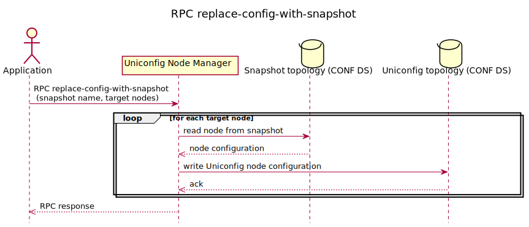

RPC replace-config-with-snapshot
================================

The RPC replaces the nodes in UniConfig topology in the CONFIG datastore
with selected nodes from specified snapshot. The RPC input contains the
name of the snapshot topology and the target nodes which should replace
the UniConfig nodes in the CONFIG datastore. Output of the RPC describes
the result of the operation and matches all input nodes. You cannot call
an RPC with empty target-nodes. If one node failed for any reason, RPC
will be fail entirely.

RPC Examples
------------

### Successful Example

RPC input contains the name of the snapshot topology which should
replace nodes from UniConfig topology in the CONFIG datastore and list
of nodes from that snapshot. RPC output contains the result of the
operation.

> **RPC Request**
>
> **RPC request:**

> **RPC Response**
>
> **RPC response:**

* * * * *

### Failed Example

RPC input contains the name of the snapshot topology which should
replace nodes from UniConfig topology in the CONFIG datastore and list
of nodes from that snapshot. The snapshot with name (snapshot2) has not
been created yet. RPC output contains the result of the operation.

> **RPC Request**
>
> **RPC request:**

> **RPC Response**
>
> **RPC response:**

* * * * *

### Failed Example

RPC input contains the name of the snapshot topology which should
replace nodes from UniConfig topology in the CONFIG datastore and list
of nodes from that snapshot. The snapshot name is missing in the RPC
input. The RPC output contains the result of the operation.

> **RPC Request**
>
> **RPC request:**

> **RPC Response**
>
> **RPC response:**

* * * * *

### Failed Example

RPC input contains the name of the snapshot topology which should
replace nodes from UniConfig topology in the CONFIG datastore and list
of nodes from that snapshot. One node is missing in snapshot1 (IOSXRN).
RPC output contains the result of the operation.

> **RPC Request**
>
> **RPC request:**

> **RPC Response**
>
> **RPC response:**

* * * * *

### Failed Example

RPC input does not contain the target nodes, so RPC can not be executed.

> **RPC Request**
>
> **RPC request:**

> **RPC Response**
>
> **RPC response:**
