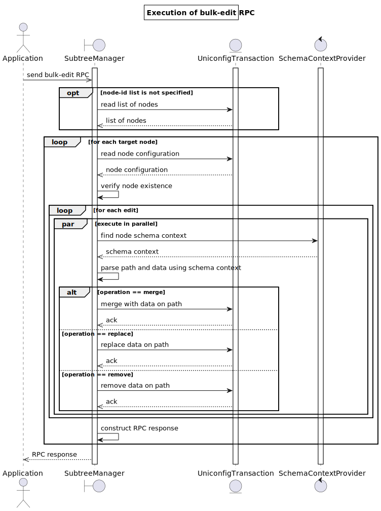

# RPC bulk-edit

Bulk-edit operation can be used for modification of multiple configuration subtrees under multiple target nodes
from 'uniconfig', 'templates' or 'unistore' topology (the same list of modifications are applied to all listed
target nodes). Bulk-edit operation is executed atomically - either all modifications are applied on all target nodes
successfully or operation fails, and configuration is not touched in the UniConfig transaction. This RPC also benefits
from parallel processing of changes per target node.



## RPC input

RPC input specifies list of target nodes and list of modifications that must be applied under target nodes:

Description of input fields:

* **topology-id** (mandatory): Identifier of the topology which contains all target nodes.
  Currently supported topologies: uniconfig, templates, unistore.
* **node-id** (optional): List of target nodes identifiers residing in the specified topology. If this field is not
  specified, or it is empty, RPC is executed on all available nodes in the specified topology.
* **edit** (mandatory with at least 1 entry): List of modifications. Each modification is uniquely identified
  by 'path' key. Modifications are applied in the preserved user-defined order.

Description of fields in the edit entry:

* **path** (mandatory): Path encoded using RFC-8040 format. It must be specified as relative path to root
  'configuration' container. If this leaf contains single character '/', path point to whole configuration.
* **operation** (mandatory): Operation that must be executed on the specified path. Supported operations
  are 'merge', 'replace', and 'remove'. Operations 'merge' and 'replace' requires to also specify input 'data'.
* **data** (optional): Content of the replaced or merged data without wrapping parent element
  (the last element of the path is not declared in the 'data', see examples, how to correctly specify content 
  of this leaf in different use-cases).

Supported operations:

* **merge**: The supplied value is merged with the target data node.
* **replace**: The supplied value is used to replace the target data node.
* **remove**: Delete the target node if it currently exists.

## RPC output

RPC output contains global status of executed operation and per-node status.

Description of output fields:

* **overall-status**: Status of operation. If RPC execution fails on at least 1 of the target nodes,
  overall status is set to 'fail'. Otherwise, it is set to 'complete'.
* **error-message**: "Described reason of the failure. This field is used if there is some structural error 
  in the RPC input that does not relate to 1 specific target node."
* **node-result**: Results of the RPC execution divided per target node ('node-id' is the key of the list).

Description of fields in the node-result entry:

* **node-id**: Identifier of the target node.
* **status**: Status of bulk-edit operation on this node. Value is set to 'complete', only if all modifications have
  been successfully written into UniConfig transaction (including other nodes). Otherwise, value is set to 'fail'.
* **error-message**: Described reason of the failure. This field appears in the output only if RPC execution failed
  on this target node.
* **error-type**: Categorized type of the error.

## RPC examples

### Successful example

The following request demonstrates application of 6 modifications to 4 templates:

1. Replacing value of the 'description' leaf.
2. Removing 'snmp' container.
3. Replacing whole 'ssh' container.
4. Merging configuration of 'routing-protocol' list entry.
5. Merging whole 'tree' list with specified multiple list entries.
6. Replacing leaf-list 'services' by provided array of strings.

```bash RPC request
curl --location --request POST 'http://127.0.0.1:8181/rests/operations/subtree-manager:bulk-edit' \
--header 'Accept: application/json' \
--header 'Content-Type: application/json' \
--header 'Cookie: UNICONFIGTXID=7bb3fbdf-23b0-488e-8d59-8d0b2757da73' \
--data-raw '{
    "input": {
        "topology-id": "templates",
        "node-id": [
            "tpl_1",
            "tpl_2",
            "tpl_3",
            "tpl_4"
        ],
        "edit": [
            {
                "path": "/groups/group=test/description",
                "operation": "replace",
                "data": "test"
            },
            {
                "path": "/snmp/config",
                "operation": "remove"
            },
            {
                "path": "/system/netconf/ssh",
                "operation": "replace",
                "data": {
                    "ip": "10.10.10.10",
                    "enabled": false,
                    "port": 2243
                }
            },
            {
                "path": "/routing-protocol/routing-protocol=test",
                "operation": "merge",
                "data": {
                    "@": {
                        "template-tags:operation": "create"
                    },
                    "name": "test"
                }
            },
            {
                "path": "/snmp/view=internet/tree",
                "operation": "merge",
                "data": [
                    {
                        "oid": "1.4",
                        "included": true
                    },
                    {
                        "oid": "1.5",
                        "included": false
                    }
                ]
            },
            {
                "path": "/router/services",
                "operation": "replace",
                "data": [
                    "dhcp",
                    "rarp"
                ]
            }
        ]
    }
}'
```

Response contains overall status 'complete' and per-node status 'complete' - all modifications have been successfully
written into the UniConfig transaction.

```json RPC response
{
    "output": {
        "overall-status": "complete",
        "node-result": [
            {
                "node-id": "tpl_1",
                "status": "complete"
            },
            {
                "node-id": "tpl_2",
                "status": "complete"
            },
            {
                "node-id": "tpl_3",
                "status": "complete"
            },
            {
                "node-id": "tpl_4",
                "status": "complete"
            }
        ]
    }
}
```

### Failed example

The next example demonstrates execution of bulk-edit operation that fails on parsing of one of the paths
using YANG schemas of device 'dev02'.


```bash RPC request
curl --location --request POST 'http://127.0.0.1:8181/rests/operations/subtree-manager:bulk-edit' \
--header 'Accept: application/json' \
--header 'Content-Type: application/json' \
--header 'Cookie: UNICONFIGTXID=7bb3fbdf-23b0-488e-8d59-8d0b2757da73' \
--data-raw '{
    "input": {
        "node-id": [
            "dev01",
            "dev02"
        ],
        "topology-id": "uniconfig",
        "edit": [
            {
                "path": "/dhcp/profile=test-profile",
                "operation": "replace",
                "data": {
                    "name": "test-profile",
                    "description": "test"
                }
            },
            {
                "path": "/settings",
                "operation": "remove"
            }
        ]
    }
}'
```

RPC response contains overall status 'fail'. There is 1 error message in the result of 'dev02'. Note that 'dev01'
result also contains 'fail' status because modifications have not been written to this node since another node ('dev02')
during execution of operation failed.

```json RPC response
{
    "output": {
        "overall-status": "fail",
        "node-result": [
            {
                "node-id": "dev01",
                "status": "fail",
                "error-type": "uniconfig-error"
            },
            {
                "node-id": "dev02",
                "status": "fail",
                "error-message": "Failed to parse path: Could not parse path 'network-topology:network-topology/topology=uniconfig/node=dev02/frinx-uniconfig-topology:configuration/dhcp/profile=test-profile'. Offset: '108': Reason: List entry '(test-ns?revision=2018-09-12)dhcp' requires key or value predicate to be present",
                "error-type": "uniconfig-error"
            }
        ]
    }
}
```