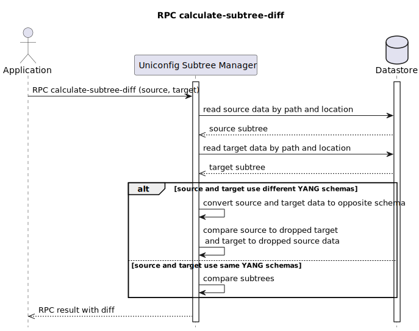

# RPC calculate-subtree-diff

This RPC creates a diff between the actual topology subtrees and
intended topology subtrees. Nodes could be from different subtrees, it
compares only the data hierarchy and values. RPC input contains
data-tree paths ('source-path' and 'target-path') and data locations
('source-datastore' and 'target-datastore'). Data location is the
enumeration of two possible values 'OPERATIONAL' and 'CONFIGURATION'.
Output of the RPC describes the status of the operation and a list of
statements representing the diff between two subtrees.



## RPC Examples

### Successful example

RPC calculate-subtree-diff input has a path to two different testtool
models in the operation memory. Output contains a list of statements
representing the diff.

```json Node testtool with schema test-module
{
    "root": {
        "simple-root": {
            "leaf-a": "leafA",
            "leaf-b": "EDITED",
            "ll": [
                "str1",
                "str2",
                "str3"
            ],
            "nested": {
                "sample-y": false
            }
        },
        "list-root": {
            "branch-ab": 9999,
            "top-list": [
                {
                    "key-1": "ka",
                    "key-2": "kb",
                    "next-data": {
                        "switch-1": [
                            null
                        ],
                        "switch-2": [
                            null
                        ]
                    },
                    "nested-list": [
                        {
                            "identifier": "f1",
                            "foo": 1
                        },
                        {
                            "identifier": "f2",
                            "foo": 10
                        },
                        {
                            "identifier": "f3",
                            "foo": 20
                        }
                    ]
                },
                {
                    "key-1": "kb",
                    "key-2": "ka",
                    "next-data": {
                        "switch-1": [
                            null
                        ]
                    },
                    "nested-list": [
                        {
                            "identifier": "e1",
                            "foo": 1
                        },
                        {
                            "identifier": "e2",
                            "foo": 2
                        },
                        {
                            "identifier": "e3",
                            "foo": 3
                        }
                    ]
                },
                {
                    "key-1": "kc",
                    "key-2": "ke",
                    "next-data": {
                        "switch-2": [
                            null
                        ]
                    },
                    "nested-list": [
                        {
                            "identifier": "q1",
                            "foo": 13
                        },
                        {
                            "identifier": "q2",
                            "foo": 14
                        },
                        {
                            "identifier": "q3",
                            "foo": 15
                        }
                    ]
                }
            ]
        },
        "choice-root": {
            "cb": [
                {
                    "key-cb": "f1",
                    "next-bit": "asdfgh"
                },
                {
                    "key-cb": "f2",
                    "next-bit": "qwertz"
                },
                {
                    "key-cb": "f3",
                    "next-bit": "yxcvb"
                },
                {
                    "key-cb": "f4",
                    "next-bit": "poiuzz"
                }
            ]
        },
        "augmented-root": {
            "aug-c": {
                "original-leaf": [
                    null
                ],
                "test-augment:list-1": [
                    {
                        "leaf-x": "x1",
                        "leaf-y": "x1"
                    },
                    {
                        "leaf-x": "x2",
                        "leaf-y": "x1"
                    },
                    {
                        "leaf-x": "x3",
                        "leaf-y": "x1"
                    }
                ]
            },
            "aug-l": [
                {
                    "my-key": "k1",
                    "test-augment:abc": {
                        "abc": false
                    }
                },
                {
                    "my-key": "k2",
                    "test-augment:abc": {
                        "abc": true
                    }
                },
                {
                    "my-key": "k3",
                    "test-augment:abc": {
                        "abc": false
                    }
                }
            ]
        }
    }
}
```

```json Node testtool2 with schema test-module-mod
{
    "root": {
        "simple-root": {
            "leaf-a": "leafA",
            "leaf-b": "leafB",
            "ll": [
                "str1",
                "str2",
                "EDITED"
            ],
            "nested": {
                "sample-y": false
            }
        },
        "list-root": {
            "branch-ab": 5,
            "top-list": [
                {
                    "key-1": "ka",
                    "key-2": "kb",
                    "next-data": {
                        "switch-1": [
                            null
                        ],
                        "switch-2": [
                            null
                        ]
                    },
                    "nested-list": [
                        {
                            "identifier": "f1",
                            "foo": 1
                        },
                        {
                            "identifier": "f2",
                            "foo": 10
                        },
                        {
                            "identifier": "f3",
                            "foo": 20
                        }
                    ]
                },
                {
                    "key-1": "kb",
                    "key-2": "ka",
                    "next-data": {
                        "switch-1": [
                            null
                        ]
                    },
                    "nested-list": [
                        {
                            "identifier": "e1",
                            "foo": 1
                        },
                        {
                            "identifier": "e2",
                            "foo": 2
                        },
                        {
                            "identifier": "e3",
                            "foo": 3
                        }
                    ]
                },
                {
                    "key-1": "kc",
                    "key-2": "EDITED",
                    "next-data": {
                        "switch-2": [
                            null
                        ]
                    },
                    "nested-list": [
                        {
                            "identifier": "q1",
                            "foo": 13
                        },
                        {
                            "identifier": "q2",
                            "foo": 14
                        },
                        {
                            "identifier": "q3",
                            "foo": 15
                        }
                    ]
                }
            ]
        },
        "choice-root": {
            "cb": [
                {
                    "key-cb": "f1",
                    "next-bit": "asdfgh"
                },
                {
                    "key-cb": "f2",
                    "next-bit": "qwertz"
                },
                {
                    "key-cb": "f3",
                    "next-bit": "yxcvb"
                },
                {
                    "key-cb": "f4",
                    "next-bit": "poiuzz"
                }
            ]
        },
        "augmented-root": {
            "aug-c": {
                "original-leaf": [
                    null
                ],
                "test-augment:list-1": [
                    {
                        "leaf-x": "x1",
                        "leaf-y": "x1"
                    },
                    {
                        "leaf-x": "EDITED",
                        "leaf-y": "x1"
                    },
                    {
                        "leaf-x": "x3",
                        "leaf-y": "x1"
                    }
                ]
            },
            "aug-l": [
                {
                    "my-key": "k1",
                    "test-augment:abc": {
                        "abc": false
                    }
                },
                {
                    "my-key": "EDITED",
                    "test-augment:abc": {
                        "abc": true
                    }
                },
                {
                    "my-key": "k3",
                    "test-augment:abc": {
                        "abc": false
                    }
                }
            ]
        }
    }
}
```

```bash RPC Request
curl --location --request POST 'http://localhost:8181/rests/operations/subtree-manager:calculate-subtree-diff' \
--header 'Accept: application/json' \
--header 'Content-Type: application/json' \
--data-raw '{
    "input": {
        "source-path": "/network-topology:network-topology/topology=uniconfig/node=testtool/configuration/test-module:root",
        "source-datastore": "OPERATIONAL",
        "target-path": "/network-topology:network-topology/topology=uniconfig/node=testtool2/configuration/test-module-mod:root",
        "target-datastore": "OPERATIONAL"
    }
}'
```

```json RPC Response, Status: 200
{
    "output": {
        "target-path": "/network-topology:network-topology/topology=uniconfig/node=testtool2/frinx-uniconfig-topology:configuration/native-schema-2091711202-test-module-mod:root",
        "status": "complete",
        "updated-data": [
            {
                "path-intended": "/network-topology:network-topology/topology=uniconfig/node=testtool/frinx-uniconfig-topology:configuration/test-module:root/list-root/branch-ab",
                "path-actual": "/network-topology:network-topology/topology=uniconfig/node=testtool2/frinx-uniconfig-topology:configuration/test-module-mod:root/list-root/branch-ab",
                "data-actual": "{\n  \"test-module-mod:branch-ab\": 5\n}",
                "data-intended": "{\n  \"test-module:branch-ab\": 9999\n}"
            },
            {
                "path-intended": "/network-topology:network-topology/topology=uniconfig/node=testtool/frinx-uniconfig-topology:configuration/test-module:root/simple-root",
                "path-actual": "/network-topology:network-topology/topology=uniconfig/node=testtool2/frinx-uniconfig-topology:configuration/test-module-mod:root/simple-root",
                "data-actual": "{\n  \"test-module-mod:ll\": [\n    \"EDITED\",\n    \"str1\",\n    \"str2\"\n  ]\n}",
                "data-intended": "{\n  \"test-module:ll\": [\n    \"str3\",\n    \"str2\",\n    \"str1\"\n  ]\n}"
            },
            {
                "path-intended": "/network-topology:network-topology/topology=uniconfig/node=testtool/frinx-uniconfig-topology:configuration/test-module:root/simple-root/leaf-b",
                "path-actual": "/network-topology:network-topology/topology=uniconfig/node=testtool2/frinx-uniconfig-topology:configuration/test-module-mod:root/simple-root/leaf-b",
                "data-actual": "{\n  \"test-module-mod:leaf-b\": \"leafB\"\n}",
                "data-intended": "{\n  \"test-module:leaf-b\": \"EDITED\"\n}"
            }
        ],
        "created-data": [
            {
                "path": "/network-topology:network-topology/topology=uniconfig/node=testtool2/frinx-uniconfig-topology:configuration/test-module-mod:root/augmented-root/aug-l=EDITED",
                "data": "{\n  \"aug-l\": [\n    {\n      \"my-key\": \"EDITED\",\n      \"test-augment-mod:abc\": {\n        \"abc\": true\n      }\n    }\n  ]\n}"
            },
            {
                "path": "/network-topology:network-topology/topology=uniconfig/node=testtool2/frinx-uniconfig-topology:configuration/test-module-mod:root/augmented-root/aug-c/test-augment-mod:list-1=EDITED",
                "data": "{\n  \"list-1\": [\n    {\n      \"leaf-x\": \"EDITED\",\n      \"leaf-y\": \"x1\"\n    }\n  ]\n}"
            },
            {
                "path": "/network-topology:network-topology/topology=uniconfig/node=testtool2/frinx-uniconfig-topology:configuration/test-module-mod:root/list-root/top-list=kc,EDITED",
                "data": "{\n  \"top-list\": [\n    {\n      \"key-1\": \"kc\",\n      \"key-2\": \"EDITED\",\n      \"nested-list\": [\n        {\n          \"identifier\": \"q2\",\n          \"foo\": 14\n        },\n        {\n          \"identifier\": \"q1\",\n          \"foo\": 13\n        },\n        {\n          \"identifier\": \"q3\",\n          \"foo\": 15\n        }\n      ],\n      \"next-data\": {\n        \"switch-2\": [\n          null\n        ]\n      }\n    }\n  ]\n}"
            }
        ],
        "deleted-data": [
            {
                "path": "/network-topology:network-topology/topology=uniconfig/node=testtool/frinx-uniconfig-topology:configuration/test-module:root/list-root/top-list=kc,ke",
                "data": "{\n  \"top-list\": [\n    {\n      \"key-1\": \"kc\",\n      \"key-2\": \"ke\",\n      \"nested-list\": [\n        {\n          \"identifier\": \"q2\",\n          \"foo\": 14\n        },\n        {\n          \"identifier\": \"q1\",\n          \"foo\": 13\n        },\n        {\n          \"identifier\": \"q3\",\n          \"foo\": 15\n        }\n      ],\n      \"next-data\": {\n        \"switch-2\": [\n          null\n        ]\n      }\n    }\n  ]\n}"
            },
            {
                "path": "/network-topology:network-topology/topology=uniconfig/node=testtool/frinx-uniconfig-topology:configuration/test-module:root/augmented-root/aug-c/test-augment:list-1=x2",
                "data": "{\n  \"list-1\": [\n    {\n      \"leaf-x\": \"x2\",\n      \"leaf-y\": \"x1\"\n    }\n  ]\n}"
            },
            {
                "path": "/network-topology:network-topology/topology=uniconfig/node=testtool/frinx-uniconfig-topology:configuration/test-module:root/augmented-root/aug-l=k2",
                "data": "{\n  \"aug-l\": [\n    {\n      \"my-key\": \"k2\",\n      \"test-augment:abc\": {\n        \"abc\": true\n      }\n    }\n  ]\n}"
            }
        ],
        "source-path": "/network-topology:network-topology/topology=uniconfig/node=testtool/frinx-uniconfig-topology:configuration/native-schema-718148732-test-module:root"
    }
}
```

### Failed Example

RPC calculate-subtree-diff has an improperly defined datastore (AAA)
within the input. Output describes the Allowed values [CONFIGURATION,
OPERATIONAL].

```bash RPC Request
curl --location --request POST 'http://localhost:8181/rests/operations/subtree-manager:calculate-subtree-diff' \
--header 'Accept: application/json' \
--header 'Content-Type: application/json' \
--data-raw '{
    "input": {
        "source-path": "/network-topology:network-topology/topology=uniconfig/node=testtool/configuration/test-module:root",
        "source-datastore": "AAA",
        "target-path": "/network-topology:network-topology/topology=uniconfig/node=testtool2/configuration/test-module-mod:root",
        "target-datastore": "OPERATIONAL"
    }
}'
```

```json RPC Response, Status: 200
{
    "errors": {
        "error": [
            {
                "error-type": "protocol",
                "error-message": "Error parsing input: Invalid value 'AAA' for enum type. Allowed values are: [CONFIGURATION, OPERATIONAL]",
                "error-tag": "malformed-message",
                "error-info": "Invalid value 'AAA' for enum type. Allowed values are: [CONFIGURATION, OPERATIONAL]"
            }
        ]
    }
}
```

### Failed Example

RPC input does not contain source node YIID, so the RPC can not be
executed.

```bash RPC Request
curl --location --request POST 'http://localhost:8181/rests/operations/subtree-manager:calculate-subtree-diff' \
--header 'Accept: application/json' \
--header 'Content-Type: application/json' \
--data-raw '{
    "input": {
        "source-datastore": "OPERATIONAL",
        "target-path": "/network-topology:network-topology/topology=uniconfig/node=testtool2/configuration/test-module-mod:root",
        "target-datastore": "OPERATIONAL"
    }
}'
```

```json RPC Response, Status: 200
{
    "output": {
        "status": "fail",
        "error-message": "source-path is not specified in input request",
        "error-type": "uniconfig-error"
    }
}
```