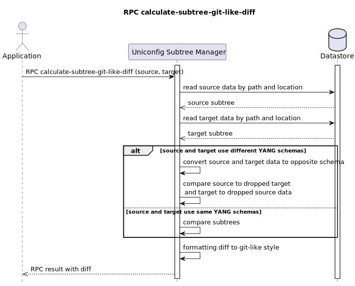

RPC calculate-subtree-git-like-diff
===================================

This RPC creates diff between actual topology subtrees and intended
topology subtrees. Subtrees can be specified under different nodes, it
only compares data hierarchy and values. RPC input contains paths
('source-path' and 'target-path') and data location ('source-datastore'
and 'target-datastore'). Data location is enumeration with two possible
values 'OPERATIONAL' or 'CONFIGURATION'. The output of the RPC is a
difference between two subtrees which are is in a git-like style.

RPC Examples
------------

### Successful example

RPC calculate-subtree-git-like-diff input has path to two interfaces
that are on different nodes. Both data locations are placed in the
CONFIGURATION datastore. Output contains a list of all the changes on
different paths. Multiple changes that occur under the same root element
are merged together. Every change has at least a source or a target
path, or both if some data are updated on that path.

> **RPC Request**
>
> **RPC request:**

> **RPC Response**
>
> **RPC response:**

* * * * *

### Successful example

The following output demonstrates a situation, when there are no changes
on different subtrees.

> **RPC Request**
>
> **RPC request:**

> **RPC Response**
>
> **RPC response:**

* * * * *

### Failed example

RPC input does not contain target node YIID, so RPC can not be executed.

> **RPC Request**
>
> **RPC request:**

> **RPC Response**
>
> **RPC response:**

### Failed example

RPC input does not contain target datastore type, so RPC can not be
executed.

> **RPC Request**
>
> **RPC request:**

> **RPC Response**
>
> **RPC response:**
