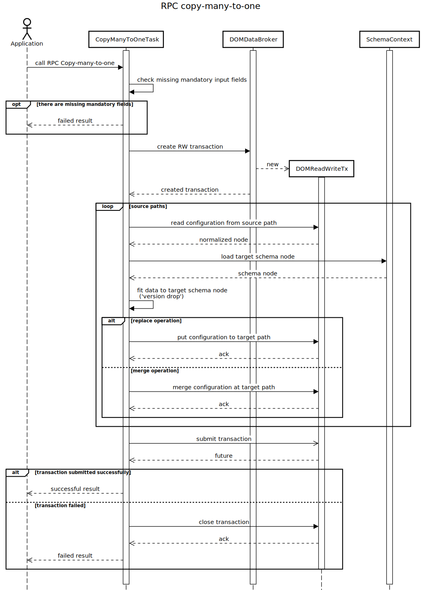

RPC copy-many-to-one
====================

RPC input contains:

-   type of operation - 'merge' or 'replace',
-   type of source datastore - CONFIGURATION / OPERATIONAL,
-   type of target datastore - CONFIGURATION / OPERATIONAL,
-   list of source paths in RFC-8040 URI formatting,
-   target path in RFC-8040 URI formatting (target path denotes parent
    entities under which configuration is copied).

Target datastore is optional input field. By default, it is the same as
source datastore. Other input fields are mandatory, so it is forbidden
to call RPC with missing mandatory field. Output of RPC describes result
of copy to target path RPC. If one path failed for any reason, RPC will
be failed overall and no modification will be done to datastore - all
modifications are done in the single atomic transaction.

Description of RPC copy-many-to-one is on figure below.

RPC Examples
------------

### Successful example

The following example demonstrates execution of copy-many-to-one RPC
with 3 source paths. Data that is described by these source paths
('snmp', 'access', and 'ntp' containers under three different nodes)
will be copied under root 'system:system' container ('dev04' node).

> **RPC Request**
>
> **RPC request:**

> **RPC Response**
>
> **RPC response:**

* * * * *

### Failed example

The following example shows failed copy-many-to-one RPC. One of the
source paths points to non-existing schema node ('invalid:invalid').

> **RPC Request**
>
> **RPC request:**

> **RPC Response**
>
> **RPC response:**
