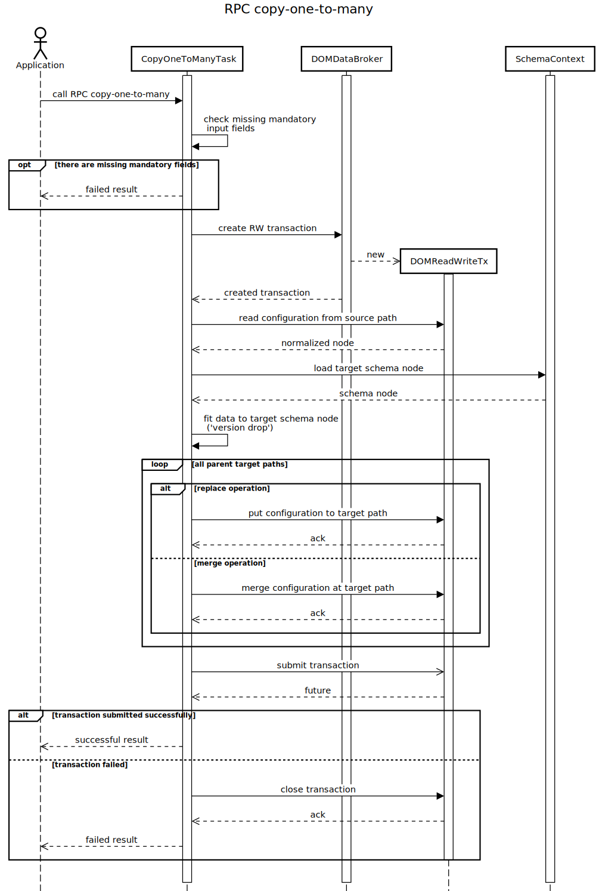

# RPC copy-one-to-many

RPC input contains:

- type of operation - 'merge' or 'replace',
- type of source datastore - CONFIGURATION / OPERATIONAL,
- type of target datastore - CONFIGURATION / OPERATIONAL,
- source path in RFC-8040 URI formatting, list of target paths in RFC-8040 URI formatting (target paths denote
    parent entities under which configuration is copied).

Target datastore is optional input field. By default, it is the same as
source datastore. Other input fields are mandatory, so it is forbidden
to call RPC with missing mandatory field. Output of RPC describes result
of copy to target paths RPC. If one path failed for any reason, RPC will
be failed overall and no modification will be done to datastore - all
modifications are done in the single atomic transaction.

Description of RPC copy-one-to-many is on figure below.



## RPC Examples

### Successful example

The following example demonstrates merging of ethernet interface
configuration from single source into interfaces 'eth-0/2' (node
'dev02'), 'eth-0/3' (node 'dev02'), 'eth-0/100' (node 'dev03'), and
'eth-0/200' (node 'dev03').

```bash RPC Request
curl --location --request POST 'http://localhost:8181/rests/operations/subtree-manager:copy-one-to-many' \
--header 'Accept: application/json' \
--header 'Content-Type: application/json' \
--data-raw '{
    "input": {
        "source-datastore": "CONFIGURATION",
        "target-datastore": "OPERATIONAL",
        "source-path": "/network-topology:network-topology/topology=uniconfig/node=dev01/configuration/interfaces:interfaces/eth=eth-0%2F2/config",
        "target-paths": [
            "/network-topology:network-topology/topology=uniconfig/node=dev02/configuration/interfaces:interfaces/eth=eth-0%2F2",
            "/network-topology:network-topology/topology=uniconfig/node=dev02/configuration/interfaces:interfaces/eth=eth-0%2F3",
            "/network-topology:network-topology/topology=uniconfig/node=dev03/configuration/interfaces:interfaces/eth=eth-0%2F100",
            "/network-topology:network-topology/topology=uniconfig/node=dev03/configuration/interfaces:interfaces/eth=eth-0%2F200"
        ],
        "operation": "merge"
    }
}'
```

```json RPC Response, Status: 200
{
    "output": {
    }
}
```

### Failed example

The next example shows failed copy-one-to-many RPC - both target paths
are invalid since 'ext' list schema nodes doesn't contain
'interfaces:interfaces' child container.

```bash RPC Request
curl --location --request POST 'http://localhost:8181/rests/operations/subtree-manager:copy-one-to-many' \
--header 'Accept: application/json' \
--header 'Content-Type: application/json' \
--data-raw '{
    "input": {
        "source-datastore": "OPERATIONAL",
        "source-path": "/network-topology:network-topology/topology=uniconfig/node=vnf01/configuration/interfaces:interfaces",
        "target-paths": [
            "/network-topology:network-topology/topology=uniconfig/node=vnf02/configuration/interfaces:interfaces/ext=ext-0%2F2",
            "/network-topology:network-topology/topology=uniconfig/node=vnf02/configuration/interfaces:interfaces/ext=ext-0%2F3"
        ],
        "operation": "replace"
    }
}'
```

```json RPC Response, Status: 200
{
    "output": {
        "error-message": "Failed to find schema node with identifier '(example-interfaces?revision=2019-12-01)interfaces' under: (example-interfaces?revision=2019-12-01)ext",
        "result": "fail"
    }
}
```
