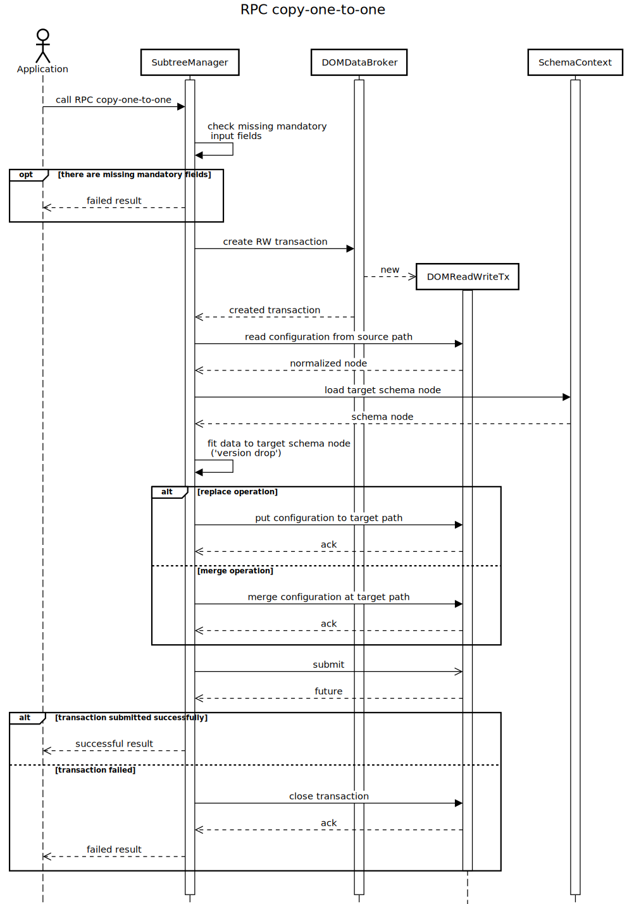

# RPC copy-one-to-one

RPC input contains:

- type of operation - 'merge' or 'replace',
- type of source datastore - CONFIGURATION / OPERATIONAL,
- type of target datastore - CONFIGURATION / OPERATIONAL,
- source path in RFC-8040 URI formatting,
- target path in RFC-8040 URI formatting (target path denote parent
    entities under which configuration is copied).

Target datastore is optional input field. By default, it is the same as
source datastore. Other input fields are mandatory, so there is
forbidden to call RPC with missing mandatory field. Output of RPC
describes result of copy to target path operation. If RPC failed for
some reason, RPC will be failed and no modification will be done to
datastore.

Description of RPC copy-one-to-one is on figure below.



## RPC Examples

### Successful example

The following example demonstrates coping of whole 'org:orgs' container
from 'dev01' to 'dev02' node under 'uniconfig' topology. Replace
operation is used.

```bash RPC Request
curl --location --request POST 'http://localhost:8181/rests/operations/subtree-manager:copy-one-to-one' \
--header 'Accept: application/json' \
--header 'Content-Type: application/json' \
--data-raw '{
    "input": {
        "source-datastore": "CONFIGURATION",
        "target-datastore": "OPERATIONAL",
        "source-path": "/network-topology:network-topology/topology=uniconfig/node=dev01/configuration/org:orgs",
        "target-path": "/network-topology:network-topology/topology=uniconfig/node=dev02/configuration",
        "operation": "replace"
    }
}'
```

```json RPC Response, Status: 200
{
    "output": {
        "result": "complete"
    }
}
```

### Failed example

The following example shows failed copy-one-to-one RPC. Input contains
specified source datastore (target datastore is the same), merge
operation, source path, and target path. In that example target path is
invalid, because it doesn't contain 'org:orgs' container in the schema
tree.

```bash RPC Request
curl --location --request POST 'http://localhost:8181/rests/operations/subtree-manager:copy-one-to-one' \
--header 'Accept: application/json' \
--header 'Content-Type: application/json' \
--data-raw '{
    "input": {
        "source-datastore": "CONFIGURATION",
        "source-path": "/network-topology:network-topology/topology=uniconfig/node=vnf01/configuration/org:orgs",
        "target-path": "/network-topology:network-topology/topology=uniconfig/node=vnf02",
        "operation": "merge"
    }
}'
```

```json RPC Response, Status: 200
{
    "output": {
        "error-message": "Failed to find schema node with identifier '(example-services?revision=2010-01-01)orgs' under: NodeList(originalListSchemaNode=list node)",
        "result": "fail"
    }
}
```
