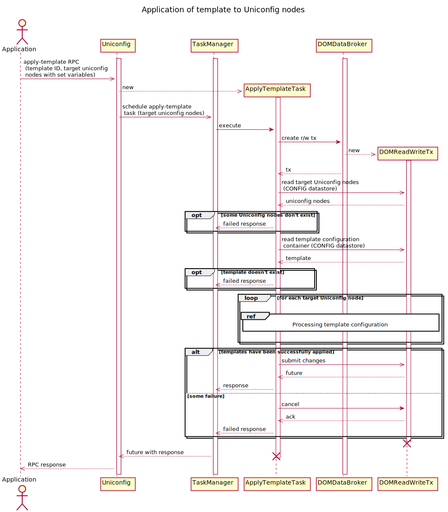
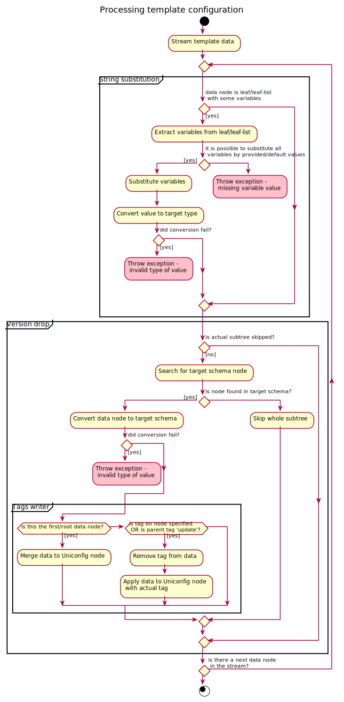

Templates Manager
=================

Overview
--------

Templates can be used for reusing of some configuration and afterwards
easier application of this configuration into target UniConfig nodes.

Basic properties of templates as they are implemented in UniConfig:

-   All templates are stored under 'templates' topology and each
    template is represented by separate 'node' list entry.
-   Whole template configuration is placed under
    'frinx-uniconfig-topology:configuration' container in the
    Configuration datastore. Because of this, configuration of template
    can be accessed and modified in the same way like modification of
    UniConfig node.
-   Templates are validated against single schema context. Schema
    context, against which validation is enabled, is selected at
    creation of template using 'uniconfig-schema-repository' query
    parameter. Value of the query parameter defines name of the schema
    repository that is placed under UniConfig distribution in form of
    the directory.

Currently implemented template features:

-   **Variables** - They are used for parametrisation of templates.
-   **Tags** - Tags can be used for selection of an operation that
    should be applied for the specific subtree at application of
    template to UniConfig node.

> **note**
>
> Schema validation of leaves and leaf-lists is adjusted, so it can
> accept both string with variables and original YANG type.

Variables
---------

Using variables it is possible to parametrise values in the template.
Structural parametrisation is not currently supported.

Properties:

-   Format of the variable: '{\$variable-id}'.
-   Variables can be set to each leaf and leaf-list in the template.
-   Single leaf or leaf-list may contain multiple variables.
-   Key of the list can also contain variable.
-   Variables are substituted by provided values at the application of
    template to UniConfig node.
-   It is possible to escape characters of the variable pattern ('\$',
    '{', '}'), so they will be interpreted as value and not part of the
    variable.
-   Variable identifier may contain any UTF-8 characters. Characters
    '\$', '{', '}' must be escaped, if they are part of the variable
    identifier.

### Examples with variables

**A. Leaf with one variable**

-   The following example shows 2 leaves with 2 variables: 'var-1' and
    'var-2'.

``` {.sourceCode .json}
{
  "leaf-a": "{$var-1}",
  "leaf-b": "{$var-2}"
}
```

Application of values '10' and 'false' to 'var-1', and 'var-2'. Leaf
'leaf-a' has 'int32' type and 'leaf-b' has 'boolean' type.

``` {.sourceCode .json}
{
  "leaf-a": 10,
  "leaf-b": false
}
```

**B. Leaf with multiple variables**

-   Leaf 'leaf-a' contains 2 variables and surrounding text that is not
    part of any variable.
-   Leaf 'leaf-b' contains 2 variable without additional text -
    substituted values of these variables are concatenated at
    application of template.

``` {.sourceCode .json}
{
  "leaf-a": "custom {$var-x} text {$var-y}",
  "leaf-b": "{$var-1}{$var-2}"
}
```

Application of values - 'var-x': 'next', 'var-y': '7', 'var-1': '10',
'var-2': '9'. Leaf 'leaf-a' has 'string' type and 'leaf-b' has 'int32'
type.

``` {.sourceCode .json}
{
  "leaf-a": "custom next text 7",
  "leaf-b": 109
}
```

**C. Leaf-list with one variable**

-   Leaf-list 'leaf-list-a' contains variable with identifier 'var-x'.
-   This variable can be substituted by one or multiple values. If
    multiple values are provided in the apply-template RPC, they are
    'unwrapped' to the leaf-list in form of next leaf-list entries.

``` {.sourceCode .json}
{
  "leaf-list-a": [
    "{$var-x}"
  ]
}
```

Substitution of 'var-x' with numbers '10', '20', '30' results in
('int32' type):

``` {.sourceCode .json}
{
  "leaf-list-a": [
    10, 20, 30
  ]
}
```

**D. Leaf-list with multiple variables**

-   Leaf-list 'leaf-list-a' contains 2 variables with identifiers
    'var-a' and 'var-2'. String "str3" represents constant value.
-   It is possible to substitute both variables with one or multiple
    variables.

``` {.sourceCode .json}
{
  "leaf-list-a": [
    "{$var-a}",
    "str3",
    "{$var-b}"
  ]
}
```

Substitution of 'var-a' with texts 'str1', 'str2' and 'var-b' with
'str4' results in ('string' type):

``` {.sourceCode .json}
{
  "leaf-list-a": [
    "str1",
    "str2",
    "str3",
    "str4"
  ]
}
```

> **note**
>
> If leaf-list is marked as "ordered-by user", then the order of
> leaf-list elements is preserved during substitution process.

**E. Leaf-list with entry that contains multiple variables**

-   Leaf-list 'leaf-list-a' contains 2 variables inside one leaf-list
    entry: 'var-a' and 'var-b'.
-   Both variables must be substituted by the same number of values.

``` {.sourceCode .json}
{
  "leaf-list-a": [
    "ratio: {$var-a}%{$var-b}",
    "strX"
  ]
}
```

-   Application of following values to variables 'var-a' and 'var-b':
    'var-a' = ['10', '20', '30'], 'var-b' = ['50', '70', '60'].

``` {.sourceCode .json}
{
  "leaf-list-a": [
    "ratio: 10%50",
    "ratio: 20%70",
    "ratio: 30%60",
    "strX"
  ]
}
```

**F. Leaves and leaf-lists with escaped special characters**

-   The following example demonstrates escaping of special characters
    outside of the variable identifier (leaf-list 'leaf-list-a') and
    inside of the variable identifier (leaf 'leaf-a').
-   Unescaped identifier of the leaf 'leaf-a': 'var-{2}'.

``` {.sourceCode .json}
{
  "leaf-list-a": [
    "{$var-1} text \\{\\$this-is-not-variable\\}"
  ],
  "leaf-a": "{$var-\\{2\\}}"
}
```

Substitution of 'var-1' by 'prefix' and 'var-{2}' by '10':

``` {.sourceCode .json}
{
  "leaf-list-a": [
    "prefix text {$this-is-not-variable}"
  ],
  "leaf-a": 10
}
```

Tags
----

By default, all templates have assigned 'merge' tag to the root
'configuration' container - if template doesn't explicitly define next
tags in the data-tree, then the whole template is merged to target
UniConfig node configuration at execution of apply-template RPC.
However, it is possible to set custom tags to data-tree elements of the
template.

Properties:

-   Tags are represented in UniConfig using node attributes with the
    following identifier: 'template-tags:operation'.
-   In RESTCONF, attributes are encoded using special notation that is
    explained in the 'RESTCONF' user guide.
-   Tags are inherited through the data-tree of the template. If
    data-tree element doesn't define any tag, then it is inherited from
    parent element.
-   Only single tag can be applied to one data node.
-   Tags can be applied to following YANG structures: container, list,
    leaf-list, leaf, list entry, leaf-list entry.

Currently, the following tags are supported:

-   **merge**: Merges with a node if it exists, otherwise creates the
    node.
-   **replace**: Replaces a node if it exists, otherwise creates the
    node.
-   **delete**: Deletes the node.
-   **create**: Creates a node. The node can not already exist. An error
    is raised if the node exists.
-   **update**: Merges with a node if it exists. If it does not exist,
    it will not be created.

### Examples with tags

**A. Tags applied to container, list, and leaf**

Template with name 'user\_template' that contains 'merge', 'replace',
and 'create' tags:

``` {.sourceCode .json}
{
  "node": [
    {
      "node-id": "user_template",
      "frinx-uniconfig-topology:configuration": {
        "system:system": {
          "@": {
            "template-tags:operation": "update"
          },
          "users": {
            "@": {
              "template-tags:operation": "replace"
            },
            "#": [
              {
                "name": "test-${username}",
                "login": "{$login}",
                "role": "{$role}",
                "password": {
                  "@": {
                    "template-tags:operation": "create"
                  },
                  "#": "{$password}"
                }
              }
            ]
          }
        }
      }
    }
  ]
}
```

Description of all operations in the correct order that are done based
on the defined tags:

-   Container 'configuration' will be merged to target UniConfig node
    (implicit root operation).
-   Container 'system:system' will be updated - its content is merged
    only, if it has already been created.
-   The whole list 'users' will replaced in the target UniConfig node.
-   Leaf named 'password' will be created at the target UniConfig node -
    it cannot exist under 'users' list entry, otherwise the error will
    be raised.

**B: Tags applied to leaf-list, leaf-list entry, and list entry**:

The following JSON represents content of sample template with multiple
tags:

-   'replace' tag is applied to single list 'my-list' entry
-   'merge' tag is applied to whole 'leaf-list-a' leaf-list
-   'create' tag is applied to whole 'leaf-list-b' leaf-list
-   'delete' tag is applied to single leaf-list 'leaf-list-b' entry with
    value '10'

``` {.sourceCode .json}
{
  "c1": {
    "my-list": [
      {
        "key": "k1",
        "value": 10,
        "@": {
          "template-tags:operation": "replace"
        }
      }
    ],
    "leaf-list-a": {
      "@": {
        "template-tags:operation": "merge"
      },
      "#": [
        10,
        20
      ]
    },
    "leaf-list-b": {
      "@": {
        "template-tags:operation": "create"
      },
      "#": [
        {
          "@": {
            "template-tags:operation": "delete"
          },
          "#": 10
        }
      ]
    }
  }
}
```

Creation of template
--------------------

A new template can be created by sending PUT request to new template
node under 'templates' topology with populated 'configuration'
container. Name of the template equals to name of the 'node' list entry.
This RESTCONF call must contain specified schema cache repository using
the 'uniconfig-schema-repository' query parameter in order to
successfully match sent data-tree with correct schema context (it is
usually associated with some type of NETCONF device).

### Example - creation of template

The following example shows creation of new template with name
'interface\_template' using 'schemas\_1' schema repository. The body of
the PUT request contains whole 'configuration' container.

> **PUT Request**
>
> **PUT request:**

> **PUT Response**
>
> **PUT response:**

* * * * *

Read/update/delete template
---------------------------

All CRUD operations with templates can be done using standard RESTCONF
PUT/DELETE/POST/PLAIN PATCH methods. As long as template contains some
data under 'configuration' container, next RESTCONF calls, that work
with templates, don't have to contain 'uniconfig-schema-repository'
query parameter, since type of the device is already known.

### Examples - RESTCONF operations

Reading specific subtree under 'interface\_template' - unit with name
'{\$unit-id}' that is placed under interface with name
'eth-0/{\$interface-id}'.

> **GET Request**
>
> **GET request:**

> **GET Response**
>
> **GET response:**

* * * * *

Changing 'update' tag of the 'address' list entry to 'create' tag using
PLAIN-PATCH RESTCONF method.

> **PATCH Request**
>
> **PATCH request:**

> **PATCH Response**
>
> **PATCH response:**

* * * * *

Application of template
-----------------------

Template can be applied to UniConfig nodes using 'apply-template' RPC.
This procedure does following steps:

1.  **Read template** - Reading of template configuration from
    'templates' topology in Configuration datastore.
2.  **String-substitution** - Substitution of variables by provided
    values or default values, if there aren't any provided values for
    some variables and leaf/leaf-list defines a default values. If some
    variables cannot be substituted (for example, user forgot to specify
    input value of variable), an error will be returned.
3.  **Version-drop** - Conversion of template into target schema context
    that is used by target UniConfig node. This component also drops
    unsupported data from input template. Because of this feature, it is
    possible to apply template between different versions of devices
    with different revisions of YANG schemas but with similar structure.
    Version-drop is also aware of 'ignoredDataOnWriteByExtensions'
    RESTCONF filtering mechanism.
4.  **Application of tags** - Data-tree of the template is streamed and
    data is applied to target UniConfig node based on set tags on data
    elements, recursively. UniConfig node configuration is updated only
    in the Configuration datastore.

Description of input RPC fields:

-   **template-node-id**: Name of the existing input template.
-   **uniconfig-node**: List of target UniConfig nodes to which template
    is applied ('uniconfig-node-id' is the key).
-   **uniconfig-node-id**: Target UniConfig node identifier.
-   **variable**: List of variables and substituted values that must be
    used during application of template to UniConfig node. Variables
    must be set per target UniConfig node since it is common, that
    values of variables should be different on different devices. Leaf
    'variable-id' represents the key of this list.
-   **variable-id**: Unescaped variable identifier.
-   **leaf-value**: Scalar value of the variable. Special characters
    ('\$', '{', '}') must be escaped.
-   **leaf-list-values**: List of values - it can be used only with
    leaf-lists. Special characters ('\$', '{', '}') must be escaped.

Description of fields in RPC response:

-   **overall-status**: Overall status of the operation as the whole. If
    application of the template fails on at least one UniConfig node,
    then overall-status will be set to 'fail' (no modification will be
    done in datastore). Otherwise, it will be set to 'complete'.
-   **node-result**: Per target UniConfig node results. The rule is
    following - all input UniConfig node IDs must also present in the
    response.
-   **node-id**: Target UniConfig node identifier (key of the list).
-   **status**: Status of the operation: 'complete' or 'fail'.
-   **error-message** (optional): Description of the error that occurred
    during application of template.
-   **error-type** (optional): Type of the error.

The following sequence diagram and nested activity diagram show process
of 'apply-template' RPC in detail.





### Examples - apply-template calls

Successful application of the template 'service\_group' to 2 UniConfig
nodes - 'dev1' and 'dev2'.

> **RPC Request**
>
> **RPC request:**

> **RPC Response**
>
> **RPC response:**

* * * * *

Failed application of the template 'temp1' - template doesn't exist.

> **RPC Request**
>
> **RPC request:**

> **RPC Response**
>
> **RPC response:**

* * * * *

Failed application of the template 'service\_group' to 2 UniConfig nodes
- 'dev1' and 'dev2' - user hasn't provided values for all required
variables.

> **RPC Request**
>
> **RPC request:**

> **RPC Response**
>
> **RPC response:**

* * * * *

Failed application of the template 'redundancy\_template' to UniConfig
node 'dev1' - type of the substituted variable value is invalid (failed
regex constraint).

> **RPC Request**
>
> **RPC request:**

> **RPC Response**
>
> **RPC response:**
