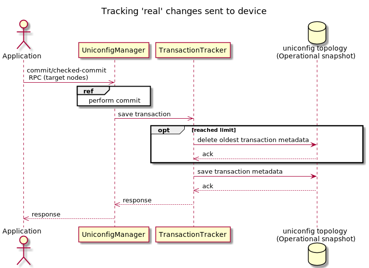

Transaction tracker
===================

Introduction
------------

The transaction tracker is responsible for saving a transaction-metadata
to the operational snapshot after successfully executed
commit/checked-commit RPC. The transaction-metadata contains information
about performed transactions, such as:

-   **transaction-id** - Identifier of transaction.
-   **username** - The name of the user who made changes.
-   **commit-time** - Timestamp of changes. If multiple devices are
    configured, then the 'commit-time' will contains the timestamp of
    the last update on the last device.
-   **metadata** - Items in this field represent nodes that have been
    configured in the one transaction. Each item contains a diff item
    with additional information.

    > -   **diff** - Items in this field are a specific changes. Each
    >     item contains path to changes, data before change and data
    >     after change.

> **note**
>
> Data-before is visible only if data was updated or deleted.
>
> Data-after is visible only if data was updated or created.

[](transaction-tracker.png)

Configuration
-------------

The UniConfig stores transaction metadata only if the
'lighty-uniconfig-config.json' file contains a "maxStoredTransactions"
parameter in "transactions" container and its value is greater then 0.
It is necessary to make this setting before running UniConfig, otherwise
parameter "maxStoredTransactions" will be '0' (default value) and
transaction-log will be disabled.

``` {.sourceCode .json}
{
    "transactions": {
        "maxStoredTransactions": 5,
        "maxTransactionAge": 0,
        "cleaningInterval": 0,
        "uniconfigTransactionEnabled": false
    }
}
```

### Show transaction-metadata

The response to this GET request contains all stored
transaction-metadata, their IDs and other items such as node-id, updated
data before update and after update, etc.

> **GET Request**
>
> **GET Request:**

> **GET Response**
>
> **GET response:**

* * * * *
