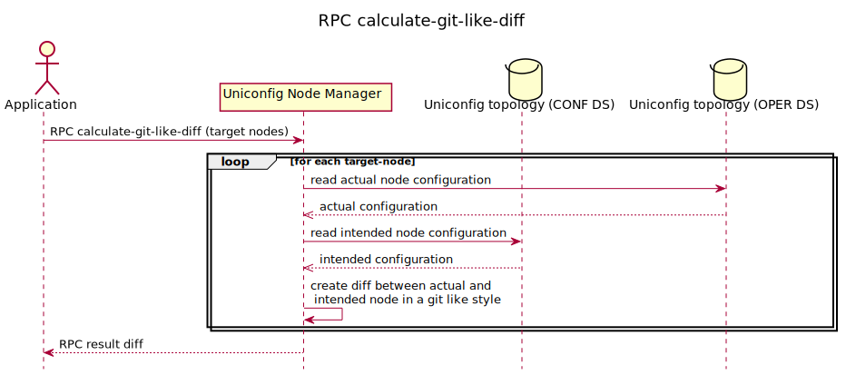

# RPC calculate-git-like-diff

This RPC creates a diff between the actual UniConfig topology nodes and
the intended UniConfig topology nodes. The RPC input contains a list of
UniConfig nodes to calculate the diff. Output of the RPC contains a list
of statements representing the diff after the commit in a git-like
style. It checks for every touched node in the transaction if target
nodes are not specified in the input. If one node failed for any reason,
the RPC will fail entirely.



## RPC Examples

### Successful Example

The RPC calculate-diff input has no target nodes specified so it will
look for all touched nodes in the transaction, and the output will
contain a list of all changes on different paths. Multiple changes that
occur under the same path are merged together.

```bash RPC Request
curl --location --request POST 'http://localhost:8181/rests/operations/uniconfig-manager:calculate-git-like-diff' \
--header 'Accept: application/json' \
--header 'Content-Type: application/json' \
--data-raw '{
    "input": {
        "target-nodes": {
        }
    }
}'
```

```json RPC Response, Status: 200
{
    "output": {
        "node-results": {
            "node-result": [
                {
                    "node-id": "XR5",
                    "status": "complete",
                    "changes": [
                        {
                            "data": "  {\n    \"frinx-openconfig-interfaces:interfaces\": {\n      \"interface\": [\n        {\n          \"key\":\"MgmtEth0/0/CPU0/0\",\n          \"subinterfaces\": {\n            \"subinterface\": [\n              {\n                \"key\":\"0\",\n                \"frinx-openconfig-if-ip:ipv4\": {\n                  \"addresses\": {\n                    \"address\": [\n                      {\n                        \"key\":\"192.168.1.214\",\n-                       \"frinx-openconfig-if-ip:config\": {\n-                         \"prefix-length\":\"24\",\n-                         \"ip\":\"192.168.1.214\"\n-                       },\n+                       \"frinx-openconfig-if-ip:config\": {\n+                         \"prefix-length\":\"27\",\n+                         \"ip\":\"192.168.1.214\"\n+                       }\n                      }\n                    ]\n                  }\n                },\n-               \"frinx-openconfig-interfaces:config\": {\n-                 \"index\":\"0\"\n-               },\n+               \"frinx-openconfig-interfaces:config\": {\n+                 \"index\":\"15\"\n+               }\n              }\n            ]\n          },\n-         \"frinx-openconfig-interfaces:config\": {\n-           \"name\":\"MgmtEth0/0/CPU0/0\",\n-           \"type\":\"iana-if-type:other\",\n-           \"enabled\":\"true\"\n-         },\n+         \"frinx-openconfig-interfaces:config\": {\n+           \"name\":\"MgmtEth0/0/CPU0/0\",\n+           \"type\":\"iana-if-type:other\",\n+           \"enabled\":\"false\"\n+         }\n        }\n      ]\n    }\n  }\n",
                            "path": "/network-topology:network-topology/topology=uniconfig/node=XR5/frinx-uniconfig-topology:configuration/frinx-openconfig-interfaces:interfaces"
                        }
                    ]
                }
            ]
        },
        "overall-status": "complete"
    }
}
```

### Failed Example

If the RPC input does not contain the target nodes and there weren't any
touched nodes, the request will result in an error.

```bash RPC Request
curl --location --request POST 'http://localhost:8181/rests/operations/uniconfig-manager:calculate-git-like-diff' \
--header 'Accept: application/json' \
--header 'Content-Type: application/json' \
--data-raw '{
    "input": {
        "target-nodes": {
        }
    }
}'
```

```json RPC Response, Status: 200
{
    "output": {
        "error-message": "There aren't any nodes specified in input RPC and there aren't any touched nodes.",
        "overall-status": "fail"
    }
}
```
