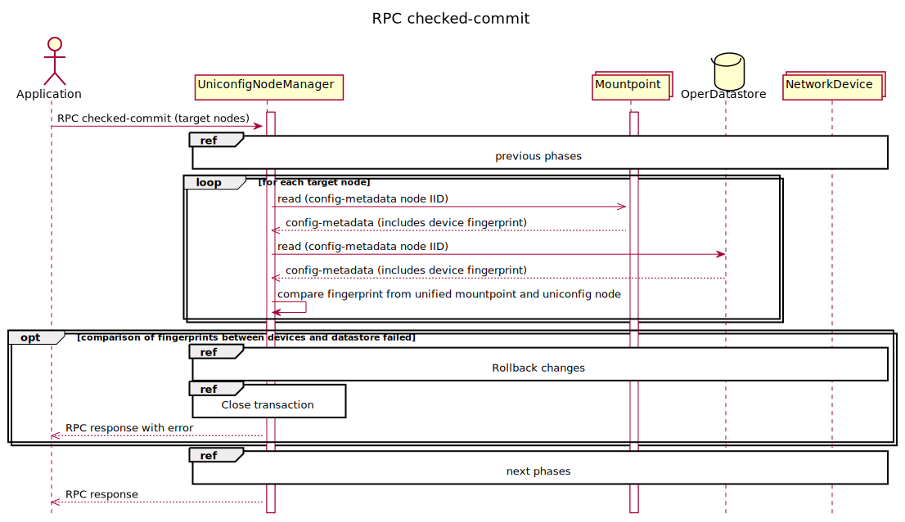

# RPC checked-commit

The trigger for execution of the checked configuration is RPC
checked-commit. A checked commit is similar to an RPC commit but it also
checks if nodes are in sync with the network before it starts
configuration. RPC fails if any node is out of sync. Output of the RPC
describes the result of the commit and matches all modified nodes in the
UniConfig transaction. If one node failed for any reason, RPC will fail
entirely.

In comparison to commit RPC, there is one additional phase between 'lock
and validate configured nodes' and 'write configuration into device'
phases:

1. Lock and validate configured nodes
2. Check if nodes are in-sync with state on devices
3. Write configuration into device
4. Validate configuration
5. Confirmed commit
6. Confirming commit (submit configuration)

Following diagram captures check if configuration fingerprints in the
transaction datastore and device are equal.



!!!
There is a difference between fingerprint-based validation in the
phases 1 and 2. The goal of the first phase is validation if other
transaction has already changed the same node by comparison of
fingerprint in the UniConfig transaction and in the database. On the
other side, the second phase validates if fingerprint in the
transaction equals to fingerprint on the device - if another system /
directly user via CLI has updated device configuration since the
beginning of the transaction.
!!!

## RPC Examples

### Successful Example

RPC checked-commit input has 2 target nodes and the output describes the
result of the checked-commit.

```bash RPC Request
curl --location --request POST 'http://localhost:8181/rests/operations/uniconfig-manager:checked-commit' \
--header 'Accept: application/json' \
--header 'Content-Type: application/json' \
--data-raw '{
    "input": {
        "target-nodes": {
            "node": ["IOSXR","IOSXRN"]
        }
    }
}'
```

```json RPC Response, Status: 200
{
    "output": {
        "overall-status": "complete",
        "node-results": {
            "node-result": [
                {
                    "node-id": "IOSXRN",
                    "configuration-status": "complete"
                },
                {
                    "node-id": "IOSXR",
                    "configuration-status": "complete"
                }
            ]
        }
    }
}
```

### Successful Example

If the RPC input does not contain the target nodes, all touched nodes
will be invoked.

```bash RPC Request
curl --location --request POST 'http://localhost:8181/rests/operations/uniconfig-manager:checked-commit' \
--header 'Accept: application/json' \
--header 'Content-Type: application/json' \
--data-raw '{
    "output": {
        "overall-status": "complete",
        "node-results": {
            "node-result": [
                {
                    "node-id": "IOSXRN",
                    "configuration-status": "complete"
                },
                {
                    "node-id": "IOSXR",
                    "configuration-status": "complete"
                }
            ]
        }
    }
}'
```

```json RPC Response, Status: 200
{
    "output": {
        "overall-status": "complete"
    }
}
```

### Failed Example

RPC checked-commit input has 2 target nodes. One of them failed on
configuration (IOSXRN). The output describes the result of the
checked-commit.

```bash RPC Request
curl --location --request POST 'http://localhost:8181/rests/operations/uniconfig-manager:checked-commit' \
--header 'Accept: application/json' \
--header 'Content-Type: application/json' \
--data-raw '{
    "input": {
        "target-nodes": {
            "node": ["IOSXR","IOSXRN"]
        }
    }
}'
```

```json RPC Response, Status: 200
{
    "output": {
        "overall-status": "fail",
        "node-results": {
            "node-result": [
                {
                    "node-id": "IOSXRN",
                    "error-type": "processing-error",
                    "rollback-status": "complete",
                    "error-message": "Supplied value \"GigabitEthernet0/0/0/1ghjfhjfhjfghj\" does not match required pattern \"^(([a-zA-Z0-9_]*\\d+/){3,4}\\d+)|(([a-zA-Z0-9_]*\\d+/){3,4}\\d+\\.\\d+)|(([a-zA-Z0-9_]*\\d+/){2}([a-zA-Z0-9_]*\\d+))|(([a-zA-Z0-9_]*\\d+/){2}([a-zA-Z0-9_]+))|([a-zA-Z0-9_-]*\\d+)|([a-zA-Z0-9_-]*\\d+\\.\\d+)|(mpls)|(dwdm)$\"\n",
                    "configuration-status": "fail"
                },
                {
                    "node-id": "IOSXR",
                    "configuration-status": "complete",
                    "rollback-status": "complete"
                }
            ]
        }
    }
}
```

### Failed Example

The RPC checked-commit input has 2 target nodes. One of them has failed
on the changed fingerprint (IOSXRN) and the other has a bad
configuration (IOSXR). The output describes the result of the
checked-commit.

```bash RPC Request
curl --location --request POST 'http://localhost:8181/rests/operations/uniconfig-manager:checked-commit' \
--header 'Accept: application/json' \
--header 'Content-Type: application/json' \
--data-raw '{
    "input": {
        "target-nodes": {
            "node": ["IOSXR","IOSXRN"]
        }
    }
}'
```

```json RPC Response, Status: 200
{
    "output": {
        "overall-status": "fail",
        "node-results": {
            "node-result": [
                {
                    "node-id": "IOSXRN",
                    "error-type": "processing-error",
                    "error-message": "Fingerprint from datastore: 2019-09-04T09:32:41 is different than fingerprint from device: 2019-09-04T09:49:01",
                    "configuration-status": "fail"
                },
                {
                    "node-id": "IOSXR",
                    "configuration-status": "fail",
                    "error-type": "processing-error"
                }
            ]
        }
    }
}
```

### Failed Example

The RPC checked-commit input has 3 target nodes. One of them was deleted
so it is missing in the Config Datastore(IOSXR), the other has not been
mounted yet (AAA). The output describes the result of the
checked-commit.

```bash RPC Request
curl --location --request POST 'http://localhost:8181/rests/operations/uniconfig-manager:checked-commit' \
--header 'Accept: application/json' \
--header 'Content-Type: application/json' \
--data-raw '{
    "input": {
        "target-nodes": {
            "node": ["IOSXR","IOSXRN","AAA"]
        }
    }
}'
```

```json RPC Response, Status: 200
{
    "output": {
        "overall-status": "fail",
        "node-results": {
            "node-result": [
                {
                    "node-id": "AAA",
                    "error-type": "no-connection",
                    "error-message": "Node has not been mounted yet.",
                    "configuration-status": "fail"
                },
                {
                    "node-id": "IOSXRN",
                    "configuration-status": "fail",
                    "error-type": "processing-error"
                },
                {
                    "node-id": "IOSXR",
                    "error-type": "processing-error",
                    "error-message": "Node is missing in uniconfig topology CONFIG datastore.",
                    "configuration-status": "fail"
                }
            ]
        }
    }
}
```

### Failed Example

If the RPC input does not contain the target nodes and there weren't any
touched nodes, the request will result in an error.

```bash RPC Request
curl --location --request POST 'http://localhost:8181/rests/operations/uniconfig-manager:checked-commit' \
--header 'Accept: application/json' \
--header 'Content-Type: application/json' \
--data-raw '{
    "input": {
        "target-nodes": {
        }
    }
}'
```

```json RPC Response, Status: 200
{
    "output": {
        "error-message": "There aren't any nodes specified in input RPC and there aren't any touched nodes.",
        "overall-status": "fail"
    }
}
```
