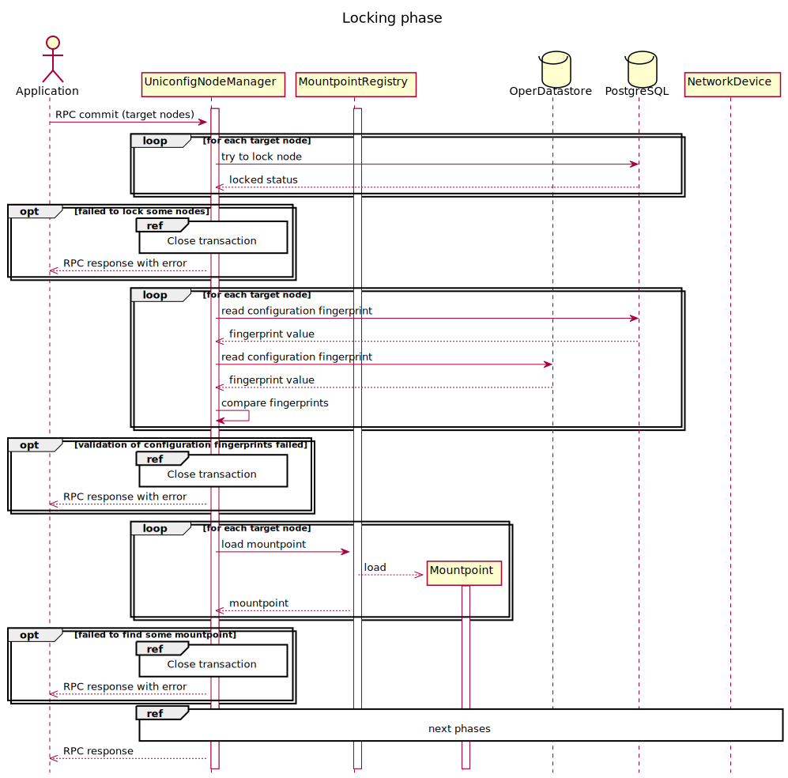
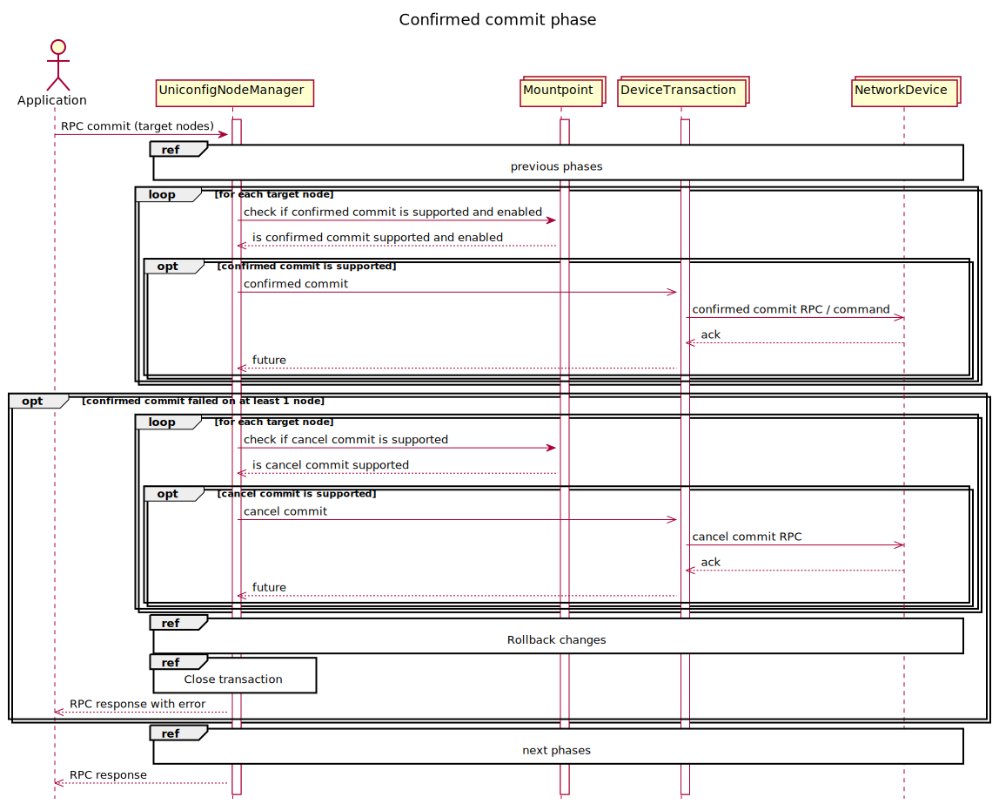

# RPC commit

The external application stores the intended configuration under nodes
in the UniConfig topology. The trigger for execution of configuration is
an RPC commit. Output of the RPC describes the result of the commit and
matches all modified nodes in the UniConfig transaction.

The configuration of nodes consists of the following phases:

1. Lock and validate configured nodes - Locking all modified nodes
    using PostgreSQL advisory locks and validation of fingerprints - if
    another transaction tries to commit overlapping nodes or different
    transaction has already changed one of the nodes, then commit will
    fail at this step.
2. Write configuration into device - Pushing calculated changes into
    device without committing of this changes.
3. Validate configuration - Validation of written configuration from
    the view of constraints and consistency.
    This phase can be skipped with "do-validate" flag.
4. Confirmed commit - It is used for locking of device configuration,
    so no other transaction can touch this device.
5. Confirming commit (submit configuration) - Persisting all changes on
    devices and in the PostgreSQL database. UniConfig transaction is
    closed.


The third and fourth phases take place only on the nodes that support
these operations. If one node failed in the random phase for any reason
the RPC will fail entirely. After commit RPC, UniConfig transaction is
closed regardless of the commit result.

!!!
If one of the nodes uses a confirmed commit (phase 4), which does not
fail, then it is necessary to issue the submitted configuration (phase
5) within the timeout period. Otherwise the node configuration issued
by the confirmed commit will be reverted to its state before the
confirmed commit (i.e. confirmed commit makes only temporary
configuration changes). The timeout period is 600 seconds (10 minutes)
by default, but the user can change it in the installation request.
!!!

Next diagram describe the first phase of commit RPC - locking of changes
nodes in the PostgreSQL database and verification if other transaction
has already committed overlapping nodes.

Next diagrams describe all 5 commit phases in detail:

**1. Lock and validate configured nodes**



**2. Write configuration into device**


**3. Validate configuration**


**4. Confirmed commit**



**5. Confirming commit (submit configuration)**


The last diagram shows rollback procedure that must be executed after
failed commit on nodes that have already been configured and don't
support 'candidate' datastore.


## RPC Examples

### Successful Example

RPC commit input has 2 target nodes and the output describes the result
of the commit.

```bash RPC Request
curl --location --request POST 'http://localhost:8181/rests/operations/uniconfig-manager:commit' \
--header 'Accept: application/json' \
--header 'Content-Type: application/json' \
--data-raw '{
    "input": {
        "target-nodes": {
            "node": ["IOSXR","IOSXRN"]
        }
    }
}'
```

```json RPC Response, Status: 200
{
    "output": {
        "overall-status": "complete",
        "node-results": {
            "node-result": [
                {
                    "node-id": "IOSXRN",
                    "configuration-status": "complete"
                },
                {
                    "node-id": "IOSXR",
                    "configuration-status": "complete"
                }
            ]
        }
    }
}
```

### Successful Example

If the RPC input does not contain the target nodes, all touched nodes
will be invoked.

```bash RPC Request
curl --location --request POST 'http://localhost:8181/rests/operations/uniconfig-manager:commit' \
--header 'Accept: application/json' \
--header 'Content-Type: application/json' \
--data-raw '{
    "output": {
        "overall-status": "complete",
        "node-results": {
            "node-result": [
                {
                    "node-id": "IOSXRN",
                    "configuration-status": "complete"
                },
                {
                    "node-id": "IOSXR",
                    "configuration-status": "complete"
                }
            ]
        }
    }
}'
```

```json RPC Response, Status: 200
{
    "output": {
        "overall-status": "complete"
    }
}
```

### Failed Example

RPC commit input has 2 target nodes and the output describes the result
of the commit. One node has failed because failed validation (IOSXRN).

```bash RPC Request
curl --location --request POST 'http://localhost:8181/rests/operations/uniconfig-manager:commit' \
--header 'Accept: application/json' \
--header 'Content-Type: application/json' \
--data-raw '{
    "input": {
        "target-nodes": {
            "node": ["IOSXR", "IOSXRN"]
        }
    }
}'
```

```json RPC Response, Status: 200
{
    "output": {
        "overall-status": "fail",
        "node-results": {
            "node-result": [
                {
                    "node-id": "IOSXRN",
                    "configuration-status": "fail",
                    "error-message": "RemoteDevice{IOSXRN}: Validate failed. illegal reference /orgs/org[name='TESTING-PROVIDER']/traffic-identification/using-networks\n",
                    "error-type": "uniconfig-error",
                    "rollback-status": "complete"
                },
                {
                    "node-id": "IOSXR",
                    "configuration-status": "complete",
                    "rollback-status": "complete"
                }
            ]
        }
    }
}
```

### Failed Example

RPC commit input has 2 target nodes and the output describes the result
of the commit. One node has failed because the confirmed commit failed
(IOSXRN). Validation phase was skipped due to false "do-validate" flag.

```bash RPC Request
curl --location --request POST 'http://localhost:8181/rests/operations/uniconfig-manager:commit' \
--header 'Accept: application/json' \
--header 'Content-Type: application/json' \
--data-raw '{
    "input": {
        "do-validate" : False,
        "target-nodes": {
            "node": ["IOSXR", "IOSXRN"]
        }
    }
}'
```

```json RPC Response, Status: 200
{
    "output": {
        "overall-status": "fail",
        "node-results": {
            "node-result": [
                {
                    "node-id": "IOSXRN",
                    "configuration-status": "fail",
                    "error-message": "RemoteDevice{IOSXRN}: Confirmed commit failed. illegal reference /orgs/org[name='TESTING-PROVIDER']/traffic-identification/using-networks\n",
                    "error-type": "uniconfig-error",
                    "rollback-status": "complete"
                },
                {
                    "node-id": "IOSXR",
                    "configuration-status": "complete",
                    "rollback-status": "complete"
                }
            ]
        }
    }
}
```

### Failed Example

RPC commit input has 2 target nodes and the output describes the result
of the commit. One node has failed because of the time delay between the
confirmed commit and the submitted configuration (IOSXRN).

```bash RPC Request
curl --location --request POST 'http://localhost:8181/rests/operations/uniconfig-manager:commit' \
--header 'Accept: application/json' \
--header 'Content-Type: application/json' \
--data-raw '{
    "input": {
        "target-nodes": {
            "node": ["IOSXR", "IOSXRN"]
        }
    }
}'
```

```json RPC Response, Status: 200
{
    "output": {
        "overall-status": "fail",
        "node-results": {
            "node-result": [
                {
                    "node-id": "IOSXRN",
                    "configuration-status": "fail",
                    "error-message": "RemoteDevice{IOSXRN}: time delay between confirmed and confirming commit was greater than 300 seconds, the configured changes were rolled back.\n",
                    "error-type": "uniconfig-error",
                    "rollback-status": "complete"
                },
                {
                    "node-id": "IOSXR",
                    "configuration-status": "complete",
                    "rollback-status": "complete"
                }
            ]
        }
    }
}
```

### Failed Example

RPC commit input has 2 target nodes and the output describes the result
of the commit. One node has failed due to improper configuration
(IOSXRN).

```bash RPC Request
curl --location --request POST 'http://localhost:8181/rests/operations/uniconfig-manager:commit' \
--header 'Accept: application/json' \
--header 'Content-Type: application/json' \
--data-raw '{
    "input": {
        "target-nodes": {
            "node": ["IOSXR","IOSXRN"]
        }
    }
}'
```

```json RPC Response, Status: 200
{
    "output": {
        "overall-status": "fail",
        "node-results": {
            "node-result": [
                {
                    "node-id": "IOSXRN",
                    "configuration-status": "fail",
                    "error-message": "Supplied value \"GigabitEthernet0/0/0/1ghjfhjfhjfghj\" does not match required pattern \"^(([a-zA-Z0-9_]*\\d+/){3,4}\\d+)|(([a-zA-Z0-9_]*\\d+/){3,4}\\d+\\.\\d+)|(([a-zA-Z0-9_]*\\d+/){2}([a-zA-Z0-9_]*\\d+))|(([a-zA-Z0-9_]*\\d+/){2}([a-zA-Z0-9_]+))|([a-zA-Z0-9_-]*\\d+)|([a-zA-Z0-9_-]*\\d+\\.\\d+)|(mpls)|(dwdm)$\"\n",
                    "error-type": "uniconfig-error",
                    "rollback-status": "complete"
                },
                {
                    "node-id": "IOSXR",
                    "configuration-status": "complete",
                    "rollback-status": "complete"
                }
            ]
        }
    }
}
```

### Failed Example

RPC commit input has 3 target nodes and the output describes the result
of the commit. One node has failed due ot improper configuration
(IOSXR), the other has not been changed (IOSXRN), and the last has not
been mounted yet (AAA).

```bash RPC Request
curl --location --request POST 'http://localhost:8181/rests/operations/uniconfig-manager:commit' \
--header 'Accept: application/json' \
--header 'Content-Type: application/json' \
--data-raw '{
    "input": {
        "target-nodes": {
            "node": ["IOSXR","IOSXRN","AAA"]
        }
    }
}'
```

```json RPC Response, Status: 200
{
    "output": {
        "overall-status": "fail",
        "node-results": {
            "node-result": [
                {
                    "node-id": "AAA",
                    "error-type": "no-connection",
                    "error-message": "Node has not been mounted yet.",
                    "configuration-status": "fail"
                },
                {
                    "node-id": "IOSXRN",
                    "configuration-status": "fail",
                    "error-type": "uniconfig-error"
                },
                {
                    "node-id": "IOSXR",
                    "configuration-status": "fail",
                    "error-type": "uniconfig-error"
                }
            ]
        }
    }
}
```

### Failed Example

RPC commit input has 2 target nodes and the output describes the result
of the commit. One node has failed due to improper configuration
(IOSXRN), the other has not been changed (IOSXR).

```bash RPC Request
curl --location --request POST 'http://localhost:8181/rests/operations/uniconfig-manager:commit' \
--header 'Accept: application/json' \
--header 'Content-Type: application/json' \
--data-raw '{
    "input": {
        "target-nodes": {
            "node": ["IOSXR","IOSXRN"]
        }
    }
}'
```

```json RPC Response, Status: 200
{
    "output": {
        "overall-status": "fail",
        "node-results": {
            "node-result": [
                {
                    "node-id": "IOSXR",
                    "configuration-status": "complete",
                    "rollback-status": "complete"
                },
                {
                    "node-id": "IOSXRN",
                    "configuration-status": "fail",
                    "error-message": "Illegal value for key: (http://cisco.com/ns/yang/Cisco-IOS-XR-ifmgr-cfg?revision=2017-09-07)interface-name, in: (http://cisco.com/ns/yang/Cisco-IOS-XR-ifmgr-cfg?revision=2017-09-07)interface-configuration[{(http://cisco.com/ns/yang/Cisco-IOS-XR-ifmgr-cfg?revision=2017-09-07)active=act, (http://cisco.com/ns/yang/Cisco-IOS-XR-ifmgr-cfg?revision=2017-09-07)interface-name=GigabitEthernet0/0/0/3}], actual value: GigabitEthernet0/0/0/3/ddd, expected value from key: GigabitEthernet0/0/0/3\n",
                    "error-type": "uniconfig-error",
                    "rollback-status": "complete"
                }
            ]
        }
    }
}
```

### Failed Example

RPC commit input has 2 target nodes and the output describes the result
of the commit. One node has lost connection (IOSXR), the other has not
been mounted yet (AAA).

```bash RPC Request
curl --location --request POST 'http://localhost:8181/rests/operations/uniconfig-manager:commit' \
--header 'Accept: application/json' \
--header 'Content-Type: application/json' \
--data-raw '{
    "input": {
        "target-nodes": {
            "node": ["IOSXR","AAA"]
        }
    }
}'
```

```json RPC Response, Status: 200
{
    "output": {
        "overall-status": "fail",
        "node-results": {
            "node-result": [
                {
                    "node-id": "AAA",
                    "error-type": "no-connection",
                    "error-message": "Node has not been mounted yet.",
                    "configuration-status": "fail"
                },
                {
                    "node-id": "IOSXR",
                    "configuration-status": "fail",
                    "error-message": "Unified Mountpoint not found.",
                    "error-type": "no-connection"
                }
            ]
        }
    }
}
```

### Failed Example

If the RPC input does not contain the target nodes and there weren't any
touched nodes, the request will result in an error.

```bash RPC Request
curl --location --request POST 'http://localhost:8181/rests/operations/uniconfig-manager:commit' \
--header 'Accept: application/json' \
--header 'Content-Type: application/json' \
--data-raw '{
    "input": {
        "target-nodes": {
        }
    }
}'
```

```json RPC Response, Status: 200
{
    "output": {
        "error-message": "There aren't any nodes specified in input RPC and there aren't any touched nodes.",
        "overall-status": "fail"
    }
}
```
