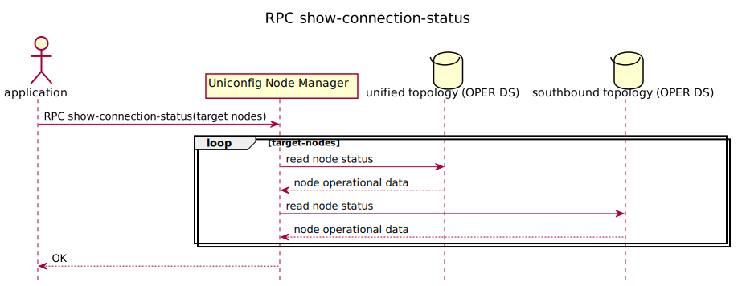

# RPC show-connection-status

This RPC verifies the connection status of the UniConfig nodes. The RPC
input contains a list of UniConfig nodes which connection status should
be verified. Output of the RPC describes the connection status of the
UniConfig nodes on the 'southbound-layer' and 'unified-layer'. Each
layer contains a 'connection-status' and 'status-message'. The
southbound layer contains an additional parameter called 'protocol'.



## RPC Examples

### CLI Device Example

The RPC show-connection-status input has one target node and the RPC
output contains the result of the operation.

```bash RPC Request
curl --location --request POST 'http://localhost:8181/rests/operations/uniconfig-manager:show-connection-status' \
--header 'Accept: application/json' \
--header 'Content-Type: application/json' \
--data-raw '{
    "input": {
        "target-nodes": {
            "node": ["IOSXR"]
        }
    }
}'
```

```json RPC Response, Status: 200
{
    "output": {
        "node-results": {
            "node-result": [
                {
                    "node-id": "IOSXR",
                    "southbound-layer": {
                        "status-message": "Success",
                        "protocol": "cli",
                        "connection-status": "connected"
                    },
                    "unified-layer": {
                        "status-message": "created unified mountpoint",
                        "connection-status": "installed"
                    }
                }
            ]
        },
        "overall-status": "complete"
    }
}
```

### Netconf Device Example

RPC show-connection-status input has one target node and the RPC output
contains the result of the operation.

```bash RPC Request
curl --location --request POST 'http://localhost:8181/rests/operations/uniconfig-manager:show-connection-status' \
--header 'Accept: application/json' \
--header 'Content-Type: application/json' \
--data-raw '{
    "input": {
        "target-nodes": {
            "node": ["vnf"]
        }
    }
}'
```

```json RPC Response, Status: 200
{
    "output": {
        "node-results": {
            "node-result": [
                {
                    "node-id": "vnf",
                    "southbound-layer": {
                        "status-message": "Success",
                        "protocol": "netconf",
                        "connection-status": "connected"
                    },
                    "unified-layer": {
                        "status-message": "created unified mountpoint",
                        "connection-status": "installed"
                    }
                }
            ]
        },
        "overall-status": "complete"
    }
}
```
