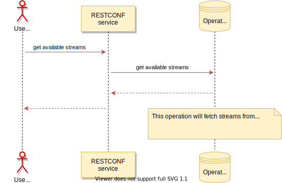

Get available streams
=====================

This operation returns a list of the available for subscription
notification streams from the the *"ietf-restconf-monitoring"* module
according to [RESTCONF RFC 8040](https://tools.ietf.org/html/rfc8040).
This document defines stream model with the following parameters:

-   *name* - The stream name. To preserve uniqueness for the stream name
    on the list UniConfig adds node name as a prefix before the original
    stream name.
-   *description* - Description of stream content.
-   *replay-support* - Indicates if replay buffer is supported for this
    stream. If 'true', then the server supports the 'start-time' and
    'stop-time' query parameters for this stream.
-   *replay-log-creation-time* - Indicates the time the replay log for
    this stream was created. Available only if replay-support is
    supported.
-   *access* - Contains a list of supported encoding formats for the
    stream and respective URL for subscription.

UniConfig extends stream model with the following parameters:

-   *stream-extensions:substream* - contains a list of yang definitions
    used by the stream.
-   *stream-extensions:is-active-subscription* - indicates existence of
    active subscriptions for the stream.

RPC Examples
------------

### Successful example

> **HTTP Request**
>
> **HTTP request:**

> **HTTP Response**
>
> **HTTP response:**
