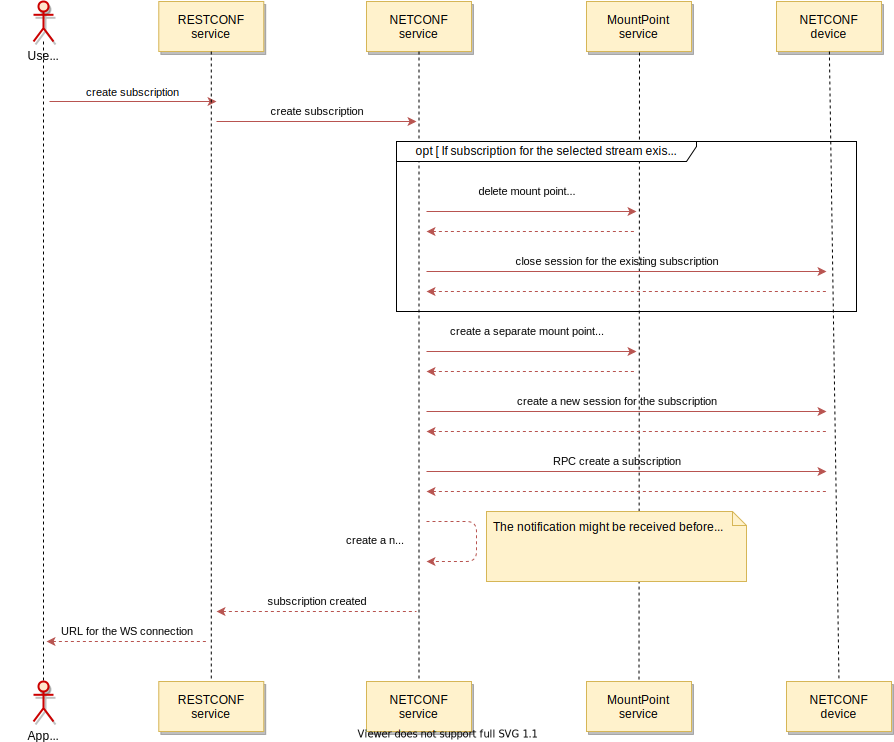

Create subscription
===================

This operation creates a subscription to the NETCONF notification stream
and provides a WebSocket endpoint which can be used to listen for the
notifications.

Besides the required stream identifier parameter, this operation also
supports optional parameters:

-   *start-time* - must be specified if user wants to enable replay and
    it should start at the time specified.
-   *stop time* - used with the optional replay feature to indicate the
    newest notifications of interest. If stopTime is not present, the
    notifications will continue until the subscription is terminated.
    Must be used with and be later than *start-time*. Values in the
    future are valid.

*Note:* Creation of new subscription for the stream will terminate all
existing subscriptions for this stream.

Subscription Workflow
---------------------

Subscription operation triggers the following workflow execution in the
background:

RPC Examples
------------

### Successful example

> **HTTP Request**
>
> **HTTP request:**

> **HTTP Response**
>
> **HTTP response:**

### Failed example

This example demonstrated response to the request with wrong combination
of 'start-time' and 'stop-time' ('stop-time' must be later than
'start-time').

> **HTTP Request**
>
> **HTTP request:**

> **HTTP Response**
>
> **HTTP response:**

### Failed example

This example demonstrates response to the request with the wrong stream
identifier

> **HTTP Request**
>
> **HTTP request:**

> **HTTP Response**
>
> **HTTP response:**
